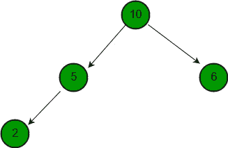
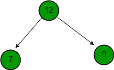
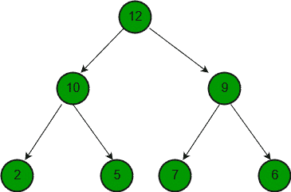

# 合并两个二进制最大堆

> 原文:[https://www.geeksforgeeks.org/merge-two-binary-max-heaps/](https://www.geeksforgeeks.org/merge-two-binary-max-heaps/)

给定两个二进制最大堆作为数组，合并给定堆。
**例:**

```
Input  : a = {10, 5, 6, 2}, 
         b = {12, 7, 9}
Output : {12, 10, 9, 2, 5, 7, 6}
```







想法很简单。我们创建一个数组来存储结果。我们将两个给定的数组逐个复制到结果中。一旦我们复制了所有元素，我们就调用标准构建堆来构建完全合并的最大堆。

## C++

```
// C++ program to merge two max heaps.
#include <bits/stdc++.h>
using namespace std;

// Standard heapify function to heapify a
// subtree rooted under idx. It assumes
// that subtrees of node are already heapified.
void maxHeapify(int arr[], int n, int idx)
{
    // Find largest of node and its children
    if (idx >= n)
        return;
    int l = 2 * idx + 1;
    int r = 2 * idx + 2;
    int max;
    if (l < n && arr[l] > arr[idx])
        max = l;
    else
        max = idx;
    if (r < n && arr[r] > arr[max])
        max = r;

    // Put maximum value at root and
    // recur for the child with the
    // maximum value
    if (max != idx) {
        swap(arr[max], arr[idx]);
        maxHeapify(arr, n, max);
    }
}

// Builds a max heap of given arr[0..n-1]
void buildMaxHeap(int arr[], int n)
{
    // building the heap from first non-leaf
    // node by calling max heapify function
    for (int i = n / 2 - 1; i >= 0; i--)
        maxHeapify(arr, n, i);
}

// Merges max heaps a[] and b[] into merged[]
void mergeHeaps(int merged[], int a[], int b[],
                int n, int m)
{
    // Copy elements of a[] and b[] one by one
    // to merged[]
    for (int i = 0; i < n; i++)
        merged[i] = a[i];
    for (int i = 0; i < m; i++)
        merged[n + i] = b[i];

    // build heap for the modified array of
    // size n+m
    buildMaxHeap(merged, n + m);
}

// Driver code
int main()
{
    int a[] = { 10, 5, 6, 2 };
    int b[] = { 12, 7, 9 };

    int n = sizeof(a) / sizeof(a[0]);
    int m = sizeof(b) / sizeof(b[0]);

    int merged[m + n];
    mergeHeaps(merged, a, b, n, m);

    for (int i = 0; i < n + m; i++)
        cout << merged[i] << " ";

    return 0;
}
```

## Java 语言(一种计算机语言，尤用于创建网站)

```
// Java program to merge two max heaps.

class GfG {

    // Standard heapify function to heapify a
    // subtree rooted under idx. It assumes
    // that subtrees of node are already heapified.
    public static void maxHeapify(int[] arr, int n,
                                             int i)
    {
        // Find largest of node and its children
        if (i >= n) {
            return;
        }
        int l = i * 2 + 1;
        int r = i * 2 + 2;
        int max;
        if (l < n && arr[l] > arr[i]) {
            max = l;
        }
        else
            max = i;
        if (r < n && arr[r] > arr[max]) {
            max = r;
        }

        // Put maximum value at root and
        // recur for the child with the
        // maximum value
        if (max != i) {
            int temp = arr[max];
            arr[max] = arr[i];
            arr[i] = temp;
            maxHeapify(arr, n, max);
        }
    }

    // Merges max heaps a[] and b[] into merged[]
    public static void mergeHeaps(int[] arr, int[] a,
                                  int[] b, int n, int m)
    {
        for (int i = 0; i < n; i++) {
            arr[i] = a[i];
        }
        for (int i = 0; i < m; i++) {
            arr[n + i] = b[i];
        }
        n = n + m;

        // Builds a max heap of given arr[0..n-1]
        for (int i = n / 2 - 1; i >= 0; i--) {
            maxHeapify(arr, n, i);
        }
    }

    // Driver Code
    public static void main(String[] args)
    {
        int[] a = {10, 5, 6, 2};
        int[] b = {12, 7, 9};
        int n = a.length;
        int m = b.length;

        int[] merged = new int[m + n];

        mergeHeaps(merged, a, b, n, m);

        for (int i = 0; i < m + n; i++)
            System.out.print(merged[i] + " ");
        System.out.println();
    }
}
```

## 蟒蛇 3

```
# Python3 program to merge two Max heaps.

# Standard heapify function to heapify a
# subtree rooted under idx. It assumes that
# subtrees of node are already heapified.
def MaxHeapify(arr, n, idx):

    # Find largest of node and
    # its children
    if idx >= n:
        return
    l = 2 * idx + 1
    r = 2 * idx + 2
    Max = 0
    if l < n and arr[l] > arr[idx]:
        Max = l
    else:
        Max = idx
    if r < n and arr[r] > arr[Max]:
        Max = r

    # Put Maximum value at root and
    # recur for the child with the
    # Maximum value
    if Max != idx:
        arr[Max], arr[idx] = arr[idx], arr[Max]
        MaxHeapify(arr, n, Max)

# Builds a Max heap of given arr[0..n-1]
def buildMaxHeap(arr, n):

    # building the heap from first non-leaf
    # node by calling Max heapify function
    for i in range(int(n / 2) - 1, -1, -1):
        MaxHeapify(arr, n, i)

# Merges Max heaps a[] and b[] into merged[]
def mergeHeaps(merged, a, b, n, m):

    # Copy elements of a[] and b[] one
    # by one to merged[]
    for i in range(n):
        merged[i] = a[i]
    for i in range(m):
        merged[n + i] = b[i]

    # build heap for the modified
    # array of size n+m
    buildMaxHeap(merged, n + m)

# Driver code
if __name__ == '__main__':
    a = [10, 5, 6, 2]
    b = [12, 7, 9]

    n = len(a)
    m = len(b)

    merged = [0] * (m + n)
    mergeHeaps(merged, a, b, n, m)

    for i in range(n + m):
        print(merged[i], end = " ")

# This code is contributed by PranchalK
```

## C#

```
// C# program to merge two max heaps.
using System;

class GfG {

    // Standard heapify function to heapify a
    // subtree rooted under idx. It assumes
    // that subtrees of node are already heapified.
    public static void maxHeapify(int[] arr,
                                  int n, int i)
    {
        // Find largest of node
        // and its children
        if (i >= n) {
            return;
        }
        int l = i * 2 + 1;
        int r = i * 2 + 2;
        int max;
        if (l < n && arr[l] > arr[i]) {
            max = l;
        }
        else
            max = i;
        if (r < n && arr[r] > arr[max]) {
            max = r;
        }

        // Put maximum value at root and
        // recur for the child with the
        // maximum value
        if (max != i) {
            int temp = arr[max];
            arr[max] = arr[i];
            arr[i] = temp;
            maxHeapify(arr, n, max);
        }
    }

    // Merges max heaps a[] and b[] into merged[]
    public static void mergeHeaps(int[] arr, int[] a,
                                  int[] b, int n, int m)
    {
        for (int i = 0; i < n; i++) {
            arr[i] = a[i];
        }
        for (int i = 0; i < m; i++) {
            arr[n + i] = b[i];
        }
        n = n + m;

        // Builds a max heap of given arr[0..n-1]
        for (int i = n / 2 - 1; i >= 0; i--) {
            maxHeapify(arr, n, i);
        }
    }

    // Driver Code
    public static void Main()
    {
        int[] a = {10, 5, 6, 2};
        int[] b = {12, 7, 9};
        int n = a.Length;
        int m = b.Length;

        int[] merged = new int[m + n];

        mergeHeaps(merged, a, b, n, m);

        for (int i = 0; i < m + n; i++)
            Console.Write(merged[i] + " ");
        Console.WriteLine();
    }
}

// This code is contributed by nitin mittal
```

## java 描述语言

```
<script>
// javascript program to merge two max heaps.

    // Standard heapify function to heapify a
    // subtree rooted under idx. It assumes
    // that subtrees of node are already heapified.
    function maxHeapify(arr , n , i)
    {

        // Find largest of node and its children
        if (i >= n) {
            return;
        }
        var l = i * 2 + 1;
        var r = i * 2 + 2;
        var max;
        if (l < n && arr[l] > arr[i]) {
            max = l;
        } else
            max = i;
        if (r < n && arr[r] > arr[max]) {
            max = r;
        }

        // Put maximum value at root and
        // recur for the child with the
        // maximum value
        if (max != i) {
            var temp = arr[max];
            arr[max] = arr[i];
            arr[i] = temp;
            maxHeapify(arr, n, max);
        }
    }

    // Merges max heaps a and b into merged
    function mergeHeaps(arr,  a,  b , n , m) {
        for (var i = 0; i < n; i++) {
            arr[i] = a[i];
        }
        for (var i = 0; i < m; i++) {
            arr[n + i] = b[i];
        }
        n = n + m;

        // Builds a max heap of given arr[0..n-1]
        for (var i = parseInt(n / 2 - 1); i >= 0; i--) {
            maxHeapify(arr, n, i);
        }
    }

    // Driver Code
        var a = [ 10, 5, 6, 2 ];
        var b = [ 12, 7, 9 ];
        var n = a.length;
        var m = b.length;

        var merged = Array(m + n).fill(0);

        mergeHeaps(merged, a, b, n, m);

        for (var i = 0; i < m + n; i++)
            document.write(merged[i] + " ");

// This code is contributed by umadevi9616
</script>
```

输出:

```
12 10 9 2 5 7 6
```

因为从 n 个元素的数组构建堆的时间复杂度是 O(n)。合并堆的复杂度等于 O(n + m)。
本文由 **K Akhil Reddy** 供稿。如果你喜欢 GeeksforGeeks 并想投稿，你也可以使用[write.geeksforgeeks.org](https://write.geeksforgeeks.org)写一篇文章或者把你的文章邮寄到 review-team@geeksforgeeks.org。看到你的文章出现在极客博客主页上，帮助其他极客。
如果发现有不正确的地方，或者想分享更多关于上述话题的信息，请写评论。