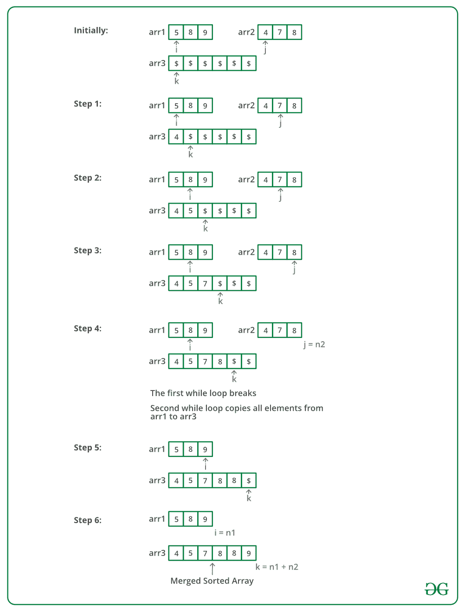

# 合并两个排序数组

> 原文:[https://www.geeksforgeeks.org/merge-two-sorted-arrays/](https://www.geeksforgeeks.org/merge-two-sorted-arrays/)

给定两个排序的数组，任务是以排序的方式合并它们。
**例:**

> **输入** : arr1[] = { 1，3，4，5}，arr2[] = {2，4，6，8}
> **输出** : arr3[] = {1，2，3，4，4，5，6，8}
> **输入** : arr1[] = { 5，8，9}，arr2[] = {4，7，8}
> **输出** : arr3[] = {4，5，7，8，8

**方法 1 (O(n1 * n2)时间和 O(n1+n2)额外空间)**

1.  创建大小为 n1 + n2 的数组 arr3[]。
2.  将 arr1[]的所有 n1 元素复制到 arr3[]
3.  遍历 arr2[]并逐个插入 arr3[]到 arr1[]的元素(如[插入排序](https://www.geeksforgeeks.org/insertion-sort/))。这一步需要 0(n1 * N2)时间。

我们已经讨论了上述方法在[合并两个有 O(1)额外空间的排序数组](https://www.geeksforgeeks.org/merge-two-sorted-arrays-o1-extra-space/)
**方法 2 (O(n1 + n2)时间和 O(n1 + n2)额外空间)**
中的实现，思路是使用[合并排序](https://www.geeksforgeeks.org/merge-sort/)的合并功能。

1.  创建大小为 n1 + n2 的数组 arr3[]。
2.  同时遍历 arr1[]和 arr2[]。
    *   在 arr1[]和 arr2[]中选取较小的当前元素，将此较小的元素复制到 arr3[]中的下一个位置，并在 arr3[]和其元素被选取的数组中向前移动。
3.  如果 arr1[]或 arr2[]中还有剩余元素，请将它们也复制到 arr3[]中。

下图是上述方法的模拟运行:



下面是上述方法的实现:

## C++

```
// C++ program to merge two sorted arrays/
#include<iostream>
using namespace std;

// Merge arr1[0..n1-1] and arr2[0..n2-1] into
// arr3[0..n1+n2-1]
void mergeArrays(int arr1[], int arr2[], int n1,
                             int n2, int arr3[])
{
    int i = 0, j = 0, k = 0;

    // Traverse both array
    while (i<n1 && j <n2)
    {
        // Check if current element of first
        // array is smaller than current element
        // of second array. If yes, store first
        // array element and increment first array
        // index. Otherwise do same with second array
        if (arr1[i] < arr2[j])
            arr3[k++] = arr1[i++];
        else
            arr3[k++] = arr2[j++];
    }

    // Store remaining elements of first array
    while (i < n1)
        arr3[k++] = arr1[i++];

    // Store remaining elements of second array
    while (j < n2)
        arr3[k++] = arr2[j++];
}

// Driver code
int main()
{
    int arr1[] = {1, 3, 5, 7};
    int n1 = sizeof(arr1) / sizeof(arr1[0]);

    int arr2[] = {2, 4, 6, 8};
    int n2 = sizeof(arr2) / sizeof(arr2[0]);

    int arr3[n1+n2];
    mergeArrays(arr1, arr2, n1, n2, arr3);

    cout << "Array after merging" <<endl;
    for (int i=0; i < n1+n2; i++)
        cout << arr3[i] << " ";

    return 0;
}
```

## Java 语言(一种计算机语言，尤用于创建网站)

```
// Java program to merge two sorted arrays
import java.util.*;
import java.lang.*;
import java.io.*;

class MergeTwoSorted
{
    // Merge arr1[0..n1-1] and arr2[0..n2-1]
    // into arr3[0..n1+n2-1]
    public static void mergeArrays(int[] arr1, int[] arr2, int n1,
                                int n2, int[] arr3)
    {
        int i = 0, j = 0, k = 0;

        // Traverse both array
        while (i<n1 && j <n2)
        {
            // Check if current element of first
            // array is smaller than current element
            // of second array. If yes, store first
            // array element and increment first array
            // index. Otherwise do same with second array
            if (arr1[i] < arr2[j])
                arr3[k++] = arr1[i++];
            else
                arr3[k++] = arr2[j++];
        }

        // Store remaining elements of first array
        while (i < n1)
            arr3[k++] = arr1[i++];

        // Store remaining elements of second array
        while (j < n2)
            arr3[k++] = arr2[j++];
    }

    public static void main (String[] args)
    {
        int[] arr1 = {1, 3, 5, 7};
        int n1 = arr1.length;

        int[] arr2 = {2, 4, 6, 8};
        int n2 = arr2.length;

        int[] arr3 = new int[n1+n2];

        mergeArrays(arr1, arr2, n1, n2, arr3);

        System.out.println("Array after merging");
        for (int i=0; i < n1+n2; i++)
            System.out.print(arr3[i] + " ");
    }
}

/* This code is contributed by Mr. Somesh Awasthi */
```

## 蟒蛇 3

```
# Python program to merge
# two sorted arrays

# Merge arr1[0..n1-1] and
# arr2[0..n2-1] into
# arr3[0..n1+n2-1]
def mergeArrays(arr1, arr2, n1, n2):
    arr3 = [None] * (n1 + n2)
    i = 0
    j = 0
    k = 0

    # Traverse both array
    while i < n1 and j < n2:

        # Check if current element
        # of first array is smaller
        # than current element of
        # second array. If yes,
        # store first array element
        # and increment first array
        # index. Otherwise do same
        # with second array
        if arr1[i] < arr2[j]:
            arr3[k] = arr1[i]
            k = k + 1
            i = i + 1
        else:
            arr3[k] = arr2[j]
            k = k + 1
            j = j + 1

    # Store remaining elements
    # of first array
    while i < n1:
        arr3[k] = arr1[i];
        k = k + 1
        i = i + 1

    # Store remaining elements
    # of second array
    while j < n2:
        arr3[k] = arr2[j];
        k = k + 1
        j = j + 1
    print("Array after merging")
    for i in range(n1 + n2):
        print(str(arr3[i]), end = " ")

# Driver code
arr1 = [1, 3, 5, 7]
n1 = len(arr1)

arr2 = [2, 4, 6, 8]
n2 = len(arr2)
mergeArrays(arr1, arr2, n1, n2);

# This code is contributed
# by ChitraNayal
```

## C#

```
// C# program to merge
// two sorted arrays
using System;

class GFG
{
    // Merge arr1[0..n1-1] and
    // arr2[0..n2-1] into
    // arr3[0..n1+n2-1]
    public static void mergeArrays(int[] arr1, int[] arr2,
                                   int n1, int n2, int[] arr3)
    {
        int i = 0, j = 0, k = 0;

        // Traverse both array
        while (i < n1 && j < n2)
        {
            // Check if current element
            // of first array is smaller
            // than current element
            // of second array. If yes,
            // store first array element
            // and increment first array
            // index. Otherwise do same
            // with second array
            if (arr1[i] < arr2[j])
                arr3[k++] = arr1[i++];
            else
                arr3[k++] = arr2[j++];
        }

        // Store remaining
        // elements of first array
        while (i < n1)
            arr3[k++] = arr1[i++];

        // Store remaining elements
        // of second array
        while (j < n2)
            arr3[k++] = arr2[j++];
    }

    // Driver code
    public static void Main()
    {
        int[] arr1 = {1, 3, 5, 7};
        int n1 = arr1.Length;

        int[] arr2 = {2, 4, 6, 8};
        int n2 = arr2.Length;

        int[] arr3 = new int[n1+n2];

        mergeArrays(arr1, arr2, n1, n2, arr3);

        Console.Write("Array after merging\n");
        for (int i = 0; i < n1 + n2; i++)
            Console.Write(arr3[i] + " ");
    }
}

// This code is contributed
// by ChitraNayal
```

## 服务器端编程语言（Professional Hypertext Preprocessor 的缩写）

```
<?php
// PHP program to merge
// two sorted arrays

// Merge $arr1[0..$n1-1] and
//       $arr2[0..$n2-1] into
//       $arr3[0..$n1+$n2-1]
function mergeArrays(&$arr1, &$arr2,
                      $n1, $n2, &$arr3)
{
    $i = 0;
    $j = 0;
    $k = 0;

    // Traverse both array
    while ($i < $n1 && $j < $n2)
    {
        // Check if current element
        // of first array is smaller
        // than current element of
        // second array. If yes,
        // store first array element
        // and increment first array
        // index. Otherwise do same
        // with second array
        if ($arr1[$i] < $arr2[$j])
            $arr3[$k++] = $arr1[$i++];
        else
            $arr3[$k++] = $arr2[$j++];
    }

    // Store remaining elements
    // of first array
    while ($i < $n1)
        $arr3[$k++] = $arr1[$i++];

    // Store remaining elements
    // of second array
    while ($j < $n2)
        $arr3[$k++] = $arr2[$j++];
}

// Driver code
$arr1 = array(1, 3, 5, 7);
$n1 = sizeof($arr1);

$arr2 = array(2, 4, 6, 8);
$n2 = sizeof($arr2);

$arr3[$n1 + $n2] = array();
mergeArrays($arr1, $arr2, $n1,
                   $n2, $arr3);

echo "Array after merging \n" ;
for ($i = 0; $i < $n1 + $n2; $i++)
    echo $arr3[$i] . " ";

// This code is contributed
// by ChitraNayal
?>
```

## java 描述语言

```
<script>
// javascript program to merge two sorted arrays

    // Merge arr1[0..n1-1] and arr2[0..n2-1]
    // into arr3[0..n1+n2-1]
    function mergeArrays(arr1,  arr2 , n1 , n2,  arr3) {
        var i = 0, j = 0, k = 0;

        // Traverse both array
        while (i < n1 && j < n2) {
            // Check if current element of first
            // array is smaller than current element
            // of second array. If yes, store first
            // array element and increment first array
            // index. Otherwise do same with second array
            if (arr1[i] < arr2[j])
                arr3[k++] = arr1[i++];
            else
                arr3[k++] = arr2[j++];
        }

        // Store remaining elements of first array
        while (i < n1)
            arr3[k++] = arr1[i++];

        // Store remaining elements of second array
        while (j < n2)
            arr3[k++] = arr2[j++];
    }

        var arr1 = [ 1, 3, 5, 7 ];
        var n1 = arr1.length;

        var arr2 = [ 2, 4, 6, 8 ];
        var n2 = arr2.length;

        var arr3 = Array(n1 + n2).fill(0);

        mergeArrays(arr1, arr2, n1, n2, arr3);

        document.write("Array after merging<br/>");
        for (i = 0; i < n1 + n2; i++)
            document.write(arr3[i] + " ");

// This code contributed by Rajput-Ji
</script>
```

**输出:**

```
Array after merging
1 2 3 4 5 6 7 8
```

**时间复杂度:**O(n1+N2)
T3】辅助空间: O(n1 + n2)
**方法三:使用地图(O(nlog(n) + mlog(m))时间和 O(n)额外空间)**

1.  将两个数组的元素作为键插入到地图中。
2.  打印地图的键。

下面是上述方法的实现。

## 卡片打印处理机（Card Print Processor 的缩写）

```
// C++ program to merge two sorted arrays
//using maps
#include<bits/stdc++.h>
using namespace std;

// Function to merge arrays
void mergeArrays(int a[], int b[], int n, int m)
{
    // Declaring a map.
    // using map as a inbuilt tool
    // to store elements in sorted order.
    map<int, bool> mp;

    // Inserting values to a map.
    for(int i = 0; i < n; i++)
    mp[a[i]] = true;

    for(int i = 0;i < m;i++)
    mp[b[i]] = true;

    // Printing keys of the map.
    for(auto i: mp)
    cout<< i.first <<" ";
}

// Driver Code
int main()
{
    int a[] = {1, 3, 5, 7}, b[] = {2, 4, 6, 8};

    int size = sizeof(a)/sizeof(int);
    int size1 = sizeof(b)/sizeof(int);

    // Function call
    mergeArrays(a, b, size, size1);

    return 0;
}

//This code is contributed by yashbeersingh42
```

## Java 语言(一种计算机语言，尤用于创建网站)

```
// Java program to merge two sorted arrays
//using maps
import java.io.*;
import java.util.*;

class GFG {

    // Function to merge arrays
    static void mergeArrays(int a[], int b[], int n, int m)
    {

        // Declaring a map.
        // using map as a inbuilt tool
        // to store elements in sorted order.
        Map<Integer,Boolean> mp = new TreeMap<Integer,Boolean>();

        // Inserting values to a map.
        for(int i = 0; i < n; i++)
        {
            mp.put(a[i], true);
        }
        for(int i = 0;i < m;i++)
        {
            mp.put(b[i], true);
        }

        // Printing keys of the map.
        for (Map.Entry<Integer,Boolean> me : mp.entrySet())
        {
            System.out.print(me.getKey() + " ");
        }
    }

    // Driver Code
    public static void main (String[] args)
    {
        int a[] = {1, 3, 5, 7}, b[] = {2, 4, 6, 8};
        int size = a.length;
        int size1 = b.length;

        // Function call
        mergeArrays(a, b, size, size1);
    }
}

// This code is contributed by rag2127
```

## C#

```
// C# program to merge two sorted arrays
//using maps
using System;
using System.Collections.Generic;

public class GFG {

  // Function to merge arrays
  static void mergeArrays(int []a, int []b, int n, int m)
  {

    // Declaring a map.
    // using map as a inbuilt tool
    // to store elements in sorted order.
    SortedDictionary<int, Boolean> mp = new SortedDictionary<int, Boolean>();

    // Inserting values to a map.
    for (int i = 0; i < n; i++) {
      mp.Add(a[i], true);
    }
    for (int i = 0; i < m; i++) {
      mp.Add(b[i], true);
    }

    // Printing keys of the map.
    foreach (KeyValuePair<int, Boolean> me in mp) {
      Console.Write(me.Key + " ");
    }
  }

  // Driver Code
  public static void Main(String[] args) {
    int []a = { 1, 3, 5, 7 };
    int []b = { 2, 4, 6, 8 };
    int size = a.Length;
    int size1 = b.Length;

    // Function call
    mergeArrays(a, b, size, size1);
  }
}

// This code is contributed by gauravrajput1
```

**输出:**

```
1 2 3 4 5 6 7 8
```

**时间复杂度:**O(nlog(N)+mlog(m))
T3】辅助空间:O(N)
T6】Brocade、[高盛](https://practice.geeksforgeeks.org/company/Goldman-Sachs/)、 [Juniper](https://practice.geeksforgeeks.org/company/Juniper/) 、 [Linkedin](https://practice.geeksforgeeks.org/company/Linkedin/) 、[微软](https://practice.geeksforgeeks.org/company/Microsoft/)、 [Quikr](https://practice.geeksforgeeks.org/company/Quikr/) 、 [Snapdeal](https://practice.geeksforgeeks.org/company/Snapdeal/) 、 [Synopsys](https://practice.geeksforgeeks.org/company/Synopsys/) 、【T2 如果你喜欢 GeeksforGeeks 并想投稿，你也可以使用[write.geeksforgeeks.org](https://write.geeksforgeeks.org)写一篇文章或者把你的文章邮寄到 review-team@geeksforgeeks.org。看到你的文章出现在极客博客主页上，帮助其他极客。
如果发现有不正确的地方，或者想分享更多关于上述话题的信息，请写评论。