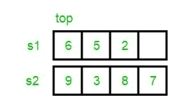
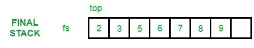

# 合并和排序两个未排序的堆栈

> 原文:[https://www . geesforgeks . org/merging-sorting-two-unsorted-stacks/](https://www.geeksforgeeks.org/merging-sorting-two-unsorted-stacks/)

给定 2 个输入堆栈，元素以未排序的方式排列。问题是将它们合并成一个新的最终堆栈，这样元素就会以有序的方式排列。





示例:

```
Input :  s1 : 9 4 2 1
         s2: 8 17 3 10
Output : final stack: 1 2 3 4 8 9 10 17

Input :  s1 : 5 7 2 6 4       
         s2 : 12 9 3 
Output : final stack: 2 3 4 5 6 7 9 12
```

创建一个空堆栈来存储结果。我们首先在结果中插入两个堆栈的元素。然后我们[对结果栈](https://www.geeksforgeeks.org/sort-stack-using-temporary-stack/)进行排序。

## C++

```
// C++ program to merge to unsorted stacks
// into a third stack in sorted way.
#include <bits/stdc++.h>
using namespace std;

// Sorts input stack and returns sorted stack.
stack<int> sortStack(stack<int>& input)
{
    stack<int> tmpStack;

    while (!input.empty()) {
        // pop out the first element
        int tmp = input.top();
        input.pop();

        // while temporary stack is not empty and top
        // of stack is greater than temp
        while (!tmpStack.empty() && tmpStack.top() > tmp) {

            // pop from temporary stack and push
            // it to the input stack
            input.push(tmpStack.top());
            tmpStack.pop();
        }

        // push temp in temporary of stack
        tmpStack.push(tmp);
    }

    return tmpStack;
}

stack<int> sortedMerge(stack<int>& s1, stack<int>& s2)
{
    // Push contents of both stacks in result
    stack<int> res;
    while (!s1.empty()) {
        res.push(s1.top());
        s1.pop();
    }
    while (!s2.empty()) {
        res.push(s2.top());
        s2.pop();
    }

    // Sort the result stack.
    return sortStack(res);
}

// main function
int main()
{
    stack<int> s1, s2;
    s1.push(34);
    s1.push(3);
    s1.push(31);

    s2.push(1);
    s2.push(12);
    s2.push(23);

    // This is the temporary stack
    stack<int> tmpStack = sortedMerge(s1, s2);
    cout << "Sorted and merged stack :\n";

    while (!tmpStack.empty()) {
        cout << tmpStack.top() << " ";
        tmpStack.pop();
    }
}
```

## Java 语言(一种计算机语言，尤用于创建网站)

```
// Java program to merge to unsorted stacks
// into a third stack in sorted way.
import java.io.*;
import java.util.*;

public class GFG {

    // This is the temporary stack
    static Stack<Integer> res = new Stack<Integer>();
    static Stack<Integer> tmpStack = new Stack<Integer>();

    // Sorts input stack and returns
    // sorted stack.
    static void sortStack(Stack<Integer> input)
    {
        while (input.size() != 0)
        {
            // pop out the first element
            int tmp = input.peek();
            input.pop();

            // while temporary stack is not empty and
            // top of stack is greater than temp
            while (tmpStack.size() != 0 &&
                            tmpStack.peek() > tmp)
            {

                // pop from temporary stack and push
                // it to the input stack
                input.push(tmpStack.peek());
                tmpStack.pop();
            }

            // push temp in temporary of stack
            tmpStack.push(tmp);
        }
    }

    static void sortedMerge(Stack<Integer> s1,
                                Stack<Integer> s2)
    {
        // Push contents of both stacks in result
        while (s1.size() != 0) {
            res.push(s1.peek());
            s1.pop();
        }

        while (s2.size() != 0) {
            res.push(s2.peek());
            s2.pop();
        }

        // Sort the result stack.
        sortStack(res);
    }

    // main function
    public static void main(String args[])
    {
        Stack<Integer> s1 = new Stack<Integer>();
        Stack<Integer> s2 = new Stack<Integer>();
        s1.push(34);
        s1.push(3);
        s1.push(31);

        s2.push(1);
        s2.push(12);
        s2.push(23);

        sortedMerge(s1, s2);
        System.out.println("Sorted and merged stack :");

        while (tmpStack.size() != 0) {
            System.out.print(tmpStack.peek() + " ");
            tmpStack.pop();
        }
    }
}

// This code is contributed by Manish Shaw
// (manishshaw1)
```

## 蟒蛇 3

```
# Python3 program to merge to unsorted stacks
# into a third stack in sorted way.

# Sorts input stack and returns
# sorted stack.
def sortStack(Input):
    tmpStack = []

    while len(Input) != 0:
        # pop out the first element
        tmp = Input[-1]
        Input.pop()

        # while temporary stack is not empty and
        # top of stack is greater than temp
        while len(tmpStack) != 0 and tmpStack[-1] > tmp:
            # pop from temporary stack and push
            # it to the input stack
            Input.append(tmpStack[-1])
            tmpStack.pop()
        # push temp in temporary of stack
        tmpStack.append(tmp)
    return tmpStack

def sortedMerge(s1, s2):
    # Push contents of both stacks in result
    res = []
    while len(s1) !=0 :
        res.append(s1[-1])
        s1.pop()
    while len(s2) !=0 :
        res.append(s2[-1])
        s2.pop()

    # Sort the result stack.
    return sortStack(res)

s1 = []
s2 = []
s1.append(34)
s1.append(3)
s1.append(31)

s2.append(1)
s2.append(12)
s2.append(23)

# This is the temporary stack
tmpStack = []
tmpStack = sortedMerge(s1, s2)
print("Sorted and merged stack :")

while len(tmpStack) != 0 :
    print(tmpStack[-1], end = " ")
    tmpStack.pop()

    # This code is contributed by decode2207.
```

## C#

```
// C# program to merge to unsorted stacks
// into a third stack in sorted way.
using System;
using System.Collections.Generic;

class GFG {

    // Sorts input stack and returns
    // sorted stack.
    static Stack<int> sortStack(ref Stack<int> input)
    {
        Stack<int> tmpStack = new Stack<int>();

        while (input.Count != 0)
        {
            // pop out the first element
            int tmp = input.Peek();
            input.Pop();

            // while temporary stack is not empty and
            // top of stack is greater than temp
            while (tmpStack.Count != 0 &&
                              tmpStack.Peek() > tmp)
            {

                // pop from temporary stack and push
                // it to the input stack
                input.Push(tmpStack.Peek());
                tmpStack.Pop();
            }

            // push temp in temporary of stack
            tmpStack.Push(tmp);
        }

        return tmpStack;
    }

    static Stack<int> sortedMerge(ref Stack<int> s1,
                                  ref Stack<int> s2)
    {
        // Push contents of both stacks in result
        Stack<int> res = new Stack<int>();
        while (s1.Count!=0) {
            res.Push(s1.Peek());
            s1.Pop();
        }
        while (s2.Count!=0) {
            res.Push(s2.Peek());
            s2.Pop();
        }

        // Sort the result stack.
        return sortStack(ref res);
    }

    // main function
    static void Main()
    {
        Stack<int> s1 = new Stack<int>();
        Stack<int> s2 = new Stack<int>();
        s1.Push(34);
        s1.Push(3);
        s1.Push(31);

        s2.Push(1);
        s2.Push(12);
        s2.Push(23);

        // This is the temporary stack
        Stack<int> tmpStack = new Stack<int>();
        tmpStack = sortedMerge(ref s1,ref s2);
        Console.Write("Sorted and merged stack :\n");

        while (tmpStack.Count!=0) {
            Console.Write(tmpStack.Peek() + " ");
            tmpStack.Pop();
        }
    }
}

// This code is contributed by Manish Shaw
// (manishshaw1)
```

## java 描述语言

```
<script>
    // Javascript program to merge to unsorted stacks
    // into a third stack in sorted way.

    // This is the temporary stack
    let res = [];
    let tmpStack = [];

    // Sorts input stack and returns
    // sorted stack.
    function sortStack(input)
    {
        while (input.length != 0)
        {
            // pop out the first element
            let tmp = input[input.length - 1];
            input.pop();

            // while temporary stack is not empty and
            // top of stack is greater than temp
            while (tmpStack.length != 0 &&
                            tmpStack[tmpStack.length - 1] > tmp)
            {

                // pop from temporary stack and push
                // it to the input stack
                input.push(tmpStack[tmpStack.length - 1]);
                tmpStack.pop();
            }

            // push temp in temporary of stack
            tmpStack.push(tmp);
        }
    }

    function sortedMerge(s1, s2)
    {
        // Push contents of both stacks in result
        while (s1.length != 0) {
            res.push(s1[s1.length - 1]);
            s1.pop();
        }

        while (s2.length != 0) {
            res.push(s2[s2.length - 1]);
            s2.pop();
        }

        // Sort the result stack.
        sortStack(res);
    }

    let s1 = [];
    let s2 = [];
    s1.push(34);
    s1.push(3);
    s1.push(31);

    s2.push(1);
    s2.push(12);
    s2.push(23);

    sortedMerge(s1, s2);
    document.write("Sorted and merged stack :" + "</br>");

    while (tmpStack.length != 0) {
      document.write(tmpStack[tmpStack.length - 1] + " ");
      tmpStack.pop();
    }

    // This code is contributed by divyesh072019.
</script>
```

**Output:** 

```
Sorted and merged stack :
34 31 23 12 3 1
```