# 猜测确认的方法

> 原文:[https://www . geesforgeks . org/猜测和确认方法/](https://www.geeksforgeeks.org/method-of-guessing-and-confirming/)

这个方法背后的基本思路是**猜测答案**，然后**通过归纳证明正确。**此方法可用于解决任何复发。如果一个解决方案被猜测，然后试图归纳验证我们的猜测，通常要么证明会成功(在这种情况下，我们完成了)，要么证明会失败(在这种情况下，失败将帮助我们完善我们的猜测)。

例如，考虑循环: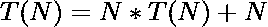。这不符合[主定理](https://www.geeksforgeeks.org/analysis-algorithm-set-4-master-method-solving-recurrences/)所要求的形式。仔细观察递归给我们的印象是类似于分治法(把问题潜水到 *√N* 子问题中，每个子问题都有大小 *√N* )。可以看出，递归第一级子问题的规模为 *N* 。所以，让我们猜测一下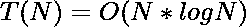，然后试着证明这个猜测是正确的。

我们先来证明一个上限:

> 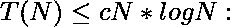
> 
> 
> 
> 
> 
> 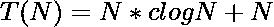
> 
> 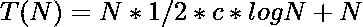
> 
> 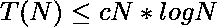

最后一个不等式只假设。如果 *N* 足够大，并且对于任何常数 c，无论多小，这都是正确的。

从上面的证明可以看出，我们的猜想对于上限是正确的。现在，让我们证明这个递归的下界:

> 
> 
> 
> 
> 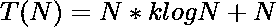
> 
> 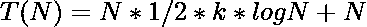
> 
> 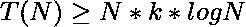

最后一个不等式只假设。如果 *N* 足够大并且对于任何常数 k，这是不正确的

从上面的证明可以看出，我们的猜想对于下界是不正确的。

从上面的讨论可以理解太大了。但是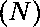呢？下界很容易直接证明:

> 

现在，让我们证明这个θ(N)的上限:
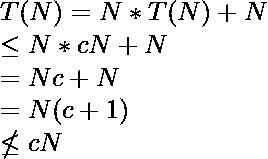

从上面的归纳可以理解为太小，太大。所以，我们需要比 N 大，比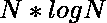小的东西？怎么样？

证明的上限:

> 
> 
> 
> 
> 
> 
> 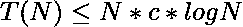

证明的下限:

> 
> 
> 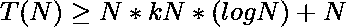
> 
> 
> 
> 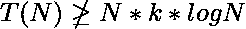

最后一步不管用。所以，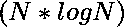不起作用。N 和之间还有什么？怎么样？

证明的上限:

> 
> 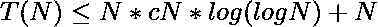
> 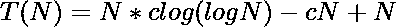
> 

证明的下限:

> 
> 
> 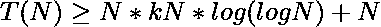
> 
> 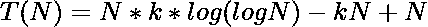
> 
> 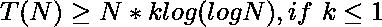

从以上证明可以看出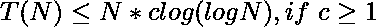和。
从技术上来说，我们仍然缺少两个证据中的基本情况，但是我们可以相当有信心在这一点上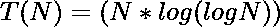。