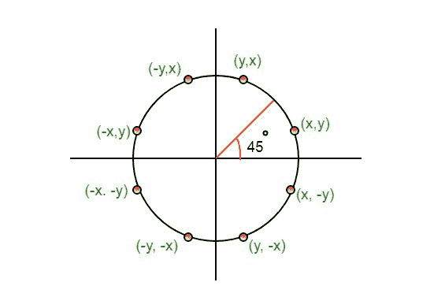
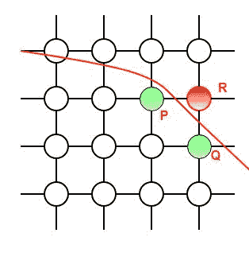
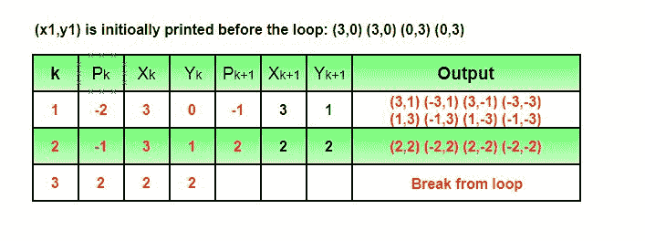

# 中点圆绘制算法

> 原文:[https://www . geesforgeks . org/中点-画圆-算法/](https://www.geeksforgeeks.org/mid-point-circle-drawing-algorithm/)

**中点**画圆算法是一种用于确定圆光栅化所需点的算法。

我们使用**中点**算法计算第一个八分圆**中圆的所有周长点**，然后将它们与其他八分圆中的镜像点一起打印出来。这是可行的，因为圆是关于它的中心对称的。



该算法与[中点线生成算法](https://www.geeksforgeeks.org/mid-point-line-generation-algorithm/)非常相似。这里，只有边界条件不同。

对于任何给定的像素(x，y)，要绘制的下一个像素是 **(x，y+1)** 或 **(x-1，y+1)** 。这可以通过以下步骤来决定。

1.  求两个可能像素的中点 **p** ，即(x-0.5，y+1)
2.  如果 **p** 位于圆的内部或圆周上，我们绘制像素(x，y+1)，否则如果它在外部，我们绘制像素(x-1，y+1)

**边界条件:**中点位于圆内还是圆外，可以用公式确定:-

> 给定一个以(0，0)为中心且半径为 r 的圆和一个点 p(x，y)
> **F(p)= x<sup>2</sup>+y<sup>2</sup>–r<sup>2</sup>**
> 如果 F(p) < 0，该点在圆内
> F(p)=0，该点在周长
> F(p) > 0 上，该点在圆外



在我们的程序中，我们用 P 表示 F(P)。P 的值是在两个竞争像素的中点(即 x-0.5，y+1)计算的。每个像素用下标 k
来描述

> **p<sub>k</sub>=(x<sub>k</sub>—0.5)<sup>2</sup>+(y<sub>【k】</sub>+1)<sup>2</sup>–r<sup>2 y<sub>k+1</sub>= y<sub>【k】</sub>+1
> 【p】<sub>【k+1】</sub>=(x<sub>【k+1】</sub>–0.5)<sup>2</sup> <sup>2</sup>+【y<sub>【k】</sub>+1)<sup>【2】</sup>+2(y<sub>【k】</sub>+1)+1–【r】 <sup>=(x <sub>+1
> = p<sub>【k】</sub>+【x】<sub>【k+1】</sub>–0.5】<sup>【2】</sup>(x<sub>【k】</sub>–0.5)<sup>【2】</sup>+2(2) +1
> 【T1117】= p<sub>【k】【T1119】+2(y<sub>【T1121】+1)+1 时，p<sub><= 0i . e 中点位于圆</sub></sub></sub></sub></sup></sup>**

要绘制的第一个点是 x 轴上的(r，0)。P 的初始值计算如下:-

> P1 =(r–0.5)<sup>2</sup>+(0+1)<sup>2</sup>–r<sup>2</sup>
> = 1.25–r
> = 1-r(四舍五入后)

**例:**

```
Input : Centre -> (0, 0), Radius -> 3
Output : (3, 0) (3, 0) (0, 3) (0, 3)
         (3, 1) (-3, 1) (3, -1) (-3, -1)
         (1, 3) (-1, 3) (1, -3) (-1, -3)
         (2, 2) (-2, 2) (2, -2) (-2, -2)
```



```
Input : Centre -> (4, 4), Radius -> 2
Output : (6, 4) (6, 4) (4, 6) (4, 6)
         (6, 5) (2, 5) (6, 3) (2, 3)
         (5, 6) (3, 6) (5, 2) (3, 2)
```

## 卡片打印处理机（Card Print Processor 的缩写）

```
// C++ program for implementing
// Mid-Point Circle Drawing Algorithm
#include<iostream>
using namespace std;

// Implementing Mid-Point Circle Drawing Algorithm
void midPointCircleDraw(int x_centre, int y_centre, int r)
{
    int x = r, y = 0;

    // Printing the initial point on the axes
    // after translation
    cout << "(" << x + x_centre << ", " << y + y_centre << ") ";

    // When radius is zero only a single
    // point will be printed
    if (r > 0)
    {
        cout << "(" << x + x_centre << ", " << -y + y_centre << ") ";
        cout << "(" << y + x_centre << ", " << x + y_centre << ") ";
        cout << "(" << -y + x_centre << ", " << x + y_centre << ")\n";
    }

    // Initialising the value of P
    int P = 1 - r;
    while (x > y)
    {
        y++;

        // Mid-point is inside or on the perimeter
        if (P <= 0)
            P = P + 2*y + 1;
        // Mid-point is outside the perimeter
        else
        {
            x--;
            P = P + 2*y - 2*x + 1;
        }

        // All the perimeter points have already been printed
        if (x < y)
            break;

        // Printing the generated point and its reflection
        // in the other octants after translation
        cout << "(" << x + x_centre << ", " << y + y_centre << ") ";
        cout << "(" << -x + x_centre << ", " << y + y_centre << ") ";
        cout << "(" << x + x_centre << ", " << -y + y_centre << ") ";
        cout << "(" << -x + x_centre << ", " << -y + y_centre << ")\n";

        // If the generated point is on the line x = y then
        // the perimeter points have already been printed
        if (x != y)
        {
            cout << "(" << y + x_centre << ", " << x + y_centre << ") ";
            cout << "(" << -y + x_centre << ", " << x + y_centre << ") ";
            cout << "(" << y + x_centre << ", " << -x + y_centre << ") ";
            cout << "(" << -y + x_centre << ", " << -x + y_centre << ")\n";
        }
    }
}

// Driver code
int main()
{
    // To draw a circle of radius 3 centered at (0, 0)
    midPointCircleDraw(0, 0, 3);
    return 0;
}
```

## C

```
// C program for implementing
// Mid-Point Circle Drawing Algorithm
#include<stdio.h>

// Implementing Mid-Point Circle Drawing Algorithm
void midPointCircleDraw(int x_centre, int y_centre, int r)
{
    int x = r, y = 0;

    // Printing the initial point on the axes
    // after translation
    printf("(%d, %d) ", x + x_centre, y + y_centre);

    // When radius is zero only a single
    // point will be printed
    if (r > 0)
    {
        printf("(%d, %d) ", x + x_centre, -y + y_centre);
        printf("(%d, %d) ", y + x_centre, x + y_centre);
        printf("(%d, %d)\n", -y + x_centre, x + y_centre);
    }

    // Initialising the value of P
    int P = 1 - r;
    while (x > y)
    {
        y++;

        // Mid-point is inside or on the perimeter
        if (P <= 0)
            P = P + 2*y + 1;

        // Mid-point is outside the perimeter
        else
        {
            x--;
            P = P + 2*y - 2*x + 1;
        }

        // All the perimeter points have already been printed
        if (x < y)
            break;

        // Printing the generated point and its reflection
        // in the other octants after translation
        printf("(%d, %d) ", x + x_centre, y + y_centre);
        printf("(%d, %d) ", -x + x_centre, y + y_centre);
        printf("(%d, %d) ", x + x_centre, -y + y_centre);
        printf("(%d, %d)\n", -x + x_centre, -y + y_centre);

        // If the generated point is on the line x = y then
        // the perimeter points have already been printed
        if (x != y)
        {
            printf("(%d, %d) ", y + x_centre, x + y_centre);
            printf("(%d, %d) ", -y + x_centre, x + y_centre);
            printf("(%d, %d) ", y + x_centre, -x + y_centre);
            printf("(%d, %d)\n", -y + x_centre, -x + y_centre);
        }
    }
}

// Driver code
int main()
{
    // To draw a circle of radius 3 centered at (0, 0)
    midPointCircleDraw(0, 0, 3);
    return 0;
}
```

## Java 语言(一种计算机语言，尤用于创建网站)

```
// Java program for implementing
// Mid-Point Circle Drawing Algorithm
class GFG {

    // Implementing Mid-Point Circle
    // Drawing Algorithm
    static void midPointCircleDraw(int x_centre,
                            int y_centre, int r)
    {

        int x = r, y = 0;

        // Printing the initial point
        // on the axes after translation
        System.out.print("(" + (x + x_centre)
                + ", " + (y + y_centre) + ")");

        // When radius is zero only a single
        // point will be printed
        if (r > 0) {

            System.out.print("(" + (x + x_centre)
                + ", " + (-y + y_centre) + ")");

            System.out.print("(" + (y + x_centre)
                 + ", " + (x + y_centre) + ")");

            System.out.println("(" + (-y + x_centre)
                   + ", " + (x + y_centre) + ")");
        }

        // Initialising the value of P
        int P = 1 - r;
        while (x > y) {

            y++;

            // Mid-point is inside or on the perimeter
            if (P <= 0)
                P = P + 2 * y + 1;

            // Mid-point is outside the perimeter
            else {
                x--;
                P = P + 2 * y - 2 * x + 1;
            }

            // All the perimeter points have already
            // been printed
            if (x < y)
                break;

            // Printing the generated point and its
            // reflection in the other octants after
            // translation
            System.out.print("(" + (x + x_centre)
                    + ", " + (y + y_centre) + ")");

            System.out.print("(" + (-x + x_centre)
                    + ", " + (y + y_centre) + ")");

            System.out.print("(" + (x + x_centre) +
                    ", " + (-y + y_centre) + ")");

            System.out.println("(" + (-x + x_centre)
                    + ", " + (-y + y_centre) + ")");

            // If the generated point is on the
            // line x = y then the perimeter points
            // have already been printed
            if (x != y) {

                System.out.print("(" + (y + x_centre)
                      + ", " + (x + y_centre) + ")");

                System.out.print("(" + (-y + x_centre)
                      + ", " + (x + y_centre) + ")");

                System.out.print("(" + (y + x_centre)
                      + ", " + (-x + y_centre) + ")");

                System.out.println("(" + (-y + x_centre)
                    + ", " + (-x + y_centre) +")");
            }
        }
    }

    // Driver code
    public static void main(String[] args) {

        // To draw a circle of radius
        // 3 centered at (0, 0)
        midPointCircleDraw(0, 0, 3);
    }
}

// This code is contributed by Anant Agarwal.
```

## 蟒蛇 3

```
# Python3 program for implementing
# Mid-Point Circle Drawing Algorithm

def midPointCircleDraw(x_centre, y_centre, r):
    x = r
    y = 0

    # Printing the initial point the
    # axes after translation
    print("(", x + x_centre, ", ",
               y + y_centre, ")",
               sep = "", end = "")

    # When radius is zero only a single
    # point be printed
    if (r > 0) :

        print("(", x + x_centre, ", ",
                  -y + y_centre, ")",
                  sep = "", end = "")
        print("(", y + x_centre, ", ",
                   x + y_centre, ")",
                   sep = "", end = "")
        print("(", -y + x_centre, ", ",
                    x + y_centre, ")", sep = "")

    # Initialising the value of P
    P = 1 - r

    while x > y:

        y += 1

        # Mid-point inside or on the perimeter
        if P <= 0:
            P = P + 2 * y + 1

        # Mid-point outside the perimeter
        else:        
            x -= 1
            P = P + 2 * y - 2 * x + 1

        # All the perimeter points have
        # already been printed
        if (x < y):
            break

        # Printing the generated point its reflection
        # in the other octants after translation
        print("(", x + x_centre, ", ", y + y_centre,
                            ")", sep = "", end = "")
        print("(", -x + x_centre, ", ", y + y_centre,
                             ")", sep = "", end = "")
        print("(", x + x_centre, ", ", -y + y_centre,
                             ")", sep = "", end = "")
        print("(", -x + x_centre, ", ", -y + y_centre,
                                        ")", sep = "")

        # If the generated point on the line x = y then
        # the perimeter points have already been printed
        if x != y:

            print("(", y + x_centre, ", ", x + y_centre,
                                ")", sep = "", end = "")
            print("(", -y + x_centre, ", ", x + y_centre,
                                 ")", sep = "", end = "")
            print("(", y + x_centre, ", ", -x + y_centre,
                                 ")", sep = "", end = "")
            print("(", -y + x_centre, ", ", -x + y_centre,
                                            ")", sep = "")

# Driver Code
if __name__ == '__main__':

    # To draw a circle of radius 3
    # centered at (0, 0)
    midPointCircleDraw(0, 0, 3)

# Contributed by: SHUBHAMSINGH10
# Improved by: siddharthx_07
```

## C#

```
// C# program for implementing Mid-Point
// Circle Drawing Algorithm
using System;

class GFG {

    // Implementing Mid-Point Circle
    // Drawing Algorithm
    static void midPointCircleDraw(int x_centre,
                            int y_centre, int r)
    {

        int x = r, y = 0;

        // Printing the initial point on the
        // axes after translation
        Console.Write("(" + (x + x_centre)
                + ", " + (y + y_centre) + ")");

        // When radius is zero only a single
        // point will be printed
        if (r > 0)
        {

            Console.Write("(" + (x + x_centre)
                + ", " + (-y + y_centre) + ")");

            Console.Write("(" + (y + x_centre)
                + ", " + (x + y_centre) + ")");

            Console.WriteLine("(" + (-y + x_centre)
                + ", " + (x + y_centre) + ")");
        }

        // Initialising the value of P
        int P = 1 - r;
        while (x > y)
        {

            y++;

            // Mid-point is inside or on the perimeter
            if (P <= 0)
                P = P + 2 * y + 1;

            // Mid-point is outside the perimeter
            else
            {
                x--;
                P = P + 2 * y - 2 * x + 1;
            }

            // All the perimeter points have already
            // been printed
            if (x < y)
                break;

            // Printing the generated point and its
            // reflection in the other octants after
            // translation
            Console.Write("(" + (x + x_centre)
                    + ", " + (y + y_centre) + ")");

            Console.Write("(" + (-x + x_centre)
                    + ", " + (y + y_centre) + ")");

            Console.Write("(" + (x + x_centre) +
                    ", " + (-y + y_centre) + ")");

            Console.WriteLine("(" + (-x + x_centre)
                    + ", " + (-y + y_centre) + ")");

            // If the generated point is on the
            // line x = y then the perimeter points
            // have already been printed
            if (x != y)
            {
                Console.Write("(" + (y + x_centre)
                    + ", " + (x + y_centre) + ")");

                Console.Write("(" + (-y + x_centre)
                    + ", " + (x + y_centre) + ")");

                Console.Write("(" + (y + x_centre)
                    + ", " + (-x + y_centre) + ")");

                Console.WriteLine("(" + (-y + x_centre)
                    + ", " + (-x + y_centre) +")");
            }
        }
    }

    // Driver code
    public static void Main()
    {

        // To draw a circle of radius
        // 3 centered at (0, 0)
        midPointCircleDraw(0, 0, 3);
    }
}

// This code is contributed by nitin mittal.
```

## 服务器端编程语言（Professional Hypertext Preprocessor 的缩写）

```
<?php
// PHP program for implementing
// Mid-Point Circle Drawing Algorithm

// Implementing Mid-Point
// Circle Drawing Algorithm
function midPointCircleDraw($x_centre,
                            $y_centre,
                            $r)
{
    $x = $r;
    $y = 0;

    // Printing the initial
    // point on the axes
    // after translation
    echo "(",$x + $x_centre,",", $y + $y_centre,")";

    // When radius is zero only a single
    // point will be printed
    if ($r > 0)
    {
        echo "(",$x + $x_centre,",", -$y + $y_centre,")";
        echo "(",$y + $x_centre,",", $x + $y_centre,")";
        echo "(",-$y + $x_centre,",", $x + $y_centre,")","\n";
    }

    // Initializing the value of P
    $P = 1 - $r;
    while ($x > $y)
    {
        $y++;

        // Mid-point is inside
        // or on the perimeter
        if ($P <= 0)
            $P = $P + 2 * $y + 1;

        // Mid-point is outside
        // the perimeter
        else
        {
            $x--;
            $P = $P + 2 * $y -
                  2 * $x + 1;
        }

        // All the perimeter points
        // have already been printed
        if ($x < $y)
            break;

        // Printing the generated
        // point and its reflection
        // in the other octants
        // after translation
        echo "(",$x + $x_centre,",", $y + $y_centre,")";
        echo "(",-$x + $x_centre,",", $y + $y_centre,")";
        echo "(",$x +$x_centre,",", -$y + $y_centre,")";
        echo "(",-$x + $x_centre,",", -$y + $y_centre,")","\n";

        // If the generated point is
        // on the line x = y then
        // the perimeter points have
        // already been printed
        if ($x != $y)
        {
            echo "(",$y + $x_centre,",", $x + $y_centre,")";
            echo "(",-$y + $x_centre,",", $x + $y_centre,")";
            echo "(",$y + $x_centre,",", -$x + $y_centre,")";
            echo "(",-$y + $x_centre,",", -$x + $y_centre,")","\n";
        }
    }
}

    // Driver code
    // To draw a circle of radius
    // 3 centered at (0, 0)
    midPointCircleDraw(0, 0, 3);

// This code is contributed by nitin mittal.
?>
```

## java 描述语言

```
<script>
// javascript program for implementing
// Mid-Point Circle Drawing Algorithm   
// Implementing Mid-Point Circle
    // Drawing Algorithm
    function midPointCircleDraw(x_centre , y_centre , r) {

        var x = r, y = 0;

        // Printing the initial point
        // on the axes after translation
        document.write("(" + (x + x_centre) + ", " + (y + y_centre) + ")");

        // When radius is zero only a single
        // point will be printed
        if (r > 0) {

            document.write("(" + (x + x_centre) + ", " + (-y + y_centre) + ")");

            document.write("(" + (y + x_centre) + ", " + (x + y_centre) + ")");

            document.write("(" + (-y + x_centre) + ", " + (x + y_centre) + ")<br/>");
        }

        // Initialising the value of P
        var P = 1 - r;
        while (x > y) {

            y++;

            // Mid-point is inside or on the perimeter
            if (P <= 0)
                P = P + 2 * y + 1;

            // Mid-point is outside the perimeter
            else {
                x--;
                P = P + 2 * y - 2 * x + 1;
            }

            // All the perimeter points have already
            // been printed
            if (x < y)
                break;

            // Printing the generated point and its
            // reflection in the other octants after
            // translation
            document.write("(" + (x + x_centre) + ", " + (y + y_centre) + ")");

            document.write("(" + (-x + x_centre) + ", " + (y + y_centre) + ")");

            document.write("(" + (x + x_centre) + ", " + (-y + y_centre) + ")");

            document.write("(" + (-x + x_centre) + ", " + (-y + y_centre) + ")<br/>");

            // If the generated point is on the
            // line x = y then the perimeter points
            // have already been printed
            if (x != y) {

                document.write("(" + (y + x_centre) + ", " + (x + y_centre) + ")");

                document.write("(" + (-y + x_centre) + ", " + (x + y_centre) + ")");

                document.write("(" + (y + x_centre) + ", " + (-x + y_centre) + ")");

                document.write("(" + (-y + x_centre) + ", " + (-x + y_centre) + ")<br/>");
            }
        }
    }

    // Driver code

        // To draw a circle of radius
        // 3 centered at (0, 0)
        midPointCircleDraw(0, 0, 3);

// This code is contributed by umadevi9616
</script>
```

输出:

```
(3, 0) (3, 0) (0, 3) (0, 3)
(3, 1) (-3, 1) (3, -1) (-3, -1)
(1, 3) (-1, 3) (1, -3) (-1, -3)
(2, 2) (-2, 2) (2, -2) (-2, -2)
```

**时间复杂度:**O(x–y)
**辅助空间:** O(1)
**参考文献:** [中点圆算法](https://en.wikipedia.org/wiki/Midpoint_circle_algorithm)
**图像参考文献:** [圆的八分圆](https://www.google.co.in/search?biw=1517&bih=708&tbm=isch&sa=1&q=octant+of+a+circle&oq=octant+of+a+circle&gs_l=img.3...12634.15814.0.16023.0.0.0.0.0.0.0.0..0.0....0...1.1.64.img..0.0.0.XzyKXP6FfIY#imgrc=N1gFvYn6t5MNjM:)、[光栅化圆](https://en.wikipedia.org/wiki/Midpoint_circle_algorithm#/media/File:Bresenham_circle.svg)，其他图像均由极客
为本文创作感谢**图希娜辛格**对本文的改进。
本文由**纳巴尼特·罗伊**供稿。如果你喜欢 GeeksforGeeks 并想投稿，你也可以用[write.geeksforgeeks.org](http://www.write.geeksforgeeks.org)写一篇文章或者把你的文章邮寄到 review-team@geeksforgeeks.org。看到你的文章出现在极客博客主页上，帮助其他极客。
如果发现有不正确的地方，或者想分享更多关于上述话题的信息，请写评论。