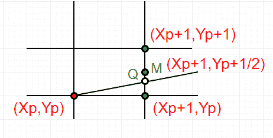
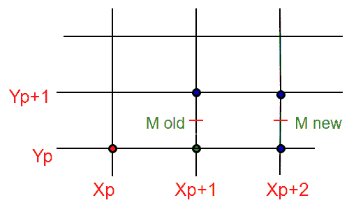

# 中点线生成算法

> 原文:[https://www . geesforgeks . org/中点线生成算法/](https://www.geeksforgeeks.org/mid-point-line-generation-algorithm/)

给定两点 A(x1，y1)和 B(x2，y2)的坐标，使得 x1 < x2 and y1 < y2\. The task to find all the intermediate points required for drawing line AB on the computer screen of pixels. Note that every pixel has integer coordinates.
我们已经在下面讨论了该任务的算法。

1.  [线条绘制的 DDA 算法](https://www.geeksforgeeks.org/dda-line-generation-algorithm-computer-graphics/)
2.  [布雷森汉姆画线算法介绍](https://www.geeksforgeeks.org/bresenhams-line-generation-algorithm/)。

本文讨论中点画线算法，这是一种不同于上一篇文章介绍的布雷森汉算法的表示方法。
如[上一篇文章](https://www.geeksforgeeks.org/bresenhams-line-generation-algorithm/)所述，对于任何给定/计算的前一个像素 P(X <sub>p</sub> ，Y <sub>p</sub> ，有两个最接近直线的下一个像素候选，E(X <sub>p</sub> +1，Y <sub>p</sub> )和 NE(X <sub>p</sub> +1，Y <sub>p</sub> +1) ( **E** 代表东和 **在中点算法中，我们执行以下操作。**

1.  找到两个可能的下一个点的中间。E(X <sub>p</sub> +1，Y <sub>p</sub> )和 NE(X <sub>p</sub> +1，Y <sub>p</sub> +1)的中间为 M(X <sub>p+1</sub> ，Y <sub>p</sub> +1/2)。
2.  如果 M 在线上方，则选择 E 作为下一个点。
3.  如果 M 在线下，那么选择 ne 作为下一个点。



**如何求点在线上方还是线下方？**
下面是一些保持算法简单的假设。

1.  我们从左向右画线。
2.  x1 < x2 和 y1< y2
3.  直线的斜率在 0 和 1 之间。我们从左下角到右上角画一条线。

上述假设之外的情况可以使用反射来处理。

```
Let us consider a line y = mx + B. 
We can re-write the equation as :
y = (dy/dx)x + B or 
(dy)x + B(dx) - y(dx) = 0
Let F(x, y) = (dy)x - y(dx) + B(dx)   -----(1)
Let we are given two end points of a line (under
above assumptions)
-> For all points (x,y) on the line, 
      the solution to F(x, y) is 0\. 
-> For all points (x,y) above the line, 
      F(x, y) result in a negative number. 
-> And for all points (x,y) below the line, 
      F(x, y) result in a positive number. 
```

这个关系用来确定 M
M = (X <sub>p+1</sub> ，Y <sub>p+1</sub> /2)
的相对
位置所以我们的**决策参数 d** 为，
d = F(M) = F(X <sub>p+1</sub> ，Y <sub>p+1</sub> /2)
**如何从 d 的旧值中高效地找到 d 的新值？**
为简单起见，让 as 将 F(x，y)写成 ax + by + c.
其中 a = dy
b = -dx
c = B*dx
我们从上面的等式(1)
**中得到这些值情况 1:** 如果选择了 E，那么下一点:
dnew = F(X <sub>p</sub> +2， Y<sub>p+1</sub>/2)
= a(X<sub>p</sub>+2)+b(Y<sub>p+1</sub>/2)+c
dold = a(X<sub>p</sub>+1)+b(Y<sub>p+1</sub>/2)+c
两个距离之差(或δ):
DELd = dnew–dold
= c (as a = dy)



**情况 2:** 如果选择 NE，那么下一点:
dnew = F(X <sub>p</sub> +2， Y<sub>p</sub>+3/2)
= a(X<sub>p</sub>+2)+b(Y<sub>p</sub>+3/2)+c
dold = a(X<sub>p</sub>+1)+b(Y<sub>p</sub>+1/2)+c
两个距离之差(或δ):
DELd = dnew-dold
= a(t) +2a–a(X<sub>p</sub>)–a+b(Y<sub>p</sub>)+3/2b–b(Y<sub>p</sub>)-1/2b
= a+b
因此，dnew = dold+dy–dx。 (as a = dy，b = -dx)
**决策参数 d0 初始值计算:**
d0 = F(X1+1，Y1+1/2)
= a(X1+1)+b(Y1+1/2)+c
= aX1+bY1+c+a+b/2
= F(X1，Y1) + a + b/2
= a + b/2 (as F(X1，Y1) = 0)(as a = dy，b = -dx)
**算法:**

```
Input (X1,Y1) and (X2,Y2)
dy = Y2- Y1
dx = X2 - X1
// initial value of 
// decision parameter d

if(dy<=dx){
d = dy - (dx/2)
x = X1 , y = Y1

// plot initial given point
Plot(x , y)

// iterate through value of X
while(x < X2)
    x = x+1

    // 'E' is chosen
    if (d < 0)
       d = d + dy

    // 'NE' is chosen
    else
       d = d + dy - dx
       y = y+1
    Plot(x,y)}

else if(dx<=dy)
{
d = dx - (dy/2)
x = X1 , y = Y1

// plot initial given point
Plot(x , y)

// iterate through value of X
while(y< Y2)
    y= y+1

    // 'E' is chosen
    if (d < 0)
       d = d + dx

    // 'NE' is chosen
    else
       d = d + dx - dy
       x= x+1
    Plot(x,y)
}
```

以下是上述想法的实现:

## C++

```
// C++ program for Mid-point line generation
#include<bits/stdc++.h>
using namespace std;

// Header file for including graphics functions
// #include<graphics.h>

// midPoint function for line generation
void midPoint(int X1, int Y1, int X2, int Y2)
{
    // calculate dx & dy

    int dx = X2 - X1;
    int dy = Y2 - Y1;

    if(dy<=dx){
    // initial value of decision parameter d
    int d = dy - (dx/2);
    int x = X1, y = Y1;

    // Plot initial given point
    // putpixel(x,y) can be used to print pixel
    // of line in graphics
    cout << x << "," << y << "\n";

    // iterate through value of X
    while (x < X2)
    {
        x++;

        // E or East is chosen
        if (d < 0)
            d = d + dy;

        // NE or North East is chosen
        else
        {
            d += (dy - dx);
            y++;
        }

        // Plot intermediate points
        // putpixel(x,y) is used to print pixel
        // of line in graphics
        cout << x << "," << y << "\n";
    }
    }

  else if(dx<dy)
  {
    // initial value of decision parameter d
    int d = dx - (dy/2);
    int x = X1, y = Y1;

    // Plot initial given point
    // putpixel(x,y) can be used to print pixel
    // of line in graphics
    cout << x << "," << y << "\n";

    // iterate through value of X
    while (y < Y2)
    {
        y++;

        // E or East is chosen
        if (d < 0)
            d = d + dx;

        // NE or North East is chosen
        // NE or North East is chosen
        else
        {
            d += (dx - dy);
            x++;
        }

        // Plot intermediate points
        // putpixel(x,y) is used to print pixel
        // of line in graphics
        cout << x << "," << y << "\n";
    }
  }
}

// Driver program
int main()
{
    // graphics driver and mode
    // used in graphics.h
    // int gd = DETECT, gm;

    // Initialize graphics function
    // initgraph (&gd, &gm, "");

    int X1 = 2, Y1 = 2, X2 = 8, Y2 = 5;
    midPoint(X1, Y1, X2, Y2);
    return 0;
}
```

## Java 语言(一种计算机语言，尤用于创建网站)

```
// Java program for Mid-point
// line generation
class GFG
{
// midPoint function for line generation
static void midPoint(int X1, int Y1,
                     int X2, int Y2)
{
    // calculate dx & dy
    int dx = X2 - X1;
    int dy = Y2 - Y1;

    // initial value of decision
    // parameter d
    int d = dy - (dx/2);
    int x = X1, y = Y1;

    // Plot initial given point
    // putpixel(x,y) can be used to
    // print pixel of line in graphics
    System.out.print(x +"," + y + "\n");

    // iterate through value of X
    while (x < X2)
    {
        x++;

        // E or East is chosen
        if (d < 0)
            d = d + dy;

        // NE or North East is chosen
        else
        {
            d += (dy - dx);
            y++;
        }

        // Plot intermediate points
        // putpixel(x,y) is used to print
        // pixel of line in graphics
        System.out.print(x +"," + y + "\n");
    }
}

// Driver code
public static void main (String[] args)
{
    int X1 = 2, Y1 = 2, X2 = 8, Y2 = 5;
    midPoint(X1, Y1, X2, Y2);
}
}

// This code is contributed by Anant Agarwal.
```

## 蟒蛇 3

```
# Python3 program for Mid-point
# line generation

# midPoint function for line generation
def midPoint(X1,Y1,X2,Y2):
    # calculate dx & dy
    dx = X2 - X1
    dy = Y2 - Y1

    # initial value of decision parameter d
    d = dy - (dx/2)
    x = X1
    y = Y1

    # Plot initial given point
    # putpixel(x,y) can be used to print pixel
    # of line in graphics
    print(x,",",y,"\n")
    # iterate through value of X
    while (x < X2):
        x=x+1
        # E or East is chosen
        if(d < 0):
            d = d + dy

        # NE or North East is chosen
        else:
            d = d + (dy - dx)
            y=y+1

        # Plot intermediate points
        # putpixel(x,y) is used to print pixel
        # of line in graphics
        print(x,",",y,"\n")

# Driver program

if __name__=='__main__':
    X1 = 2
    Y1 = 2
    X2 = 8
    Y2 = 5
    midPoint(X1, Y1, X2, Y2)

# This code is contributed by ash264
```

## C#

```
// C# program for Mid-point
// line generation
using System;

class GFG {

    // midPoint function for line
    // generation
    static void midPoint(int X1, int Y1,
                         int X2, int Y2)
    {

        // calculate dx & dy
        int dx = X2 - X1;
        int dy = Y2 - Y1;

        // initial value of decision
        // parameter d
        int d = dy - (dx/2);
        int x = X1, y = Y1;

        // Plot initial given point
        // putpixel(x,y) can be used
        // to print pixel of line in
        // graphics
        Console.Write(x + "," + y + "\n");

        // iterate through value of X
        while (x < X2)
        {
            x++;

            // E or East is chosen
            if (d < 0)
                d = d + dy;

            // NE or North East is chosen
            else
            {
                d += (dy - dx);
                y++;
            }

            // Plot intermediate points
            // putpixel(x,y) is used to print
            // pixel of line in graphics
            Console.Write(x + "," + y + "\n");
        }
    }

    // Driver code
    public static void Main ()
    {
        int X1 = 2, Y1 = 2, X2 = 8, Y2 = 5;
        midPoint(X1, Y1, X2, Y2);
    }
}

// This code is contributed by nitin mittal.
```

## 服务器端编程语言（Professional Hypertext Preprocessor 的缩写）

```
<?php
// PHP program for Mid-point
// line generation

// midPoint function for
// line generation
function midPoint($X1, $Y1,
                  $X2, $Y2)
{

    // calculate dx & dy
    $dx = $X2 - $X1;
    $dy = $Y2 - $Y1;

    // initial value of
    // decision parameter d
    $d = $dy - ($dx/2);
    $x = $X1;
    $y = $Y1;

    // Plot initial given point
    // putpixel(x,y) can be used
    // to print pixel of line
    // in graphics
    echo $x , "," , $y , "\n";

    // iterate through
    // value of X
    while ($x < $X2)
    {
        $x++;

        // E or East is chosen
        if ($d < 0)
            $d = $d + $dy;

        // NE or North East
        // is chosen
        else
        {
            $d += ($dy - $dx);
            $y++;
        }

        // Plot intermediate points
        // putpixel(x,y) is used
        // to print pixel of
        // line in graphics
        echo $x , "," ,$y , "\n";
    }
}

    // Driver Code
    $X1 = 2;
    $Y1 = 2;
    $X2 = 8;
    $Y2 = 5;
    midPoint($X1, $Y1, $X2, $Y2);

// This code is contributed by nitin mittal.
?>
```

## java 描述语言

```
<script>

// JavaScript program for the above approach

// midPoint function for line generation
function midPoint(X1, Y1, X2, Y2)
{

    // calculate dx & dy
    let dx = X2 - X1;
    let dy = Y2 - Y1;

    // initial value of decision
    // parameter d
    let d = dy - (dx/2);
    let x = X1, y = Y1;

    // Plot initial given point
    // putpixel(x,y) can be used to
    // print pixel of line in graphics
    document.write(x +"," + y + "<br/>");

    // iterate through value of X
    while (x < X2)
    {
        x++;

        // E or East is chosen
        if (d < 0)
            d = d + dy;

        // NE or North East is chosen
        else
        {
            d += (dy - dx);
            y++;
        }

        // Plot intermediate points
        // putpixel(x,y) is used to print
        // pixel of line in graphics
        document.write(x + "," + y + "<br/>");
    }
}

// Driver Code
    let X1 = 2, Y1 = 2, X2 = 8, Y2 = 5;
    midPoint(X1, Y1, X2, Y2);

// This code is contributed by chinmoy1997pal.
</script>
```

**输出:**

```
2,2
3,3
4,3
5,4
6,4
7,5
8,5
```

**时间复杂度:**O(x2–x1)
**辅助空间:** O(1)
**参考文献:**
[http://www . eng . Utah . edu/~ cs 5600/slides/Wk % 202% 20le C02 _ Bresenham . pdf](http://www.eng.utah.edu/~cs5600/slides/Wk%202%20Lec02_Bresenham.pdf)
本文由[**Shivam Pradhan(anuj _ charm)**](https://www.facebook.com/anuj.charm)供稿。如果你喜欢 GeeksforGeeks 并想投稿，你也可以使用[write.geeksforgeeks.org](https://write.geeksforgeeks.org)写一篇文章或者把你的文章邮寄到 review-team@geeksforgeeks.org。看到你的文章出现在极客博客主页上，帮助其他极客。
如果发现有不正确的地方，或者想分享更多关于上述话题的信息，请写评论。