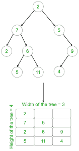

# 二叉树的中间到上下顺序遍历

> 原文:[https://www . geesforgeks . org/中到上-下-顺序-遍历二叉树/](https://www.geeksforgeeks.org/middle-to-up-down-order-traversal-of-a-binary-tree/)

给定一个[二叉树](https://www.geeksforgeeks.org/binary-tree-data-structure/)，任务是从中间到上下顺序遍历这个二叉树。
在**中间到上下顺序**遍历中，执行以下步骤:

1.  首先，打印树的中间层。
2.  然后，在树的中层以上的一层打印元素。
3.  然后，在树的中层以下一层打印元素。
4.  然后，在树的中层以上的两层打印元素。
5.  然后，在树的中层以下两层打印元素，以此类推。

**注:**在此问题中，中间水平被认为是在 **((H / 2) + 1) <sup>第</sup>** 水平，其中 **H** 是树的高度，而**根的水平**被认为是 1。

**示例:**

```
Input:
                 10 
               /     \ 
              12     13 
              /       \ 
             14        15 
             / \       / \ 
            21 22     23 24  
Output:
        14, 15, 
        12, 13, 
        21, 22, 23, 24, 
        10,
Explanation:
There are 4 levels in the tree. 
Therefore, Middle level = ((4 / 2) + 1) = 3
Now, the tree is traversed in the following way:
Middle level: 14, 15
One level above the middle level: 12, 13
One level below the middle level: 21, 22, 23, 24
Two levels above the middle level: 10

Input:
                  5 
                /   \ 
              2      13 
            /   \      \
           4    25       6
          /      / \ 
        11       3 21 
                     \
                      9
Output:
        4, 25, 6 
        2, 13 
        11, 3, 21
        5
        9
Explanation:
There are 5 levels in the tree. 
Therefore, Middle level = ((5 / 2) + 1) = 3.
Now, the tree is traversed in the following way:
Middle level: 4, 25, 6
One level above the middle level: 2, 13
One level below the middle level: 11, 3, 21
Two levels above the middle level: 5
Two levels below the middle level: 9
```

**方法:**想法是将树储存在 [**矩阵**](https://www.geeksforgeeks.org/matrix/) 中。为了做到这一点，

*   计算树的[高度](https://www.geeksforgeeks.org/iterative-method-to-find-height-of-binary-tree/)和[宽度](https://www.geeksforgeeks.org/maximum-width-of-a-binary-tree/)。
*   在计算高度和最大宽度之后，创建 2d 矩阵，并且对树执行[广度优先搜索](https://www.geeksforgeeks.org/breadth-first-search-or-bfs-for-a-graph/)以将树存储在矩阵中。
    例如:



*   然后，简单地迭代矩阵，并根据给定的条件打印矩阵中的值。

下面是上述方法的实现:

## C++

```
// C++ program to traverse the tree
// from the middle to up and down

#include <bits/stdc++.h>
using namespace std;

// A Tree node
struct Node {
    int key;
    struct Node *left, *right;
};

// Utility function to create
// a new node
Node* newNode(int key)
{
    Node* temp = new Node;
    temp->key = key;
    temp->left = temp->right = NULL;
    return (temp);
}

// Function to calculate the
// height of the tree
int findHeight(struct Node* node)
{
    // Base condition
    if (node == NULL)
        return 0;
    int leftHeight = findHeight(node->left);
    int rightHeight = findHeight(node->right);

    // Return the maximum of the height
    // of the left and right subtree
    return 1 + (leftHeight > rightHeight
                    ? leftHeight
                    : rightHeight);
}

// Function to find the width of the tree
void findWidth(struct Node* node, int& maxValue,
               int& minValue, int hd)
{
    // Base cases
    if (node == NULL)
        return;

    if (hd > maxValue) {
        maxValue = hd;
    }

    if (hd < minValue) {
        minValue = hd;
    }

    // Recursively call the function twice to find
    // the maximum width
    findWidth(node->left, maxValue, minValue, hd - 1);
    findWidth(node->right, maxValue, minValue, hd + 1);
}

// Function to traverse the tree and
// store level order traversal in a matrix
void BFS(int** mtrx, struct Node* node)
{
    // Create queue for storing
    // the addresses of nodes
    queue<struct Node*> qu;

    qu.push(node);

    int i = -1, j = -1;

    struct Node* poped_node = NULL;

    // Iterating over the queue to perform
    // breadth-first search traversal
    while (!qu.empty()) {

        i++;

        int qsize = qu.size();

        while (qsize--) {
            j++;

            poped_node = qu.front();

            // Store the data of the node into
            // the matrix
            mtrx[i][j] = poped_node->key;
            qu.pop();

            // Performing BFS for the remaining
            // nodes in the queue
            if (poped_node->left != NULL) {
                qu.push(poped_node->left);
            }

            if (poped_node->right != NULL) {
                qu.push(poped_node->right);
            }
        }

        j = -1;
    }
}

// Function for Middle to Up Down
// Traversal of Binary Tree
void traverse_matrix(int** mtrx, int height,
                     int width)
{
    // Variables to handle rows and columns
    // of the matrix
    int up = (height / 2);
    int down = up + 1;

    bool flag = true;
    int k = 0;

    // Print the middle row
    for (int j = 0; j < width; j++) {
        if (mtrx[up][j] != INT_MAX) {
            cout << mtrx[up][j] << ", ";
        }
    }
    cout << endl;
    up--;

    // Loop to print the remaining rows
    for (int i = 0; i < (height - 1); i++) {

        // Condition to manage up and
        // down indices in the matrix
        if (flag) {
            k = up;
            up--;
            flag = !flag;
        }

        else {
            k = down;
            down++;
            flag = !flag;
        }

        // Loop to print the value
        // of matrix cells in particular row
        for (int j = 0; j < width; j++) {

            if (mtrx[k][j] != INT_MAX) {
                cout << mtrx[k][j] << ", ";
            }
        }
        cout << endl;
    }
}

// A utility function for middle to
// up down traversal
void printPattern(struct Node* node)
{
    // max, min has been taken for
    // calculating the width of tree
    int max_value = INT_MIN;
    int min_value = INT_MAX;
    int hd = 0;

    // Calculate the width of a tree
    findWidth(node, max_value, min_value, hd);
    int width = max_value + abs(min_value);

    // Calculate the height of the tree
    int height = findHeight(node);

    // Double pointer to create 2D array
    int** mtrx = new int*[height];

    // Initialize the width for
    // each row of the matrix
    for (int i = 0; i < height; i++) {
        mtrx[i] = new int[width];
    }

    // Initialize complete matrix with
    // MAX INTEGER(purpose garbage)
    for (int i = 0; i < height; i++) {
        for (int j = 0; j < width; j++) {
            mtrx[i][j] = INT_MAX;
        }
    }

    // Store the BFS traversal of the tree
    // into the 2-D matrix
    BFS(mtrx, node);

    // Print the circular clockwise spiral
    // traversal of the tree
    traverse_matrix(mtrx, height, width);

    // release extra memory
    // allocated for matrix
    free(mtrx);
}

// Driver Code
int main()
{
    /*
                  10
               /     \
              12     13
              /       \
             14        15
             / \       / \
            21 22     23 24 
    */

    // Creating the above tree
    Node* root = newNode(10);
    root->left = newNode(12);
    root->right = newNode(13);

    root->right->left = newNode(14);
    root->right->right = newNode(15);

    root->right->left->left = newNode(21);
    root->right->left->right = newNode(22);
    root->right->right->left = newNode(23);
    root->right->right->right = newNode(24);

    printPattern(root);

    return 0;
}
```

## Java 语言(一种计算机语言，尤用于创建网站)

```
// Java program to traverse the tree
// from the middle to up and down
import java.util.*;

class GFG{

// A Tree node
static class Node {
    int key;
    Node left, right;
};
static int maxValue, minValue;

// Utility function to create
// a new node
static Node newNode(int key)
{
    Node temp = new Node();
    temp.key = key;
    temp.left = temp.right = null;
    return (temp);
}

// Function to calculate the
// height of the tree
static int findHeight(Node node)
{
    // Base condition
    if (node == null)
        return 0;
    int leftHeight = findHeight(node.left);
    int rightHeight = findHeight(node.right);

    // Return the maximum of the height
    // of the left and right subtree
    return 1 + (leftHeight > rightHeight
                    ? leftHeight
                    : rightHeight);
}

// Function to find the width of the tree
static void findWidth(Node node, int hd)
{
    // Base cases
    if (node == null)
        return;

    if (hd > maxValue) {
        maxValue = hd;
    }

    if (hd < minValue) {
        minValue = hd;
    }

    // Recursively call the function twice to find
    // the maximum width
    findWidth(node.left, hd - 1);
    findWidth(node.right, hd + 1);
}

// Function to traverse the tree and
// store level order traversal in a matrix
static void BFS(int [][]mtrx, Node node)
{
    // Create queue for storing
    // the addresses of nodes
    Queue<Node> qu = new LinkedList<Node>();

    qu.add(node);

    int i = -1, j = -1;

    Node poped_node = null;

    // Iterating over the queue to perform
    // breadth-first search traversal
    while (!qu.isEmpty()) {

        i++;

        int qsize = qu.size();

        while (qsize-- > 0) {
            j++;

            poped_node = qu.peek();

            // Store the data of the node into
            // the matrix
            mtrx[i][j] = poped_node.key;
            qu.remove();

            // Performing BFS for the remaining
            // nodes in the queue
            if (poped_node.left != null) {
                qu.add(poped_node.left);
            }

            if (poped_node.right != null) {
                qu.add(poped_node.right);
            }
        }

        j = -1;
    }
}

// Function for Middle to Up Down
// Traversal of Binary Tree
static void traverse_matrix(int [][]mtrx, int height,
                    int width)
{
    // Variables to handle rows and columns
    // of the matrix
    int up = (height / 2);
    int down = up + 1;

    boolean flag = true;
    int k = 0;

    // Print the middle row
    for (int j = 0; j < width; j++) {
        if (mtrx[up][j] != Integer.MAX_VALUE) {
            System.out.print(mtrx[up][j]+ ", ");
        }
    }
    System.out.println();
    up--;

    // Loop to print the remaining rows
    for (int i = 0; i < (height - 1); i++) {

        // Condition to manage up and
        // down indices in the matrix
        if (flag) {
            k = up;
            up--;
            flag = !flag;
        }

        else {
            k = down;
            down++;
            flag = !flag;
        }

        // Loop to print the value
        // of matrix cells in particular row
        for (int j = 0; j < width; j++) {

            if (mtrx[k][j] != Integer.MAX_VALUE) {
                System.out.print(mtrx[k][j]+ ", ");
            }
        }
        System.out.println();
    }
}

// A utility function for middle to
// up down traversal
static void printPattern(Node node)
{
    // max, min has been taken for
    // calculating the width of tree
    maxValue = Integer.MIN_VALUE;
    minValue = Integer.MAX_VALUE;
    int hd = 0;

    // Calculate the width of a tree
    findWidth(node, hd);
    int width = maxValue + Math.abs(minValue);

    // Calculate the height of the tree
    int height = findHeight(node);

    // Double pointer to create 2D array
    int [][]mtrx = new int[width][height];

    // Initialize complete matrix with
    // MAX INTEGER(purpose garbage)
    for (int i = 0; i < height; i++) {
        for (int j = 0; j < width; j++) {
            mtrx[i][j] = Integer.MAX_VALUE;
        }
    }

    // Store the BFS traversal of the tree
    // into the 2-D matrix
    BFS(mtrx, node);

    // Print the circular clockwise spiral
    // traversal of the tree
    traverse_matrix(mtrx, height, width);

    // release extra memory
    // allocated for matrix
    mtrx =null;
}

// Driver Code
public static void main(String[] args)
{
    /*
                10
            / \
            12 13
            / \
            14 15
            / \ / \
            21 22 23 24
    */

    // Creating the above tree
    Node root = newNode(10);
    root.left = newNode(12);
    root.right = newNode(13);

    root.right.left = newNode(14);
    root.right.right = newNode(15);

    root.right.left.left = newNode(21);
    root.right.left.right = newNode(22);
    root.right.right.left = newNode(23);
    root.right.right.right = newNode(24);

    printPattern(root);
}
}

// This code is contributed by Rajput-Ji
```

## 蟒蛇 3

```
# Python3 program for the
# above approach
from collections import deque

# A Tree node
class Node:

    def __init__(self, x):

        self.key = x
        self.left = None
        self.right = None

minValue, maxValue = 0, 0

# Function to calculate the
# height of the tree
def findHeight(node):

    # Base condition
    if (node == None):
        return 0
    leftHeight = findHeight(node.left)
    rightHeight = findHeight(node.right)

    # Return the maximum of the height
    # of the left and right subtree
    if leftHeight > rightHeight:
        return leftHeight + 1

    return rightHeight + 1

# Function to find the width
# of the tree
def findWidth(node, hd):

    global minValue, maxValue

    # Base cases
    if (node == None):
        return

    if (hd > maxValue):
        maxValue = hd

    if (hd < minValue):
        minValue = hd

    # Recursively call the
    # function twice to find
    # the maximum width
    findWidth(node.left,
              hd - 1)
    findWidth(node.right,
              hd + 1)

# Function to traverse the
# tree and store level order
# traversal in a matrix
def BFS(mtrx, node):

    # Create queue for storing
    # the addresses of nodes
    qu = deque()

    qu.append(node)
    i = -1
    j = -1
    poped_node = None

    # Iterating over the queue
    # to perform breadth-first
    # search traversal
    while (len(qu) > 0):
        i += 1
        qsize = len(qu)
        while (qsize):
            j += 1
            poped_node = qu.popleft()

            # Store the data of the
            # node into the matrix
            mtrx[i][j] = poped_node.key
            #qu.pop()

            # Performing BFS for
            # the remaining nodes
            # in the queue
            if (poped_node.left != None):
                qu.append(poped_node.left)

            if (poped_node.right != None):
                qu.append(poped_node.right)
            qsize -= 1

        j = -1

#Function for Middle to Up Down
#Traversal of Binary Tree
def traverse_matrix(mtrx,
                    height,width):

    # Variables to handle rows
    # and columns of the matrix
    up = (height // 2)
    down = up + 1

    flag = True
    k = 0

    # Print middle row
    for j in range(width):
        if (mtrx[up][j] != 10 ** 9):
            print(mtrx[up][j], end = ", ")
    print()
    up -= 1

    # Loop to print the remaining rows
    for i in range(height - 1):

        # Condition to manage up and
        # down indices in the matrix
        if (flag):
            k = up
            up -= 1
            flag = not flag
        else:
            k = down
            down += 1
            flag = not flag

        # Loop to print the value
        # of matrix cells in
        # particular row
        for j in range(width):
            if (mtrx[k][j] != 10 ** 9):
                print(mtrx[k][j], end = ", ")
        print()

# A utility function for middle to
# up down traversal
def printPattern(node):

    global maxValue, minValue

    # max, min has been taken for
    # calculating the width of tree
    maxValue = -10 ** 9
    minValue = 10 ** 9
    hd = 0

    # Calculate the width
    # of a tree
    findWidth(node, hd)
    width = maxValue + abs(minValue)

    # Calculate the height of the tree
    height = findHeight(node)

    # print(height,width)

    #Double pointer to create 2D array
    mtrx = [[10 ** 9 for i in range(width + 1)]
                     for i in range(height + 1)]

    # Store the BFS traversal of the tree
    # into the 2-D matrix
    BFS(mtrx, node)

    # Print circular clockwise spiral
    # traversal of the tree
    traverse_matrix(mtrx, height, width)

# Driver Code
if __name__ == '__main__':

    # /*
    #               10
    #            /     \
    #           12     13
    #           /       \
    #          14        15
    #          / \       / \
    #         21 22     23 24
    # */

    # Creating the above tree
    root = Node(10)
    root.left = Node(12)
    root.right = Node(13)

    root.right.left = Node(14)
    root.right.right = Node(15)

    root.right.left.left = Node(21)
    root.right.left.right = Node(22)
    root.right.right.left = Node(23)
    root.right.right.right = Node(24)

    printPattern(root)

# This code is contributed by Mohit Kumar 29
```

## C#

```
// C# program to traverse the tree
// from the middle to up and down
using System;
using System.Collections;
using System.Collections.Generic;

class GFG
{

// A Tree node
class Node
{
    public int key;
    public Node left, right;
};

static int maxValue, minValue;

// Utility function to create
// a new node
static Node newNode(int key)
{
    Node temp = new Node();
    temp.key = key;
    temp.left = temp.right = null;
    return (temp);
}

// Function to calculate the
// height of the tree
static int findHeight(Node node)
{
    // Base condition
    if (node == null)
        return 0;
    int leftHeight = findHeight(node.left);
    int rightHeight = findHeight(node.right);

    // Return the maximum of the height
    // of the left and right subtree
    return 1 + (leftHeight > rightHeight
                    ? leftHeight
                    : rightHeight);
}

// Function to find the width of the tree
static void findWidth(Node node, int hd)
{
    // Base cases
    if (node == null)
        return;

    if (hd > maxValue) {
        maxValue = hd;
    }

    if (hd < minValue) {
        minValue = hd;
    }

    // Recursively call the function twice to find
    // the maximum width
    findWidth(node.left, hd - 1);
    findWidth(node.right, hd + 1);
}

// Function to traverse the tree and
// store level order traversal in a matrix
static void BFS(int [,]mtrx, Node node)
{
    // Create queue for storing
    // the addresses of nodes
    Queue qu = new Queue(); 
    qu.Enqueue(node);
    int i = -1, j = -1;
    Node poped_node = null;

    // Iterating over the queue to perform
    // breadth-first search traversal
    while (qu.Count != 0)
    {
        i++;
        int qsize = qu.Count;
        while (qsize-- > 0) {
            j++;

            poped_node = (Node)qu.Peek();

            // Store the data of the node into
            // the matrix
            mtrx[i,j] = poped_node.key;
            qu.Dequeue();

            // Performing BFS for the remaining
            // nodes in the queue
            if (poped_node.left != null) {
                qu.Enqueue(poped_node.left);
            }

            if (poped_node.right != null) {
                qu.Enqueue(poped_node.right);
            }
        }

        j = -1;
    }
}

// Function for Middle to Up Down
// Traversal of Binary Tree
static void traverse_matrix(int [,]mtrx, int height,
                    int width)
{
    // Variables to handle rows and columns
    // of the matrix
    int up = (height / 2);
    int down = up + 1;

    bool flag = true;
    int k = 0;

    // Print the middle row
    for (int j = 0; j < width; j++) {
        if (mtrx[up, j] != 100000000) {
            Console.Write(mtrx[up,j]+ ", ");
        }
    }
    Console.WriteLine();
    up--;

    // Loop to print the remaining rows
    for (int i = 0; i < (height - 1); i++)
    {

        // Condition to manage up and
        // down indices in the matrix
        if (flag) {
            k = up;
            up--;
            flag = !flag;
        }

        else {
            k = down;
            down++;
            flag = !flag;
        }

        // Loop to print the value
        // of matrix cells in particular row
        for (int j = 0; j < width; j++)
        {

            if (mtrx[k, j] != 100000000) {
                Console.Write(mtrx[k,j]+ ", ");
            }
        }
        Console.WriteLine();
    }
}

// A utility function for middle to
// up down traversal
static void printPattern(Node node)
{
    // max, min has been taken for
    // calculating the width of tree
    maxValue = -100000000;
    minValue = 100000000;
    int hd = 0;

    // Calculate the width of a tree
    findWidth(node, hd);
    int width = maxValue + Math.Abs(minValue);

    // Calculate the height of the tree
    int height = findHeight(node);

    // Double pointer to create 2D array
    int [,]mtrx = new int[width,height];

    // Initialize complete matrix with
    // MAX INTEGER(purpose garbage)
    for (int i = 0; i < height; i++) {
        for (int j = 0; j < width; j++) {
            mtrx[i, j] = 100000000;
        }
    }

    // Store the BFS traversal of the tree
    // into the 2-D matrix
    BFS(mtrx, node);

    // Print the circular clockwise spiral
    // traversal of the tree
    traverse_matrix(mtrx, height, width);

    // release extra memory
    // allocated for matrix
    mtrx = null;
}

// Driver Code
public static void Main(string[] args)
{
    /*
                10
            / \
            12 13
            / \
            14 15
            / \ / \
            21 22 23 24
    */

    // Creating the above tree
    Node root = newNode(10);
    root.left = newNode(12);
    root.right = newNode(13);

    root.right.left = newNode(14);
    root.right.right = newNode(15);

    root.right.left.left = newNode(21);
    root.right.left.right = newNode(22);
    root.right.right.left = newNode(23);
    root.right.right.right = newNode(24);

    printPattern(root);
}
}

// This code is contributed by rutvik_56
```

## java 描述语言

```
<script>

// Javascript program to traverse the tree
// from the middle to up and down

// A Tree node
class Node
{

    // Utility function to create
    // a new node
    constructor(key)
    {
        this.key = key;
        this.left = this.right = null;
    }
}

// Function to calculate the
// height of the tree
function findHeight(node)
{

    // Base condition
    if (node == null)
        return 0;

    let leftHeight = findHeight(node.left);
    let rightHeight = findHeight(node.right);

    // Return the maximum of the height
    // of the left and right subtree
    return 1 + (leftHeight > rightHeight ?
                leftHeight : rightHeight);
}

// Function to find the width of the tree
function findWidth(node,hd)
{

    // Base cases
    if (node == null)
        return;

    if (hd > maxValue)
    {
        maxValue = hd;
    }

    if (hd < minValue)
    {
        minValue = hd;
    }

    // Recursively call the function twice
    // to find the maximum width
    findWidth(node.left, hd - 1);
    findWidth(node.right, hd + 1);
}

// Function to traverse the tree and
// store level order traversal in a matrix
function BFS(mtrx, node)
{

    // Create queue for storing
    // the addresses of nodes
    let qu = [];

    qu.push(node);

    let i = -1, j = -1;
    let poped_node = null;

    // Iterating over the queue to perform
    // breadth-first search traversal
    while (qu.length != 0)
    {

        i++;
        let qsize = qu.length;

        while (qsize-- > 0)
        {
            j++;

            poped_node = qu[0];

            // Store the data of the node into
            // the matrix
            mtrx[i][j] = poped_node.key;
            qu.shift();

            // Performing BFS for the remaining
            // nodes in the queue
            if (poped_node.left != null)
            {
                qu.push(poped_node.left);
            }

            if (poped_node.right != null)
            {
                qu.push(poped_node.right);
            }
        }
        j = -1;
    }
}

// Function for Middle to Up Down
// Traversal of Binary Tree
function traverse_matrix(mtrx, height, width)
{

    // Variables to handle rows and columns
    // of the matrix
    let up = Math.floor(height / 2);
    let down = up + 1;

    let flag = true;
    let k = 0;

    // Print the middle row
    for(let j = 0; j < width; j++)
    {
        if (mtrx[up][j] != Number.MAX_VALUE)
        {
            document.write(mtrx[up][j] + ", ");
        }
    }
    document.write("<br>");
    up--;

    // Loop to print the remaining rows
    for(let i = 0; i < (height - 1); i++)
    {

        // Condition to manage up and
        // down indices in the matrix
        if (flag)
        {
            k = up;
            up--;
            flag = !flag;
        }
        else
        {
            k = down;
            down++;
            flag = !flag;
        }

        // Loop to print the value
        // of matrix cells in particular row
        for(let j = 0; j < width; j++)
        {
            if (mtrx[k][j] != Number.MAX_VALUE)
            {
                document.write(mtrx[k][j] + ", ");
            }
        }
        document.write("<br>");
    }
}

// A utility function for middle to
// up down traversal
function printPattern(node)
{

    // max, min has been taken for
    // calculating the width of tree
    maxValue = Number.MIN_VALUE;
    minValue = Number.MAX_VALUE;
    let hd = 0;

    // Calculate the width of a tree
    findWidth(node, hd);
    let width = maxValue + Math.abs(minValue);

    // Calculate the height of the tree
    let height = findHeight(node);

    // Double pointer to create 2D array
    let mtrx = new Array(width);
    for(let i = 0; i < width; i++)
    {
        mtrx[i] = new Array(height);
    }

    // Initialize complete matrix with
    // MAX INTEGER(purpose garbage)
    for(let i = 0; i < height; i++)
    {
        for(let j = 0; j < width; j++)
        {
            mtrx[i][j] = Number.MAX_VALUE;
        }
    }

    // Store the BFS traversal of the tree
    // into the 2-D matrix
    BFS(mtrx, node);

    // Print the circular clockwise spiral
    // traversal of the tree
    traverse_matrix(mtrx, height, width);

    // release extra memory
    // allocated for matrix
    mtrx = null;
}

// Driver Code
/*
            10
            / \
            12 13
            / \
            14 15
            / \ / \
            21 22 23 24
    */

// Creating the above tree
let root = new Node(10);
root.left = new Node(12);
root.right = new Node(13);

root.right.left = new Node(14);
root.right.right = new Node(15);

root.right.left.left = new Node(21);
root.right.left.right = new Node(22);
root.right.right.left = new Node(23);
root.right.right.right = new Node(24);

printPattern(root);

// This code is contributed by unknown2108

</script>
```

**Output:** 

```
14, 15, 
12, 13, 
21, 22, 23, 24, 
10,
```