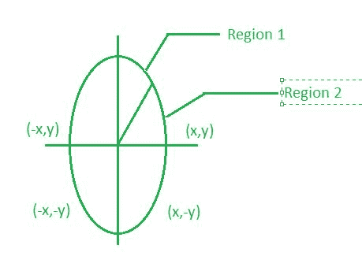

# 中点椭圆绘制算法

> 原文:[https://www . geesforgeks . org/中点-椭圆-绘制-算法/](https://www.geeksforgeeks.org/midpoint-ellipse-drawing-algorithm/)

中点椭圆算法用于在计算机图形学中绘制椭圆。

也可参考:[中点线算法](https://www.geeksforgeeks.org/mid-point-line-generation-algorithm/)、[中点圆算法](https://www.geeksforgeeks.org/mid-point-circle-drawing-algorithm/)T4】



中点椭圆算法通过将第一象限分成两个区域来绘制(查找)第一象限上的椭圆点。
每个点(x，y)然后被投影到其他三个象限(-x，y)，(x，-y)，(-x，-y)，即它使用 4 向对称。

**椭圆函数:**

> f <sub>椭圆</sub> (x，y)= r<sub>y</sub><sup>2</sup>x<sup>2</sup>+r<sub>x</sub>T10】2y<sup>2</sup>-r<sub>x</sub>T16】2r<sub>y</sub>T20】2T22】f<sub>椭圆</sub> (x，y) < 0 然后
> f <sub>椭圆</sub> (x，y) > 0 则(x，y)在椭圆外。
> f <sub>椭圆</sub> (x，y)=0 则(x，y)在椭圆上。

**决策参数:**
最初，我们在区域 1 中有两个决策参数 p1 <sub>0</sub> ，在区域 2 中有两个决策参数 p2 <sub>0</sub> 。
这些参数定义为:区域 1 中的 p1 <sub>0</sub> 给出为:

> P1<sub>0</sub>= r<sub>y</sub><sup>2</sup>+1/4r<sub>x</sub>T8】2-r<sub>x</sub>T12】2r<sub>y</sub>

**中点椭圆算法:**

1.  沿 x 轴和 y 轴取输入半径，得到椭圆中心。
2.  最初，我们假设椭圆以原点为中心，第一点为:(x，y <sub>0</sub> )= (0，r <sub>y</sub> )。
3.  获取区域 1 的初始决策参数为:P1<sub>0</sub>= r<sub>y</sub><sup>2</sup>+1/4r<sub>x</sub>T8】2-r<sub>x</sub>T12】2r<sub>y</sub>
4.  对于区域 1 中的每个 x <sub>k</sub> 位置:
    如果 p1 <sub>k</sub> < 0，则沿的下一个点是(x <sub>k+1</sub> ，y <sub>k</sub> )和 P1<sub>k+1</sub>= P1<sub>k</sub>+2r<sub>y</sub><sup>2</sup>x<sub>k+1</sub>+r<sub>y【T20 y <sub>k-1</sub> )
    和 P1<sub>k+1</sub>= P1<sub>k</sub>+2r<sub>y</sub>T35】2x<sub>k+1</sub>–2r<sub>x</sub>T41】2y<sub>k+1</sub>+r<sub>y</sub>T47】2</sub>
5.  使用区域 1 的最后一点(x <sub>0</sub> 、y <sub>0</sub> )作为:p2<sub>0</sub>= r<sub>y</sub>T8】2(x<sub>0</sub>+1/2)<sup>2</sup>+r<sub>x</sub><sup>2</sup>(y<sub>0</sub>-1)<sup>2</sup>
6.  在区域 2 中从 k =0 开始的每个 y <sub>k</sub> 处，执行以下任务。
    如果 p2<sub>k</sub>T23】0 下一个点是(x <sub>k</sub> ，y <sub>k-1</sub> )和 p2<sub>k+1</sub>= p2<sub>k</sub>-2r<sub>x</sub>T15】2y<sub>k+1</sub>+r<sub>x</sub>T21】2
7.  否则，下一点就是(x <sub>k+1</sub> ，y <sub>k -1</sub> )和 p2<sub>k+1</sub>= p2<sub>k</sub>+2r<sub>y</sub>T10】2x<sub>k+1</sub>-2r<sub>x</sub>T16】2y<sub>k+1</sub>+r<sub>x</sub>
8.  现在获取三个象限中的对称点，并将坐标值绘制为:x=x+xc，y=y+yc
9.  对区域 1 重复上述步骤，直到 2r<sub>y</sub><sup>2</sup>x>= 2r<sub>x</sub>T6】2y

**实施:**

## C++

```
// C++ program for implementing
// Mid-Point Ellipse Drawing Algorithm
#include <bits/stdc++.h>
using namespace std;

void midptellipse(int rx, int ry,
                  int xc, int yc)
{
    float dx, dy, d1, d2, x, y;
    x = 0;
    y = ry;

    // Initial decision parameter of region 1
    d1 = (ry * ry) - (rx * rx * ry) +
                     (0.25 * rx * rx);
    dx = 2 * ry * ry * x;
    dy = 2 * rx * rx * y;

    // For region 1
    while (dx < dy)
    {

        // Print points based on 4-way symmetry
        cout << x + xc << " , " << y + yc << endl;
        cout << -x + xc << " , " << y + yc << endl;
        cout << x + xc << " , " << -y + yc << endl;
        cout << -x + xc << " , " << -y + yc << endl;

        // Checking and updating value of
        // decision parameter based on algorithm
        if (d1 < 0)
        {
            x++;
            dx = dx + (2 * ry * ry);
            d1 = d1 + dx + (ry * ry);
        }
        else
        {
            x++;
            y--;
            dx = dx + (2 * ry * ry);
            dy = dy - (2 * rx * rx);
            d1 = d1 + dx - dy + (ry * ry);
        }
    }

    // Decision parameter of region 2
    d2 = ((ry * ry) * ((x + 0.5) * (x + 0.5))) +
         ((rx * rx) * ((y - 1) * (y - 1))) -
          (rx * rx * ry * ry);

    // Plotting points of region 2
    while (y >= 0)
    {

        // Print points based on 4-way symmetry
        cout << x + xc << " , " << y + yc << endl;
        cout << -x + xc << " , " << y + yc << endl;
        cout << x + xc << " , " << -y + yc << endl;
        cout << -x + xc << " , " << -y + yc << endl;

        // Checking and updating parameter
        // value based on algorithm
        if (d2 > 0)
        {
            y--;
            dy = dy - (2 * rx * rx);
            d2 = d2 + (rx * rx) - dy;
        }
        else
        {
            y--;
            x++;
            dx = dx + (2 * ry * ry);
            dy = dy - (2 * rx * rx);
            d2 = d2 + dx - dy + (rx * rx);
        }
    }
}

// Driver code
int main()
{
    // To draw a ellipse of major and
    // minor radius 15, 10 centered at (50, 50)
    midptellipse(10, 15, 50, 50);

    return 0;
}

// This code is contributed
// by Akanksha Rai
```

## C

```
// C program for implementing
// Mid-Point Ellipse Drawing Algorithm

#include <stdio.h>

void midptellipse(int rx, int ry, int xc, int yc)
{

    float dx, dy, d1, d2, x, y;
    x = 0;
    y = ry;

    // Initial decision parameter of region 1
    d1 = (ry * ry)
         - (rx * rx * ry)
         + (0.25 * rx * rx);
    dx = 2 * ry * ry * x;
    dy = 2 * rx * rx * y;

    // For region 1
    while (dx < dy) {

        // Print points based on 4-way symmetry
        printf("(%f, %f)\n", x + xc, y + yc);
        printf("(%f, %f)\n", -x + xc, y + yc);
        printf("(%f, %f)\n", x + xc, -y + yc);
        printf("(%f, %f)\n", -x + xc, -y + yc);

        // Checking and updating value of
        // decision parameter based on algorithm
        if (d1 < 0) {
            x++;
            dx = dx + (2 * ry * ry);
            d1 = d1 + dx + (ry * ry);
        }
        else {
            x++;
            y--;
            dx = dx + (2 * ry * ry);
            dy = dy - (2 * rx * rx);
            d1 = d1 + dx - dy + (ry * ry);
        }
    }

    // Decision parameter of region 2
    d2 = ((ry * ry) * ((x + 0.5) * (x + 0.5)))
         + ((rx * rx) * ((y - 1) * (y - 1)))
         - (rx * rx * ry * ry);

    // Plotting points of region 2
    while (y >= 0) {

        // printing points based on 4-way symmetry
        printf("(%f, %f)\n", x + xc, y + yc);
        printf("(%f, %f)\n", -x + xc, y + yc);
        printf("(%f, %f)\n", x + xc, -y + yc);
        printf("(%f, %f)\n", -x + xc, -y + yc);

        // Checking and updating parameter
        // value based on algorithm
        if (d2 > 0) {
            y--;
            dy = dy - (2 * rx * rx);
            d2 = d2 + (rx * rx) - dy;
        }
        else {
            y--;
            x++;
            dx = dx + (2 * ry * ry);
            dy = dy - (2 * rx * rx);
            d2 = d2 + dx - dy + (rx * rx);
        }
    }
}

// Driver code
int main()
{
    // To draw a ellipse of major and
    // minor radius 15, 10  centered at (50, 50)
    midptellipse(10, 15, 50, 50);

    return 0;
}
```

## Java 语言(一种计算机语言，尤用于创建网站)

```
// Java program for implementing
// Mid-Point Ellipse Drawing Algorithm
import java.util.*;
import java.text.DecimalFormat;

class GFG
{

static void midptellipse(float rx, float ry,
                        float xc, float yc)
{

    float dx, dy, d1, d2, x, y;
    x = 0;
    y = ry;

    // Initial decision parameter of region 1
    d1 = (ry * ry) - (rx * rx * ry) +
                    (0.25f * rx * rx);
    dx = 2 * ry * ry * x;
    dy = 2 * rx * rx * y;
    DecimalFormat df = new DecimalFormat("#,###,##0.00000");

    // For region 1
    while (dx < dy)
    {

        // Print points based on 4-way symmetry
        System.out.println(df.format((x + xc)) +
                            ", "+df.format((y + yc)));
        System.out.println(df.format((-x + xc)) +
                            ", "+ df.format((y + yc)));
        System.out.println(df.format((x + xc)) +
                            ", "+ df.format((-y + yc)));
        System.out.println(df.format((-x + xc)) +
                            ", "+df.format((-y + yc)));

        // Checking and updating value of
        // decision parameter based on algorithm
        if (d1 < 0)
        {
            x++;
            dx = dx + (2 * ry * ry);
            d1 = d1 + dx + (ry * ry);
        }
        else
        {
            x++;
            y--;
            dx = dx + (2 * ry * ry);
            dy = dy - (2 * rx * rx);
            d1 = d1 + dx - dy + (ry * ry);
        }
    }

    // Decision parameter of region 2
    d2 = ((ry * ry) * ((x + 0.5f) * (x + 0.5f)))
        + ((rx * rx) * ((y - 1) * (y - 1)))
        - (rx * rx * ry * ry);

    // Plotting points of region 2
    while (y >= 0) {

        // printing points based on 4-way symmetry
        System.out.println(df.format((x + xc)) +
                            ", " + df.format((y + yc)));
        System.out.println(df.format((-x + xc)) +
                            ", "+ df.format((y + yc)));
        System.out.println(df.format((x + xc)) +
                            ", " + df.format((-y + yc)));
        System.out.println(df.format((-x + xc)) +
                            ", " + df.format((-y + yc)));

        // Checking and updating parameter
        // value based on algorithm
        if (d2 > 0) {
            y--;
            dy = dy - (2 * rx * rx);
            d2 = d2 + (rx * rx) - dy;
        }
        else {
            y--;
            x++;
            dx = dx + (2 * ry * ry);
            dy = dy - (2 * rx * rx);
            d2 = d2 + dx - dy + (rx * rx);
        }
    }
}

// Driver code
public static void main(String args[])
{
    // To draw a ellipse of major and
    // minor radius 15, 10 centered at (50, 50)
    midptellipse(10, 15, 50, 50);
}
}

// This code is contributed by
// Surendra_Gangwar
```

## 蟒蛇 3

```
# Python3 program for implementing
# Mid-Point Ellipse Drawing Algorithm

def midptellipse(rx, ry, xc, yc):

    x = 0;
    y = ry;

    # Initial decision parameter of region 1
    d1 = ((ry * ry) - (rx * rx * ry) +
                      (0.25 * rx * rx));
    dx = 2 * ry * ry * x;
    dy = 2 * rx * rx * y;

    # For region 1
    while (dx < dy):

        # Print points based on 4-way symmetry
        print("(", x + xc, ",", y + yc, ")");
        print("(",-x + xc,",", y + yc, ")");
        print("(",x + xc,",", -y + yc ,")");
        print("(",-x + xc, ",", -y + yc, ")");

        # Checking and updating value of
        # decision parameter based on algorithm
        if (d1 < 0):
            x += 1;
            dx = dx + (2 * ry * ry);
            d1 = d1 + dx + (ry * ry);
        else:
            x += 1;
            y -= 1;
            dx = dx + (2 * ry * ry);
            dy = dy - (2 * rx * rx);
            d1 = d1 + dx - dy + (ry * ry);

    # Decision parameter of region 2
    d2 = (((ry * ry) * ((x + 0.5) * (x + 0.5))) +
          ((rx * rx) * ((y - 1) * (y - 1))) -
           (rx * rx * ry * ry));

    # Plotting points of region 2
    while (y >= 0):

        # printing points based on 4-way symmetry
        print("(", x + xc, ",", y + yc, ")");
        print("(", -x + xc, ",", y + yc, ")");
        print("(", x + xc, ",", -y + yc, ")");
        print("(", -x + xc, ",", -y + yc, ")");

        # Checking and updating parameter
        # value based on algorithm
        if (d2 > 0):
            y -= 1;
            dy = dy - (2 * rx * rx);
            d2 = d2 + (rx * rx) - dy;
        else:
            y -= 1;
            x += 1;
            dx = dx + (2 * ry * ry);
            dy = dy - (2 * rx * rx);
            d2 = d2 + dx - dy + (rx * rx);

# Driver code

# To draw a ellipse of major and
# minor radius 15, 10 centered at (50, 50)
midptellipse(10, 15, 50, 50);

# This code is contributed by chandan_jnu
```

## C#

```
// C# program for implementing
// Mid-Point Ellipse Drawing Algorithm
using System;

class GFG
{

static void midptellipse(double rx, double ry,
                        double xc, double yc)
{

    double dx, dy, d1, d2, x, y;
    x = 0;
    y = ry;

    // Initial decision parameter of region 1
    d1 = (ry * ry) - (rx * rx * ry) +
                    (0.25f * rx * rx);
    dx = 2 * ry * ry * x;
    dy = 2 * rx * rx * y;

    // For region 1
    while (dx < dy)
    {

        // Print points based on 4-way symmetry
        Console.WriteLine(String.Format("{0:0.000000}",
                            (x + xc)) + ", "+String.Format
                            ("{0:0.000000}",(y + yc)));
        Console.WriteLine(String.Format("{0:0.000000}",
                            (-x + xc)) + ", "+ String.Format
                            ("{0:0.000000}",(y + yc)));
        Console.WriteLine(String.Format("{0:0.000000}",
                            (x + xc)) + ", "+String.Format
                            ("{0:0.000000}",(-y + yc)));
        Console.WriteLine(String.Format("{0:0.000000}",
                            (-x + xc)) +", "+String.Format
                            ("{0:0.000000}",(-y + yc)));

        // Checking and updating value of
        // decision parameter based on algorithm
        if (d1 < 0)
        {
            x++;
            dx = dx + (2 * ry * ry);
            d1 = d1 + dx + (ry * ry);
        }
        else
        {
            x++;
            y--;
            dx = dx + (2 * ry * ry);
            dy = dy - (2 * rx * rx);
            d1 = d1 + dx - dy + (ry * ry);
        }
    }

    // Decision parameter of region 2
    d2 = ((ry * ry) * ((x + 0.5f) * (x + 0.5f)))
        + ((rx * rx) * ((y - 1) * (y - 1)))
        - (rx * rx * ry * ry);

    // Plotting points of region 2
    while (y >= 0)
    {

        // printing points based on 4-way symmetry
        Console.WriteLine(String.Format("{0:0.000000}",
                            (x + xc)) + ", " + String.Format
                            ("{0:0.000000}",(y + yc)));
        Console.WriteLine(String.Format("{0:0.000000}",
                            (-x + xc)) + ", "+ String.Format
                            ("{0:0.000000}",(y + yc)));
        Console.WriteLine(String.Format("{0:0.000000}",
                            (x + xc)) + ", " + String.Format
                            ("{0:0.000000}",(-y + yc)));
        Console.WriteLine(String.Format("{0:0.000000}",
                            (-x + xc)) + ", " + String.Format
                            ("{0:0.000000}",(-y + yc)));

        // Checking and updating parameter
        // value based on algorithm
        if (d2 > 0)
        {
            y--;
            dy = dy - (2 * rx * rx);
            d2 = d2 + (rx * rx) - dy;
        }
        else
        {
            y--;
            x++;
            dx = dx + (2 * ry * ry);
            dy = dy - (2 * rx * rx);
            d2 = d2 + dx - dy + (rx * rx);
        }
    }
}

// Driver code
static void Main()
{

    // To draw a ellipse of major and
    // minor radius 15, 10 centered at (50, 50)
    midptellipse(10, 15, 50, 50);
}
}

// This code is contributed by mits
```

## 服务器端编程语言（Professional Hypertext Preprocessor 的缩写）

```
<?php
// PHP program for implementing
// Mid-Point Ellipse Drawing Algorithm

function midptellipse($rx, $ry, $xc, $yc)
{
    $x = 0;
    $y = $ry;

    // Initial decision parameter of region 1
    $d1 = ($ry * $ry) - ($rx * $rx * $ry) +
                        (0.25 * $rx * $rx);
    $dx = 2 * $ry * $ry * $x;
    $dy = 2 * $rx * $rx * $y;

    // For region 1
    while ($dx < $dy)
    {

        // Print points based on 4-way symmetry
        echo "( ", $x + $xc, ", ", $y + $yc, " )\n";
        echo "( ",-$x + $xc,", ", $y + $yc, " )\n";
        echo "( ",$x + $xc,", ", -$y + $yc , " )\n";
        echo "( ",-$x + $xc, ", ", -$y + $yc, " )\n";

        // Checking and updating value of
        // decision parameter based on algorithm
        if ($d1 < 0)
        {
            $x++;
            $dx = $dx + (2 * $ry * $ry);
            $d1 = $d1 + $dx + ($ry * $ry);
        }
        else
        {
            $x++;
            $y--;
            $dx = $dx + (2 * $ry * $ry);
            $dy = $dy - (2 * $rx * $rx);
            $d1 = $d1 + $dx - $dy + ($ry * $ry);
        }
    }

    // Decision parameter of region 2
    $d2 = (($ry * $ry) * (($x + 0.5) * ($x + 0.5))) +
          (($rx * $rx) * (($y - 1) * ($y - 1))) -
                          ($rx * $rx * $ry * $ry);

    // Plotting points of region 2
    while ($y >= 0)
    {

        // printing points based on 4-way symmetry
        echo "( ",$x + $xc,", ", $y + $yc ," )\n";
        echo "( ",-$x + $xc,", ", $y + $yc , " )\n";
        echo "( ",$x + $xc,", ", -$y + $yc, " )\n";
        echo "( ",-$x + $xc,", ", -$y + $yc, " )\n";

        // Checking and updating parameter
        // value based on algorithm
        if ($d2 > 0)
        {
            $y--;
            $dy = $dy - (2 * $rx * $rx);
            $d2 = $d2 + ($rx * $rx) - $dy;
        }
        else
        {
            $y--;
            $x++;
            $dx = $dx + (2 * $ry * $ry);
            $dy = $dy - (2 * $rx * $rx);
            $d2 = $d2 + $dx - $dy + ($rx * $rx);
        }
    }
}

// Driver code

// To draw a ellipse of major and
// minor radius 15, 10 centered at (50, 50)
midptellipse(10, 15, 50, 50);

// This code is contributed by Ryuga
?>
```

## java 描述语言

```
<script>

// Javascript program for implementing
// Mid-Point Ellipse Drawing Algorithm
function midptellipse(rx, ry, xc, yc)
{
    var dx, dy, d1, d2, x, y;
    x = 0;
    y = ry;

    // Initial decision parameter of region 1
    d1 = (ry * ry) - (rx * rx * ry) +
                   (0.25 * rx * rx);
    dx = 2 * ry * ry * x;
    dy = 2 * rx * rx * y;

    // For region 1
    while (dx < dy)
    {

        // Print points based on 4-way symmetry
        document.write("(" + (x + xc).toFixed(5) +
                     " , " + (y + yc).toFixed(5) +
                       ")" + "<br>");
        document.write("(" + (-x + xc).toFixed(5) +
                     " , " + (y + yc).toFixed(5) +
                       ")" + "<br>");
        document.write("(" + (x + xc).toFixed(5) +
                     " , " + (-y + yc).toFixed(5) +
                       ")" + "<br>");
        document.write("(" +  (-x + xc).toFixed(5) +
                     " , " + (-y + yc).toFixed(5) +
                       ")" + "<br>");

        // Checking and updating value of
        // decision parameter based on algorithm
        if (d1 < 0)
        {
            x++;
            dx = dx + (2 * ry * ry);
            d1 = d1 + dx + (ry * ry);
        }
        else
        {
            x++;
            y--;
            dx = dx + (2 * ry * ry);
            dy = dy - (2 * rx * rx);
            d1 = d1 + dx - dy + (ry * ry);
        }
    }

    // Decision parameter of region 2
    d2 = ((ry * ry) * ((x + 0.5) * (x + 0.5))) +
         ((rx * rx) * ((y - 1) * (y - 1))) -
          (rx * rx * ry * ry);

    // Plotting points of region 2
    while (y >= 0)
    {

        // Print points based on 4-way symmetry
        document.write("(" + (x + xc).toFixed(5) +
                     " , " + (y + yc).toFixed(5) +
                      " )" + "<br>");
        document.write("(" + (-x + xc).toFixed(5) +
                     " , " + (y + yc).toFixed(5) +
                       ")" + "<br>");
        document.write("(" + (x + xc).toFixed(5) +
                     " , " + (-y + yc).toFixed(5) +
                       ")" + "<br>");
        document.write("(" + (-x + xc).toFixed(5) +
                     " , " + (-y + yc).toFixed(5) +
                       ")" + "<br>");

        // Checking and updating parameter
        // value based on algorithm
        if (d2 > 0)
        {
            y--;
            dy = dy - (2 * rx * rx);
            d2 = d2 + (rx * rx) - dy;
        }
        else
        {
            y--;
            x++;
            dx = dx + (2 * ry * ry);
            dy = dy - (2 * rx * rx);
            d2 = d2 + dx - dy + (rx * rx);
        }
    }
}

// Driver code

// To draw a ellipse of major and
// minor radius 15, 10 centered at (50, 50)
midptellipse(10, 15, 50, 50);

// This code is contributed by akshitsaxenaa09

</script>
```

**Output:** 

```
(50.000000, 65.000000)
(50.000000, 65.000000)
(50.000000, 35.000000)
(50.000000, 35.000000)
(51.000000, 65.000000)
(49.000000, 65.000000)
(51.000000, 35.000000)
(49.000000, 35.000000)
(52.000000, 65.000000)
(48.000000, 65.000000)
(52.000000, 35.000000)
(48.000000, 35.000000)
(53.000000, 64.000000)
(47.000000, 64.000000)
(53.000000, 36.000000)
(47.000000, 36.000000)
(54.000000, 64.000000)
(46.000000, 64.000000)
(54.000000, 36.000000)
(46.000000, 36.000000)
(55.000000, 63.000000)
(45.000000, 63.000000)
(55.000000, 37.000000)
(45.000000, 37.000000)
(56.000000, 62.000000)
(44.000000, 62.000000)
(56.000000, 38.000000)
(44.000000, 38.000000)
(57.000000, 61.000000)
(43.000000, 61.000000)
(57.000000, 39.000000)
(43.000000, 39.000000)
(57.000000, 60.000000)
(43.000000, 60.000000)
(57.000000, 40.000000)
(43.000000, 40.000000)
(58.000000, 59.000000)
(42.000000, 59.000000)
(58.000000, 41.000000)
(42.000000, 41.000000)
(58.000000, 58.000000)
(42.000000, 58.000000)
(58.000000, 42.000000)
(42.000000, 42.000000)
(59.000000, 57.000000)
(41.000000, 57.000000)
(59.000000, 43.000000)
(41.000000, 43.000000)
(59.000000, 56.000000)
(41.000000, 56.000000)
(59.000000, 44.000000)
(41.000000, 44.000000)
(59.000000, 55.000000)
(41.000000, 55.000000)
(59.000000, 45.000000)
(41.000000, 45.000000)
(60.000000, 54.000000)
(40.000000, 54.000000)
(60.000000, 46.000000)
(40.000000, 46.000000)
(60.000000, 53.000000)
(40.000000, 53.000000)
(60.000000, 47.000000)
(40.000000, 47.000000)
(60.000000, 52.000000)
(40.000000, 52.000000)
(60.000000, 48.000000)
(40.000000, 48.000000)
(60.000000, 51.000000)
(40.000000, 51.000000)
(60.000000, 49.000000)
(40.000000, 49.000000)
(60.000000, 50.000000)
(40.000000, 50.000000)
(60.000000, 50.000000)
(40.000000, 50.000000)
```