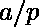

# 米迪定理

> 原文:[https://www.geeksforgeeks.org/midys-theorem/](https://www.geeksforgeeks.org/midys-theorem/)

根据[米迪定理](https://en.wikipedia.org/wiki/Midy%27s_theorem)，如果的重复小数的周期，其中 p 是**素数**和是一个**缩减分数**，有偶数个数字，那么将重复部分分成两半相加得到一串 9s。

示例:

> a = 1 和 p = 7
> 1/7 = 0.14285714285..
> 所以 1/7 是重复小数，重复 142857。现在，根据定理，它有偶数个重复数字，即 142857。此外，如果我们把它分成两半，我们得到 142 和 857。因此，将这两者相加，我们得到 999，它是一串 9，与我们的定理相匹配。
> a = 2，p = 11
> 2/11 = 0.18181818181..
> 这里，重复小数是 18。这是偶数，因此 1+8 = 9，这再次证明了米迪定理的有效性。

给定分子和分母，任务是找出结果浮点数是否遵循 Midy 定理。

**方法:**
我们来模拟一下将分数转换为小数的过程。让我们看一下已经算出整数部分的部分，即下限(分子/分母)。现在剩下(余数=分子%分母)/分母。
如果你还记得转换为十进制的过程，在每一步我们都要做以下工作:

1.  余数乘以 10。
2.  将余数/分母附加到结果中。
3.  余数=余数%分母。

任何时候，如果余数变成 0，我们就完了。
然而，当存在循环序列时，余数永远不会变成 0。例如，如果你看 1/3，余数永远不会变成 0。

下面是一个重要的观察:
如果我们从余数“rem”开始，如果余数在任何时间点重复，则“rem”的两次出现之间的数字会不断重复。
所以这个想法是将看到的余数存储在地图中。每当余数重复时，我们在下一次出现之前返回序列。

下面是米迪定理的实现:

## C++

```
// C++ implementation as a
// proof of the Midy's theorem
#include <bits/stdc++.h>
using namespace std;

// Returns repeating sequence of a fraction.
// If repeating sequence doesn't exits,
// then returns -1
string fractionToDecimal(int numerator, int denominator)
{
    string res;

    /* Create a map to store already seen remainders
       remainder is used as key and its position in
       result is stored as value. Note that we need
       position for cases like 1/6\. In this case,
       the recurring sequence doesn't start from first
       remainder. */
    map<int, int> mp;
    mp.clear();

    // Find first remainder
    int rem = numerator % denominator;

    // Keep finding remainder until either remainder
    // becomes 0 or repeats
    while ((rem != 0) && (mp.find(rem) == mp.end()))
    {
        // Store this remainder
        mp[rem] = res.length();

        // Multiply remainder with 10
        rem = rem * 10;

        // Append rem / denr to result
        int res_part = rem / denominator;
        res += to_string(res_part);

        // Update remainder
        rem = rem % denominator;
    }
    return (rem == 0) ? "-1" : res.substr(mp[rem]);
}

// Checks whether a number is prime or not
bool isPrime(int n)
{
    for (int i = 2; i <= n / 2; i++)    
        if (n % i == 0)
            return false;
   return true;
}

// If all conditions are met,
// it proves Midy's theorem
void Midys(string str, int n)
{
    int l = str.length();
    int part1 = 0, part2 = 0;
    if (!isPrime(n))   
    {
        cout << "Denominator is not prime, "
             << "thus Midy's theorem is not applicable";
    }
    else if (l % 2 == 0)
    {
        for (int i = 0; i < l / 2; i++)
        {
            part1 = part1 * 10 + (str[i] - '0');
            part2 = part2 * 10 + (str[l / 2 + i] - '0');
        }
        cout << part1 << " + " << part2 << " = "
             << (part1 + part2) << endl;
        cout << "Midy's theorem holds!";
    }
    else
    {
        cout << "The repeating decimal is of odd length "
             << "thus Midy's theorem is not applicable";
    }
}

// Driver code
int main()
{
    int numr = 2, denr = 11;
    string res = fractionToDecimal(numr, denr);
    if (res == "-1")
        cout << "The fraction does not have repeating decimal";
    else {
        cout << "Repeating decimal = " << res << endl;
        Midys(res, denr);
    }
    return 0;
}
```

## Java 语言(一种计算机语言，尤用于创建网站)

```
// Java implementation as a
// proof of the Midy's theorem
import java.util.*;

class GFG{

// Returns repeating sequence of a fraction.
// If repeating sequence doesn't exits,
// then returns -1
static String fractionToDecimal(int numerator,
                                int denominator)
{
    String res = "";

    /* Create a map to store already seen remainders
    remainder is used as key and its position in
    result is stored as value. Note that we need
    position for cases like 1/6\. In this case,
    the recurring sequence doesn't start from first
    remainder. */
    HashMap<Integer, Integer> mp = new HashMap<>();

    // Find first remainder
    int rem = numerator % denominator;

    // Keep finding remainder until either remainder
    // becomes 0 or repeats
    while ((rem != 0) && !mp.containsKey(rem))
    {

        // Store this remainder
        mp.put(rem, res.length());

        // Multiply remainder with 10
        rem = rem * 10;

        // Append rem / denr to result
        int res_part = rem / denominator;
        res += res_part + "";

        // Update remainder
        rem = rem % denominator;
    }

    return (rem == 0) ? "-1" : res.substring(mp.get(rem));
}

// Checks whether a number is prime or not
static boolean isPrime(int n)
{
    for(int i = 2; i <= n / 2; i++)
        if (n % i == 0)
            return false;

    return true;
}

// If all conditions are met,
// it proves Midy's theorem
static void Midys(String str, int n)
{
    int l = str.length();
    int part1 = 0, part2 = 0;

    if (!isPrime(n))   
    {
        System.out.print("Denominator is not prime, " +
                         "thus Midy's theorem is not " +
                         "applicable");
    }
    else if (l % 2 == 0)
    {
        for(int i = 0; i < l / 2; i++)
        {
            part1 = part1 * 10 + (str.charAt(i) - '0');
            part2 = part2 * 10 + (str.charAt(l / 2 + i) - '0');
        }
        System.out.println(part1 + " + " + part2 +
                           " = " + (part1 + part2));
        System.out.print("Midy's theorem holds!");
    }
    else
    {
        System.out.print("The repeating decimal is " +
                         "of odd length thus Midy's "+
                         "theorem is not applicable");
    }
}

// Driver code
public static void main(String []args)
{
    int numr = 2, denr = 11;
    String res = fractionToDecimal(numr, denr);

    if (res == "-1")
        System.out.print("The fraction does not " +
                         "have repeating decimal");
    else
    {
        System.out.println("Repeating decimal = " + res);
        Midys(res, denr);
    }
}
}

// This code is contributed by rutvik_56
```

## C#

```
// C# implementation as a
// proof of the Midy's theorem
using System;
using System.Collections;
using System.Collections.Generic;

class GFG{

// Returns repeating sequence of a fraction.
// If repeating sequence doesn't exits,
// then returns -1
static String fractionToDecimal(int numerator,
                                int denominator)
{
    String res = "";

    /* Create a map to store already seen remainders
    remainder is used as key and its position in
    result is stored as value. Note that we need
    position for cases like 1/6\. In this case,
    the recurring sequence doesn't start from first
    remainder. */
    Dictionary<int,int> mp = new Dictionary<int,int>();

    // Find first remainder
    int rem = numerator % denominator;

    // Keep finding remainder until either remainder
    // becomes 0 or repeats
    while ((rem != 0) && !mp.ContainsKey(rem))
    {

        // Store this remainder
        mp[rem]= res.Length;

        // Multiply remainder with 10
        rem = rem * 10;

        // Append rem / denr to result
        int res_part = rem / denominator;
        res += res_part + "";

        // Update remainder
        rem = rem % denominator;
    }

    return (rem == 0) ? "-1" : res.Substring(mp[rem]);
}

// Checks whether a number is prime or not
static bool isPrime(int n)
{
    for(int i = 2; i <= n / 2; i++)
        if (n % i == 0)
            return false;          
    return true;
}

// If all conditions are met,
// it proves Midy's theorem
static void Midys(String str, int n)
{
    int l = str.Length;
    int part1 = 0, part2 = 0;  
    if (!isPrime(n))   
    {
        Console.Write("Denominator is not prime, " +
                         "thus Midy's theorem is not " +
                         "applicable");
    }
    else if (l % 2 == 0)
    {
        for(int i = 0; i < l / 2; i++)
        {
            part1 = part1 * 10 + (str[i] - '0');
            part2 = part2 * 10 + (str[l / 2 + i] - '0');
        }
        Console.WriteLine(part1 + " + " + part2 +
                           " = " + (part1 + part2));
        Console.Write("Midy's theorem holds!");
    }
    else
    {
        Console.Write("The repeating decimal is " +
                         "of odd length thus Midy's "+
                         "theorem is not applicable");
    }
}

// Driver code
public static void Main(string []args)
{
    int numr = 2, denr = 11;
    string res = fractionToDecimal(numr, denr);

    if (res == "-1")
        Console.Write("The fraction does not " +
                         "have repeating decimal");
    else
    {
        Console.WriteLine("Repeating decimal = " + res);
        Midys(res, denr);
    }
}
}

// This code is contributed by pratham76.
```

**输出:**

```
Repeating decimal = 18
1 + 8 = 9
Midy's theorem holds!
```

关于米迪定理的更多信息，可以在 http://digitalcommons.unl.edu/cgi/viewcontent.cgi?的
[上找到文章=1047 &上下文=mathfacpub](http://www.kurims.kyoto-u.ac.jp/EMIS/journals/INTEGERS/papers/h2/h2.pdf)