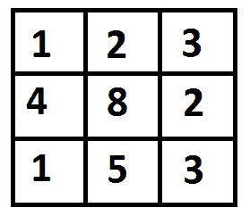
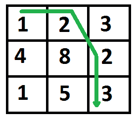

# 最小成本路径| DP-6

> 原文:[https://www.geeksforgeeks.org/min-cost-path-dp-6/](https://www.geeksforgeeks.org/min-cost-path-dp-6/)

给定成本矩阵 cost[][]和 cost[][]中的位置(m，n)，编写一个函数，返回从(0，0)到达(m，n)的最小成本路径的成本。矩阵的每个单元都代表了遍历该单元的成本。到达路径的总成本(m，n)是该路径上所有成本的总和(包括源和目的地)。您只能遍历给定单元格中的向下、向右和对角线方向较低的单元格，即从给定单元格(I，j)开始，可以遍历单元格(i+1，j)、(I，j+1)和(i+1，j+1)。你可以假设所有的成本都是正整数。

例如，在下图中，到(2，2)的最小成本路径是什么？



下图中突出显示了成本最低的路径。路径是(0，0)–>(0，1)–>(1，2)–>(2，2)。路径的成本是 8 (1 + 2 + 2 + 3)。



**1)最优子结构**
到达(m，n)的路径必须通过 3 个单元之一:(m-1，n-1)或(m-1，n)或(m，n-1)。因此，达到(m，n)的最小成本可以写成“3 个单元的最小值加上成本[m][n]”。
minCost(m，n) = min (minCost(m-1，n-1)，minCost(m-1，n)，minCost(m，n-1)) + cost[m][n]

**2)重叠子问题**
下面是 MCP(最小成本路径)问题的简单递归实现。实现简单地遵循上面提到的递归结构。

## C++

```
// A Naive recursive implementation
// of MCP(Minimum Cost Path) problem
#include <bits/stdc++.h>
using namespace std;

#define R 3
#define C 3

int min(int x, int y, int z);

// Returns cost of minimum cost path
// from (0,0) to (m, n) in mat[R][C]
int minCost(int cost[R][C], int m, int n)
{
    if (n < 0 || m < 0)
        return INT_MAX;
    else if (m == 0 && n == 0)
        return cost[m][n];
    else
        return cost[m][n] +
         min(minCost(cost, m - 1, n - 1),
             minCost(cost, m - 1, n),
             minCost(cost, m, n - 1));
}

// A utility function that returns
// minimum of 3 integers
int min(int x, int y, int z)
{
    if (x < y)
        return (x < z) ? x : z;
    else
        return (y < z) ? y : z;
}

// Driver code
int main()
{
    int cost[R][C] = { { 1, 2, 3 },
                       { 4, 8, 2 },
                       { 1, 5, 3 } };

    cout << minCost(cost, 2, 2) << endl;

    return 0;
}

// This code is contributed by nikhilchhipa9
```

## C

```
/* A Naive recursive implementation of MCP(Minimum Cost Path) problem */
#include<stdio.h>
#include<limits.h>
#define R 3
#define C 3

int min(int x, int y, int z);

/* Returns cost of minimum cost path from (0,0) to (m, n) in mat[R][C]*/
int minCost(int cost[R][C], int m, int n)
{
   if (n < 0 || m < 0)
      return INT_MAX;
   else if (m == 0 && n == 0)
      return cost[m][n];
   else
      return cost[m][n] + min( minCost(cost, m-1, n-1),
                               minCost(cost, m-1, n),
                               minCost(cost, m, n-1) );
}

/* A utility function that returns minimum of 3 integers */
int min(int x, int y, int z)
{
   if (x < y)
      return (x < z)? x : z;
   else
      return (y < z)? y : z;
}

/* Driver program to test above functions */
int main()
{
   int cost[R][C] = { {1, 2, 3},
                      {4, 8, 2},
                      {1, 5, 3} };
   printf(" %d ", minCost(cost, 2, 2));
   return 0;
}
```

## Java 语言(一种计算机语言，尤用于创建网站)

```
/* A Naive recursive implementation of
MCP(Minimum Cost Path) problem */
public class GFG {

    /* A utility function that returns
    minimum of 3 integers */
    static int min(int x, int y, int z)
    {
        if (x < y)
            return (x < z) ? x : z;
        else
            return (y < z) ? y : z;
    }

    /* Returns cost of minimum cost path
    from (0,0) to (m, n) in mat[R][C]*/
    static int minCost(int cost[][], int m,
                                     int n)
    {
        if (n < 0 || m < 0)
            return Integer.MAX_VALUE;
        else if (m == 0 && n == 0)
            return cost[m][n];
        else
            return cost[m][n] +
                min( minCost(cost, m-1, n-1),
                     minCost(cost, m-1, n),
                     minCost(cost, m, n-1) );
    }

    // Driver code
    public static void main(String args[])
    {

        int cost[][] = { {1, 2, 3},
                         {4, 8, 2},
                         {1, 5, 3} };

        System.out.print(minCost(cost, 2, 2));
    }
}

// This code is contributed by Sam007
```

## 蟒蛇 3

```
# A Naive recursive implementation of MCP(Minimum Cost Path) problem
R = 3
C = 3
import sys

# Returns cost of minimum cost path from (0,0) to (m, n) in mat[R][C]
def minCost(cost, m, n):
    if (n < 0 or m < 0):
        return sys.maxsize
    elif (m == 0 and n == 0):
        return cost[m][n]
    else:
        return cost[m][n] + min( minCost(cost, m-1, n-1),
                                minCost(cost, m-1, n),
                                minCost(cost, m, n-1) )

#A utility function that returns minimum of 3 integers */
def min(x, y, z):
    if (x < y):
        return x if (x < z) else z
    else:
        return y if (y < z) else z

# Driver program to test above functions
cost= [ [1, 2, 3],
        [4, 8, 2],
        [1, 5, 3] ]
print(minCost(cost, 2, 2))

# This code is contributed by
# Smitha Dinesh Semwal
```

## C#

```
/* A Naive recursive implementation of
MCP(Minimum Cost Path) problem */
using System;

class GFG
{

    /* A utility function that
    returns minimum of 3 integers */
    static int min(int x,
                   int y, int z)
    {
        if (x < y)
            return ((x < z) ? x : z);
        else
            return ((y < z) ? y : z);
    }

    /* Returns cost of minimum
    cost path from (0,0) to
    (m, n) in mat[R][C]*/
    static int minCost(int [,]cost,
                       int m , int n)
    {
        if (n < 0 || m < 0)
            return int.MaxValue;
        else if (m == 0 && n == 0)
            return cost[m, n];
        else
            return cost[m, n] +
                   min(minCost(cost, m - 1, n - 1),
                   minCost(cost, m - 1, n),
                   minCost(cost, m, n - 1) );
    }

    // Driver code
    public static void Main()
    {

        int [,]cost = {{1, 2, 3},
                       {4, 8, 2},
                       {1, 5, 3}};

        Console.Write(minCost(cost, 2, 2));
    }
}

// This code is contributed
// by shiv_bhakt.
```

## 服务器端编程语言（Professional Hypertext Preprocessor 的缩写）

```
<?php
/* A Naive recursive implementation
of MCP(Minimum Cost Path) problem */

$R = 3;
$C = 3;

/* Returns cost of minimum 
cost path from (0,0) to
(m, n) in mat[R][C]*/
function minCost($cost, $m, $n)
{
global $R;
global $C;
if ($n < 0 || $m < 0)
    return PHP_INT_MAX;
else if ($m == 0 && $n == 0)
    return $cost[$m][$n];
else
    return $cost[$m][$n] + 
            min1(minCost($cost, $m - 1, $n - 1),
            minCost($cost, $m - 1, $n),
            minCost($cost, $m, $n - 1) );
}

/* A utility function that
returns minimum of 3 integers */
function min1($x, $y, $z)
{
if ($x < $y)
    return ($x < $z)? $x : $z;
else
    return ($y < $z)? $y : $z;
}

// Driver Code
$cost = array(array(1, 2, 3),
              array (4, 8, 2),
              array (1, 5, 3));
echo minCost($cost, 2, 2);

// This code is contributed by mits.
?>
```

## java 描述语言

```
<script>

// A Naive recursive implementation of
// MCP(Minimum Cost Path) problem

// A utility function that returns
// minimum of 3 integers
function min(x, y, z)
{
    if (x < y)
        return (x < z) ? x : z;
    else
        return (y < z) ? y : z;
}

// Returns cost of minimum cost path
// from (0,0) to (m, n) in mat[R][C]
function minCost(cost, m, n)
{
    if (n < 0 || m < 0)
        return Number.MAX_VALUE;
    else if (m == 0 && n == 0)
        return cost[m][n];
    else
        return cost[m][n] + min(minCost(cost, m - 1, n - 1),
                                minCost(cost, m - 1, n),
                                minCost(cost, m, n - 1));
}

// Driver code
var cost = [ [ 1, 2, 3 ],
             [ 4, 8, 2 ],
             [ 1, 5, 3 ] ];

document.write(minCost(cost, 2, 2));

// This code is contributed by gauravrajput1

</script>
```

**Output**

```
 8
```

***时间复杂度:** O(m * n)*

需要注意的是，上面的函数一次又一次地计算相同的子问题。请看下面的递归树，有很多节点出现不止一次。这个简单递归解决方案的时间复杂度是指数级的，而且非常慢。

```
mC refers to minCost()
                                    mC(2, 2)
                          /            |           \
                         /             |            \             
                 mC(1, 1)           mC(1, 2)             mC(2, 1)
              /     |     \       /     |     \           /     |     \ 
             /      |      \     /      |      \         /      |       \
       mC(0,0) mC(0,1) mC(1,0) mC(0,1) mC(0,2) mC(1,1) mC(1,0) mC(1,1) mC(2,0)
```

所以 MCP 问题同时具有动态规划问题的两个性质(见[这个](https://www.geeksforgeeks.org/overlapping-subproblems-property-in-dynamic-programming-dp-1/)和[这个](https://www.geeksforgeeks.org/optimal-substructure-property-in-dynamic-programming-dp-2/))。像其他典型的[动态规划(DP)问题](https://www.geeksforgeeks.org/archives/tag/dynamic-programming)一样，相同子问题的重新计算可以通过以自下而上的方式构建临时数组 tc[][]来避免。

## C++

```
/* Dynamic Programming implementation of MCP problem */
#include <bits/stdc++.h>
#include<limits.h>
#define R 3
#define C 3
using namespace std;
int min(int x, int y, int z);

int minCost(int cost[R][C], int m, int n)
{
     int i, j;

     // Instead of following line, we can use int tc[m+1][n+1] or
     // dynamically allocate memory to save space. The following line is
     // used to keep the program simple and make it working on all compilers.
     int tc[R][C]; 

     tc[0][0] = cost[0][0];

     /* Initialize first column of total cost(tc) array */
     for (i = 1; i <= m; i++)
        tc[i][0] = tc[i - 1][0] + cost[i][0];

     /* Initialize first row of tc array */
     for (j = 1; j <= n; j++)
        tc[0][j] = tc[0][j - 1] + cost[0][j];

     /* Construct rest of the tc array */
     for (i = 1; i <= m; i++)
        for (j = 1; j <= n; j++)
            tc[i][j] = min(tc[i - 1][j - 1],
                           tc[i - 1][j],
                           tc[i][j - 1]) + cost[i][j];

     return tc[m][n];
}

/* A utility function that returns minimum of 3 integers */
int min(int x, int y, int z)
{
   if (x < y)
      return (x < z)? x : z;
   else
      return (y < z)? y : z;
}

/* Driver code*/
int main()
{
   int cost[R][C] = { {1, 2, 3},
                      {4, 8, 2},
                      {1, 5, 3} };
   cout << "  " << minCost(cost, 2, 2);
   return 0;
}

// This code is contributed by shivanisinghss2110
```

## C

```
/* Dynamic Programming implementation of MCP problem */
#include<stdio.h>
#include<limits.h>
#define R 3
#define C 3

int min(int x, int y, int z);

int minCost(int cost[R][C], int m, int n)
{
     int i, j;

     // Instead of following line, we can use int tc[m+1][n+1] or
     // dynamically allocate memory to save space. The following line is
     // used to keep the program simple and make it working on all compilers.
     int tc[R][C]; 

     tc[0][0] = cost[0][0];

     /* Initialize first column of total cost(tc) array */
     for (i = 1; i <= m; i++)
        tc[i][0] = tc[i-1][0] + cost[i][0];

     /* Initialize first row of tc array */
     for (j = 1; j <= n; j++)
        tc[0][j] = tc[0][j-1] + cost[0][j];

     /* Construct rest of the tc array */
     for (i = 1; i <= m; i++)
        for (j = 1; j <= n; j++)
            tc[i][j] = min(tc[i-1][j-1],
                           tc[i-1][j],
                           tc[i][j-1]) + cost[i][j];

     return tc[m][n];
}

/* A utility function that returns minimum of 3 integers */
int min(int x, int y, int z)
{
   if (x < y)
      return (x < z)? x : z;
   else
      return (y < z)? y : z;
}

/* Driver program to test above functions */
int main()
{
   int cost[R][C] = { {1, 2, 3},
                      {4, 8, 2},
                      {1, 5, 3} };
   printf(" %d ", minCost(cost, 2, 2));
   return 0;
}
```

## Java 语言(一种计算机语言，尤用于创建网站)

```
/* Java program for Dynamic Programming implementation
   of Min Cost Path problem */
import java.util.*;

class MinimumCostPath
{
    /* A utility function that returns minimum of 3 integers */
    private static int min(int x, int y, int z)
    {
        if (x < y)
            return (x < z)? x : z;
        else
            return (y < z)? y : z;
    }

    private static int minCost(int cost[][], int m, int n)
    {
        int i, j;
        int tc[][]=new int[m+1][n+1];

        tc[0][0] = cost[0][0];

        /* Initialize first column of total cost(tc) array */
        for (i = 1; i <= m; i++)
            tc[i][0] = tc[i-1][0] + cost[i][0];

        /* Initialize first row of tc array */
        for (j = 1; j <= n; j++)
            tc[0][j] = tc[0][j-1] + cost[0][j];

        /* Construct rest of the tc array */
        for (i = 1; i <= m; i++)
            for (j = 1; j <= n; j++)
                tc[i][j] = min(tc[i-1][j-1],
                               tc[i-1][j],
                               tc[i][j-1]) + cost[i][j];

        return tc[m][n];
    }

    /* Driver program to test above functions */
    public static void main(String args[])
    {
        int cost[][]= {{1, 2, 3},
                       {4, 8, 2},
                       {1, 5, 3}};
        System.out.println(minCost(cost,2,2));
    }
}
// This code is contributed by Pankaj Kumar
```

## 计算机编程语言

```
# Dynamic Programming Python implementation of Min Cost Path
# problem
R = 3
C = 3

def minCost(cost, m, n):

    # Instead of following line, we can use int tc[m+1][n+1] or
    # dynamically allocate memoery to save space. The following
    # line is used to keep te program simple and make it working
    # on all compilers.
    tc = [[0 for x in range(C)] for x in range(R)]

    tc[0][0] = cost[0][0]

    # Initialize first column of total cost(tc) array
    for i in range(1, m+1):
        tc[i][0] = tc[i-1][0] + cost[i][0]

    # Initialize first row of tc array
    for j in range(1, n+1):
        tc[0][j] = tc[0][j-1] + cost[0][j]

    # Construct rest of the tc array
    for i in range(1, m+1):
        for j in range(1, n+1):
            tc[i][j] = min(tc[i-1][j-1], tc[i-1][j], tc[i][j-1]) + cost[i][j]

    return tc[m][n]

# Driver program to test above functions
cost = [[1, 2, 3],
        [4, 8, 2],
        [1, 5, 3]]
print(minCost(cost, 2, 2))

# This code is contributed by Bhavya Jain
```

## C#

```
// C# program for Dynamic Programming implementation
// of Min Cost Path problem
using System;

class GFG
{
    // A utility function that
    // returns minimum of 3 integers
    private static int min(int x, int y, int z)
    {
        if (x < y)
            return (x < z)? x : z;
        else
            return (y < z)? y : z;
    }

    private static int minCost(int [,]cost, int m, int n)
    {
        int i, j;
        int [,]tc=new int[m+1,n+1];

        tc[0,0] = cost[0,0];

        /* Initialize first column of total cost(tc) array */
        for (i = 1; i <= m; i++)
            tc[i, 0] = tc[i - 1, 0] + cost[i, 0];

        /* Initialize first row of tc array */
        for (j = 1; j <= n; j++)
            tc[0, j] = tc[0, j - 1] + cost[0, j];

        /* Construct rest of the tc array */
        for (i = 1; i <= m; i++)
            for (j = 1; j <= n; j++)
                tc[i, j] = min(tc[i - 1, j - 1],
                            tc[i - 1, j],
                            tc[i, j - 1]) + cost[i, j];

        return tc[m, n];
    }

    // Driver program
    public static void Main()
    {
        int [,]cost= {{1, 2, 3},
                    {4, 8, 2},
                    {1, 5, 3}};
        Console.Write(minCost(cost,2,2));
    }
}

// This code is contributed by Sam007.
```

## 服务器端编程语言（Professional Hypertext Preprocessor 的缩写）

```
<?php
// DP implementation
// of MCP problem
$R = 3;
$C = 3;

function minCost($cost, $m, $n)
{
    global $R;
    global $C;
    // Instead of following line,
    // we can use int tc[m+1][n+1]
    // or dynamically allocate
    // memory to save space. The
    // following line is used to keep
    // the program simple and make
    // it working on all compilers.
    $tc;
    for ($i = 0; $i <= $R; $i++)
    for ($j = 0; $j <= $C; $j++)
    $tc[$i][$j] = 0;

    $tc[0][0] = $cost[0][0];

    /* Initialize first column of
       total cost(tc) array */
    for ($i = 1; $i <= $m; $i++)
        $tc[$i][0] = $tc[$i - 1][0] +
                     $cost[$i][0];

    /* Initialize first
       row of tc array */
    for ($j = 1; $j <= $n; $j++)
        $tc[0][$j] = $tc[0][$j - 1] +
                     $cost[0][$j];

    /* Construct rest of
       the tc array */
    for ($i = 1; $i <= $m; $i++)
        for ($j = 1; $j <= $n; $j++)

            // returns minimum of 3 integers
            $tc[$i][$j] = min($tc[$i - 1][$j - 1],
                              $tc[$i - 1][$j],
                              $tc[$i][$j - 1]) +
                              $cost[$i][$j];

    return $tc[$m][$n];
}

// Driver Code
$cost = array(array(1, 2, 3),
              array(4, 8, 2),
              array(1, 5, 3));
echo minCost($cost, 2, 2);

// This code is contributed by mits
?>
```

## java 描述语言

```
<script>
    // Javascript program for Dynamic Programming implementation
    // of Min Cost Path problem

    /* A utility function that returns minimum of 3 integers */
    function min(x, y, z)
    {
        if (x < y)
            return (x < z)? x : z;
        else
            return (y < z)? y : z;
    }

    function minCost(cost, m, n)
    {
        let i, j;
        let tc = new Array(m+1);

        for(let k = 0; k < m + 1; k++)
        {
            tc[k] = new Array(n+1);
        }

        tc[0][0] = cost[0][0];

        /* Initialize first column of total cost(tc) array */
        for (i = 1; i <= m; i++)
            tc[i][0] = tc[i-1][0] + cost[i][0];

        /* Initialize first row of tc array */
        for (j = 1; j <= n; j++)
            tc[0][j] = tc[0][j-1] + cost[0][j];

        /* Construct rest of the tc array */
        for (i = 1; i <= m; i++)
            for (j = 1; j <= n; j++)
                tc[i][j] = Math.min(tc[i-1][j-1],
                               tc[i-1][j],
                               tc[i][j-1]) + cost[i][j];

        return tc[m][n];
    }

    let cost = [[1, 2, 3],
                [4, 8, 2],
                 [1, 5, 3]];
    document.write(minCost(cost,2,2));

</script>
```

**Output**

```
 8
```