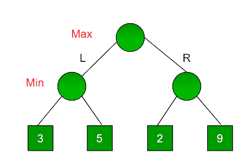
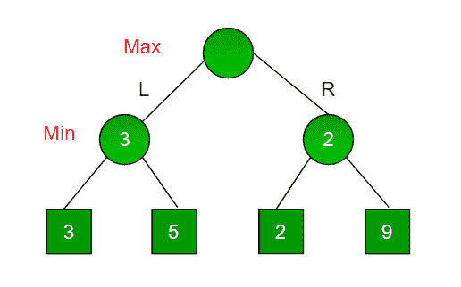

# 博弈论中的极小极大算法|集合 1(简介)

> 原文:[https://www . geesforgeks . org/minimax-博弈论中的算法-set-1-introduction/](https://www.geeksforgeeks.org/minimax-algorithm-in-game-theory-set-1-introduction/)

Minimax 是一种[回溯](https://www.geeksforgeeks.org/tag/backtracking/)算法，用于决策和博弈论中，假设你的对手也打得最优，为玩家找到最优的一招。广泛应用于井字游戏、双陆棋、曼卡拉、国际象棋等双人回合游戏中。
在 Minimax 中，这两个玩家被称为最大化者和最小化者。**最大化器**试图获得尽可能高的分数，而**最小化器**试图反其道而行之，获得尽可能低的分数。
每个板状态都有一个与之相关的值。在给定的状态下，如果最大化者占据上风，那么棋盘的分数将趋向于某个正值。如果最小化器在棋盘状态中占据上风，那么它将趋向于一些负值。棋盘的数值是由一些启发式算法计算出来的，这些算法对每种游戏都是唯一的。

**举例:**
考虑一个有 4 个最终状态的游戏，到达最终状态的路径是从完美二叉树的根到 4 片叶子，如下图所示。假设你是最大化玩家，你获得了第一次移动的机会，即你在根，你的对手在下一级。**考虑到你的对手也打得很好，作为一个最大化玩家，你会做出哪一个动作？**



由于这是一个基于回溯的算法，它尝试所有可能的移动，然后回溯并做出决定。

*   最大化者向左:现在轮到最小化者了。最小化器现在可以在 3 和 5 之间选择。作为最小值，它肯定会选择两者中最少的，那就是 3
*   最大化向右:现在轮到最小化了。极小值现在可以在 2 和 9 之间选择。他会选择 2，因为它是两个值中最少的。

作为最大化者，你会选择更大的值，即 3。因此，最大化器的最佳移动是向左，最佳值是 3。

现在游戏树如下所示:



上图显示了最大化器左右移动时的两种可能得分。

*注意:即使右边的子树上有一个值 9，最小化器也不会选择那个值。我们必须始终假设我们的对手打得最好。*

下面是相同的实现。

## C++

```
// A simple C++ program to find
// maximum score that
// maximizing player can get.
#include<bits/stdc++.h>
using namespace std;

// Returns the optimal value a maximizer can obtain.
// depth is current depth in game tree.
// nodeIndex is index of current node in scores[].
// isMax is true if current move is
// of maximizer, else false
// scores[] stores leaves of Game tree.
// h is maximum height of Game tree
int minimax(int depth, int nodeIndex, bool isMax,
            int scores[], int h)
{
    // Terminating condition. i.e
    // leaf node is reached
    if (depth == h)
        return scores[nodeIndex];

    //  If current move is maximizer,
    // find the maximum attainable
    // value
    if (isMax)
       return max(minimax(depth+1, nodeIndex*2, false, scores, h),
            minimax(depth+1, nodeIndex*2 + 1, false, scores, h));

    // Else (If current move is Minimizer), find the minimum
    // attainable value
    else
        return min(minimax(depth+1, nodeIndex*2, true, scores, h),
            minimax(depth+1, nodeIndex*2 + 1, true, scores, h));
}

// A utility function to find Log n in base 2
int log2(int n)
{
  return (n==1)? 0 : 1 + log2(n/2);
}

// Driver code
int main()
{
    // The number of elements in scores must be
    // a power of 2.
    int scores[] = {3, 5, 2, 9, 12, 5, 23, 23};
    int n = sizeof(scores)/sizeof(scores[0]);
    int h = log2(n);
    int res = minimax(0, 0, true, scores, h);
    cout << "The optimal value is : " << res << endl;
    return 0;
}
```

## Java 语言(一种计算机语言，尤用于创建网站)

```
// A simple java program to find maximum score that
// maximizing player can get.

import java.io.*;

class GFG {

// Returns the optimal value a maximizer can obtain.
// depth is current depth in game tree.
// nodeIndex is index of current node in scores[].
// isMax is true if current move is of maximizer, else false
// scores[] stores leaves of Game tree.
// h is maximum height of Game tree
 static int minimax(int depth, int nodeIndex, boolean  isMax,
            int scores[], int h)
{
    // Terminating condition. i.e leaf node is reached
    if (depth == h)
        return scores[nodeIndex];

    // If current move is maximizer, find the maximum attainable
    // value
    if (isMax)
    return Math.max(minimax(depth+1, nodeIndex*2, false, scores, h),
            minimax(depth+1, nodeIndex*2 + 1, false, scores, h));

    // Else (If current move is Minimizer), find the minimum
    // attainable value
    else
        return Math.min(minimax(depth+1, nodeIndex*2, true, scores, h),
            minimax(depth+1, nodeIndex*2 + 1, true, scores, h));
}

// A utility function to find Log n in base 2
 static int log2(int n)
{
return (n==1)? 0 : 1 + log2(n/2);
}

// Driver code

    public static void main (String[] args) {
            // The number of elements in scores must be
    // a power of 2.
    int scores[] = {3, 5, 2, 9, 12, 5, 23, 23};
    int n = scores.length;
    int h = log2(n);
    int res = minimax(0, 0, true, scores, h);
    System.out.println( "The optimal value is : "  +res);

    }
}

// This code is contributed by vt_m
```

## C#

```
// A simple C# program to find maximum score that
// maximizing player can get.
using System;

public class GFG
{

// Returns the optimal value a maximizer can obtain.
// depth is current depth in game tree.
// nodeIndex is index of current node in scores[].
// isMax is true if current move is of maximizer, else false
// scores[] stores leaves of Game tree.
// h is maximum height of Game tree
static int minimax(int depth, int nodeIndex, bool isMax,
            int []scores, int h)
{
    // Terminating condition. i.e leaf node is reached
    if (depth == h)
        return scores[nodeIndex];

    // If current move is maximizer, find the maximum attainable
    // value
    if (isMax)
    return Math.Max(minimax(depth+1, nodeIndex*2, false, scores, h),
            minimax(depth+1, nodeIndex*2 + 1, false, scores, h));

    // Else (If current move is Minimizer), find the minimum
    // attainable value
    else
        return Math.Min(minimax(depth+1, nodeIndex*2, true, scores, h),
            minimax(depth+1, nodeIndex*2 + 1, true, scores, h));
}

// A utility function to find Log n in base 2
static int log2(int n)
{
    return (n==1)? 0 : 1 + log2(n/2);
}

// Driver code
static public void Main ()
{

    // The number of elements in scores must be
    // a power of 2.
    int []scores = {3, 5, 2, 9, 12, 5, 23, 23};
    int n = scores.Length;
    int h = log2(n);
    int res = minimax(0, 0, true, scores, h);
    Console.WriteLine( "The optimal value is : " +res);

}
}

// This code is contributed by ajit.
```

## 蟒蛇 3

```
# A simple Python3 program to find
# maximum score that
# maximizing player can get
import math

def minimax (curDepth, nodeIndex,
             maxTurn, scores,
             targetDepth):

    # base case : targetDepth reached
    if (curDepth == targetDepth):
        return scores[nodeIndex]

    if (maxTurn):
        return max(minimax(curDepth + 1, nodeIndex * 2,
                    False, scores, targetDepth),
                   minimax(curDepth + 1, nodeIndex * 2 + 1,
                    False, scores, targetDepth))

    else:
        return min(minimax(curDepth + 1, nodeIndex * 2,
                     True, scores, targetDepth),
                   minimax(curDepth + 1, nodeIndex * 2 + 1,
                     True, scores, targetDepth))

# Driver code
scores = [3, 5, 2, 9, 12, 5, 23, 23]

treeDepth = math.log(len(scores), 2)

print("The optimal value is : ", end = "")
print(minimax(0, 0, True, scores, treeDepth))

# This code is contributed
# by rootshadow
```

## java 描述语言

```
<script>

// Javascript program to find maximum score that
// maximizing player can get.

// Returns the optimal value a maximizer can obtain.
// depth is current depth in game tree.
// nodeIndex is index of current node in scores[].
// isMax is true if current move is of maximizer, else false
// scores[] stores leaves of Game tree.
// h is maximum height of Game tree
 function minimax(depth, nodeIndex, isMax,
            scores, h)
{
    // Terminating condition. i.e leaf node is reached
    if (depth == h)
        return scores[nodeIndex];

    // If current move is maximizer, find the maximum attainable
    // value
    if (isMax)
    return Math.max(minimax(depth+1, nodeIndex*2, false, scores, h),
            minimax(depth+1, nodeIndex*2 + 1, false, scores, h));

    // Else (If current move is Minimizer), find the minimum
    // attainable value
    else
        return Math.min(minimax(depth+1, nodeIndex*2, true, scores, h),
            minimax(depth+1, nodeIndex*2 + 1, true, scores, h));
}

// A utility function to find Log n in base 2
 function log2(n)
{
return (n==1)? 0 : 1 + log2(n/2);
}

// Driver Code

    // The number of elements in scores must be
    // a power of 2.
    let scores = [3, 5, 2, 9, 12, 5, 23, 23];
    let n = scores.length;
    let h = log2(n);
    let res = minimax(0, 0, true, scores, h);
    document.write( "The optimal value is : "  +res);

</script>
```

**输出:**

```
The optimal value is:  12
```

本文的想法是用一个简单的例子来介绍 Minimax。

*   在上面的例子中，一个玩家只有两个选择。总的来说，可以有更多的选择。在这种情况下，我们需要重现所有可能的移动，并找到最大值/最小值。比如井字游戏中，第一个玩家可以做 9 个可能的动作。
*   在上面的例子中，分数(游戏树的叶子)是给我们的。对于一个典型的游戏，我们需要导出这些值

我们将很快用极小极大算法覆盖井字游戏。
本文由**阿克谢·l·阿拉德亚供稿。**如果你喜欢 GeeksforGeeks 并想投稿，你也可以写一篇文章并把你的文章邮寄到 review-team@geeksforgeeks.org。看到你的文章出现在极客博客主页上，帮助其他极客。
如发现任何不正确的地方，请写评论，或者您想分享更多关于上述话题的信息