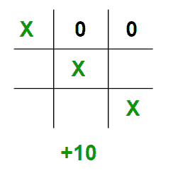
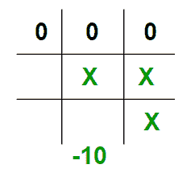
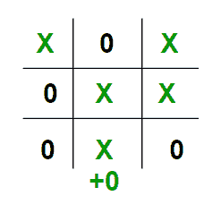

# 博弈论中的极小极大算法|集合 2(评价函数介绍)

> 原文:[https://www . geesforgeks . org/minimax-博弈论中的算法-集合-2-评估-函数/](https://www.geeksforgeeks.org/minimax-algorithm-in-game-theory-set-2-evaluation-function/)

先决条件:[博弈论中的极小极大算法](https://www.geeksforgeeks.org/minimax-algorithm-in-game-theory-set-1-introduction/)
正如在上面的文章中看到的，每个叶节点都有一个与之关联的值。我们将这个值存储在一个数组中。但是在现实世界中当我们在创建一个程序来玩井字游戏，国际象棋，背景游戏等。我们需要实现一个函数，根据电路板上各部分的位置来计算电路板的价值。该功能通常被称为[评估功能](https://en.wikipedia.org/wiki/Evaluation_function)。它有时也被称为启发式函数。
评估功能对于每种类型的游戏都是独一无二的。在这篇文章中，讨论了游戏井字游戏的评估功能。评估功能背后的基本思想是，如果轮到**最大化**时，给棋盘一个高值，或者如果轮到**最小化**时，给棋盘一个低值。
对于这个场景，让我们考虑**X** 作为**最大化**和 **O** 作为**最小化**。
让我们构建我们的评估函数:

1.  如果 X 在棋盘上获胜，我们给它一个+10 的正值。



1.  如果 O 在棋盘上获胜，我们给它一个-10 的负值。



1.  如果没有人赢或者游戏结果是平局，那么我们给出+0 的值。



我们可以选择除 10 以外的任何正值/负值。为了简单起见，我们选择了 10。为了简单起见，我们将使用小写字母“x”和小写字母“o”代表玩家，下划线“_”代表棋盘上的空格。
如果我们把我们的棋盘表示成一个 3×3 的 2D 字符矩阵，像 char board[3][3]；然后我们必须检查每一行，每一列和对角线，以检查是否有任何一个玩家已经连续得到 3。

## C++

```
// C++ program to compute evaluation function for
// Tic Tac Toe Game.
#include<stdio.h>
#include<algorithm>
using namespace std;

// Returns a value based on who is winning
// b[3][3] is the Tic-Tac-Toe board
int evaluate(char b[3][3])
{
    // Checking for Rows for X or O victory.
    for (int row = 0; row<3; row++)
    {
        if (b[row][0]==b[row][1] && b[row][1]==b[row][2])
        {
            if (b[row][0]=='x')
               return +10;
            else if (b[row][0]=='o')
               return -10;
        }
    }

    // Checking for Columns for X or O victory.
    for (int col = 0; col<3; col++)
    {
        if (b[0][col]==b[1][col] && b[1][col]==b[2][col])
        {
            if (b[0][col]=='x')
                return +10;
            else if (b[0][col]=='o')
                return -10;
        }
    }

    // Checking for Diagonals for X or O victory.
    if (b[0][0]==b[1][1] && b[1][1]==b[2][2])
    {
        if (b[0][0]=='x')
            return +10;
        else if (b[0][0]=='o')
            return -10;
    }
    if (b[0][2]==b[1][1] && b[1][1]==b[2][0])
    {
        if (b[0][2]=='x')
            return +10;
        else if (b[0][2]=='o')
            return -10;
    }

    // Else if none of them have won then return 0
    return 0;
}

// Driver code
int main()
{
    char board[3][3] =
    {
        { 'x', '_', 'o'},
        { '_', 'x', 'o'},
        { '_', '_', 'x'}
    };

    int value = evaluate(board);
    printf("The value of this board is %d\n", value);
    return 0;
}
```

## Java 语言(一种计算机语言，尤用于创建网站)

```
// Java program to compute evaluation function for
// Tic Tac Toe Game.

class GFG
{

// Returns a value based on who is winning
// b[3][3] is the Tic-Tac-Toe board
static int evaluate(char b[][])
{
    // Checking for Rows for X or O victory.
    for (int row = 0; row < 3; row++)
    {
        if (b[row][0] == b[row][1] && b[row][1] == b[row][2])
        {
            if (b[row][0] == 'x')
            return +10;
            else if (b[row][0] == 'o')
            return -10;
        }
    }

    // Checking for Columns for X or O victory.
    for (int col = 0; col < 3; col++)
    {
        if (b[0][col] == b[1][col] && b[1][col] == b[2][col])
        {
            if (b[0][col] == 'x')
                return +10;
            else if (b[0][col] == 'o')
                return -10;
        }
    }

    // Checking for Diagonals for X or O victory.
    if (b[0][0] == b[1][1] && b[1][1] == b[2][2])
    {
        if (b[0][0] == 'x')
            return +10;
        else if (b[0][0] == 'o')
            return -10;
    }
    if (b[0][2] == b[1][1] && b[1][1] == b[2][0])
    {
        if (b[0][2] == 'x')
            return +10;
        else if (b[0][2] == 'o')
            return -10;
    }

    // Else if none of them have won then return 0
    return 0;
}

// Driver code
public static void main(String[] args)
{
    char board[][] =
    {
        { 'x', '_', 'o'},
        { '_', 'x', 'o'},
        { '_', '_', 'x'}
    };

    int value = evaluate(board);
    System.out.printf("The value of this board is %d\n", value);
}
}

// This code is contributed by PrinciRaj1992
```

## 蟒蛇 3

```
# Python3 program to compute evaluation
# function for Tic Tac Toe Game.

# Returns a value based on who is winning
# b[3][3] is the Tic-Tac-Toe board
def evaluate(b):

    # Checking for Rows for X or O victory.
    for row in range(0, 3):

        if b[row][0] == b[row][1] and b[row][1] == b[row][2]:

            if b[row][0] == 'x':
                return 10
            elif b[row][0] == 'o':
                return -10

    # Checking for Columns for X or O victory.
    for col in range(0, 3):

        if b[0][col] == b[1][col] and b[1][col] == b[2][col]:

            if b[0][col]=='x':
                return 10
            elif b[0][col] == 'o':
                return -10

    # Checking for Diagonals for X or O victory.
    if b[0][0] == b[1][1] and b[1][1] == b[2][2]:

        if b[0][0] == 'x':
            return 10
        elif b[0][0] == 'o':
            return -10

    if b[0][2] == b[1][1] and b[1][1] == b[2][0]:

        if b[0][2] == 'x':
            return 10
        elif b[0][2] == 'o':
            return -10

    # Else if none of them have won then return 0
    return 0

# Driver code
if __name__ == "__main__":

    board = [['x', '_', 'o'],
             ['_', 'x', 'o'],
             ['_', '_', 'x']]

    value = evaluate(board)
    print("The value of this board is", value)

# This code is contributed by Rituraj Jain
```

## C#

```
// C# program to compute evaluation function for
// Tic Tac Toe Game.
using System;

class GFG
{

// Returns a value based on who is winning
// b[3,3] is the Tic-Tac-Toe board
static int evaluate(char [,]b)
{
    // Checking for Rows for X or O victory.
    for (int row = 0; row < 3; row++)
    {
        if (b[row, 0] == b[row, 1] && b[row, 1] == b[row, 2])
        {
            if (b[row, 0] == 'x')
            return +10;
            else if (b[row, 0] == 'o')
            return -10;
        }
    }

    // Checking for Columns for X or O victory.
    for (int col = 0; col < 3; col++)
    {
        if (b[0, col] == b[1, col] && b[1, col] == b[2, col])
        {
            if (b[0, col] == 'x')
                return +10;
            else if (b[0, col] == 'o')
                return -10;
        }
    }

    // Checking for Diagonals for X or O victory.
    if (b[0, 0] == b[1, 1] && b[1, 1] == b[2, 2])
    {
        if (b[0, 0] == 'x')
            return +10;
        else if (b[0, 0] == 'o')
            return -10;
    }
    if (b[0, 2] == b[1, 1] && b[1, 1] == b[2, 0])
    {
        if (b[0, 2] == 'x')
            return +10;
        else if (b[0, 2] == 'o')
            return -10;
    }

    // Else if none of them have won then return 0
    return 0;
}

// Driver code
public static void Main(String[] args)
{
    char [,]board =
    {
        { 'x', '_', 'o'},
        { '_', 'x', 'o'},
        { '_', '_', 'x'}
    };

    int value = evaluate(board);
    Console.Write("The value of this board is {0}\n", value);
}
}

// This code is contributed by Rajput-Ji
```

## java 描述语言

```
<script>
// Javascript program to compute evaluation function for
// Tic Tac Toe Game.

// Returns a value based on who is winning
// b[3][3] is the Tic-Tac-Toe board
function evaluate(b)
{

    // Checking for Rows for X or O victory.
    for (let row = 0; row < 3; row++)
    {
        if (b[row][0] == b[row][1] && b[row][1] == b[row][2])
        {
            if (b[row][0] == 'x')
                return +10;
            else if (b[row][0] == 'o')
                return -10;
        }
    }

    // Checking for Columns for X or O victory.
    for (let col = 0; col < 3; col++)
    {
        if (b[0][col] == b[1][col] && b[1][col] == b[2][col])
        {
            if (b[0][col] == 'x')
                return +10;
            else if (b[0][col] == 'o')
                return -10;
        }
    }

    // Checking for Diagonals for X or O victory.
    if (b[0][0] == b[1][1] && b[1][1] == b[2][2])
    {
        if (b[0][0] == 'x')
            return +10;
        else if (b[0][0] == 'o')
            return -10;
    }
    if (b[0][2] == b[1][1] && b[1][1] == b[2][0])
    {
        if (b[0][2] == 'x')
            return +10;
        else if (b[0][2] == 'o')
            return -10;
    }

    // Else if none of them have won then return 0
    return 0;
}

// Driver code
let board=[[ 'x', '_', 'o'],
        [ '_', 'x', 'o'],
        [ '_', '_', 'x']];

let value = evaluate(board);
document.write("The value of this board is "+ value+"<br>");

// This code is contributed by avanitrachhadiya2155
</script>
```

**输出:**

```
The value of this board is 10
```

本文的思路是了解如何为游戏井字游戏编写一个简单的评估函数。在下一篇文章中，我们将看到如何将这个评估函数与极小极大函数相结合。敬请关注。
本文作者为**阿克谢·l·阿拉德哈**。如果你喜欢极客博客并想投稿，你也可以写一篇文章并把你的文章邮寄到 review-team@geeksforgeeks.org。看到你的文章出现在极客博客主页上，帮助其他极客。
如发现任何不正确的地方，请写评论，或者您想分享更多关于上述话题的信息