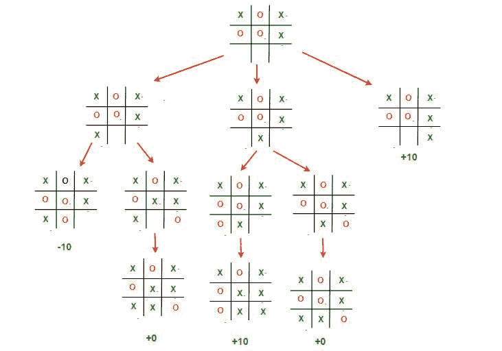

# 博弈论中的极小极大算法|集合 3(井字游戏 AI–寻找最佳移动)

> 原文:[https://www . geesforgeks . org/minimax-博弈论中的算法-集合-3-TIC-tac-toe-ai-find-optimal-move/](https://www.geeksforgeeks.org/minimax-algorithm-in-game-theory-set-3-tic-tac-toe-ai-finding-optimal-move/)

先决条件:[博弈论中的极小极大算法](https://www.geeksforgeeks.org/minimax-algorithm-in-game-theory-set-1-introduction/)、[博弈论中的评估函数](https://www.geeksforgeeks.org/minimax-algorithm-in-game-theory-set-2-evaluation-function/)、
让我们结合到目前为止所学的关于极小极大和评估函数的知识，编写一个合适的井字游戏 **AI** ( **A** 人工智能 **I** 智能体)来玩一个完美的游戏。这种人工智能将考虑所有可能的情况，并做出最佳的行动。

#### 寻找最佳移动:

我们将引入一个名为 **findBestMove()** 的新函数。该函数使用**极小极大()**评估所有可用的移动，然后返回最大化器可以做出的最佳移动。伪代码如下:

```
function findBestMove(board):
    bestMove = NULL
    for each move in board :
        if current move is better than bestMove
            bestMove = current move
    return bestMove
```

#### Minimax:

为了检查当前的移动是否比最佳移动更好，我们借助 **minimax()** 功能，该功能将考虑游戏可以进行的所有可能方式，并为该移动返回最佳值，假设对手也玩得最佳

**minimax()** 函数中最大化器和最小化器的代码与 **findBestMove()** 类似，唯一不同的是，它不会返回一个移动，而是会返回一个值。伪代码如下:

```
function minimax(board, depth, isMaximizingPlayer):

    if current board state is a terminal state :
        return value of the board

    if isMaximizingPlayer :
        bestVal = -INFINITY 
        for each move in board :
            value = minimax(board, depth+1, false)
            bestVal = max( bestVal, value) 
        return bestVal

    else :
        bestVal = +INFINITY 
        for each move in board :
            value = minimax(board, depth+1, true)
            bestVal = min( bestVal, value) 
        return bestVal 
```

#### 检查游戏结束状态:

为了检查游戏是否结束，并确保没有剩余的动作，我们使用 **isMovesLeft()** 功能。这是一个简单直接的函数，它检查移动是否可用，并分别返回真或假。伪代码如下:

```
function isMovesLeft(board):
    for each cell in board:
        if current cell is empty:
            return true
    return false
```

#### 让我们的人工智能更智能:

最后一步是让我们的人工智能更聪明一点。即使下面的人工智能玩得很好，它可能会选择做出一个会导致更慢的胜利或更快的损失的举动。让我们举个例子来解释一下。
假设 X 从给定的棋盘状态有 2 种可能的赢局方式。

*   招式**A**:X 2 招就能赢
*   招式**B**:X 4 招就能赢

我们的评估函数将为这两个动作返回+10 的值**和 **B** 。即使 **A** 因为确保更快的胜利而更好，我们的 AI 有时也可能会选择 **B** 。为了克服这个问题，我们从评估的分数中减去深度值。这意味着在胜利的情况下，它会选择一个需要最少移动次数的胜利，而在失败的情况下，它会尝试延长游戏并尽可能多的移动。所以新的评估值将是**

*   **移动 **A** 的值将为+10–2 = 8**
*   **移动 **B** 的值将为+10–4 = 6**

**现在自移 **A** 相比于移 **B** 我们的 AI 会选择移 **A** 战胜移 **B** 。同样的事情必须适用于最小值。我们不是减去深度，而是增加深度值，最小化器总是试图得到尽可能负的值。我们可以减去评估函数内部或外部的深度。任何地方都可以。我选择在函数之外做。伪代码实现如下。**

```
**if** maximizer has won:
    **return** WIN_SCORE – depth

**else if** minimizer has won:
    **return** LOOSE_SCORE + depth
```

### **实施:**

**下面是上述想法的实现。**

## **C++**

```
// C++ program to find the next optimal move for
// a player
#include<bits/stdc++.h>
using namespace std;

struct Move
{
    int row, col;
};

char player = 'x', opponent = 'o';

// This function returns true if there are moves
// remaining on the board. It returns false if
// there are no moves left to play.
bool isMovesLeft(char board[3][3])
{
    for (int i = 0; i<3; i++)
        for (int j = 0; j<3; j++)
            if (board[i][j]=='_')
                return true;
    return false;
}

// This is the evaluation function as discussed
// in the previous article ( http://goo.gl/sJgv68 )
int evaluate(char b[3][3])
{
    // Checking for Rows for X or O victory.
    for (int row = 0; row<3; row++)
    {
        if (b[row][0]==b[row][1] &&
            b[row][1]==b[row][2])
        {
            if (b[row][0]==player)
                return +10;
            else if (b[row][0]==opponent)
                return -10;
        }
    }

    // Checking for Columns for X or O victory.
    for (int col = 0; col<3; col++)
    {
        if (b[0][col]==b[1][col] &&
            b[1][col]==b[2][col])
        {
            if (b[0][col]==player)
                return +10;

            else if (b[0][col]==opponent)
                return -10;
        }
    }

    // Checking for Diagonals for X or O victory.
    if (b[0][0]==b[1][1] && b[1][1]==b[2][2])
    {
        if (b[0][0]==player)
            return +10;
        else if (b[0][0]==opponent)
            return -10;
    }

    if (b[0][2]==b[1][1] && b[1][1]==b[2][0])
    {
        if (b[0][2]==player)
            return +10;
        else if (b[0][2]==opponent)
            return -10;
    }

    // Else if none of them have won then return 0
    return 0;
}

// This is the minimax function. It considers all
// the possible ways the game can go and returns
// the value of the board
int minimax(char board[3][3], int depth, bool isMax)
{
    int score = evaluate(board);

    // If Maximizer has won the game return his/her
    // evaluated score
    if (score == 10)
        return score;

    // If Minimizer has won the game return his/her
    // evaluated score
    if (score == -10)
        return score;

    // If there are no more moves and no winner then
    // it is a tie
    if (isMovesLeft(board)==false)
        return 0;

    // If this maximizer's move
    if (isMax)
    {
        int best = -1000;

        // Traverse all cells
        for (int i = 0; i<3; i++)
        {
            for (int j = 0; j<3; j++)
            {
                // Check if cell is empty
                if (board[i][j]=='_')
                {
                    // Make the move
                    board[i][j] = player;

                    // Call minimax recursively and choose
                    // the maximum value
                    best = max( best,
                        minimax(board, depth+1, !isMax) );

                    // Undo the move
                    board[i][j] = '_';
                }
            }
        }
        return best;
    }

    // If this minimizer's move
    else
    {
        int best = 1000;

        // Traverse all cells
        for (int i = 0; i<3; i++)
        {
            for (int j = 0; j<3; j++)
            {
                // Check if cell is empty
                if (board[i][j]=='_')
                {
                    // Make the move
                    board[i][j] = opponent;

                    // Call minimax recursively and choose
                    // the minimum value
                    best = min(best,
                           minimax(board, depth+1, !isMax));

                    // Undo the move
                    board[i][j] = '_';
                }
            }
        }
        return best;
    }
}

// This will return the best possible move for the player
Move findBestMove(char board[3][3])
{
    int bestVal = -1000;
    Move bestMove;
    bestMove.row = -1;
    bestMove.col = -1;

    // Traverse all cells, evaluate minimax function for
    // all empty cells. And return the cell with optimal
    // value.
    for (int i = 0; i<3; i++)
    {
        for (int j = 0; j<3; j++)
        {
            // Check if cell is empty
            if (board[i][j]=='_')
            {
                // Make the move
                board[i][j] = player;

                // compute evaluation function for this
                // move.
                int moveVal = minimax(board, 0, false);

                // Undo the move
                board[i][j] = '_';

                // If the value of the current move is
                // more than the best value, then update
                // best/
                if (moveVal > bestVal)
                {
                    bestMove.row = i;
                    bestMove.col = j;
                    bestVal = moveVal;
                }
            }
        }
    }

    printf("The value of the best Move is : %d\n\n",
            bestVal);

    return bestMove;
}

// Driver code
int main()
{
    char board[3][3] =
    {
        { 'x', 'o', 'x' },
        { 'o', 'o', 'x' },
        { '_', '_', '_' }
    };

    Move bestMove = findBestMove(board);

    printf("The Optimal Move is :\n");
    printf("ROW: %d COL: %d\n\n", bestMove.row,
                                  bestMove.col );
    return 0;
}
```

## **Java 语言(一种计算机语言，尤用于创建网站)**

```
// Java program to find the
// next optimal move for a player
class GFG
{
static class Move
{
    int row, col;
};

static char player = 'x', opponent = 'o';

// This function returns true if there are moves
// remaining on the board. It returns false if
// there are no moves left to play.
static Boolean isMovesLeft(char board[][])
{
    for (int i = 0; i < 3; i++)
        for (int j = 0; j < 3; j++)
            if (board[i][j] == '_')
                return true;
    return false;
}

// This is the evaluation function as discussed
// in the previous article ( http://goo.gl/sJgv68 )
static int evaluate(char b[][])
{
    // Checking for Rows for X or O victory.
    for (int row = 0; row < 3; row++)
    {
        if (b[row][0] == b[row][1] &&
            b[row][1] == b[row][2])
        {
            if (b[row][0] == player)
                return +10;
            else if (b[row][0] == opponent)
                return -10;
        }
    }

    // Checking for Columns for X or O victory.
    for (int col = 0; col < 3; col++)
    {
        if (b[0][col] == b[1][col] &&
            b[1][col] == b[2][col])
        {
            if (b[0][col] == player)
                return +10;

            else if (b[0][col] == opponent)
                return -10;
        }
    }

    // Checking for Diagonals for X or O victory.
    if (b[0][0] == b[1][1] && b[1][1] == b[2][2])
    {
        if (b[0][0] == player)
            return +10;
        else if (b[0][0] == opponent)
            return -10;
    }

    if (b[0][2] == b[1][1] && b[1][1] == b[2][0])
    {
        if (b[0][2] == player)
            return +10;
        else if (b[0][2] == opponent)
            return -10;
    }

    // Else if none of them have won then return 0
    return 0;
}

// This is the minimax function. It considers all
// the possible ways the game can go and returns
// the value of the board
static int minimax(char board[][],
                    int depth, Boolean isMax)
{
    int score = evaluate(board);

    // If Maximizer has won the game
    // return his/her evaluated score
    if (score == 10)
        return score;

    // If Minimizer has won the game
    // return his/her evaluated score
    if (score == -10)
        return score;

    // If there are no more moves and
    // no winner then it is a tie
    if (isMovesLeft(board) == false)
        return 0;

    // If this maximizer's move
    if (isMax)
    {
        int best = -1000;

        // Traverse all cells
        for (int i = 0; i < 3; i++)
        {
            for (int j = 0; j < 3; j++)
            {
                // Check if cell is empty
                if (board[i][j]=='_')
                {
                    // Make the move
                    board[i][j] = player;

                    // Call minimax recursively and choose
                    // the maximum value
                    best = Math.max(best, minimax(board,
                                    depth + 1, !isMax));

                    // Undo the move
                    board[i][j] = '_';
                }
            }
        }
        return best;
    }

    // If this minimizer's move
    else
    {
        int best = 1000;

        // Traverse all cells
        for (int i = 0; i < 3; i++)
        {
            for (int j = 0; j < 3; j++)
            {
                // Check if cell is empty
                if (board[i][j] == '_')
                {
                    // Make the move
                    board[i][j] = opponent;

                    // Call minimax recursively and choose
                    // the minimum value
                    best = Math.min(best, minimax(board,
                                    depth + 1, !isMax));

                    // Undo the move
                    board[i][j] = '_';
                }
            }
        }
        return best;
    }
}

// This will return the best possible
// move for the player
static Move findBestMove(char board[][])
{
    int bestVal = -1000;
    Move bestMove = new Move();
    bestMove.row = -1;
    bestMove.col = -1;

    // Traverse all cells, evaluate minimax function
    // for all empty cells. And return the cell
    // with optimal value.
    for (int i = 0; i < 3; i++)
    {
        for (int j = 0; j < 3; j++)
        {
            // Check if cell is empty
            if (board[i][j] == '_')
            {
                // Make the move
                board[i][j] = player;

                // compute evaluation function for this
                // move.
                int moveVal = minimax(board, 0, false);

                // Undo the move
                board[i][j] = '_';

                // If the value of the current move is
                // more than the best value, then update
                // best/
                if (moveVal > bestVal)
                {
                    bestMove.row = i;
                    bestMove.col = j;
                    bestVal = moveVal;
                }
            }
        }
    }

    System.out.printf("The value of the best Move " +
                             "is : %d\n\n", bestVal);

    return bestMove;
}

// Driver code
public static void main(String[] args)
{
    char board[][] = {{ 'x', 'o', 'x' },
                      { 'o', 'o', 'x' },
                      { '_', '_', '_' }};

    Move bestMove = findBestMove(board);

    System.out.printf("The Optimal Move is :\n");
    System.out.printf("ROW: %d COL: %d\n\n",
               bestMove.row, bestMove.col );
}

}

// This code is contributed by PrinciRaj1992
```

## **蟒蛇 3**

```
# Python3 program to find the next optimal move for a player
player, opponent = 'x', 'o'

# This function returns true if there are moves
# remaining on the board. It returns false if
# there are no moves left to play.
def isMovesLeft(board) :

    for i in range(3) :
        for j in range(3) :
            if (board[i][j] == '_') :
                return True
    return False

# This is the evaluation function as discussed
# in the previous article ( http://goo.gl/sJgv68 )
def evaluate(b) :

    # Checking for Rows for X or O victory.
    for row in range(3) :    
        if (b[row][0] == b[row][1] and b[row][1] == b[row][2]) :       
            if (b[row][0] == player) :
                return 10
            elif (b[row][0] == opponent) :
                return -10

    # Checking for Columns for X or O victory.
    for col in range(3) :

        if (b[0][col] == b[1][col] and b[1][col] == b[2][col]) :

            if (b[0][col] == player) :
                return 10
            elif (b[0][col] == opponent) :
                return -10

    # Checking for Diagonals for X or O victory.
    if (b[0][0] == b[1][1] and b[1][1] == b[2][2]) :

        if (b[0][0] == player) :
            return 10
        elif (b[0][0] == opponent) :
            return -10

    if (b[0][2] == b[1][1] and b[1][1] == b[2][0]) :

        if (b[0][2] == player) :
            return 10
        elif (b[0][2] == opponent) :
            return -10

    # Else if none of them have won then return 0
    return 0

# This is the minimax function. It considers all
# the possible ways the game can go and returns
# the value of the board
def minimax(board, depth, isMax) :
    score = evaluate(board)

    # If Maximizer has won the game return his/her
    # evaluated score
    if (score == 10) :
        return score

    # If Minimizer has won the game return his/her
    # evaluated score
    if (score == -10) :
        return score

    # If there are no more moves and no winner then
    # it is a tie
    if (isMovesLeft(board) == False) :
        return 0

    # If this maximizer's move
    if (isMax) :    
        best = -1000

        # Traverse all cells
        for i in range(3) :        
            for j in range(3) :

                # Check if cell is empty
                if (board[i][j]=='_') :

                    # Make the move
                    board[i][j] = player

                    # Call minimax recursively and choose
                    # the maximum value
                    best = max( best, minimax(board,
                                              depth + 1,
                                              not isMax) )

                    # Undo the move
                    board[i][j] = '_'
        return best

    # If this minimizer's move
    else :
        best = 1000

        # Traverse all cells
        for i in range(3) :        
            for j in range(3) :

                # Check if cell is empty
                if (board[i][j] == '_') :

                    # Make the move
                    board[i][j] = opponent

                    # Call minimax recursively and choose
                    # the minimum value
                    best = min(best, minimax(board, depth + 1, not isMax))

                    # Undo the move
                    board[i][j] = '_'
        return best

# This will return the best possible move for the player
def findBestMove(board) :
    bestVal = -1000
    bestMove = (-1, -1)

    # Traverse all cells, evaluate minimax function for
    # all empty cells. And return the cell with optimal
    # value.
    for i in range(3) :    
        for j in range(3) :

            # Check if cell is empty
            if (board[i][j] == '_') :

                # Make the move
                board[i][j] = player

                # compute evaluation function for this
                # move.
                moveVal = minimax(board, 0, False)

                # Undo the move
                board[i][j] = '_'

                # If the value of the current move is
                # more than the best value, then update
                # best/
                if (moveVal > bestVal) :               
                    bestMove = (i, j)
                    bestVal = moveVal

    print("The value of the best Move is :", bestVal)
    print()
    return bestMove
# Driver code
board = [
    [ 'x', 'o', 'x' ],
    [ 'o', 'o', 'x' ],
    [ '_', '_', '_' ]
]

bestMove = findBestMove(board)

print("The Optimal Move is :")
print("ROW:", bestMove[0], " COL:", bestMove[1])

# This code is contributed by divyesh072019
```

## **C#**

```
// C# program to find the
// next optimal move for a player
using System;
using System.Collections.Generic;

class GFG
{
class Move
{
    public int row, col;
};

static char player = 'x', opponent = 'o';

// This function returns true if there are moves
// remaining on the board. It returns false if
// there are no moves left to play.
static Boolean isMovesLeft(char [,]board)
{
    for (int i = 0; i < 3; i++)
        for (int j = 0; j < 3; j++)
            if (board[i, j] == '_')
                return true;
    return false;
}

// This is the evaluation function as discussed
// in the previous article ( http://goo.gl/sJgv68 )
static int evaluate(char [,]b)
{
    // Checking for Rows for X or O victory.
    for (int row = 0; row < 3; row++)
    {
        if (b[row, 0] == b[row, 1] &&
            b[row, 1] == b[row, 2])
        {
            if (b[row, 0] == player)
                return +10;
            else if (b[row, 0] == opponent)
                return -10;
        }
    }

    // Checking for Columns for X or O victory.
    for (int col = 0; col < 3; col++)
    {
        if (b[0, col] == b[1, col] &&
            b[1, col] == b[2, col])
        {
            if (b[0, col] == player)
                return +10;

            else if (b[0, col] == opponent)
                return -10;
        }
    }

    // Checking for Diagonals for X or O victory.
    if (b[0, 0] == b[1, 1] && b[1, 1] == b[2, 2])
    {
        if (b[0, 0] == player)
            return +10;
        else if (b[0, 0] == opponent)
            return -10;
    }

    if (b[0, 2] == b[1, 1] && b[1, 1] == b[2, 0])
    {
        if (b[0, 2] == player)
            return +10;
        else if (b[0, 2] == opponent)
            return -10;
    }

    // Else if none of them have won then return 0
    return 0;
}

// This is the minimax function. It considers all
// the possible ways the game can go and returns
// the value of the board
static int minimax(char [,]board,
                   int depth, Boolean isMax)
{
    int score = evaluate(board);

    // If Maximizer has won the game
    // return his/her evaluated score
    if (score == 10)
        return score;

    // If Minimizer has won the game
    // return his/her evaluated score
    if (score == -10)
        return score;

    // If there are no more moves and
    // no winner then it is a tie
    if (isMovesLeft(board) == false)
        return 0;

    // If this maximizer's move
    if (isMax)
    {
        int best = -1000;

        // Traverse all cells
        for (int i = 0; i < 3; i++)
        {
            for (int j = 0; j < 3; j++)
            {
                // Check if cell is empty
                if (board[i, j] == '_')
                {
                    // Make the move
                    board[i, j] = player;

                    // Call minimax recursively and choose
                    // the maximum value
                    best = Math.Max(best, minimax(board,
                                    depth + 1, !isMax));

                    // Undo the move
                    board[i, j] = '_';
                }
            }
        }
        return best;
    }

    // If this minimizer's move
    else
    {
        int best = 1000;

        // Traverse all cells
        for (int i = 0; i < 3; i++)
        {
            for (int j = 0; j < 3; j++)
            {
                // Check if cell is empty
                if (board[i, j] == '_')
                {
                    // Make the move
                    board[i, j] = opponent;

                    // Call minimax recursively and choose
                    // the minimum value
                    best = Math.Min(best, minimax(board,
                                    depth + 1, !isMax));

                    // Undo the move
                    board[i, j] = '_';
                }
            }
        }
        return best;
    }
}

// This will return the best possible
// move for the player
static Move findBestMove(char [,]board)
{
    int bestVal = -1000;
    Move bestMove = new Move();
    bestMove.row = -1;
    bestMove.col = -1;

    // Traverse all cells, evaluate minimax function
    // for all empty cells. And return the cell
    // with optimal value.
    for (int i = 0; i < 3; i++)
    {
        for (int j = 0; j < 3; j++)
        {
            // Check if cell is empty
            if (board[i, j] == '_')
            {
                // Make the move
                board[i, j] = player;

                // compute evaluation function for this
                // move.
                int moveVal = minimax(board, 0, false);

                // Undo the move
                board[i, j] = '_';

                // If the value of the current move is
                // more than the best value, then update
                // best/
                if (moveVal > bestVal)
                {
                    bestMove.row = i;
                    bestMove.col = j;
                    bestVal = moveVal;
                }
            }
        }
    }

    Console.Write("The value of the best Move " +
                        "is : {0}\n\n", bestVal);

    return bestMove;
}

// Driver code
public static void Main(String[] args)
{
    char [,]board = {{ 'x', 'o', 'x' },
                     { 'o', 'o', 'x' },
                     { '_', '_', '_' }};

    Move bestMove = findBestMove(board);

    Console.Write("The Optimal Move is :\n");
    Console.Write("ROW: {0} COL: {1}\n\n",
            bestMove.row, bestMove.col );
}
}

// This code is contributed by 29AjayKumar
```

## **java 描述语言**

```
<script>

// Javascript program to find the
// next optimal move for a player
class Move
{
    constructor()
    {
        let row,col;
    }
}

let player = 'x', opponent = 'o';

// This function returns true if there are moves
// remaining on the board. It returns false if
// there are no moves left to play.
function isMovesLeft(board)
{
    for(let i = 0; i < 3; i++)
        for(let j = 0; j < 3; j++)
            if (board[i][j] == '_')
                return true;

    return false;
}

// This is the evaluation function as discussed
// in the previous article ( http://goo.gl/sJgv68 )
function evaluate(b)
{

    // Checking for Rows for X or O victory.
    for(let row = 0; row < 3; row++)
    {
        if (b[row][0] == b[row][1] &&
            b[row][1] == b[row][2])
        {
            if (b[row][0] == player)
                return +10;

            else if (b[row][0] == opponent)
                return -10;
        }
    }

    // Checking for Columns for X or O victory.
    for(let col = 0; col < 3; col++)
    {
        if (b[0][col] == b[1][col] &&
            b[1][col] == b[2][col])
        {
            if (b[0][col] == player)
                return +10;

            else if (b[0][col] == opponent)
                return -10;
        }
    }

    // Checking for Diagonals for X or O victory.
    if (b[0][0] == b[1][1] && b[1][1] == b[2][2])
    {
        if (b[0][0] == player)
            return +10;

        else if (b[0][0] == opponent)
            return -10;
    }

    if (b[0][2] == b[1][1] &&
        b[1][1] == b[2][0])
    {
        if (b[0][2] == player)
            return +10;

        else if (b[0][2] == opponent)
            return -10;
    }

    // Else if none of them have
    // won then return 0
    return 0;
}

// This is the minimax function. It
// considers all the possible ways
// the game can go and returns the
// value of the board
function minimax(board, depth, isMax)
{
    let score = evaluate(board);

    // If Maximizer has won the game
    // return his/her evaluated score
    if (score == 10)
        return score;

    // If Minimizer has won the game
    // return his/her evaluated score
    if (score == -10)
        return score;

    // If there are no more moves and
    // no winner then it is a tie
    if (isMovesLeft(board) == false)
        return 0;

    // If this maximizer's move
    if (isMax)
    {
        let best = -1000;

        // Traverse all cells
        for(let i = 0; i < 3; i++)
        {
            for(let j = 0; j < 3; j++)
            {

                // Check if cell is empty
                if (board[i][j]=='_')
                {

                    // Make the move
                    board[i][j] = player;

                    // Call minimax recursively
                    // and choose the maximum value
                    best = Math.max(best, minimax(board,
                                    depth + 1, !isMax));

                    // Undo the move
                    board[i][j] = '_';
                }
            }
        }
        return best;
    }

    // If this minimizer's move
    else
    {
        let best = 1000;

        // Traverse all cells
        for(let i = 0; i < 3; i++)
        {
            for(let j = 0; j < 3; j++)
            {

                // Check if cell is empty
                if (board[i][j] == '_')
                {

                    // Make the move
                    board[i][j] = opponent;

                    // Call minimax recursively and
                    // choose the minimum value
                    best = Math.min(best, minimax(board,
                                    depth + 1, !isMax));

                    // Undo the move
                    board[i][j] = '_';
                }
            }
        }
        return best;
    }
}

// This will return the best possible
// move for the player
function findBestMove(board)
{
    let bestVal = -1000;
    let bestMove = new Move();
    bestMove.row = -1;
    bestMove.col = -1;

    // Traverse all cells, evaluate
    // minimax function for all empty
    // cells. And return the cell
    // with optimal value.
    for(let i = 0; i < 3; i++)
    {
        for(let j = 0; j < 3; j++)
        {

            // Check if cell is empty
            if (board[i][j] == '_')
            {

                // Make the move
                board[i][j] = player;

                // compute evaluation function
                // for this move.
                let moveVal = minimax(board, 0, false);

                // Undo the move
                board[i][j] = '_';

                // If the value of the current move
                // is more than the best value, then
                // update best
                if (moveVal > bestVal)
                {
                    bestMove.row = i;
                    bestMove.col = j;
                    bestVal = moveVal;
                }
            }
        }
    }

    document.write("The value of the best Move " +
                   "is : ", bestVal + "<br><br>");

    return bestMove;
}

// Driver code
let board = [ [ 'x', 'o', 'x' ],
              [ 'o', 'o', 'x' ],
              [ '_', '_', '_' ] ];
let bestMove = findBestMove(board);

document.write("The Optimal Move is :<br>");
document.write("ROW: " + bestMove.row +
               " COL: "+ bestMove.col + "<br>");

// This code is contributed by rag2127

</script>
```

****输出:****

```
The value of the best Move is : 10

The Optimal Move is :
ROW: 2 COL: 2 
```

### **解释:**

****

**这张图片描述了游戏从根棋盘状态开始的所有可能路径。它通常被称为**游戏树**。**

**上例中的 3 种可能情况是:**

*   ****左移**:如果 X 打[2，0]。然后 O 将玩[2，1]并赢得游戏。这个移动的值是-10**
*   ****中动**:如果 X 打[2，1]。然后 O 将玩[2，2]，这将使游戏平局。此移动的值为 0**
*   ****右移**:如果 X 打[2，2]。那么他将赢得这场比赛。此招的数值为+10；**

****记住，即使 X 打中招有赢的可能，O 也绝不会让这种情况发生，而是会选择平局。**
因此 X 最好的选择，就是打[2，2]，这将保证他取得一场胜利。
我们确实鼓励我们的读者尝试给出各种输入，并理解为什么人工智能选择玩这个动作。Minimax 可能会让程序员感到困惑，因为它认为它会提前几个步骤，而且有时很难调试。请记住，这种极小极大算法的实现可以应用于任何 2 人棋盘游戏，只需对棋盘结构和我们如何迭代移动进行一些小的改变。有时，对于像国际象棋这样复杂的游戏，极小极大不可能计算出每一个可能的游戏状态。因此，我们只计算一定深度，并使用评估函数来计算板的值。
请继续关注下一周的文章，我们将讨论**阿尔法-贝塔修剪**，这可以显著提高极小极大遍历游戏树的时间。**

**本文由 [**阿克谢·L·阿拉德亚**](http://dollarakshay.com) 供稿。如果你喜欢 GeeksforGeeks 并想投稿，你也可以使用[write.geeksforgeeks.org](https://write.geeksforgeeks.org)写一篇文章或者把你的文章邮寄到 review-team@geeksforgeeks.org。看到你的文章出现在极客博客主页上，帮助其他极客。
如果发现有不正确的地方，或者想分享更多关于上述话题的信息，请写评论。**