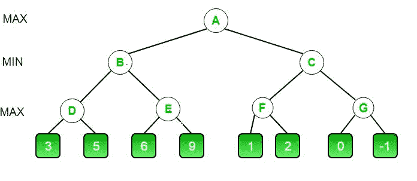
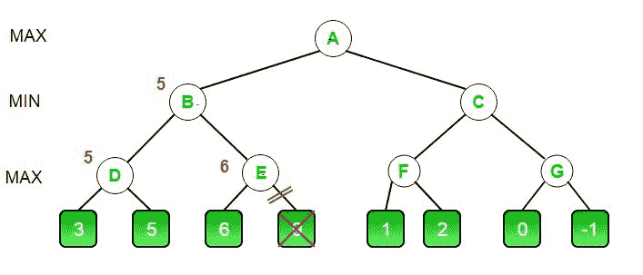
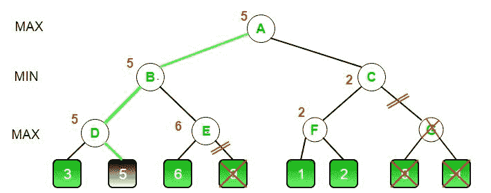

# 博弈论中的极小极大算法|集合 4 (Alpha-Beta 剪枝)

> 原文:[https://www . geesforgeks . org/minimax-博弈论中的算法-集合-4-alpha-beta-剪枝/](https://www.geeksforgeeks.org/minimax-algorithm-in-game-theory-set-4-alpha-beta-pruning/)

先决条件:[博弈论中的极小极大算法](https://www.geeksforgeeks.org/minimax-algorithm-in-game-theory-set-1-introduction/)、[博弈论中的评价函数](https://www.geeksforgeeks.org/minimax-algorithm-in-game-theory-set-2-evaluation-function/)、
Alpha-Beta 剪枝其实并不是一种新算法，而是极小极大算法的一种优化技术。它大大减少了计算时间。这使我们能够更快地搜索，甚至在游戏树中进入更深的层次。它切断了游戏树中不需要搜索的分支，因为已经有一个更好的移动可用。它被称为 Alpha-Beta 剪枝，因为它在 minimax 函数中传递了 2 个额外的参数，即 Alpha 和 Beta。
我们来定义参数α和β。
**Alpha** 是**最大化器**目前在该级别或以上可以保证的最佳值。
**Beta** 是**minimum**目前能保证在该级别或以上的最佳值。

#### 伪代码:

```
function minimax(node, depth, isMaximizingPlayer, alpha, beta):

    if node is a leaf node :
        return value of the node

    if isMaximizingPlayer :
        bestVal = -INFINITY 
        for each child node :
            value = minimax(node, depth+1, false, alpha, beta)
            bestVal = max( bestVal, value) 
            alpha = max( alpha, bestVal)
            if beta <= alpha:
                break
        return bestVal

    else :
        bestVal = +INFINITY 
        for each child node :
            value = minimax(node, depth+1, true, alpha, beta)
            bestVal = min( bestVal, value) 
            beta = min( beta, bestVal)
            if beta <= alpha:
                break
        return bestVal
```

```
// Calling the function for the first time.
minimax(0, 0, true, -INFINITY, +INFINITY)
```

让我们用一个例子来说明上面的算法。



*   初始呼叫从 **A** 开始。这里阿尔法的值是 **-INFINITY** ，贝塔的值是 **+INFINITY** 。这些值向下传递到树中的后续节点。在 **A** 处，最大化器必须选择 **B** 和 **C** 中的最大值，因此 **A** 先调用 **B**
*   在 **B** it，最小值必须选择 **D** 和 **E** 中的最小值，因此首先调用 **D** 。
*   在 **D** 处，它查看其左边的子节点，该子节点是一个叶节点。该节点返回值 3。现在α在 **D** 的值是 max( -INF，3)，也就是 3。
*   为了决定是否值得查看它的右节点，它检查条件β< =α。这是错误的，因为β=+INF 和α= 3。所以它继续搜索。
*   **D** 现在看它的右子代，返回一个值 5。在 **D** 处，α=最大值(3，5)，即 5。现在节点 **D** 的值是 5
*   **D** 将值 5 返回给 **B** 。在 **B** 处，β= min(+INF，5)即 5。现在保证最小值为 5 或更小。 **B** 现在调用 **E** 看看他能不能得到低于 5 的值。
*   在**E**α和β的值分别不是-INF 和+INF 而是-INF 和 5，因为β的值在 **B** 改变了，这就是 **B** 传给 **E** 的
*   现在 **E** 看它左边的孩子 6。在 **E** 处，α= max(-INF，6)也就是 6。在这里，条件变为真。β是 5，α是 6。所以贝塔<=阿尔法是真的。因此，它断开并且 **E** 返回 6 到 **B**
*   注意 **E** 的右子值是多少并不重要。它可能是+INF 或-INF，这仍然没有关系，我们甚至不必看它，因为最小值保证为 5 或更小。所以最大化者一看到 6，他就知道最小化者永远不会走这条路，因为他可以在 **B** 的左侧得到 5。这样我们就不必看 9，从而节省了计算时间。
*   **E** 将值 6 返回给 **B** 。在 **B** 处，β= min(5，6)，即 5。节点 **B** 的值也是 5

到目前为止，这就是我们的游戏树的样子。9 被划掉了，因为它从未被计算过。



*   **B** 返回 5 到 **A** 。在 **A** 处，α= max(-INF，5)也就是 5。现在最大化器的值保证为 5 或更大。 **A** 现在调用 **C** 看看能否得到高于 5 的值。
*   在 **C** 处，α= 5，β=+INF。 **C** 呼叫 **F**
*   在 **F** 处，α= 5，β=+INF。 **F** 看它左边的孩子是 1。alpha = max( 5，1 ),仍然是 5。
*   **F** 看它右边的孩子是一个 2。因此，该节点的最佳值为 2。阿尔法仍然是 5
*   **F** 将值 2 返回到 **C** 。在 **C** ，β=分钟(+INF，2)。当β= 2 和α= 5 时，条件β<=α变为真。所以它断裂了，甚至不需要计算 **G** 的整个子树。
*   这种中断背后的直觉是，在 **C** 处，最小值被保证为 2 或更小的值。但是如果最大化者选择 **B** ，他已经被保证值为 5。那么为什么最大化器会选择 **C** 而得到一个小于 2 的值呢？同样，您可以看到最后两个值是什么并不重要。我们还通过跳过整个子树节省了大量计算。
*   **C** 现在将值 2 返回给 **A** 。因此 **A** 的最佳值是 max( 5，2)，也就是 5。
*   因此，最大化器可以得到的最佳值是 5

这就是我们最终的游戏树的样子。如你所见 **G** 被划掉了，因为它从未被计算过。



## 卡片打印处理机（Card Print Processor 的缩写）

```
// C++ program to demonstrate
// working of Alpha-Beta Pruning
#include<bits/stdc++.h>
using namespace std;

// Initial values of
// Alpha and Beta
const int MAX = 1000;
const int MIN = -1000;

// Returns optimal value for
// current player(Initially called
// for root and maximizer)
int minimax(int depth, int nodeIndex,
            bool maximizingPlayer,
            int values[], int alpha,
            int beta)
{

    // Terminating condition. i.e
    // leaf node is reached
    if (depth == 3)
        return values[nodeIndex];

    if (maximizingPlayer)
    {
        int best = MIN;

        // Recur for left and
        // right children
        for (int i = 0; i < 2; i++)
        {

            int val = minimax(depth + 1, nodeIndex * 2 + i,
                              false, values, alpha, beta);
            best = max(best, val);
            alpha = max(alpha, best);

            // Alpha Beta Pruning
            if (beta <= alpha)
                break;
        }
        return best;
    }
    else
    {
        int best = MAX;

        // Recur for left and
        // right children
        for (int i = 0; i < 2; i++)
        {
            int val = minimax(depth + 1, nodeIndex * 2 + i,
                              true, values, alpha, beta);
            best = min(best, val);
            beta = min(beta, best);

            // Alpha Beta Pruning
            if (beta <= alpha)
                break;
        }
        return best;
    }
}

// Driver Code
int main()
{
    int values[8] = { 3, 5, 6, 9, 1, 2, 0, -1 };
    cout <<"The optimal value is : "<< minimax(0, 0, true, values, MIN, MAX);;
    return 0;
}
```

## Java 语言(一种计算机语言，尤用于创建网站)

```
// Java program to demonstrate
// working of Alpha-Beta Pruning
import java.io.*;

class GFG {

// Initial values of
// Alpha and Beta
static int MAX = 1000;
static int MIN = -1000;

// Returns optimal value for
// current player (Initially called
// for root and maximizer)
static int minimax(int depth, int nodeIndex,
                   Boolean maximizingPlayer,
                   int values[], int alpha,
                   int beta)
{
    // Terminating condition. i.e
    // leaf node is reached
    if (depth == 3)
        return values[nodeIndex];

    if (maximizingPlayer)
    {
        int best = MIN;

        // Recur for left and
        // right children
        for (int i = 0; i < 2; i++)
        {
            int val = minimax(depth + 1, nodeIndex * 2 + i,
                              false, values, alpha, beta);
            best = Math.max(best, val);
            alpha = Math.max(alpha, best);

            // Alpha Beta Pruning
            if (beta <= alpha)
                break;
        }
        return best;
    }
    else
    {
        int best = MAX;

        // Recur for left and
        // right children
        for (int i = 0; i < 2; i++)
        {

            int val = minimax(depth + 1, nodeIndex * 2 + i,
                              true, values, alpha, beta);
            best = Math.min(best, val);
            beta = Math.min(beta, best);

            // Alpha Beta Pruning
            if (beta <= alpha)
                break;
        }
        return best;
    }
}

    // Driver Code
    public static void main (String[] args)
    {

        int values[] = {3, 5, 6, 9, 1, 2, 0, -1};
        System.out.println("The optimal value is : " +
                            minimax(0, 0, true, values, MIN, MAX));

    }
}

// This code is contributed by vt_m.
```

## 蟒蛇 3

```
# Python3 program to demonstrate
# working of Alpha-Beta Pruning

# Initial values of Alpha and Beta
MAX, MIN = 1000, -1000

# Returns optimal value for current player
#(Initially called for root and maximizer)
def minimax(depth, nodeIndex, maximizingPlayer,
            values, alpha, beta):

    # Terminating condition. i.e
    # leaf node is reached
    if depth == 3:
        return values[nodeIndex]

    if maximizingPlayer:

        best = MIN

        # Recur for left and right children
        for i in range(0, 2):

            val = minimax(depth + 1, nodeIndex * 2 + i,
                          False, values, alpha, beta)
            best = max(best, val)
            alpha = max(alpha, best)

            # Alpha Beta Pruning
            if beta <= alpha:
                break

        return best

    else:
        best = MAX

        # Recur for left and
        # right children
        for i in range(0, 2):

            val = minimax(depth + 1, nodeIndex * 2 + i,
                            True, values, alpha, beta)
            best = min(best, val)
            beta = min(beta, best)

            # Alpha Beta Pruning
            if beta <= alpha:
                break

        return best

# Driver Code
if __name__ == "__main__":

    values = [3, 5, 6, 9, 1, 2, 0, -1] 
    print("The optimal value is :", minimax(0, 0, True, values, MIN, MAX))

# This code is contributed by Rituraj Jain
```

## C#

```
// C# program to demonstrate
// working of Alpha-Beta Pruning
using System;

class GFG
{

// Initial values of
// Alpha and Beta
static int MAX = 1000;
static int MIN = -1000;

// Returns optimal value for
// current player (Initially called
// for root and maximizer)
static int minimax(int depth, int nodeIndex,
                Boolean maximizingPlayer,
                int []values, int alpha,
                int beta)
{
    // Terminating condition. i.e
    // leaf node is reached
    if (depth == 3)
        return values[nodeIndex];

    if (maximizingPlayer)
    {
        int best = MIN;

        // Recur for left and
        // right children
        for (int i = 0; i < 2; i++)
        {
            int val = minimax(depth + 1, nodeIndex * 2 + i,
                            false, values, alpha, beta);
            best = Math.Max(best, val);
            alpha = Math.Max(alpha, best);

            // Alpha Beta Pruning
            if (beta <= alpha)
                break;
        }
        return best;
    }
    else
    {
        int best = MAX;

        // Recur for left and
        // right children
        for (int i = 0; i < 2; i++)
        {

            int val = minimax(depth + 1, nodeIndex * 2 + i,
                            true, values, alpha, beta);
            best = Math.Min(best, val);
            beta = Math.Min(beta, best);

            // Alpha Beta Pruning
            if (beta <= alpha)
                break;
        }
        return best;
    }
}

// Driver Code
public static void Main (String[] args)
{

    int []values = {3, 5, 6, 9, 1, 2, 0, -1};
    Console.WriteLine("The optimal value is : " +
                        minimax(0, 0, true, values, MIN, MAX));

}
}

// This code is contributed by 29AjayKumar
```

## java 描述语言

```
<script>
// Javascript program to demonstrate
// working of Alpha-Beta Pruning

// Initial values of
// Alpha and Beta
let MAX = 1000;
let MIN = -1000;

// Returns optimal value for
// current player (Initially called
// for root and maximizer)
function minimax(depth,nodeIndex,maximizingPlayer,values,alpha,beta)
{
    // Terminating condition. i.e
    // leaf node is reached
    if (depth == 3)
        return values[nodeIndex];

    if (maximizingPlayer)
    {
        let best = MIN;

        // Recur for left and
        // right children
        for (let i = 0; i < 2; i++)
        {
            let val = minimax(depth + 1, nodeIndex * 2 + i,
                              false, values, alpha, beta);
            best = Math.max(best, val);
            alpha = Math.max(alpha, best);

            // Alpha Beta Pruning
            if (beta <= alpha)
                break;
        }
        return best;
    }
    else
    {
        let best = MAX;

        // Recur for left and
        // right children
        for (let i = 0; i < 2; i++)
        {

            let val = minimax(depth + 1, nodeIndex * 2 + i,
                              true, values, alpha, beta);
            best = Math.min(best, val);
            beta = Math.min(beta, best);

            // Alpha Beta Pruning
            if (beta <= alpha)
                break;
        }
        return best;
    }
}

// Driver Code
let values=[3, 5, 6, 9, 1, 2, 0, -1];
document.write("The optimal value is : " +
                            minimax(0, 0, true, values, MIN, MAX));

// This code is contributed by rag2127
</script>
```

#### 输出:

```
The optimal value is : 5
```

本文由 [**阿克谢·L·阿拉德亚**](http://dollarakshay.com) 供稿。如果你喜欢 GeeksforGeeks 并想投稿，你也可以使用[write.geeksforgeeks.org](https://write.geeksforgeeks.org)写一篇文章或者把你的文章邮寄到 review-team@geeksforgeeks.org。看到你的文章出现在极客博客主页上，帮助其他极客。
如果发现有不正确的地方，或者想分享更多关于上述话题的信息，请写评论。