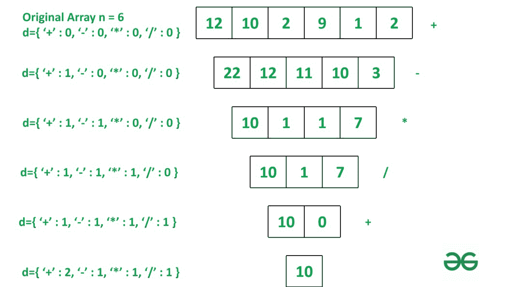

# 最小化要在给定数组的相邻元素上执行的算术运算，以减少它

> 原文:[https://www . geeksforgeeks . org/对给定数组的相邻元素执行最小化算术运算以简化它/](https://www.geeksforgeeks.org/minimize-arithmetic-operations-to-be-performed-on-adjacent-elements-of-given-array-to-reduce-it/)

给定一个[数组](https://www.geeksforgeeks.org/array-data-structure/) **arr[]** ，任务是在 **arr[]** 上依次执行算术运算 **(+、-、*、/)** 。这些操作在相邻元素上执行，直到数组大小减少到 **1** 。最后，返回减少的值和相同操作所需的操作数。为了更清楚，请参考示例。

**示例:**

> **输入:** arr = {12，10，2，9，1，2}
> **输出:**缩减值:10
> 执行的操作:
> +:2
> –:1
> *:1
> /:1
> 
> **说明:**
> 步骤 1:执行连续元素【22，12，11，10，3】
> 步骤 2:执行连续元素【10，1，1，7】
> 的减法步骤 3:执行连续元素【10，1，7】
> 的乘法步骤 4:执行连续元素【10，0】
> 的除法步骤 5:再次执行连续元素【10】
> 的加法
> 
> 
> 
> **输入:** arr = {5，-2，-1，2，4，5}
> **输出:**减少值:-3
> 执行的操作:
> +:2
> –:2
> *:1
> /:1

**方法:**由于在这个问题中，我们必须基于序列执行操作，如先加后减，然后乘法，然后除法，因此我们可以使用 Switch 案例来解决这个问题。

初始化一个字典，其中运算符 **(+，-，*，/)** 为键，0 为值。使用功能**添加、sub、mul** 和 **div，将对数组执行**操作。它具有作为函数的操作，该操作基于 **c%4** 的值将数组映射为函数，并返回简化的数组。其中 **c** 记录执行的操作数量。字典会跟踪执行的每个操作，直到数组的大小减少到 **1** 。
按照以下步骤解决给定问题。

第一步:将 **c** 分配给 **1** 并申报字典 **d** 。

*   第二步:如果 **c%4==1** ，则使用运算功能对连续元素进行加法运算。

*   第三步:如果 **c%4==2** ，则使用运算功能对连续元素进行减法运算。

*   第四步:如果 **c%4==3** ，则使用运算功能对连续元素进行乘法运算。

*   第五步:如果 **c%4==0** ，则使用运算功能对连续元素进行除法运算。

*   第六步:重复第 **2** 步，直到数组大小等于 **1** 。

*   步骤 7: **d** 用于跟踪执行的每个操作。

下面是上述方法的实现:

## 蟒蛇 3

```
# Function for adding consecutive element
def add(a):
    return [a[i]+a[i + 1] for i in range(len(a)-1)]

# Function for subtracting consecutive element
def sub(a):
    return [a[i] - a[i + 1] for i in range(len(a)- 1)]

# Function for multiplication of consecutive element
def mul(a):
    return [a[i] * a[i + 1] for i in range(len(a) - 1)]

# Function for division of consecutive element
def div(a):
    return [0 if a[i] == 0 or a[i + 1] == 0 \
            else a[i]//a[i + 1] \
                 for i in range(len(a) - 1)]

# Operation function which maps array
# to corresponding function
# based on value of i.
def Operation(i, A):
    switcher = {
        1: add,
        2: sub,
        3: mul,
        0: div
    }
    func = switcher.get(i, lambda: 'Invalid')
    return func(A)

# Driver Code
c = 1

# dictionary value which keep track
# of no of operation of each operator.
d = {'+':0, '-':0, '*':0, '/':0 }

arr =[5, -2, -1, 2, 1, 4, 5]

# loop till size of array become equal to 1.
while len(arr)!= 1:
    x = c % 4
    # After each operation value
    # in dictionary value is incremented
    # also reduced array
    # is assigned to original array.
    if x == 1:
        d['+'] += 1
        arr = Operation(x, arr)
    elif x == 2:
        d['-'] += 1
        arr = Operation(x, arr)
    elif x == 3:
        d['*'] += 1
        arr = Operation(x, arr)
    elif x == 0:
        d['/'] += 1
        arr = Operation(x, arr)
    c += 1

# Printing reduced value
print("Reduced value:", *arr)

# Printing value of each operation
# performed to reduce size of array to 1.
print("Operations Performed:")
for i in d.keys():
    print(str(i) + " : " +str(d[i]))
```

**Output**

```
Reduced value: -3
Operations Performed:
+ : 2
- : 2
* : 1
/ : 1
```

**时间复杂度:***O(N)*
T5】辅助空间: *O(N)*