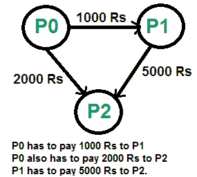
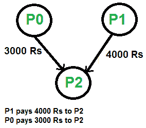

# 给定一组互相借钱的朋友之间的现金流最小化

> 原文:[https://www . geeksforgeeks . org/minimum-给定集合中的现金流-朋友-借款/](https://www.geeksforgeeks.org/minimize-cash-flow-among-given-set-friends-borrowed-money/)

给了一些朋友，他们不得不互相给予或接受一些钱。设计一个算法，使所有朋友之间的总现金流最小化。

示例:

下图显示了待结算的输入债务。



上述债务可以通过以下优化方式解决



想法是使用[贪婪算法](https://www.geeksforgeeks.org/tag/Greedy-Algorithm/)，在每一步，结算一个人的所有金额，并对剩余的 n-1 个人重复。
怎么挑第一人？要选择第一个人，请计算每个人的净金额，其中净金额是通过从所有贷项(要支付的金额)中减去所有债务(要支付的金额)获得的。对每个人的净值进行评估后，找出两个净值最大和最小的人。这两个人是最多的债权人和债务人。最少两个的人是我们第一个被解决并从名单中删除的人。让两个金额的最小值为 x。我们从最大的债务人到最大的债权人支付“x”金额，并结算一个人。如果 x 等于最大借方，则结算最大债务人，否则结算最大债权人。
以下是详细算法。

对每一个人做下面的 Pi，其中 I 是从 0 到 n-1。

1.  计算每个人的净金额。人“I”的净额可以通过从所有信用的总和中减去所有债务的总和来计算。
2.  找出最大债权人和最大债务人这两个人。让最大债权人贷记的最大金额为最大贷方，从最大债务人借记的最大金额为最大借方。设最大债务人为 Pd，最大债权人为 Pc。
3.  求 maxDebit 和 maxCredit 的最小值。让最少两个为 x。从 Pd 借记' x ’,并将此金额贷记到 Pc
4.  如果 x 等于 maxCredit，则从人员集合中移除 Pc，并对剩余(n-1)人重复。
5.  如果 x 等于 maxDebit，则从人员集合中移除 Pd，并对剩余(n-1)人重复。

感谢 Balaji S 在评论[这里](https://www.geeksforgeeks.org/amazon-interview-experience-set-165-sde/)提出这个方法。

以下是上述算法的实现。

## C++

```
// C++ program to fin maximum cash flow among a set of persons
#include<iostream>
using namespace std;

// Number of persons (or vertices in the graph)
#define N 3

// A utility function that returns index of minimum value in arr[]
int getMin(int arr[])
{
    int minInd = 0;
    for (int i=1; i<N; i++)
        if (arr[i] < arr[minInd])
            minInd = i;
    return minInd;
}

// A utility function that returns index of maximum value in arr[]
int getMax(int arr[])
{
    int maxInd = 0;
    for (int i=1; i<N; i++)
        if (arr[i] > arr[maxInd])
            maxInd = i;
    return maxInd;
}

// A utility function to return minimum of 2 values
int minOf2(int x, int y)
{
    return (x<y)? x: y;
}

// amount[p] indicates the net amount to be credited/debited
// to/from person 'p'
// If amount[p] is positive, then i'th person will amount[i]
// If amount[p] is negative, then i'th person will give  -amount[i]
void minCashFlowRec(int amount[])
{
    // Find the indexes of minimum and maximum values in amount[]
    // amount[mxCredit] indicates the maximum amount to be given
    //                  (or credited) to any person .
    // And amount[mxDebit] indicates the maximum amount to be taken
    //                  (or debited) from any person.
    // So if there is a positive value in amount[], then there must
    // be a negative value
    int mxCredit = getMax(amount), mxDebit = getMin(amount);

    // If both amounts are 0, then all amounts are settled
    if (amount[mxCredit] == 0 && amount[mxDebit] == 0)
        return;

    // Find the minimum of two amounts
    int min = minOf2(-amount[mxDebit], amount[mxCredit]);
    amount[mxCredit] -= min;
    amount[mxDebit] += min;

    // If minimum is the maximum amount to be
    cout << "Person " << mxDebit << " pays " << min
         << " to " << "Person " << mxCredit << endl;

    // Recur for the amount array.  Note that it is guaranteed that
    // the recursion would terminate as either amount[mxCredit]
    // or  amount[mxDebit] becomes 0
    minCashFlowRec(amount);
}

// Given a set of persons as graph[] where graph[i][j] indicates
// the amount that person i needs to pay person j, this function
// finds and prints the minimum cash flow to settle all debts.
void minCashFlow(int graph[][N])
{
    // Create an array amount[], initialize all value in it as 0.
    int amount[N] = {0};

    // Calculate the net amount to be paid to person 'p', and
    // stores it in amount[p]. The value of amount[p] can be
    // calculated by subtracting debts of 'p' from credits of 'p'
    for (int p=0; p<N; p++)
       for (int i=0; i<N; i++)
          amount[p] += (graph[i][p] -  graph[p][i]);

    minCashFlowRec(amount);
}

// Driver program to test above function
int main()
{
    // graph[i][j] indicates the amount that person i needs to
    // pay person j
    int graph[N][N] = { {0, 1000, 2000},
                        {0, 0, 5000},
                        {0, 0, 0},};

    // Print the solution
    minCashFlow(graph);
    return 0;
}
```

## Java 语言(一种计算机语言，尤用于创建网站)

```
// Java program to fin maximum cash
// flow among a set of persons

class GFG
{
    // Number of persons (or vertices in the graph)
    static final int N = 3;

    // A utility function that returns
    // index of minimum value in arr[]
    static int getMin(int arr[])
    {
        int minInd = 0;
        for (int i = 1; i < N; i++)
            if (arr[i] < arr[minInd])
                minInd = i;
        return minInd;
    }

    // A utility function that returns
    // index of maximum value in arr[]
    static int getMax(int arr[])
    {
        int maxInd = 0;
        for (int i = 1; i < N; i++)
            if (arr[i] > arr[maxInd])
                maxInd = i;
        return maxInd;
    }

    // A utility function to return minimum of 2 values
    static int minOf2(int x, int y)
    {
        return (x < y) ? x: y;
    }

    // amount[p] indicates the net amount
    // to be credited/debited to/from person 'p'
    // If amount[p] is positive, then
    // i'th person will amount[i]
    // If amount[p] is negative, then
    // i'th person will give -amount[i]
    static void minCashFlowRec(int amount[])
    {
        // Find the indexes of minimum and
        // maximum values in amount[]
        // amount[mxCredit] indicates the maximum amount
        // to be given (or credited) to any person .
        // And amount[mxDebit] indicates the maximum amount
        // to be taken(or debited) from any person.
        // So if there is a positive value in amount[],
        // then there must be a negative value
        int mxCredit = getMax(amount), mxDebit = getMin(amount);

        // If both amounts are 0, then
        // all amounts are settled
        if (amount[mxCredit] == 0 && amount[mxDebit] == 0)
            return;

        // Find the minimum of two amounts
        int min = minOf2(-amount[mxDebit], amount[mxCredit]);
        amount[mxCredit] -= min;
        amount[mxDebit] += min;

        // If minimum is the maximum amount to be
        System.out.println("Person " + mxDebit + " pays " + min
                                + " to " + "Person " + mxCredit);

        // Recur for the amount array.
        // Note that it is guaranteed that
        // the recursion would terminate
        // as either amount[mxCredit]  or
        // amount[mxDebit] becomes 0
        minCashFlowRec(amount);
    }

    // Given a set of persons as graph[]
    // where graph[i][j] indicates
    // the amount that person i needs to
    // pay person j, this function
    // finds and prints the minimum
    // cash flow to settle all debts.
    static void minCashFlow(int graph[][])
    {
        // Create an array amount[],
        // initialize all value in it as 0.
        int amount[]=new int[N];

        // Calculate the net amount to
        // be paid to person 'p', and
        // stores it in amount[p]. The
        // value of amount[p] can be
        // calculated by subtracting
        // debts of 'p' from credits of 'p'
        for (int p = 0; p < N; p++)
        for (int i = 0; i < N; i++)
            amount[p] += (graph[i][p] - graph[p][i]);

        minCashFlowRec(amount);
    }

    // Driver code
    public static void main (String[] args)
    {
        // graph[i][j] indicates the amount
        // that person i needs to pay person j
        int graph[][] = { {0, 1000, 2000},
                            {0, 0, 5000},
                            {0, 0, 0},};

        // Print the solution
        minCashFlow(graph);
    }
}

// This code is contributed by Anant Agarwal.
```

## 蟒蛇 3

```
# Python3 program to fin maximum
# cash flow among a set of persons

# Number of persons(or vertices in graph)
N = 3

# A utility function that returns
# index of minimum value in arr[]
def getMin(arr):

    minInd = 0
    for i in range(1, N):
        if (arr[i] < arr[minInd]):
            minInd = i
    return minInd

# A utility function that returns
# index of maximum value in arr[]
def getMax(arr):

    maxInd = 0
    for i in range(1, N):
        if (arr[i] > arr[maxInd]):
            maxInd = i
    return maxInd

# A utility function to
# return minimum of 2 values
def minOf2(x, y):

    return x if x < y else y

# amount[p] indicates the net amount to
# be credited/debited to/from person 'p'
# If amount[p] is positive, then i'th
# person will amount[i]
# If amount[p] is negative, then i'th
# person will give -amount[i]
def minCashFlowRec(amount):

    # Find the indexes of minimum
    # and maximum values in amount[]
    # amount[mxCredit] indicates the maximum
    # amount to be given(or credited) to any person.
    # And amount[mxDebit] indicates the maximum amount
    # to be taken (or debited) from any person.
    # So if there is a positive value in amount[],
    # then there must be a negative value
    mxCredit = getMax(amount)
    mxDebit = getMin(amount)

    # If both amounts are 0,
    # then all amounts are settled
    if (amount[mxCredit] == 0 and amount[mxDebit] == 0):
        return 0

    # Find the minimum of two amounts
    min = minOf2(-amount[mxDebit], amount[mxCredit])
    amount[mxCredit] -=min
    amount[mxDebit] += min

    # If minimum is the maximum amount to be
    print("Person " , mxDebit , " pays " , min
        , " to " , "Person " , mxCredit)

    # Recur for the amount array. Note that
    # it is guaranteed that the recursion
    # would terminate as either amount[mxCredit]
    # or amount[mxDebit] becomes 0
    minCashFlowRec(amount)

# Given a set of persons as graph[] where
# graph[i][j] indicates the amount that
# person i needs to pay person j, this
# function finds and prints the minimum
# cash flow to settle all debts.
def minCashFlow(graph):

    # Create an array amount[],
    # initialize all value in it as 0.
    amount = [0 for i in range(N)]

    # Calculate the net amount to be paid
    # to person 'p', and stores it in amount[p].
    # The value of amount[p] can be calculated by
    # subtracting debts of 'p' from credits of 'p'
    for p in range(N):
        for i in range(N):
            amount[p] += (graph[i][p] - graph[p][i])

    minCashFlowRec(amount)

# Driver code

# graph[i][j] indicates the amount
# that person i needs to pay person j
graph = [ [0, 1000, 2000],
          [0, 0, 5000],
          [0, 0, 0] ]

minCashFlow(graph)

# This code is contributed by Anant Agarwal.
```

## C#

```
// C# program to fin maximum cash
// flow among a set of persons
using System;

class GFG
{
    // Number of persons (or
    // vertices in the graph)
    static int N = 3;

    // A utility function that returns
    // index of minimum value in arr[]
    static int getMin(int []arr)
    {
        int minInd = 0;
        for (int i = 1; i < N; i++)
            if (arr[i] < arr[minInd])
                minInd = i;
        return minInd;
    }

    // A utility function that returns
    // index of maximum value in arr[]
    static int getMax(int []arr)
    {
        int maxInd = 0;
        for (int i = 1; i < N; i++)
            if (arr[i] > arr[maxInd])
                maxInd = i;
        return maxInd;
    }

    // A utility function to return
    // minimum of 2 values
    static int minOf2(int x, int y)
    {
        return (x < y) ? x: y;
    }

    // amount[p] indicates the net amount
    // to be credited/debited to/from person 'p'
    // If amount[p] is positive, then
    // i'th person will amount[i]
    // If amount[p] is negative, then
    // i'th person will give -amount[i]
    static void minCashFlowRec(int []amount)
    {
        // Find the indexes of minimum and
        // maximum values in amount[]
        // amount[mxCredit] indicates the maximum amount
        // to be given (or credited) to any person .
        // And amount[mxDebit] indicates the maximum amount
        // to be taken(or debited) from any person.
        // So if there is a positive value in amount[],
        // then there must be a negative value
        int mxCredit = getMax(amount), mxDebit = getMin(amount);

        // If both amounts are 0, then
        // all amounts are settled
        if (amount[mxCredit] == 0 &&
            amount[mxDebit] == 0)
            return;

        // Find the minimum of two amounts
        int min = minOf2(-amount[mxDebit], amount[mxCredit]);
        amount[mxCredit] -= min;
        amount[mxDebit] += min;

        // If minimum is the maximum amount to be
        Console.WriteLine("Person " + mxDebit +
                          " pays " + min + " to " +
                          "Person " + mxCredit);

        // Recur for the amount array.
        // Note that it is guaranteed that
        // the recursion would terminate
        // as either amount[mxCredit] or
        // amount[mxDebit] becomes 0
        minCashFlowRec(amount);
    }

    // Given a set of persons as graph[]
    // where graph[i][j] indicates
    // the amount that person i needs to
    // pay person j, this function
    // finds and prints the minimum
    // cash flow to settle all debts.
    static void minCashFlow(int [,]graph)
    {
        // Create an array amount[],
        // initialize all value in it as 0.
        int []amount=new int[N];

        // Calculate the net amount to
        // be paid to person 'p', and
        // stores it in amount[p]. The
        // value of amount[p] can be
        // calculated by subtracting
        // debts of 'p' from credits of 'p'
        for (int p = 0; p < N; p++)
        for (int i = 0; i < N; i++)
            amount[p] += (graph[i,p] - graph[p,i]);

        minCashFlowRec(amount);
    }

    // Driver code
    public static void Main ()
    {
        // graph[i][j] indicates the amount
        // that person i needs to pay person j
        int [,]graph = { {0, 1000, 2000},
                         {0, 0, 5000},
                         {0, 0, 0},};

        // Print the solution
        minCashFlow(graph);
    }
}

// This code is contributed by nitin mittal.
```

## 服务器端编程语言（Professional Hypertext Preprocessor 的缩写）

```
<?php
// PHP program to fin maximum cash
// flow among a set of persons

// Number of persons (or vertices in the graph)
$N = 3;

// A utility function that returns
// index of minimum value in arr[]
function getMin($arr)
{
    global $N;
    $minInd = 0;
    for ($i = 1; $i < $N; $i++)
        if ($arr[$i] < $arr[$minInd])
            $minInd = $i;
    return $minInd;
}

// A utility function that returns
// index of maximum value in arr[]
function getMax($arr)
{
    global $N;
    $maxInd = 0;
    for ($i = 1; $i < $N; $i++)
        if ($arr[$i] > $arr[$maxInd])
            $maxInd = $i;
    return $maxInd;
}

// A utility function to return minimum of 2 values
function minOf2($x, $y)
{
    return ($x < $y)? $x: $y;
}

// amount[p] indicates the net amount
// to be credited/debited to/from person 'p'
// If amount[p] is positive, then i'th
// person will amount[i]
// If amount[p] is negative, then i'th
// person will give -amount[i]
function minCashFlowRec($amount)
{
    // Find the indexes of minimum and
    // maximum values in amount[]
    // amount[mxCredit] indicates the
    // maximum amount to be given
    // (or credited) to any person .
    // And amount[mxDebit] indicates the
    // maximum amount to be taken
    // (or debited) from any person.
    // So if there is a positive value in
    // amount[], then there must
    // be a negative value
    $mxCredit = getMax($amount);
    $mxDebit = getMin($amount);

    // If both amounts are 0, then
    // all amounts are settled
    if ($amount[$mxCredit] == 0 &&
        $amount[$mxDebit] == 0)
        return;

    // Find the minimum of two amounts
    $min = minOf2(-$amount[$mxDebit], $amount[$mxCredit]);
    $amount[$mxCredit] -= $min;
    $amount[$mxDebit] += $min;

    // If minimum is the maximum amount to be
    echo "Person ".$mxDebit." pays ".$min." to Person ".$mxCredit."\n";

    // Recur for the amount array. Note
    // that it is guaranteed that the
    // recursion would terminate as
    // either amount[mxCredit]
    // or amount[mxDebit] becomes 0
    minCashFlowRec($amount);
}

// Given a set of persons as graph[]
// where graph[i][j] indicates the
// amount that person i needs to
// pay person j, this function finds
// and prints the minimum cash flow
// to settle all debts.
function minCashFlow($graph)
{
    global $N;

    // Create an array amount[],
    // initialize all value in it as 0.
    $amount=array_fill(0, $N, 0);

    // Calculate the net amount to be
    // paid to person 'p', and stores
    // it in amount[p]. The value of
    // amount[p] can be calculated by
    // subtracting debts of 'p' from
    // credits of 'p'
    for ($p = 0; $p < $N; $p++)
        for ($i = 0; $i < $N; $i++)
            $amount[$p] += ($graph[$i][$p] - $graph[$p][$i]);

    minCashFlowRec($amount);
}

    // Driver code

    // graph[i][j] indicates the amount
    // that person i needs to pay person j
    $graph = array(array(0, 1000, 2000),
                        array(0, 0, 5000),
                        array(0, 0, 0));

    // Print the solution
    minCashFlow($graph);

// This code is contributed by mits
?>
```

## java 描述语言

```
<script>

// javascript program to fin maximum cash
// flow among a set of persons  
// Number of persons (or vertices in the graph)
    var N = 3;

    // A utility function that returns
    // index of minimum value in arr
    function getMin(arr)
    {
        var minInd = 0;
        for (i = 1; i < N; i++)
            if (arr[i] < arr[minInd])
                minInd = i;
        return minInd;
    }

    // A utility function that returns
    // index of maximum value in arr
    function getMax(arr)
    {
        var maxInd = 0;
        for (i = 1; i < N; i++)
            if (arr[i] > arr[maxInd])
                maxInd = i;
        return maxInd;
    }

    // A utility function to return minimum of 2 values
    function minOf2(x , y)
    {
        return (x < y) ? x: y;
    }

    // amount[p] indicates the net amount
    // to be credited/debited to/from person 'p'
    // If amount[p] is positive, then
    // i'th person will amount[i]
    // If amount[p] is negative, then
    // i'th person will give -amount[i]
    function minCashFlowRec(amount)
    {

        // Find the indexes of minimum and
        // maximum values in amount
        // amount[mxCredit] indicates the maximum amount
        // to be given (or credited) to any person .
        // And amount[mxDebit] indicates the maximum amount
        // to be taken(or debited) from any person.
        // So if there is a positive value in amount,
        // then there must be a negative value
        var mxCredit = getMax(amount), mxDebit = getMin(amount);

        // If both amounts are 0, then
        // all amounts are settled
        if (amount[mxCredit] == 0 && amount[mxDebit] == 0)
            return;

        // Find the minimum of two amounts
        var min = minOf2(-amount[mxDebit], amount[mxCredit]);
        amount[mxCredit] -= min;
        amount[mxDebit] += min;

        // If minimum is the maximum amount to be
        document.write("<br>Person " + mxDebit + " pays " + min
                                + " to " + "Person " + mxCredit);

        // Recur for the amount array.
        // Note that it is guaranteed that
        // the recursion would terminate
        // as either amount[mxCredit]  or
        // amount[mxDebit] becomes 0
        minCashFlowRec(amount);
    }

    // Given a set of persons as graph
    // where graph[i][j] indicates
    // the amount that person i needs to
    // pay person j, this function
    // finds and prints the minimum
    // cash flow to settle all debts.
    function minCashFlow(graph)
    {
        // Create an array amount,
        // initialize all value in it as 0.
        var amount=Array.from({length: N}, (_, i) => 0);

        // Calculate the net amount to
        // be paid to person 'p', and
        // stores it in amount[p]. The
        // value of amount[p] can be
        // calculated by subtracting
        // debts of 'p' from credits of 'p'
        for (p = 0; p < N; p++)
        for (i = 0; i < N; i++)
            amount[p] += (graph[i][p] - graph[p][i]);

        minCashFlowRec(amount);
    }

    // Driver code
 // graph[i][j] indicates the amount
    // that person i needs to pay person j
    var graph = [ [0, 1000, 2000],
                        [0, 0, 5000],
                        [0, 0, 0]];

    // Print the solution
    minCashFlow(graph);

// This code is contributed by Amit Katiyar
</script>
```

**输出:**

```
Person 1 pays 4000 to Person 2
Person 0 pays 3000 to Person 2
```

**算法范式:**贪婪
T3】时间复杂度: O(N <sup>2</sup> )其中 N 为人数。
本文由**高拉夫**供稿。如果您发现任何不正确的地方，请写评论，或者您想分享更多关于上面讨论的主题的信息