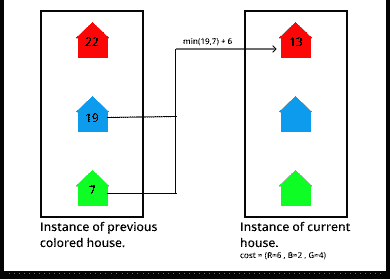

# 尽量减少油漆 N 栋房子的成本，让相邻的房子有不同的颜色

> 原文:[https://www . geeksforgeeks . org/最小化油漆成本-n-houses-使得相邻的房屋具有不同的颜色/](https://www.geeksforgeeks.org/minimize-cost-of-painting-n-houses-such-that-adjacent-houses-have-different-colors/)

给定一个整数 **N** 和一个 2D [阵](https://www.geeksforgeeks.org/introduction-to-arrays/)T4【成本】【3】，其中**成本【I】【0】**、**成本【I】【1】**、**成本【I】【2】**是将 **i <sup>th</sup> 房屋**涂上颜色**红色**、**蓝色**、**的成本**

**示例:**

> **输入:** N = 3，成本[][3] = {{14，2，11}，{11，14，5}，{14，3，10}}
> 输出:10
> T6】解释:T8】把房子 0 漆成蓝色。成本= 2。把房子 1 漆成绿色。成本= 5。把房子 2 漆成蓝色。成本= 3。
> 因此，总成本= 2 + 5 + 3 = 10。
> 
> **输入:** N = 2，成本[][3] = {{1，2，3}，{1，4，6 } }
> T3】输出: 3

**天真方法:**解决给定问题的最简单方法是生成所有可能的方法，用颜色**红色**、**蓝色**和**绿色**给所有房屋着色，并在所有可能的组合中找到最小成本，使得没有两个相邻的房屋具有相同的颜色。
***时间复杂度:**(3<sup>N</sup>)*
***辅助空间:** O(1)*

**高效方法:**上述方法可以通过使用[动态规划](https://www.geeksforgeeks.org/dynamic-programming/)进行优化，因为有[重叠子问题](https://www.geeksforgeeks.org/overlapping-subproblems-property-in-dynamic-programming-dp-1/)可以存储，以最小化[递归调用](https://www.geeksforgeeks.org/recursion/)的数量。想法是在之前**彩色房屋的其他两种颜色的最低成本的基础上，找到用任何颜色粉刷**当前**房屋的最低成本。按照以下步骤解决给定的问题:**

**[](https://media.geeksforgeeks.org/wp-content/uploads/20210118194750/Frame1.png)**

**按照以下步骤解决问题:**

*   **创建一个辅助 2D **dp[][3]** 数组来存储之前着色房屋的最小成本。**
*   **将 **dp[0][0]** 、 **dp[0][1]** 、 **dp[0][2]** 分别初始化为**成本[i][0]** 、**成本[i][1]** 、**成本[i][2]** 的成本。**
*   **[遍历给定数组](https://www.geeksforgeeks.org/c-program-to-traverse-an-array/) **费用[]【3】**超范围**【1，N】**并以**DP【I】【0】**、**DP【I】【1】**、**DP【I】【2】中其他两种颜色费用最小的颜色**红色**、**蓝色**、**绿色**更新当前房屋的粉刷费用****
*   **完成以上步骤后，打印**DP【N–1】【0】**、**DP【N–1】【1】**、**DP【N–1】【2】**的最小值，作为油漆所有相邻颜色不同的房屋的最小成本。**

**下面是上述方法的实现:**

## **C++**

```
// C++ program for the above approach

#include <bits/stdc++.h>
using namespace std;

// Function to find the minimum cost of
// coloring the houses such that no two
// adjacent houses has the same color
int minCost(vector<vector<int> >& costs,
            int N)
{
    // Corner Case
    if (N == 0)
        return 0;

    // Auxiliary 2D dp array
    vector<vector<int> > dp(
        N, vector<int>(3, 0));

    // Base Case
    dp[0][0] = costs[0][0];
    dp[0][1] = costs[0][1];
    dp[0][2] = costs[0][2];

    for (int i = 1; i < N; i++) {

        // If current house is colored
        // with red the take min cost of
        // previous houses colored with
        // (blue and green)
        dp[i][0] = min(dp[i - 1][1],
                       dp[i - 1][2])
                   + costs[i][0];

        // If current house is colored
        // with blue the take min cost of
        // previous houses colored with
        // (red and green)
        dp[i][1] = min(dp[i - 1][0],
                       dp[i - 1][2])
                   + costs[i][1];

        // If current house is colored
        // with green the take min cost of
        // previous houses colored with
        // (red and blue)
        dp[i][2] = min(dp[i - 1][0],
                       dp[i - 1][1])
                   + costs[i][2];
    }

    // Print the min cost of the
    // last painted house
    cout << min(dp[N - 1][0],
                min(dp[N - 1][1],
                    dp[N - 1][2]));
}

// Driver Code
int main()
{
    vector<vector<int> > costs{ { 14, 2, 11 },
                                { 11, 14, 5 },
                                { 14, 3, 10 } };
    int N = costs.size();

    // Function Call
    minCost(costs, N);

    return 0;
}
```

## **Java 语言(一种计算机语言，尤用于创建网站)**

```
// Java program for the above approach
import java.io.*;
import java.lang.*;
import java.util.*;

class GFG {

  // Function to find the minimum cost of
  // coloring the houses such that no two
  // adjacent houses has the same color
  static void minCost(int costs[][], int N)
  {

    // Corner Case
    if (N == 0)
      return;

    // Auxiliary 2D dp array
    int dp[][] = new int[N][3];

    // Base Case
    dp[0][0] = costs[0][0];
    dp[0][1] = costs[0][1];
    dp[0][2] = costs[0][2];

    for (int i = 1; i < N; i++) {

      // If current house is colored
      // with red the take min cost of
      // previous houses colored with
      // (blue and green)
      dp[i][0] = Math.min(dp[i - 1][1], dp[i - 1][2])
        + costs[i][0];

      // If current house is colored
      // with blue the take min cost of
      // previous houses colored with
      // (red and green)
      dp[i][1] = Math.min(dp[i - 1][0], dp[i - 1][2])
        + costs[i][1];

      // If current house is colored
      // with green the take min cost of
      // previous houses colored with
      // (red and blue)
      dp[i][2] = Math.min(dp[i - 1][0], dp[i - 1][1])
        + costs[i][2];
    }

    // Print the min cost of the
    // last painted house
    System.out.println(
      Math.min(dp[N - 1][0],
               Math.min(dp[N - 1][1], dp[N - 1][2])));
  }

  // Driver code
  public static void main(String[] args)
  {

    int costs[][] = { { 14, 2, 11 },
                     { 11, 14, 5 },
                     { 14, 3, 10 } };

    int N = costs.length;

    // Function Call
    minCost(costs, N);
  }
}

// This code is contributed by Kingash.
```

## **蟒蛇 3**

```
# Python 3 program for the above approach

# Function to find the minimum cost of
# coloring the houses such that no two
# adjacent houses has the same color
def minCost(costs, N):

    # Corner Case
    if (N == 0):
        return 0

    # Auxiliary 2D dp array
    dp = [[0 for i in range(3)] for j in range(3)]

    # Base Case
    dp[0][0] = costs[0][0]
    dp[0][1] = costs[0][1]
    dp[0][2] = costs[0][2]

    for i in range(1, N, 1):

        # If current house is colored
        # with red the take min cost of
        # previous houses colored with
        # (blue and green)
        dp[i][0] = min(dp[i - 1][1], dp[i - 1][2]) + costs[i][0]

        # If current house is colored
        # with blue the take min cost of
        # previous houses colored with
        # (red and green)
        dp[i][1] = min(dp[i - 1][0], dp[i - 1][2]) + costs[i][1]

        # If current house is colored
        # with green the take min cost of
        # previous houses colored with
        # (red and blue)
        dp[i][2] = min(dp[i - 1][0], dp[i - 1][1]) + costs[i][2]

    # Print the min cost of the
    # last painted house
    print(min(dp[N - 1][0], min(dp[N - 1][1],dp[N - 1][2])))

# Driver Code
if __name__ == '__main__':
    costs = [[14, 2, 11],
             [11, 14, 5],
             [14, 3, 10]]
    N = len(costs)

    # Function Call
    minCost(costs, N)

    # This code is contributed by ipg2016107.
```

## **C#**

```
// C# program for the above approach
using System;
using System.Collections.Generic;
class GFG{

  // Function to find the minimum cost of
  // coloring the houses such that no two
  // adjacent houses has the same color
  static int minCost(List<List<int>>costs,
                     int N)
  {
    // Corner Case
    if (N == 0)
      return 0;

    // Auxiliary 2D dp array
    List<int> temp = new List<int>();
    for(int i=0;i<3;i++)
      temp.Add(0);
    List<List<int>> dp = new List<List<int>>();
    for(int i=0;i<N;i++)
      dp.Add(temp);

    // Base Case
    dp[0][0] = costs[0][0];
    dp[0][1] = costs[0][1];
    dp[0][2] = costs[0][2];

    for (int i = 1; i < N; i++) {

      // If current house is colored
      // with red the take min cost of
      // previous houses colored with
      // (blue and green)
      dp[i][0] = Math.Min(dp[i - 1][1],
                          dp[i - 1][2])
        + costs[i][0];

      // If current house is colored
      // with blue the take min cost of
      // previous houses colored with
      // (red and green)
      dp[i][1] = Math.Min(dp[i - 1][0],
                          dp[i - 1][2])
        + costs[i][1];

      // If current house is colored
      // with green the take min cost of
      // previous houses colored with
      // (red and blue)
      dp[i][2] = Math.Min(dp[i - 1][0],
                          dp[i - 1][1])
        + costs[i][2];
    }

    // Print the min cost of the
    // last painted house
    return (Math.Min(dp[N - 1][0], Math.Min(dp[N - 1][1],dp[N - 1][2])))-11;
  }

  // Driver Code
  public static void Main()
  {
    List<List<int>>costs = new List<List<int>>();
    costs.Add(new List<int>(){14, 2, 11});
    costs.Add(new List<int>(){11, 14, 5 });
    costs.Add(new List<int>(){14, 3, 10 });
    int N = 3;

    // Function Call
    Console.WriteLine((int)(minCost(costs, N)));
  }
}

// This code is contributed by bgangwar59.
```

## **java 描述语言**

```
<script>
    // Javascript program for the above approach

    // Function to find the minimum cost of
    // coloring the houses such that no two
    // adjacent houses has the same color
    function minCost(costs, N)
    {
        // Corner Case
        if (N == 0)
            return 0;

        // Auxiliary 2D dp array
        let dp = new Array(N);
        for(let i = 0; i < N; i++)
        {
            dp[i] = new Array(3);
            for(let j = 0; j < 3; j++)
            {
                dp[i][j] = 0;
            }
        }

        // Base Case
        dp[0][0] = costs[0][0];
        dp[0][1] = costs[0][1];
        dp[0][2] = costs[0][2];

        for(let i = 1; i < N; i++)
        {
            // If current house is colored
            // with red the take min cost of
            // previous houses colored with
            // (blue and green)
            dp[i][0] = Math.min(dp[i - 1][1], dp[i - 1][2]) + costs[i][0];

            // If current house is colored
            // with blue the take min cost of
            // previous houses colored with
            // (red and green)
            dp[i][1] = Math.min(dp[i - 1][0], dp[i - 1][2]) + costs[i][1];

            // If current house is colored
            // with green the take min cost of
            // previous houses colored with
            // (red and blue)
            dp[i][2] = Math.min(dp[i - 1][0], dp[i - 1][1]) + costs[i][2];
        }

        // Print the min cost of the
        // last painted house
        document.write(Math.min(dp[N - 1][0], Math.min(dp[N - 1][1],dp[N - 1][2])));
    }

    let costs = [[14, 2, 11],
             [11, 14, 5],
             [14, 3, 10]];
    let N = costs.length;

    // Function Call
    minCost(costs, N);

    // This code is contributed by decode2207.
</script>
```

****Output:** 

```
10
```** 

*****时间复杂度:**O(N)*
T5**辅助空间:** O(N)**