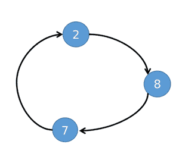
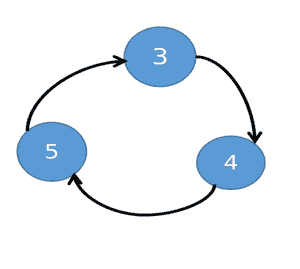
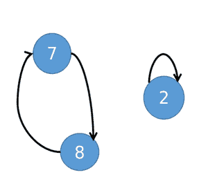

# 通过将任意一对元素(X，Y)与成本交换为(X + Y)来最小化对数组进行排序的成本

> 原文:[https://www . geeksforgeeks . org/通过交换任意一对元素 x-y 来最小化排序数组的成本，成本为 x-y/](https://www.geeksforgeeks.org/minimize-cost-to-sort-an-array-by-swapping-any-pair-of-element-x-y-with-cost-as-x-y/)

给定一个由 **N** 个整数组成的[数组](https://www.geeksforgeeks.org/introduction-to-arrays/) **arr[]** ，任务是通过交换任意一对元素 **(X，Y)** 以升序对给定数组 **arr[]** 进行排序，以使交换的成本为 **(X + Y)** 。

**示例:**

> **输入:** arr[] = {3，2，1}
> **输出:** 4
> **解释:**
> 以下是为排序数组而执行的数组元素交换:
> 
> 1.  交换索引 0 和 2 处的数组元素会将数组修改为{1，2，3}。这个交换操作的代价是(arr[0] + arr[2]) = (3 + 1) = 4。
> 
> 在上述步骤之后，给定的数组被排序，总成本为 4，这是所有可能的交换组合中的最小值。
> 
> **输入:** arr[] = {7，9，15 }
> T3】输出: 0

**方法:**给定的问题可以基于以下观察来解决:

1.  通过在当前数组和排序数组的每个 **i <sup>第</sup>T5】元素之间形成边，形成一个[有向图](https://www.geeksforgeeks.org/graph-data-structure-and-algorithms/)。**
2.  可以观察到，每个组件总是会形成一个循环，因为在那里每个节点的[内度](https://www.geeksforgeeks.org/finding-in-and-out-degrees-of-all-vertices-in-a-graph/)和[外度](https://www.geeksforgeeks.org/finding-in-and-out-degrees-of-all-vertices-in-a-graph/)等于 **1** 。
3.  因此，想法是将每个周期的元素分别排序。

插图:

*   假设给定的数组是{8，4，5，3，2，7}。排序后的数组将等于{2，3，4，5，7，8}。
*   对于上面的数组，该图将包含两个循环组件。

 

*   如果在一个周期中交换两个元素，长度为 **K > 1** ，这样至少该周期的 **1** 元素将到达其目的地。然后在交换之后，它将被分成两个周期，一个周期长度为**K–1**，另一个周期长度为 **1** 。
*   对于给定的阵列，如果 2 和 8 以 2 → 8 → 7 → 2 的周期交换。2 会去它的目的地，7 → 8 → 7 会形成一个较小的循环。



*   因此，对大小为 **K** 的周期进行排序所需的互换的最小数量等于 **(K-1)** 。
*   可以观察到，每次交换都会给成本增加两个因素。所以**2×(K–1)**元素会加入到成本中，还有 **K** 元素。所以有些元素会被多次添加到成本中。
*   因此，我们的想法是，用一个周期的最小值与其他元素交换，将它们放在正确的位置。那么在最终成本中，每个元素将被添加一次，最小元素将被添加**K–1**次。所以这是解决周期的最佳方法。
*   对循环进行排序有两种选择:要么只使用循环的局部最小值，要么同时使用数组的局部最小值和整体最小值。

按照以下步骤解决问题:

*   将变量 **res** 初始化为 **0** 来存储总成本。
*   将 **arr[]** 的每个元素复制到另一个数组中，比如说**copyrar[]**和[按照升序](https://www.geeksforgeeks.org/c-program-to-sort-an-array-in-ascending-order/)排序**copyrar[]**。
*   初始化一个 [hashmap](https://www.geeksforgeeks.org/unordered_map-in-cpp-stl/) 比如 **place** ，将数组元素及其在排序数组中的正确位置存储为键值对。
*   另外，初始化一个数组，**访问了大小为 **N** 的[]** ，并将其所有条目标记为假。
*   [使用变量 **i** 迭代数组](https://www.geeksforgeeks.org/iterating-arrays-java/)、 **arr[]** ，并执行以下步骤:
    *   如果**访问了【I】**为真，那么[继续](https://www.geeksforgeeks.org/continue-statement-cpp/)。
    *   如果元素访问索引被访问**为真**，执行以下步骤:
    *   如果**地点【arr[I]】**等于 **i** ，则标记**访问了【I】，**为真并继续。
    *   初始化一个变量，比如 **min_value** 为**arr【I】**和 **sum** 为 **0，**存储当前周期的最小值和周期元素的总和。
    *   另外，将变量 **j** 初始化为 **i** 以循环迭代，将变量 **num** 初始化为 **0** 以存储循环中的数字计数。
    *   迭代直到**访问的【j】**不是**真**，并在每次迭代中执行以下步骤:
        *   将**号**号**号**号**号**号**号**号相加号，然后将**号访问的【j】号**号标记为**真**。
        *   将**最小值**更新为**最小值(最小值，arr[j])** 。然后将**地点【arr[j]】**的值赋给 **j** 。
    *   用**最小值**减去**和**。
    *   现在找到通过使用局部最小值 **min_value** 获得的成本，并将其存储在一个变量中，比如**成本 1** 。
        *   **成本 1** **=总和+最小值*(num-1)。**
    *   现在找到通过使用全局最小值**copyrar【0】**获得的成本，并将其存储在一个变量中，比如**成本 2** 。
        *   **cost 2 = copyrar[0]*(num+1)+2 * min _ val+sum**
    *   现在将**静止**增加**分钟(成本 1，成本 2)。**
*   完成以上步骤后，打印 **res** 作为总成本。

下面是上述方法的实现:

## C++

```
// C++ program for the above approach

#include <bits/stdc++.h>
using namespace std;

// Function to find the minimum cost to
// sort the array
int findMinimumCost(int arr[], int N)
{
    // Stores the required result
    int res = 0;

    // Create 2 arrays
    int copyArr[N], visited[N];

    for (int i = 0; i < N; ++i) {
        copyArr[i] = arr[i];
        visited[i] = false;
    }

    // Sort the array, copyArr[] in
    // increasing order
    sort(copyArr, copyArr + N);

    // Map the numbers to their desired
    // place after sorting
    map<int, int> place;

    // Store the original places of the
    // elements in map
    for (int i = 0; i < N; ++i) {
        place[copyArr[i]] = i;
    }

    // Iterate in the range [0, N-1]
    for (int i = 0; i < N; ++i) {

        // If the ith index is not visited
        if (visited[i] == false) {

            // If the original place and
            // the place in sorted array
            // is same then only mark this
            // element as visited
            if (place[arr[i]] == i) {
                visited[i] = true;
                continue;
            }

            // Else a new cycle is present
            int min_val = arr[i], cost1, cost2;
            int num = 0;
            int sum = 0;
            int j = i;

            // Iterate while the nodes
            // in the current cycle is
            // not visited
            while (visited[j] == false) {

                // Increment sum by arr[j]
                sum += arr[j];
                num++;

                // Update the min_val value
                if (arr[j] < min_val) {
                    min_val = arr[j];
                }

                // Mark j as visited
                visited[j] = true;

                // Place j at its
                // original place
                j = place[arr[j]];
            }

            // Sum of all numbers of
            // cycle other than minimum
            sum -= min_val;

            // Cost from local minimum
            cost1 = sum + min_val * (num - 1);

            // Cost from overall minimum
            cost2 = copyArr[0] * (num + 1) + 2 * min_val
                    + sum;

            // Add the lower cost to
            // the final result
            if (cost1 < cost2) {
                res += cost1;
            }
            else {
                res += cost2;
            }
        }
    }

    // Print the minimum cost
    return res;
}

// Driver Code
int main()
{
    int arr[] = { 3, 2, 1 };
    int N = (sizeof(arr) / sizeof(int));
    cout << findMinimumCost(arr, N);

    return 0;
}
```

## Java 语言(一种计算机语言，尤用于创建网站)

```
import java.util.ArrayList;
import java.util.Arrays;
import java.util.HashMap;
import java.util.Map;

//Java program for above approach
class GFG{

    // Function to find the minimum cost to
// sort the array
    static int findMinimumCost(int[] arr, int N)
    {
        // Stores the required result
        int res = 0;

        // Create 2 arrays
        int[] copyArr = new int[N];
        boolean[] visited = new boolean[N];

        for (int i = 0; i < N; ++i) {
            copyArr[i] = arr[i];
            visited[i] = false;
        }

        // Sort the array, copyArr[] in
        // increasing order
        Arrays.sort(copyArr);

        // Map the numbers to their desired
        // place after sorting
        Map<Integer, Integer> place = new HashMap<>();

        // Store the original places of the
        // elements in map
        for (int i = 0; i < N; ++i) {
            place.put(copyArr[i],i);
        }

        // Iterate in the range [0, N-1]
        for (int i = 0; i < N; ++i) {

            // If the ith index is not visited
            if (visited[i] == false) {

                // If the original place and
                // the place in sorted array
                // is same then only mark this
                // element as visited
                if (place.get(arr[i]) == i) {
                    visited[i] = true;
                    continue;
                }

                // Else a new cycle is present
                int min_val = arr[i], cost1, cost2;
                int num = 0;
                int sum = 0;
                int j = i;

                // Iterate while the nodes
                // in the current cycle is
                // not visited
                while (visited[j] == false) {

                    // Increment sum by arr[j]
                    sum += arr[j];
                    num++;

                    // Update the min_val value
                    if (arr[j] < min_val) {
                        min_val = arr[j];
                    }

                    // Mark j as visited
                    visited[j] = true;

                    // Place j at its
                    // original place
                    j = place.get(arr[j]);
                }

                // Sum of all numbers of
                // cycle other than minimum
                sum -= min_val;

                // Cost from local minimum
                cost1 = sum + min_val * (num - 1);

                // Cost from overall minimum
                cost2 = copyArr[0] * (num + 1) + 2 * min_val
                        + sum;

                // Add the lower cost to
                // the final result
                if (cost1 < cost2) {
                    res += cost1;
                }
                else {
                    res += cost2;
                }
            }
        }

        // Print the minimum cost
        return res;
    }

    // Driver Code
    public static void main(String[] args) {
        int[] arr = { 3, 2, 1 };
        int N = arr.length;
        System.out.println(findMinimumCost(arr, N));

    }
}

// This code is contributed by hritikrommie.
```

## 蟒蛇 3

```
# Python program for the above approach

# Function to find the minimum cost to
# sort the array
def findMinimumCost(arr, N):
    # Stores the required result
    res = 0

    # Create 2 arrays
    copyArr = [0] * N
    visited = [0] * N

    for i in range(N):
        copyArr[i] = arr[i]
        visited[i] = False

    # Sort the array, copyArr[] in
    # increasing order
    copyArr.sort()

    # Map the numbers to their desired
    # place after sorting
    place = {}

    # Store the original places of the
    # elements in map
    for i in range(N):
        place[copyArr[i]] = i

    # Iterate in the range [0, N-1]
    for i in range(N):

        # If the ith index is not visited
        if (visited[i] == False):

            # If the original place and
            # the place in sorted array
            # is same then only mark this
            # element as visited
            if (place[arr[i]] == i):
                visited[i] = True
                continue

            # Else a new cycle is present
            min_val = arr[i]
            num = 0
            sum = 0
            j = i

            # Iterate while the nodes
            # in the current cycle is
            # not visited
            while (visited[j] == False):

                # Increment sum by arr[j]
                sum += arr[j]
                num += 1

                # Update the min_val value
                if (arr[j] < min_val):
                    min_val = arr[j]

                # Mark j as visited
                visited[j] = True

                # Place j at its
                # original place
                j = place[arr[j]]

            # Sum of all numbers of
            # cycle other than minimum
            sum -= min_val

            # Cost from local minimum
            cost1 = sum + min_val * (num - 1)

            # Cost from overall minimum
            cost2 = copyArr[0] * (num + 1) + 2 * min_val + sum

            # Add the lower cost to
            # the final result
            if (cost1 < cost2):
                res += cost1
            else:
                res += cost2

    # Print the minimum cost
    return res

# Driver Code

arr = [3, 2, 1]
N = len(arr)
print(findMinimumCost(arr, N))

# This code is contributed by gfgking
```

## C#

```
// C# program for the above approach
using System;
using System.Collections.Generic;

class GFG{

// Function to find the minimum cost to
// sort the array
static int findMinimumCost(int[] arr, int N)
{

    // Stores the required result
    int res = 0;

    // Create 2 arrays
    int[] copyArr = new int[N];
    int[] visited = new int[N];

    for(int i = 0; i < N; ++i)
    {
        copyArr[i] = arr[i];
        visited[i] = 0;
    }

    // Sort the array, copyArr[] in
    // increasing order
    Array.Sort(copyArr);

    // Map the numbers to their desired
    // place after sorting
    Dictionary<int,
               int> place = new Dictionary<int,
                                           int>();

    // Store the original places of the
    // elements in map
    for(int i = 0; i < N; ++i)
    {
        place[copyArr[i]] = i;
    }

    // Iterate in the range [0, N-1]
    for(int i = 0; i < N; ++i)
    {

        // If the ith index is not visited
        if (visited[i] == 0)
        {

            // If the original place and
            // the place in sorted array
            // is same then only mark this
            // element as visited
            if (place[arr[i]] == i)
            {
                visited[i] = 1;
                continue;
            }

            // Else a new cycle is present
            int min_val = arr[i], cost1, cost2;
            int num = 0;
            int sum = 0;
            int j = i;

            // Iterate while the nodes
            // in the current cycle is
            // not visited
            while (visited[j] == 0)
            {

                // Increment sum by arr[j]
                sum += arr[j];
                num++;

                // Update the min_val value
                if (arr[j] < min_val)
                {
                    min_val = arr[j];
                }

                // Mark j as visited
                visited[j] = 1;

                // Place j at its
                // original place
                j = place[arr[j]];
            }

            // Sum of all numbers of
            // cycle other than minimum
            sum -= min_val;

            // Cost from local minimum
            cost1 = sum + min_val * (num - 1);

            // Cost from overall minimum
            cost2 = copyArr[0] * (num + 1) +
                             2 * min_val + sum;

            // Add the lower cost to
            // the final result
            if (cost1 < cost2)
            {
                res += cost1;
            }
            else
            {
                res += cost2;
            }
        }
    }

    // Print the minimum cost
    return res;
}

// Driver code
public static void Main()
{
    int[] arr = { 3, 2, 1 };
    int N = arr.Length;

    Console.WriteLine(findMinimumCost(arr, N));
}
}

// This code is contributed by sanjoy_62
```

## java 描述语言

```
<script>

       // JavaScript program for the above approach

       // Function to find the minimum cost to
       // sort the array
       function findMinimumCost(arr, N) {
           // Stores the required result
           let res = 0;

           // Create 2 arrays
           let copyArr = Array(N);
           let visited = Array(N);

           for (let i = 0; i < N; ++i) {
               copyArr[i] = arr[i];
               visited[i] = false;
           }

           // Sort the array, copyArr[] in
           // increasing order
           copyArr.sort(function (a, b) { return a - b; });

           // Map the numbers to their desired
           // place after sorting
           let place = new Map();

           // Store the original places of the
           // elements in map
           for (let i = 0; i < N; ++i) {
               place.set(copyArr[i], i);
           }

           // Iterate in the range [0, N-1]
           for (let i = 0; i < N; ++i) {

               // If the ith index is not visited
               if (visited[i] == false) {

                   // If the original place and
                   // the place in sorted array
                   // is same then only mark this
                   // element as visited
                   if (place.get(arr[i]) == i) {
                       visited[i] = true;
                       continue;
                   }

                   // Else a new cycle is present
                   let min_val = arr[i], cost1, cost2;
                   let num = 0;
                   let sum = 0;
                   let j = i;

                   // Iterate while the nodes
                   // in the current cycle is
                   // not visited
                   while (visited[j] == false) {

                       // Increment sum by arr[j]
                       sum += arr[j];
                       num++;

                       // Update the min_val value
                       if (arr[j] < min_val) {
                           min_val = arr[j];
                       }

                       // Mark j as visited
                       visited[j] = true;

                       // Place j at its
                       // original place
                       j = place.get(arr[j]);
                   }

                   // Sum of all numbers of
                   // cycle other than minimum
                   sum -= min_val;

                   // Cost from local minimum
                   cost1 = sum + min_val * (num - 1);

                   // Cost from overall minimum
                   cost2 = copyArr[0] * (num + 1) + 2 * min_val
                       + sum;

                   // Add the lower cost to
                   // the final result
                   if (cost1 < cost2) {
                       res += cost1;
                   }
                   else {
                       res += cost2;
                   }
               }
           }

           // Print the minimum cost
           return res;
       }

       // Driver Code

       let arr = [3, 2, 1];
       let N = arr.length;
       document.write(findMinimumCost(arr, N));

   // This code is contributed by Potta Lokesh
   </script>
```

**Output:** 

```
4
```

***时间复杂度:** O(N*log N)*
***辅助空间:** O(N)*