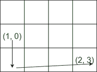

# 根据给定的行变更和列变更成本，在矩阵中最小化从源到目的地的旅行成本

> 原文:[https://www . geesforgeks . org/最小化基于给定行变化和列变化的矩阵中从源到目的地的旅行成本/](https://www.geeksforgeeks.org/minimize-cost-to-travel-from-source-to-destination-in-a-matrix-based-on-given-row-change-and-column-change-cost/)

给定一个 **M*N** 网格，给定一个[数组](https://www.geeksforgeeks.org/array-data-structure/)**start pos【】**，表示起始位置是单元格 **(startPos[0]** ， **startPos[1])** ，数组**homePos【】**表示其目的地在单元格的 **(homePos[0]，homePos[1])。**

从任何细胞移动只允许在四个方向:左，右，上，下，并且不能超出边界。有两个 0 索引整数数组**:长度为 **M** 的行成本[]** 和长度为 **N** 的**列成本[]** ，表示移动成本。

如果有向上或向下的移动进入行为 **r** 的单元格，移动的成本为**行成本【r】**。类似地，如果向左或向右移动到相邻的单元中 **c** ，则该移动花费 **colCosts** 。

返回**从出发地到目的地的最小总费用**。

**注意:**任何移动都没有负成本。

**示例:**

> **输入:** M = 3，N = 4，startPos[] = {1，0}，homePos[] = {2，3}，rowCosts[] = {5，4，3}，colCosts[] = {8，2，6，7 }
> T3】输出:18
> T6】解释:一个理想的路径是:
> 
> *   它从(1，0)开始，下降到(2，0)。这一举措的成本为行成本[2] = 3。
> *   它直接到(2，1)。这一步的代价是 colCosts[1] = 2。
> *   它直接到(2，2)。这一举动的代价是 colCosts[2] = 6。
> *   它直接到(2，3)。这一举动的代价是 colCosts[3] = 7。
> *   总成本是 3 + 2 + 6 + 7 = 18。
> 
> 运动如下图所示:
> 
> 
> 
> **输入:** M = 3，N = 4，startPos[] = {0，0}，homePos[] = {0，0}，rowCosts[] = {5，4，3}，colCosts[] = {8，2，6，7 }
> T3】输出:0
> T6】说明:起始位置和目的地都一样。所以没有移动成本。

**方法:**解决方案依赖于观察:

> 为了以最小的成本到达目的地，只有位于范围**【开始位置【0】、家庭位置【0】]**中的行和位于范围**【开始位置【1】、家庭位置【1】]**中的列应该交叉。
> **原因:**穿越任何其他行或列都会增加额外的成本，因为所有的移动都有正成本，并且移动次数会随着额外的行和列穿越而增加。

因此，起始位置和起始位置之间的每一行和每一列的成本将恰好发生一次。计算在**home pos【0】**和**startPos【0】**行之间移动的成本。和**主页【1】**和**开始【1】**列。按照以下步骤解决问题:

*   将变量 **rmin、cmin** 初始化为开始和结束位置的最小值。
*   将变量 **rmax、cmax** 初始化为起始位置和终止位置的最大值。
*   [使用变量 **i** 迭代范围](https://www.geeksforgeeks.org/range-based-loop-c/)**【rmin，rmax】**，并执行以下任务:
    *   将值**行成本【I】**添加到变量 **ans 中。**
*   [使用变量 **i** 迭代范围](https://www.geeksforgeeks.org/range-based-loop-c/)**【cmin，Cmax】**，并执行以下任务:
    *   将值**列成本【I】**添加到变量 **ans 中。**
*   从变量 **ans 中减去值**行成本[开始位置[0]]，列成本[开始位置[1]]** 。**
*   执行上述步骤后，打印**和**的值作为答案。

下面是上述方法的实现。

## C++

```
// C++ program for the above approach
#include <bits/stdc++.h>
using namespace std;

// Function to find the minimum cost
int minPathCost(vector<int>& startPos,
                vector<int>& homePos,
                vector<int>& rowCosts,
                vector<int>& colCosts)
{
    int ans = 0;
    int rmin = min(startPos[0], homePos[0]);
    int rmax = max(startPos[0], homePos[0]);
    int cmin = min(startPos[1], homePos[1]);
    int cmax = max(startPos[1], homePos[1]);

    // Determine the cost of the rows
    // that cross the path.
    for (int i = rmin; i <= rmax; i++)
        ans += rowCosts[i];

    // Determine the cost of the cols
    // that cross the path.
    for (int i = cmin; i <= cmax; i++)
        ans += colCosts[i];

    // Starting coordinates need to be
    // excluded from the final result
    ans -= rowCosts[startPos[0]];
    ans -= colCosts[startPos[1]];

    return ans;
}

// Driver Code
int main()
{
    vector<int> startpos{ 1, 0 };
    vector<int> homepos{ 2, 3 };
    vector<int> roscost{ 5, 4, 3 };
    vector<int> colcst{ 8, 2, 6, 7 };

    cout << minPathCost(startpos, homepos,
                        roscost, colcst);

    return 0;
}
```

## Java 语言(一种计算机语言，尤用于创建网站)

```
// Java code to implement the above approach
import java.util.*;
public class GFG
{

  // Function to find the minimum cost
  static int minPathCost(int []startPos,
                         int []homePos,
                         int []rowCosts,
                         int []colCosts)
  {
    int ans = 0;
    int rmin = Math.min(startPos[0], homePos[0]);
    int rmax = Math.max(startPos[0], homePos[0]);
    int cmin = Math.min(startPos[1], homePos[1]);
    int cmax = Math.max(startPos[1], homePos[1]);

    // Determine the cost of the rows
    // that cross the path.
    for (int i = rmin; i <= rmax; i++)
      ans += rowCosts[i];

    // Determine the cost of the cols
    // that cross the path.
    for (int i = cmin; i <= cmax; i++)
      ans += colCosts[i];

    // Starting coordinates need to be
    // excluded from the final result
    ans -= rowCosts[startPos[0]];
    ans -= colCosts[startPos[1]];

    return ans;
  }

  // Driver code
  public static void main(String args[])
  {
    int []startpos = { 1, 0 };
    int []homepos = { 2, 3 };
    int []roscost = { 5, 4, 3 };
    int []colcst = { 8, 2, 6, 7 };
    System.out.println( minPathCost(startpos, homepos,
                                    roscost, colcst));
  }
}

// This code is contributed by Samim Hossain Mondal.
```

## java 描述语言

```
<script>

// JavaScript program for the above approach

// Function to find the minimum cost
function minPathCost(startPos, homePos,
                     rowCosts, colCosts)
{
    let ans = 0;
    let rmin = Math.min(startPos[0], homePos[0]);
    let rmax = Math.max(startPos[0], homePos[0]);
    let cmin = Math.min(startPos[1], homePos[1]);
    let cmax = Math.max(startPos[1], homePos[1]);

    // Determine the cost of the rows
    // that cross the path.
    for(let i = rmin; i <= rmax; i++)
        ans += rowCosts[i];

    // Determine the cost of the cols
    // that cross the path.
    for(let i = cmin; i <= cmax; i++)
        ans += colCosts[i];

    // Starting coordinates need to be
    // excluded from the final result
    ans -= rowCosts[startPos[0]];
    ans -= colCosts[startPos[1]];

    return ans;
}

// Driver Code
let startpos = [ 1, 0 ];
let homepos = [ 2, 3 ];
let roscost = [ 5, 4, 3 ];
let colcst = [ 8, 2, 6, 7 ];

document.write(minPathCost(startpos, homepos,
                           roscost, colcst));

// This code is contributed by Potta Lokesh

</script>
```

**Output**

```
18
```

***时间复杂度:** O(M + N)*
***辅助空间:** O(1)*