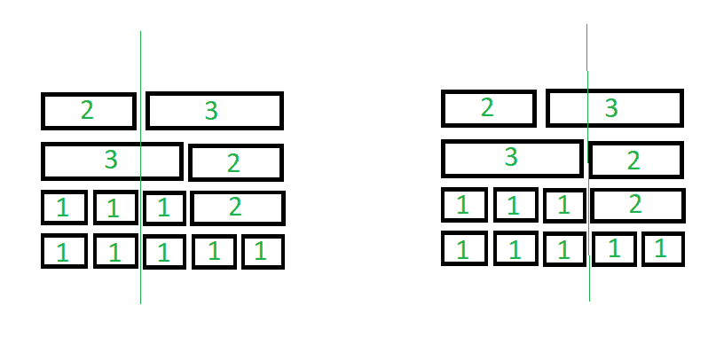

# 减少一次打击中切割的瓷砖数量

> 原文:[https://www . geeksforgeeks . org/最小化单击中的碎片数量/](https://www.geeksforgeeks.org/minimize-count-of-tiles-cut-in-a-single-strike/)

给定一个 [2D 阵列](https://www.geeksforgeeks.org/multidimensional-arrays-c-cpp/)表示等长瓷砖的宽度和级别，每个级别的总宽度相同，任务是找到通过穿过所有级别瓷砖的剑的单次垂直打击可以切割的最小瓷砖数量。

**示例:**

> **输入:**tilessstack[][]= { { 2，3 }，{ 3，2 }，{ 1，1，1，2 }，{ 1，1，1，1，1 } }
> T3】输出:1
> T6】说明:T8】可以切割的最小瓷砖数等于 1
> 
> 
> 
> **输入:**tilessstack[][]= { { 1，1 }，{ 1，1 } }
> T3】输出: 0

**方法:**想法是找到最大数量的间隙，这样如果画一条垂直线穿过这些点，那么它将切割最小数量的瓷砖。按照以下步骤解决问题:

*   [遍历 2D 阵的每一行](https://www.geeksforgeeks.org/iterate-over-a-list-in-python/) **tilesStack[][]** 。对于每一个 i <sup>第</sup>行，[映射](https://www.geeksforgeeks.org/map-associative-containers-the-c-standard-template-library-stl/)其[前缀和](https://www.geeksforgeeks.org/prefix-sum-array-implementation-applications-competitive-programming/)，其表示从最左边的图块开始的间隙距离，并使用[映射](https://www.geeksforgeeks.org/python-map-function/)存储每行前缀和的频率。
*   求前缀和(间隙距离)的最大频率，说 **X** 。
*   最后，打印**(长度(tilessstack)–X)**的值，该值代表通过绘制垂直线获得的最小切片数。

下面是这个方法的实现。

## C++

```
// C++ program for the above approach
#include<bits/stdc++.h>
using namespace std;

// Function to count the minimum number
// of tiles that gets cut by a single
// vertical strike of a sword
void cutTiles(vector<vector<int>> tilesStack)
{

  // Map prefix sum of each row
  // of tilesStack
  map<int, int> gaps;

  // Traverse each row of the tiles
  for(vector<int> tiles:tilesStack)
  {

    // Stores distance of gap from
    // left of each row
    int totWidth = 0;

    // Excluding the last gap as it will
    // be the edge of the level
    for(int i = 0; i < tiles.size() - 1; i++)
    {

      // Update totWidth
      totWidth += tiles[i];

      // If gap is already found at
      // this points in previous levels
      gaps[totWidth]++;
    }
  }

  // Stores maximum number of 
  // gap from left
  int X = 0;
  for(auto x : gaps)
  {
    X = max(x.second, X);
  }
  cout << tilesStack.size() - X;
}

// Driver code
int main()
{
  vector<vector<int>> tilesStack(4);
  tilesStack[0].push_back(2);
  tilesStack[0].push_back(3);
  tilesStack[1].push_back(3);
  tilesStack[1].push_back(2);
  tilesStack[2].push_back(1);
  tilesStack[2].push_back(1);
  tilesStack[2].push_back(1);
  tilesStack[2].push_back(2);
  tilesStack[3].push_back(1);
  tilesStack[3].push_back(1);
  tilesStack[3].push_back(1);
  tilesStack[3].push_back(1);
  tilesStack[3].push_back(1);

  // Function Call
  cutTiles(tilesStack);
}

// This code is contributed by rutvik_56.
```

## Java 语言(一种计算机语言，尤用于创建网站)

```
// Java program for the above approach
import java.util.*;
public class GFG
{

  // Function to count the minimum number
  // of tiles that gets cut by a single
  // vertical strike of a sword
  static void cutTiles(Vector<Vector<Integer>> tilesStack)
  {

    // Map prefix sum of each row
    // of tilesStack
    HashMap<Integer, Integer> gaps = new HashMap<>();

    // Traverse each row of the tiles
    for(Vector<Integer> tiles : tilesStack)
    {

      // Stores distance of gap from
      // left of each row
      int totWidth = 0;

      // Excluding the last gap as it will
      // be the edge of the level
      for(int i = 0; i < tiles.size() - 1; i++)
      {

        // Update totWidth
        totWidth += tiles.get(i);

        // If gap is already found at
        // this points in previous levels
        if(gaps.containsKey(totWidth))
        {
          gaps.put(totWidth, gaps.get(totWidth) + 1);
        }
        else{
          gaps.put(totWidth, 1);
        }
      }
    }

    // Stores maximum number of 
    // gap from left
    int X = 0;
    for (Map.Entry Key : gaps.entrySet())
    {
      X = Math.max((int)Key.getValue(),X);
    }   
    System.out.print(tilesStack.size() - X);
  }

  // Driver code
  public static void main(String[] args)
  {
    Vector<Vector<Integer>> tilesStack = new Vector<Vector<Integer>>();
    tilesStack.add(new Vector<Integer>());
    tilesStack.get(0).add(2);
    tilesStack.get(0).add(3);
    tilesStack.add(new Vector<Integer>());
    tilesStack.get(1).add(3);
    tilesStack.get(1).add(2);
    tilesStack.add(new Vector<Integer>());
    tilesStack.get(2).add(1);
    tilesStack.get(2).add(1);
    tilesStack.get(2).add(1);
    tilesStack.get(2).add(2);
    tilesStack.add(new Vector<Integer>());
    tilesStack.get(3).add(1);
    tilesStack.get(3).add(1);
    tilesStack.get(3).add(1);
    tilesStack.get(3).add(1);
    tilesStack.get(3).add(1);

    // Function Call
    cutTiles(tilesStack);
  }
}

// This code is contributed by divyeshrabadiya07.
```

## 计算机编程语言

```
# Python3 program for the above approach

# Function to count the minimum number
# of tiles that gets cut by a single
# vertical strike of a sword
def cutTiles(tilesStack):

    # Map prefix sum of each row
    # of tilesStack
    gaps = {}

    # Handling the case when
    # map will be empty
    gaps[-1] = 0

    # Traverse each row of the tiles
    for tiles in tilesStack:

        # Stores distance of gap from
        # left of each row
        totWidth = 0

        # Excluding the last gap as it will
        # be the edge of the level
        for tile in tiles[:-1]:

            # Update totWidth
            totWidth += tile

            # If gap is already found at
            # this points in previous levels
            if totWidth in gaps:
                gaps[totWidth] += 1
            else:
                gaps[totWidth] = 1

    # Stores maximum number of
    # gap from left
    X = max(list(gaps.values()))

    print(len(tilesStack) - X)

# Driver Code
if __name__ == '__main__':

    tilesStack = [[2, 3], [3, 2], [1, 1, 1, 2],
                              [1, 1, 1, 1, 1]]

    # Function Call
    cutTiles(tilesStack)
```

## C#

```
// C# program for the above approach
using System;
using System.Collections.Generic;
class GFG {

    // Function to count the minimum number
    // of tiles that gets cut by a single
    // vertical strike of a sword
    static void cutTiles(List<List<int>> tilesStack)
    {
        // Map prefix sum of each row
        // of tilesStack
        Dictionary<int, int> gaps = new Dictionary<int, int>();

        // Traverse each row of the tiles
        foreach(List<int> tiles in tilesStack)
        {
            // Stores distance of gap from
            // left of each row
            int totWidth = 0;

            // Excluding the last gap as it will
            // be the edge of the level
            for(int i = 0; i < tiles.Count - 1; i++)
            {
                // Update totWidth
                totWidth += tiles[i];

                // If gap is already found at
                // this points in previous levels
                if(gaps.ContainsKey(totWidth))
                {
                    gaps[totWidth] += 1;
                }
                else{
                    gaps[totWidth] = 1;
                }
            }
        }

        // Stores maximum number of 
        // gap from left
        int X = 0;
        foreach(KeyValuePair<int, int> Key in gaps)
        {
            X = Math.Max(Key.Value,X);
        }

        Console.WriteLine(tilesStack.Count - X);
    }

  static void Main() {
    List<List<int>> tilesStack = new List<List<int>>();
    tilesStack.Add(new List<int>());
    tilesStack[0].Add(2);
    tilesStack[0].Add(3);
    tilesStack.Add(new List<int>());
    tilesStack[1].Add(3);
    tilesStack[1].Add(2);
    tilesStack.Add(new List<int>());
    tilesStack[2].Add(1);
    tilesStack[2].Add(1);
    tilesStack[2].Add(1);
    tilesStack[2].Add(2);
    tilesStack.Add(new List<int>());
    tilesStack[3].Add(1);
    tilesStack[3].Add(1);
    tilesStack[3].Add(1);
    tilesStack[3].Add(1);
    tilesStack[3].Add(1);

    // Function Call
    cutTiles(tilesStack);
  }
}

// This code is contributed by divyeshrbadiya07.
```

## java 描述语言

```
<script>
    // Javascript program for the above approach

    // Function to count the minimum number
    // of tiles that gets cut by a single
    // vertical strike of a sword
    function cutTiles(tilesStack)
    {
        // Map prefix sum of each row
        // of tilesStack
        let gaps = new Map();

        // Traverse each row of the tiles
        for(let tiles = 0; tiles < tilesStack.length; tiles++)
        {
            // Stores distance of gap from
            // left of each row
            let totWidth = 0;

            // Excluding the last gap as it will
            // be the edge of the level
            for(let i = 0; i < tilesStack[tiles].length - 1; i++)
            {
                // Update totWidth
                totWidth += tilesStack[tiles][i];

                // If gap is already found at
                // this points in previous levels
                if(gaps.has(totWidth))
                {
                    gaps.set(totWidth, gaps.get(totWidth) + 1);
                }
                else{
                    gaps.set(totWidth, 1);
                }
            }
        }

        // Stores maximum number of
        // gap from left
        let X = 0;
        gaps.forEach((values,keys)=>
        {
            X = Math.max(values,X);
        })

        document.write(tilesStack.length - X);
    }

    let tilesStack = new Array(4);
    for(let i = 0; i < tilesStack.length; i++)
    {
        tilesStack[i] = [];
    }
    tilesStack[0].push(2);
    tilesStack[0].push(3);
    tilesStack[1].push(3);
    tilesStack[1].push(2);
    tilesStack[2].push(1);
    tilesStack[2].push(1);
    tilesStack[2].push(1);
    tilesStack[2].push(2);
    tilesStack[3].push(1);
    tilesStack[3].push(1);
    tilesStack[3].push(1);
    tilesStack[3].push(1);
    tilesStack[3].push(1);

    // Function Call
    cutTiles(tilesStack);

</script>
```

**Output:** 

```
1
```

***时间复杂度:** O(N * M)，其中 N 为关卡总数，M 为每个关卡的宽度*
***辅助空间:** O(M)*