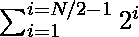

# 将两个序列之间的差异最小化，这两个序列是通过将前 N 次幂 2

分开获得的

> 原文:[https://www . geeksforgeeks . org/最小化两个序列之间的差异-通过拆分获得-第一个-n 次方-2/](https://www.geeksforgeeks.org/minimize-difference-between-two-sequences-obtained-by-splitting-first-n-powers-of-2/)

给定一个正偶数 **N** ，任务是将 2 的第一 **N** [次幂分成两个相等的序列，这样它们的和之间的绝对差最小。打印获得的最小差异。](https://www.geeksforgeeks.org/program-to-find-whether-a-no-is-power-of-two/)

**例:**

> ***输入:** N = 2*
> ***输出:** 2*
> ***解释:***
> *顺序为{2，4}。*
> *分割序列的唯一可能方式是{2}、{4}。因此，差值= 4 2 = 2。*
> 
> ***输入:** N = 4*
> ***输出:** 6*
> ***解释:***
> *顺序为{2，4，8，16}。*
> *最优的方式是将序列拆分为{2，16}、{4，8}。不同之处在于(2 + 16)和(4 + 8) = 6。*

**天真方法:**解决这个问题最简单的方法是[生成序列的 **N/2** 元素](https://www.geeksforgeeks.org/print-all-possible-combinations-of-r-elements-in-a-given-array-of-size-n/)的所有可能组合，并存储它们的和。然后，找出所有对的和之间的最小差。
***时间复杂度:**O(2<sup>N</sup>)*
***辅助空间:** O(N)*

**方法:**上述方法也可以根据以下观察进行优化:

*   由于 **2 <sup>N</sup>** 大于所有其他元素的总和:

> 

*   具有最大元素的子阵列将总是具有较大的总和。因此，为了最小化它们之和之间的差异，想法是将**(N/2–1)**最小的元素放入具有最大元素的子阵列中。

按照以下步骤解决问题:

*   初始化两个变量 **sum1 = 0** 和 **sum2 = 0** ，分别存储第一子阵列和第二子阵列的和。
*   将和**2<sup>N</sup>T4】的和加到变量 **sum1** 上。**
*   将的和加到变量**的和 2** 上。
*   完成以上步骤后，打印 **sum1** 和 **sum2** 的差值。

下面是上述方法的实现:

## C++

```
// C++ program for the above approach
#include <bits/stdc++.h>
using namespace std;

// Function to partition first N powers
// of 2 into two subsequences with
// minimum difference between their sum
void minimumDifference(int N)
{
    // Largest element in the first part
    int sum1 = (1 << N), sum2 = 0;

    // Place N/2 - 1 smallest
    // elements in the first sequence
    for (int i = 1; i < N / 2; i++)
        sum1 += (1 << i);

    // Place remaining N / 2 elements
    // in the second sequence
    for (int i = N / 2; i < N; i++)
        sum2 += (1 << i);

    // Print the minimum difference
    cout << sum1 - sum2;
}

// Driver Code
int main()
{
    int N = 4;
    minimumDifference(N);

    return 0;
}
```

## Java 语言(一种计算机语言，尤用于创建网站)

```
// Java implementation of
// the above approach
import java.util.*;
class GFG
{

 // Function to partition first N powers
  // of 2 into two subsequences with
  // minimum difference between their sum
  static void minimumDifference(int N)
  {

    // Largest element in the first part
    int sum1 = (1 << N), sum2 = 0;

    // Place N/2 - 1 smallest
    // elements in the first sequence
    for (int i = 1; i < N / 2; i++)
      sum1 += (1 << i);

    // Place remaining N / 2 elements
    // in the second sequence
    for (int i = N / 2; i < N; i++)
      sum2 += (1 << i);

    // Print the minimum difference
    System.out.println(sum1 - sum2);
  }

    // Driver Code
    public static void main(String args[])
    {
        int N = 4;
        minimumDifference(N);
    }
}

// This code is contributed by splevel62.
```

## 蟒蛇 3

```
# Python program for the above approach

# Function to partition first N powers
# of 2 into two subsequences with
# minimum difference between their sum
def minimumDifference(N):

    # Largest element in the first part
    sum1 = (1 << N)
    sum2 = 0

    # Place N/2 - 1 smallest
    # elements in the first sequence
    for i in range(1, N // 2):
        sum1 += (1 << i)

    # Place remaining N / 2 elements
    # in the second sequence
    for i in range( N // 2, N):
        sum2 += (1 << i)

    # Print the minimum difference
    print(sum1 - sum2)

# Driver Code
N = 4
minimumDifference(N)

# This code is contributed by rohitsingh07052.
```

## C#

```
// C# program for the above approach
using System;
class GFG
{

  // Function to partition first N powers
  // of 2 into two subsequences with
  // minimum difference between their sum
  static void minimumDifference(int N)
  {
    // Largest element in the first part
    int sum1 = (1 << N), sum2 = 0;

    // Place N/2 - 1 smallest
    // elements in the first sequence
    for (int i = 1; i < N / 2; i++)
      sum1 += (1 << i);

    // Place remaining N / 2 elements
    // in the second sequence
    for (int i = N / 2; i < N; i++)
      sum2 += (1 << i);

    // Print the minimum difference
    Console.WriteLine(sum1 - sum2);
  }

  // Driver Code
  static public void Main ()
  {
    int N = 4;
    minimumDifference(N);
  }
}

// This code is contributed by susmitakundugoaldanga.
```

## java 描述语言

```
<script>

// JavaScript implementation of
// the above approach

    // Function to partition first N powers
    // of 2 into two subsequences with
    // minimum difference between their sum
    function minimumDifference(N) {

        // Largest element in the first part
        var sum1 = (1 << N), sum2 = 0;

        // Place N/2 - 1 smallest
        // elements in the first sequence
        for (i = 1; i < N / 2; i++)
            sum1 += (1 << i);

        // Place remaining N / 2 elements
        // in the second sequence
        for (i = N / 2; i < N; i++)
            sum2 += (1 << i);

        // Print the minimum difference
        document.write(sum1 - sum2);
    }

    // Driver Code

        var N = 4;
        minimumDifference(N);

// This code contributed by aashish1995

</script>
```

**Output:** 

```
6
```

***时间复杂度:** O(N)*
***辅助空间:** O(1)*