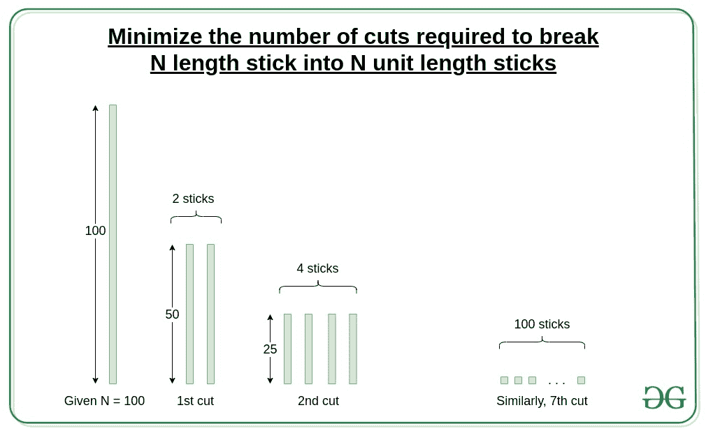

# 尽量减少将 N 根长度的木棒切割成 N 根单位长度木棒所需的切割次数

> 原文:[https://www . geeksforgeeks . org/minimum-切割次数-需要将 n 个单位长度的棒分成 n 个单位长度的棒/](https://www.geeksforgeeks.org/minimize-number-of-cuts-required-to-break-n-length-stick-into-n-unit-length-sticks/)

给定一个整数 **N** 表示给定棒的长度，任务是最小化将棒分成单位长度的碎片所需的时间，假设在任何时刻棒的任何部分都可能进行单次切割。

**示例:**

> **输入:** N = 100
> **输出:** 7
> **说明:**
> (100 台)—>(50 台 2 份)—>(25 台 4 份)—>(12 台 4 份，13 台 4 份)—>(6 台 12 份，7 台 4 份)—>(3 台 28 份，4 台 4 份)
> 
> **输入:** N = 65
> **输出:** 7
> **说明:**
> (65 台)—>(32 台 1 份，33 台 1 份)—>(16 台 3 份，17 台 1 份)—>(8 台 7 份，9 台 1 份)—>(4 台 15 份，5 台 1 份)— > (31

**方法:**
由于我们可以在特定的时间内一次切割棍子的任何部分，所以我们需要在每次切割后最大化这些部分。所以，我们会用第一个切口把棍子切成尽可能长的两部分。在下一个实例中，在下一次切割中，将获得的两个零件进一步切割成两个最长的零件。重复此操作，直到获得 **N** 单元件。

> **图解:**
> N = 100
> 第一次切割:(50) + (50)
> 第二次切割:(25) + (25) + (25) + (25)
> 第三次切割:(12)+(13)+(12)+(13)+(12)+(13)+(12)+(13)
> 第四次切割:(6) + (6) + (6) + (7) + (6) + (6) +) +(3)+(3)+(3)+(3)+(4)+(3)+(3)+(3)+(3)+(3)+(3)+(3)+(4)+(3)+(3)+(3)+(3)+(3)+(3)+(3)+(3)+(4)+(3)+(3)+(3)+(3)+(3)+(3)+(3)+(4)+(4)
> 第 6 次切割



因此，将一根长度为 N 的木棒分割成 1 个单位碎片所需的最短时间为 **ceil(log <sub>2</sub> N)** 。

下面是上述方法的实现:

## C++

```
// C++ program to find minimum
// time required to split a
// stick of N length into
// unit pieces

#include <bits/stdc++.h>
using namespace std;

// Function to return the
// minimum time required
// to split stick of N into
// length into unit pieces
int min_time_to_cut(int N)
{
    if (N == 0)
        return 0;
    // Return the minimum
    // unit of time required
    return ceil(log2(N));
}
// Driver Code
int main()
{
    int N = 100;
    cout << min_time_to_cut(N);
    return 0;
}
```

## Java 语言(一种计算机语言，尤用于创建网站)

```
// Java program to find minimum
// time required to split a
// stick of N length into
// unit pieces
import java.lang.*;

class GFG{

// Function to return the
// minimum time required
// to split stick of N into
// length into unit pieces
static int min_time_to_cut(int N)
{
    if (N == 0)
        return 0;

    // Return the minimum
    // unit of time required
    return (int)Math.ceil(Math.log(N) /
                          Math.log(2));
}

// Driver Code
public static void main(String[] args)
{
    int N = 100;
    System.out.print(min_time_to_cut(N));
}
}

// This code is contributed by rock_cool
```

## 蟒蛇 3

```
# Python3 program to find minimum
# time required to split a stick
# of N length into unit pieces
import math

# Function to return the
# minimum time required
# to split stick of N into
# length into unit pieces
def min_time_to_cut(N):

    if (N == 0):
        return 0

    # Return the minimum
    # unit of time required
    return int(math.log2(N)) + 1

# Driver Code
N = 100

print(min_time_to_cut(N))

# This code is contributed by Vishal Maurya
```

## C#

```
// C# program to find minimum
// time required to split a
// stick of N length into
// unit pieces
using System;
class GFG{

// Function to return the
// minimum time required
// to split stick of N into
// length into unit pieces
static int min_time_to_cut(int N)
{
    if (N == 0)
        return 0;

    // Return the minimum
    // unit of time required
    return (int)Math.Ceiling(Math.Log(N) /
                             Math.Log(2));
}

// Driver Code
public static void Main()
{
    int N = 100;
    Console.Write(min_time_to_cut(N));
}
}

// This code is contributed by Code_Mech
```

## java 描述语言

```
<script>

// Javascript program to find minimum
// time required to split a stick of
// N length into unit pieces

// Function to return the
// minimum time required
// to split stick of N into
// length into unit pieces
function min_time_to_cut(N)
{
    if (N == 0)
        return 0;

    // Return the minimum
    // unit of time required
    return Math.ceil(Math.log(N) /
                     Math.log(2));
}

// Driver code
let N = 100;

document.write(min_time_to_cut(N));

// This code is contributed by divyesh072019

</script>
```

**Output:** 

```
7
```

***时间复杂度:** O (1)*
***辅助空间:** O (1)*