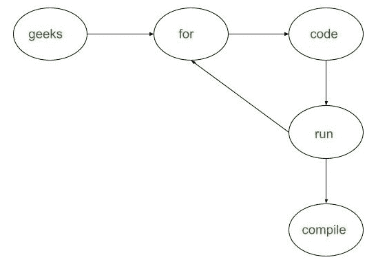

# 尽量减少需要在学生中分发的笔记数量

> 原文:[https://www . geesforgeks . org/minimum-需要在学生中分发的笔记数量/](https://www.geeksforgeeks.org/minimize-number-of-notes-required-to-be-distributed-among-students/)

给定由代表班级中学生姓名的 **N** [字符串](https://www.geeksforgeeks.org/string-data-structure/)和另一对数组**P【】【2】**组成的[数组**arr【】**，使得 **P[i][0]** 喜欢 **P[i][1]** ，任务是找到要在班级中分发的最小数量的笔记，使得只有当一个学生直接或间接喜欢另一个学生时，才能进行笔记共享。](https://www.geeksforgeeks.org/introduction-to-arrays/)

**示例:**

> **输入:** arr[] = {geeks，for，code，run，compile}，P[][] = {{geeks，for}，{for，code}，{code，run}，{run，compile}，{run，for}}
> **输出:** 3
> **解释:**
> 下图表示学生之间的关系:
> 
> 
> 
> 从上图可以看出:
> 
> 1.  名为{“for”、“code”、“run”}的学生需要一份笔记，因为它们之间存在相互关系。
> 2.  名为{“极客”}的学生需要一份笔记。
> 3.  名为{“编译”}的学生也需要一份笔记。
> 
> 所以，最少需要 3 个音符。
> 
> **输入:** arr[] = {geeks，for，all，run，debug，compile}，P[][] = {{geeks，for}，{for，all}，{all，geeks}，{for，run}，{run，compile}，{compile，debug}，{debug，run}}
> **输出:** 2

**方法:**在给定条件下生成关系图后，求有向图中[强连通分量的个数，即可解决给定问题。按照以下步骤解决问题:](https://www.geeksforgeeks.org/strongly-connected-components/)

*   创建一个[散列表](https://www.geeksforgeeks.org/how-to-create-an-unordered_map-of-pairs-in-c/)，比如说 **M** ，将学生的名字映射到他们各自的索引值。
*   [使用变量 **i** 遍历数组](https://www.geeksforgeeks.org/c-program-to-traverse-an-array/) **A** ，并将[映射](https://www.geeksforgeeks.org/map-associative-containers-the-c-standard-template-library-stl/)中的每个字符串**A【I】**M 映射为值 **i** 。
*   [迭代数组中的所有对](https://www.geeksforgeeks.org/range-based-loop-c/) **P** ，对于每个对，从哈希表中获取相应的值， **M** 并在它们之间创建一个有向边。
*   在遍历所有对之后，形成具有 **N** 个顶点和 **M** 个边的有向图。
*   创建一个空的[栈](https://www.geeksforgeeks.org/stack-data-structure/) **S** ，执行图的 [DFS 遍历:](https://www.geeksforgeeks.org/depth-first-search-or-dfs-for-a-graph/)
    *   创建一个[递归函数](https://www.geeksforgeeks.org/recursive-functions/)，获取一个节点和一个访问过的数组的索引。
    *   将当前节点标记为**已访问**，遍历所有相邻的、未标记的节点，用相邻节点的索引调用递归函数。
    *   遍历当前节点的所有邻居后，将当前节点推入堆栈 **S** 。
*   反转所有边的方向，得到构造图的[转置。](https://www.geeksforgeeks.org/transpose-graph/)
*   [迭代直到](https://www.geeksforgeeks.org/loops-in-c-and-cpp/)[栈 **S** 不为空](https://www.geeksforgeeks.org/stack-empty-and-stack-size-in-c-stl/)并执行以下步骤:
    *   将堆栈的[顶元素 **S**](https://www.geeksforgeeks.org/stack-top-c-stl/) 存储在变量**V**[中，从堆栈 **S**](https://www.geeksforgeeks.org/stack-push-and-pop-in-c-stl/) 中弹出。
    *   从节点 **V** 作为源执行 [DFS 遍历](https://www.geeksforgeeks.org/depth-first-search-or-dfs-for-a-graph/)。
    *   更新连接组件的[数量](https://www.geeksforgeeks.org/number-of-connected-components-of-a-graph-using-disjoint-set-union/)并将计数存储在变量中，sat **cnt** 。
*   完成上述步骤后，打印 **cnt** 的值作为结果。

下面是上述方法的实现:

## C++

```
// C++ program for the above approach
#include <bits/stdc++.h>
using namespace std;

// Structure of class Graph
class Graph {

    // No. of vertices
    int V;

    // An array of adjacency lists
    list<int>* adj;

    // Function that fills the stack
    // with the vertices v
    void fillOrder(int v, bool visited[],
                   stack<int>& Stack);

    // Recursive function to perform
    // the DFS starting from v
    void DFSUtil(int v, bool visited[]);

public:
    Graph(int V);
    void addEdge(int v, int w);

    // Function to count the number of
    // strongly connected components
    void countSCCs();

    // Function that returns reverse
    // (or transpose) of the graph
    Graph getTranspose();
};

// Constructor of the Graph
Graph::Graph(int V)
{
    this->V = V;
    adj = new list<int>[V];
}

// Recursive function to perform the
// DFS  starting from v
void Graph::DFSUtil(int v, bool visited[])
{
    // Mark the current node as visited
    visited[v] = true;

    // Recurr for all the vertices
    // adjacent to this vertex
    list<int>::iterator i;

    for (i = adj[v].begin();
         i != adj[v].end(); ++i) {
        if (!visited[*i])
            DFSUtil(*i, visited);
    }
}

// Function to return the reverse
// (or transpose) of the graph
Graph Graph::getTranspose()
{
    Graph g(V);
    for (int v = 0; v < V; v++) {

        // Recurr for all the vertices
        // adjacent to this vertex
        list<int>::iterator i;

        for (i = adj[v].begin();
             i != adj[v].end(); ++i) {
            g.adj[*i].push_back(v);
        }
    }
    return g;
}

// Function to add an edge
void Graph::addEdge(int v, int w)
{
    // Add w to v’s list
    adj[v].push_back(w);
}

// Function to fill the stack with
// the vertices during DFS traversal
void Graph::fillOrder(int v, bool visited[],
                      stack<int>& Stack)
{
    // Mark the current node as visited
    visited[v] = true;

    // Recurr for all the vertices
    // adjacent to this vertex
    list<int>::iterator i;

    for (i = adj[v].begin();
         i != adj[v].end(); ++i) {
        if (!visited[*i])
            fillOrder(*i, visited, Stack);
    }

    // All vertices reachable from
    // the node v are processed
    // Update the stack
    Stack.push(v);
}

// Function that counts the strongly
// connected components in the graph
void Graph::countSCCs()
{
    stack<int> Stack;

    // Mark all the vertices as not
    // visited (For first DFS)
    bool* visited = new bool[V];
    for (int i = 0; i < V; i++)
        visited[i] = false;

    // Fill vertices in the stack
    // according to their finishing
    // time
    for (int i = 0; i < V; i++) {
        // Vertex i is not visited
        if (visited[i] == false)
            fillOrder(i, visited, Stack);
    }

    // Create a reversed graph
    Graph gr = getTranspose();

    // Mark all the vertices as
    // not visited (For second DFS)
    for (int i = 0; i < V; i++)
        visited[i] = false;
    int cnt = 0;

    // Now process all vertices in
    // order defined by Stack
    while (Stack.empty() == false) {

        // Pop a vertex from stack
        int v = Stack.top();
        Stack.pop();

        // Get the strongly connected
        // component of the popped
        // vertex
        if (visited[v] == false) {

            gr.DFSUtil(v, visited);
            cnt++;
        }
    }

    // Print the result
    cout << cnt;
}

// Function that counts the minimum
// number of notes required with the
// given criteria
void solve(vector<string>& A,
           vector<vector<string> >& P)
{

    Graph g(A.size());

    // Used to map the strings to
    // their respective indices
    unordered_map<string, int> um;
    for (int i = 0; i < A.size(); i++) {
        um[A[i]] = i;
    }

    // Iterate through all the edges
    // and add them to the graph
    for (int i = 0; i < P.size(); i++) {
        int x = um[P[i][0]];
        int y = um[P[i][1]];
        g.addEdge(x, y);
    }

    // Function Call
    g.countSCCs();
}

// Driver Code
int main()
{

    vector<string> arr
        = { "geeks", "for", "code",
            "run", "compile" };
    vector<vector<string> > P = { { "geeks", "for" },
                                  { "for", "code" },
                                  { "code", "run" },
                                  { "run", "compile" },
                                  { "run", "for" } };

    solve(arr, P);

    return 0;
}
```

## Java 语言(一种计算机语言，尤用于创建网站)

```
// Java program for above approach
import java.util.ArrayList;
import java.util.*;

// Structure of class Graph
public class Graph{

// No. of vertices
int V;

// An array of adjacency lists
ArrayList<ArrayList<Integer>>  adj;

// Constructor of the Graph
Graph(int V)
{
    this.V = V;
    adj = new ArrayList<>();
    for(int i = 0; i < V; i++)
    {
        adj.add(new ArrayList<>());
    }
}

// Recursive function to perform the
// DFS  starting from v
void DFSUtil(int v, boolean visited[])
{

    // Mark the current node as visited
    visited[v] = true;

    // Recurr for all the vertices
    // adjacent to this vertex
    for(int i : adj.get(v))
    {
        if (!visited[i])
            DFSUtil(i, visited);
    }
}

// Function to return the reverse
// (or transpose) of the graph
Graph getTranspose()
{
    Graph g = new Graph(V);
    for(int v = 0; v < V; v++)
    {

        // Recurr for all the vertices
        // adjacent to this vertex
        for(int i : adj.get(v))
        {
            g.adj.get(i).add(v);
        }
    }
    return g;
}

// Function to add an edge
void addEdge(int v, int w)
{

    // Add w to v’s list
    adj.get(v).add(w);
}

// Function to fill the stack with
// the vertices during DFS traversal
void fillOrder(int v, boolean[] visited,
               Stack<Integer> stack)
{

    // Mark the current node as visited
    visited[v] = true;

    // Recurr for all the vertices
    // adjacent to this vertex
    for(int i : adj.get(v))
    {
        if (!visited[i])
            fillOrder(i, visited, stack);
    }

    // All vertices reachable from
    // the node v are processed
    // Update the stack
    stack.push(v);
}

// Function that counts the strongly
// connected components in the graph
void countSCCs()
{
    Stack<Integer> stack = new Stack<>();

    // Mark all the vertices as not
    // visited (For first DFS)
    boolean[] visited = new boolean[V];
    for(int i = 0; i < V; i++)
        visited[i] = false;

    // Fill vertices in the stack
    // according to their finishing
    // time
    for(int i = 0; i < V; i++)
    {

        // Vertex i is not visited
        if (visited[i] == false)
            fillOrder(i, visited, stack);
    }

    // Create a reversed graph
    Graph gr = getTranspose();

    // Mark all the vertices as
    // not visited (For second DFS)
    for(int i = 0; i < V; i++)
        visited[i] = false;

    int cnt = 0;

    // Now process all vertices in
    // order defined by Stack
    while (stack.empty() == false)
    {

        // Pop a vertex from stack
        int v = stack.peek();
        stack.pop();

        // Get the strongly connected
        // component of the popped
        // vertex
        if (visited[v] == false)
        {
            gr.DFSUtil(v, visited);
            cnt++;
        }
    }

    // Print the result
    System.out.print(cnt);
}

// Function that counts the minimum
// number of notes required with the
// given criteria
static void solve(ArrayList<String> A,
        ArrayList<ArrayList<String>> P)
{
    Graph g = new Graph(A.size());

    // Used to map the strings to
    // their respective indices
    HashMap<String, Integer> um = new HashMap<>();
    for(int i = 0; i < A.size(); i++)
    {
        um.put(A.get(i), i);
    }

    // Iterate through all the edges
    // and add them to the graph
    for(int i = 0; i < P.size(); i++)
    {
        int x = um.get(P.get(i).get(0));
        int y = um.get(P.get(i).get(1));
        g.addEdge(x, y);
    }

    // Function Call
    g.countSCCs();
}

// Driver code
public static void main(String[] args)
{
    ArrayList<String> arr = new ArrayList<>();
    arr.add("geeks");
    arr.add("for");
    arr.add("code");
    arr.add("run");
    arr.add("compile");

    ArrayList<ArrayList<String> > P = new ArrayList<>();
    for(int i = 0; i < 5; i++)
        P.add(new ArrayList<>());

    P.get(0).add("geeks");
    P.get(0).add("for");
    P.get(1).add("for");
    P.get(1).add("code");
    P.get(2).add("code");
    P.get(2).add("run");
    P.get(3).add("run");
    P.get(3).add("compile");
    P.get(4).add("run");
    P.get(4).add("for");

    solve(arr, P);
}
}

// This code is contributed by hritikrommie
```

**Output:** 

```
3
```

***时间复杂度:** O(N + M)*
***辅助空间:** O(N)*