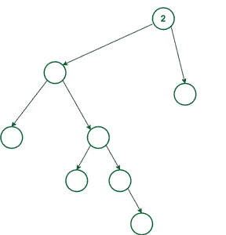
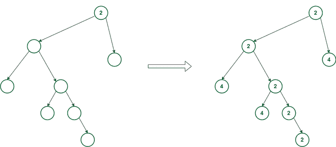
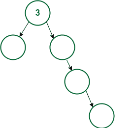
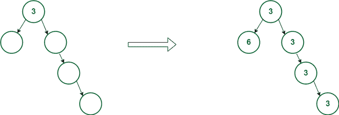

# 通过填充给定的空树，使每个节点都是其子节点的 GCD，从而最小化节点值的总和

> 原文:[https://www . geesforgeks . org/通过填充给定的空树来最小化节点值的总和，以便每个节点都是其子节点的 gcd/](https://www.geeksforgeeks.org/minimize-sum-of-node-values-by-filling-given-empty-tree-such-that-each-node-is-gcd-of-its-children/)

给定一个二叉树，它由没有值的 **N** 个节点和代表根节点值的整数 **X** 组成，任务是找到给定树的所有节点值的最小和，使得每个节点的值必须是其子节点的 GCDs 的值。还有，没有两个[姐弟](https://www.geeksforgeeks.org/check-if-two-nodes-in-a-binary-tree-are-siblings/)可以有相同的数值。

**示例:**

> **输入:**
> 
> 
> 
> **输出:** 22
> **说明:**给定的树可以填充，如下图所示:
> 
> 
> 
> **输入:**
> 
> 
> 
> **输出:** 18
> **说明:**给定的树可以填充，如下图所示:
> 
> 

**方法:**为了最小化和，两个孩子都可以有 **X** 和 **2*X** 的值，其中 **X** 是父母的值。现在，如果节点只有一个子节点，那么它的值将等于它的父节点。但是为了决定哪个子树应该有一个 **X** 和 **2*X** 的值来获得最小和，将考虑每个节点的每个子树的深度。深度较大的子对象将被赋予 **X** 的值，这样它可以将其传递给更多的子对象，而另一个子对象将获得 **2*X** 的值。请按照以下步骤解决此问题:

1.  找到每个节点的深度，并将其存储在节点地址旁边的[图](https://www.geeksforgeeks.org/map-associative-containers-the-c-standard-template-library-stl/)中作为关键字。
2.  现在，执行 [DFS 遍历](https://www.geeksforgeeks.org/depth-first-traversal-for-a-graph/)，从**根节点**开始，在每个调用中，如果节点比它的兄弟节点有更多的深度，就给节点分配一个值 **X** 。否则，赋值 **2*X** 。
3.  完成上述步骤后，在[回溯](https://www.geeksforgeeks.org/backtracking-algorithms/)的同时，求左右子值之和，并返回总和，即每次调用中左右子和当前节点的值之和。
4.  完成上述步骤后，打印从 **DFS 调用**返回的值作为最小可能和。

下面是上述方法的实现:

## C++

```
// C++ program for the above approach
#include <bits/stdc++.h>
using namespace std;

// Structure of Tree Node
class Node {
public:
    int val;
    Node *left, *right;
    Node(int val)
    {
        this->val = val;
        left = NULL;
        right = NULL;
    }
};

class Tree {
public:
    unordered_map<Node*, int> depth;

    // Function to find the depth of all
    // nodes and store it in map depth
    int findDepth(Node* cur)
    {
        int mx = 0;
        if (cur->left) {
            mx = findDepth(cur->left);
        }
        if (cur->right) {
            mx = max(mx, findDepth(cur->right));
        }

        // Update and return the maximum
        // depth of the tree
        return depth[cur] = mx + 1;
    }

    // Function to assign values to nodes
    // and return the minimum sum possible
    int dfs(Node* cur, bool flag, int parValue)
    {
        if (parValue != -1) {
            if (flag)
                cur->val = parValue;
            else
                cur->val = parValue * 2;
        }
        int l = 0, r = 0;
        if (cur->left && cur->right) {
            if (depth[cur->left] > depth[cur->right]) {
                l = dfs(cur->left, 1, cur->val);
                r = dfs(cur->right, 0, cur->val);
            }
            else {
                l = dfs(cur->left, 0, cur->val);
                r = dfs(cur->right, 1, cur->val);
            }
        }
        else if (cur->left) {
            l = dfs(cur->left, 1, cur->val);
        }
        else if (cur->right) {
            r = dfs(cur->right, 1, cur->val);
        }

        return l + r + cur->val;
    }

    // Function to find the minimum sum
    // for the given tree by assign the
    // values to the node according to
    // the given criteria
    int minimumSum(Node* root)
    {
        // Find the maximum depth
        findDepth(root);

        // Calculate the minimum sum and
        // return it
        return dfs(root, 1, -1);
    }
};

// Driver Code
int main()
{

    // Given root node value
    int X = 2;

    // Given empty tree structure
    Node* root = new Node(X);
    root->left = new Node(-1);
    root->right = new Node(-1);
    root->left->left = new Node(-1);
    root->left->right = new Node(-1);
    root->left->right->left = new Node(-1);
    root->left->right->right = new Node(-1);
    root->left->right->right->left = new Node(-1);

    Tree t;

    // Fill the tree and print minimum tree sum
    cout << t.minimumSum(root);

    return 0;
}
```

## Java 语言(一种计算机语言，尤用于创建网站)

```
// Java program for the above approach
import java.util.*;
public class Main
{
    // Structure of Tree Node
    static class Node {

        public int val;
        public Node left, right;

        public Node(int val)
        {
            this.val = val;
            left = right = null;
        }
    }

    static HashMap<Node, Integer> depth = new HashMap<>();

    // Function to find the depth of all
    // nodes and store it in map depth
    static int findDepth(Node cur)
    {
        int mx = 0;
        if (cur.left != null) {
            mx = findDepth(cur.left);
        }
        if (cur.right != null) {
            mx = Math.max(mx, findDepth(cur.right));
        }

        // Update and return the maximum
        // depth of the tree
        depth.put(cur, mx + 1);
        return depth.get(cur);
    }

    // Function to assign values to nodes
    // and return the minimum sum possible
    static int dfs(Node cur, int flag, int parValue)
    {
        if (parValue != -1) {
            if (flag == 1)
                cur.val = parValue;
            else
                cur.val = parValue * 2;
        }
        int l = 0, r = 0;
        if (cur.left != null && cur.right != null) {
            if (depth.containsKey(cur.left) && depth.containsKey(cur.right) && depth.get(cur.left) > depth.get(cur.right)) {
                l = dfs(cur.left, 1, cur.val);
                r = dfs(cur.right, 0, cur.val);
            }
            else {
                l = dfs(cur.left, 0, cur.val);
                r = dfs(cur.right, 1, cur.val);
            }
        }
        else if (cur.left != null) {
            l = dfs(cur.left, 1, cur.val);
        }
        else if (cur.right != null) {
            r = dfs(cur.right, 1, cur.val);
        }

        return (l + r + cur.val);
    }

    // Function to find the minimum sum
    // for the given tree by assign the
    // values to the node according to
    // the given criteria
    static int minimumSum(Node root)
    {
        // Find the maximum depth
        findDepth(root);

        // Calculate the minimum sum and
        // return it
        return dfs(root, 1, -1);
    }

  // Driver code
    public static void main(String[] args)
    {

        // Given root node value
        int X = 2;

        // Given empty tree structure
        Node root = new Node(X);
        root.left = new Node(-1);
        root.right = new Node(-1);
        root.left.left = new Node(-1);
        root.left.right = new Node(-1);
        root.left.right.left = new Node(-1);
        root.left.right.right = new Node(-1);
        root.left.right.right.left = new Node(-1);

        // Fill the tree and print minimum tree sum
        System.out.print(minimumSum(root));
    }
}

// This code is contributed by suresh07.
```

## 蟒蛇 3

```
# Python3 program for the above approach

# Structure of Tree Node
class Node:
    def __init__(self, val):
        self.val = val
        self.left = None
        self.right = None

depth = {}

# Function to find the depth of all
# nodes and store it in map depth
def findDepth(cur):
    mx = 0
    if (cur.left != None):
        mx = findDepth(cur.left)
    if (cur.right != None):
        mx = max(mx, findDepth(cur.right))

    # Update and return the maximum
    # depth of the tree
    depth[cur] = mx + 1
    return depth[cur]

# Function to assign values to nodes
# and return the minimum sum possible
def dfs(cur, flag, parValue):
    if (parValue != -1):
        if flag:
            cur.val = parValue
        else:
            cur.val = parValue * 2
    l, r = 0,  0;
    if (cur.left != None and cur.right != None):
        if ((cur.left in depth) and (cur.right in depth) and depth[cur.left] > depth[cur.right]):
            l = dfs(cur.left, 1, cur.val)
            r = dfs(cur.right, 0, cur.val)
        else:
            l = dfs(cur.left, 0, cur.val)
            r = dfs(cur.right, 1, cur.val)
    elif (cur.left != None):
        l = dfs(cur.left, 1, cur.val)
    elif (cur.right != None):
        r = dfs(cur.right, 1, cur.val)

    return (l + r + cur.val)

# Function to find the minimum sum
# for the given tree by assign the
# values to the node according to
# the given criteria
def minimumSum(root):

    # Find the maximum depth
    findDepth(root)

    # Calculate the minimum sum and
    # return it
    return dfs(root, 1, -1)

# Given root node value
X = 2

# Given empty tree structure
root = Node(X)
root.left = Node(-1)
root.right = Node(-1)
root.left.left = Node(-1)
root.left.right =Node(-1)
root.left.right.left = Node(-1)
root.left.right.right = Node(-1)
root.left.right.right.left = Node(-1);

# Fill the tree and print minimum tree sum
print(minimumSum(root))

# This code is contributed by mukesh07.
```

## C#

```
// C# program for the above approach
using System;
using System.Collections.Generic;
class GFG {

    // Structure of Tree Node
    class Node {

        public int val;
        public Node left, right;

        public Node(int val)
        {
            this.val = val;
            left = right = null;
        }
    }

    static Dictionary<Node, int> depth = new Dictionary<Node, int>();

    // Function to find the depth of all
    // nodes and store it in map depth
    static int findDepth(Node cur)
    {
        int mx = 0;
        if (cur.left != null) {
            mx = findDepth(cur.left);
        }
        if (cur.right != null) {
            mx = Math.Max(mx, findDepth(cur.right));
        }

        // Update and return the maximum
        // depth of the tree
        depth[cur] = mx + 1;
        return depth[cur];
    }

    // Function to assign values to nodes
    // and return the minimum sum possible
    static int dfs(Node cur, int flag, int parValue)
    {
        if (parValue != -1) {
            if (flag == 1)
                cur.val = parValue;
            else
                cur.val = parValue * 2;
        }
        int l = 0, r = 0;
        if (cur.left != null && cur.right != null) {
            if (depth.ContainsKey(cur.left) && depth.ContainsKey(cur.right) && depth[cur.left] > depth[cur.right]) {
                l = dfs(cur.left, 1, cur.val);
                r = dfs(cur.right, 0, cur.val);
            }
            else {
                l = dfs(cur.left, 0, cur.val);
                r = dfs(cur.right, 1, cur.val);
            }
        }
        else if (cur.left != null) {
            l = dfs(cur.left, 1, cur.val);
        }
        else if (cur.right != null) {
            r = dfs(cur.right, 1, cur.val);
        }

        return (l + r + cur.val);
    }

    // Function to find the minimum sum
    // for the given tree by assign the
    // values to the node according to
    // the given criteria
    static int minimumSum(Node root)
    {
        // Find the maximum depth
        findDepth(root);

        // Calculate the minimum sum and
        // return it
        return dfs(root, 1, -1);
    }

  static void Main() {
    // Given root node value
    int X = 2;

    // Given empty tree structure
    Node root = new Node(X);
    root.left = new Node(-1);
    root.right = new Node(-1);
    root.left.left = new Node(-1);
    root.left.right = new Node(-1);
    root.left.right.left = new Node(-1);
    root.left.right.right = new Node(-1);
    root.left.right.right.left = new Node(-1);

    // Fill the tree and print minimum tree sum
    Console.Write(minimumSum(root));
  }
}

// This code is contributed by divyesh072019.
```

## java 描述语言

```
<script>
    // Javascript program for the above approach

    // Structure of Tree Node
    class Node
    {
        constructor(val) {
           this.left = null;
           this.right = null;
           this.val = val;
        }
    }

    let depth = new Map();

    // Function to find the depth of all
    // nodes and store it in map depth
    function findDepth(cur)
    {
        let mx = 0;
        if (cur.left != null) {
            mx = findDepth(cur.left);
        }
        if (cur.right != null) {
            mx = Math.max(mx, findDepth(cur.right));
        }

        // Update and return the maximum
        // depth of the tree
        depth[cur] = mx + 1
        return depth[cur];
    }

    // Function to assign values to nodes
    // and return the minimum sum possible
    function dfs(cur, flag, parValue)
    {
        if (parValue != -1) {
            if (flag)
                cur.val = parValue;
            else
                cur.val = parValue * 2;
        }
        let l = 0, r = 0;
        if (cur.left != null && cur.right != null) {
            if (depth.has(cur.left) && depth.has(cur.right) && depth[cur.left] > depth[cur.right]) {
                l = dfs(cur.left, 1, cur.val);
                r = dfs(cur.right, 0, cur.val);
            }
            else {
                l = dfs(cur.left, 0, cur.val);
                r = dfs(cur.right, 1, cur.val);
            }
        }
        else if (cur.left != null) {
            l = dfs(cur.left, 1, cur.val);
        }
        else if (cur.right != null) {
            r = dfs(cur.right, 1, cur.val);
        }

        return (l + r + cur.val/2);
    }

    // Function to find the minimum sum
    // for the given tree by assign the
    // values to the node according to
    // the given criteria
    function minimumSum(root)
    {
        // Find the maximum depth
        findDepth(root);

        // Calculate the minimum sum and
        // return it
        return dfs(root, 1, -1) + 4;
    }

    // Given root node value
    let X = 2;

    // Given empty tree structure
    let root = new Node(X);
    root.left = new Node(-1);
    root.right = new Node(-1);
    root.left.left = new Node(-1);
    root.left.right = new Node(-1);
    root.left.right.left = new Node(-1);
    root.left.right.right = new Node(-1);
    root.left.right.right.left = new Node(-1);

    // Fill the tree and print minimum tree sum
    document.write(minimumSum(root));

    // This code is contributed by decode2207.
</script>
```

**Output**

```
22
```

***时间复杂度:**O(N)*
T5**辅助空间:** O(1)