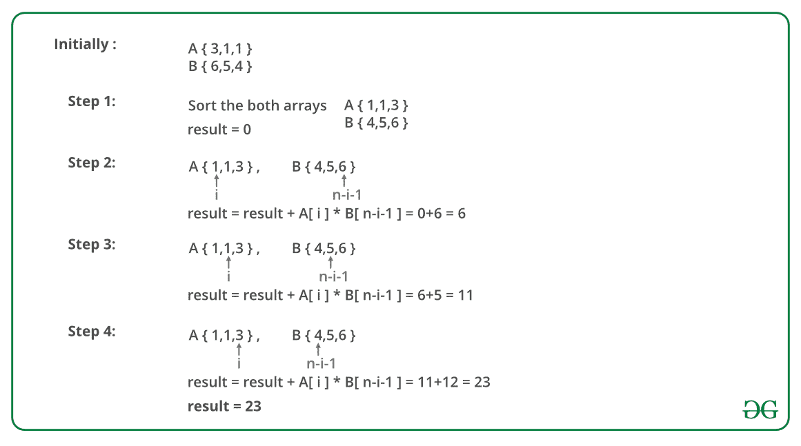

# 在允许排列的情况下，最小化两个数组的乘积之和

> 原文:[https://www . geesforgeks . org/minimum-sum-product-two-array-排列-允许/](https://www.geeksforgeeks.org/minimize-sum-product-two-arrays-permutations-allowed/)

给定两个大小相等的数组 A 和 B，任务是求 A[0]* B[0]+A[1]* B[1]+…+A[n-1]* B[n-1]的最小值。允许对数组 A 和 B 的元素进行洗牌。

**示例:**

```
Input : A[] = {3, 1, 1} and B[] = {6, 5, 4}.
Output : 23
Minimum value of S = 1*6 + 1*5 + 3*4 = 23.

Input : A[] = { 6, 1, 9, 5, 4 } and B[] = { 3, 4, 8, 2, 4 }
Output : 80.
Minimum value of S = 1*8 + 4*4 + 5*4 + 6*3 + 9*2 = 80.
```

其思想是将一个数组的最小元素乘以另一个数组的最大元素。解决这个问题的算法:

1.  对数组 A 和数组 b 进行排序。
2.  遍历数组，对于每个元素，将 A[i]和 B[n–I–1]相乘并相加。

注意:我们正在添加可能导致溢出情况的元素乘法。

下图说明了上述方法:



下面是上述方法的实现:

## C++

```
// C++ program to calculate minimum sum of product
// of two arrays.
#include <bits/stdc++.h>
using namespace std;

// Returns minimum sum of product of two arrays
// with permutations allowed
long long int minValue(int A[], int B[], int n)
{
    // Sort A and B so that minimum and maximum
    // value can easily be fetched.
    sort(A, A + n);
    sort(B, B + n);

    // Multiplying minimum value of A and maximum
    // value of B
    long long int result = 0;
    for (int i = 0; i < n; i++)
        result += (A[i] * B[n - i - 1]);

    return result;
}

// Driven Code
int main()
{
    int A[] = { 3, 1, 1 };
    int B[] = { 6, 5, 4 };
    int n = sizeof(A) / sizeof(A[0]);
    cout << minValue(A, B, n) << endl;
    return 0;
}
```

## Java 语言(一种计算机语言，尤用于创建网站)

```
// Java program to calculate minimum
// sum of product of two arrays.
import java.io.*;
import java.util.*;

class GFG {

    // Returns minimum sum of product of two arrays
    // with permutations allowed
    static long minValue(int A[], int B[], int n)
    {
        // Sort A and B so that minimum and maximum
        // value can easily be fetched.
        Arrays.sort(A);
        Arrays.sort(B);

        // Multiplying minimum value of A
        // and maximum value of B
        long result = 0;
        for (int i = 0; i < n; i++)
            result += (A[i] * B[n - i - 1]);

        return result;
    }

    // Driven Code
    public static void main(String[] args)
    {
        int A[] = { 3, 1, 1 };
        int B[] = { 6, 5, 4 };
        int n = A.length;
        ;
        System.out.println(minValue(A, B, n));
    }
}

// This code is contributed by vt_m
```

## 计算机编程语言

```
# Python program to calculate minimum sum of product
# of two arrays.

# Returns minimum sum of product of two arrays
# with permutations allowed

def minValue(A, B, n):

    # Sort A and B so that minimum and maximum
    # value can easily be fetched.
    A.sort()
    B.sort()

    # Multiplying minimum value of A and maximum
    # value of B
    result = 0
    for i in range(n):
        result += (A[i] * B[n - i - 1])

    return result

# Driven Program
A = [3, 1, 1]
B = [6, 5, 4]
n = len(A)
print minValue(A, B, n)

# Contributed by: Afzal Ansari
```

## C#

```
// C# program to calculate minimum
// sum of product of two arrays.
using System;

class GFG {

    // Returns minimum sum of product
    // of two arrays with permutations
    // allowed
    static long minValue(int[] a, int[] b,
                                   int n)
    {

        // Sort A and B so that minimum
        // and maximum value can easily
        // be fetched.
        Array.Sort(a);
        Array.Sort(b);

        // Multiplying minimum value of
        // A and maximum value of B
        long result = 0;

        for (int i = 0; i < n; i++)
            result += (a[i] * b[n - i - 1]);

        return result;
    }

    // Driven Code
    public static void Main()
    {

        int[] a = { 3, 1, 1 };
        int[] b = { 6, 5, 4 };
        int n = a.Length;

        Console.Write(minValue(a, b, n));
    }
}

// This code is contributed by nitin mittal.
```

## 服务器端编程语言（Professional Hypertext Preprocessor 的缩写）

```
<?php
// PHP program to calculate minimum
// sum of product of two arrays.

// Returns minimum sum of
// product of two arrays
// with permutations allowed
function minValue($A, $B, $n)
{
    // Sort A and B so that minimum
    // and maximum value can easily
    // be fetched.
    sort($A); sort($A , $n);
    sort($B); sort($B , $n);

    // Multiplying minimum value of
    // A and maximum value of B
    $result = 0;
    for ($i = 0; $i < $n; $i++)
        $result += ($A[$i] *
                    $B[$n - $i - 1]);

    return $result;
}

// Driver Code
$A = array( 3, 1, 1 );
$B = array( 6, 5, 4 );
$n = sizeof($A) / sizeof($A[0]);
echo minValue($A, $B, $n) ;

// This code is contributed by nitin mittal.
?>
```

## java 描述语言

```
<script>

// JavaScript program to calculate minimum
// sum of product of two arrays.

// Returns minimum sum of product of two arrays
// with permutations allowed
function minValue(A, B, n)
{

    // Sort A and B so that minimum and maximum
    // value can easily be fetched.
    A.sort();
    B.sort();

    // Multiplying minimum value of A
    // and maximum value of B
    let result = 0;
    for(let i = 0; i < n; i++)
        result += (A[i] * B[n - i - 1]);

    return result;
}

// Driver Code
let A = [ 3, 1, 1 ];
let B = [ 6, 5, 4 ];
let n = A.length;

document.write(minValue(A, B, n));

// This code is contributed by souravghosh0416

</script>
```

**输出:**

```
23
```

**时间复杂度:** O(n log n)。

本文由[**Anuj Chauhan(Anuj 0503)**](https://web.facebook.com/anuj0503)供稿。如果你喜欢 GeeksforGeeks 并想投稿，你也可以使用[contribute.geeksforgeeks.org](http://www.contribute.geeksforgeeks.org)写一篇文章或者把你的文章邮寄到 contribute@geeksforgeeks.org。看到你的文章出现在极客博客主页上，帮助其他极客。
如果发现有不正确的地方，或者想分享更多关于上述话题的信息，请写评论。