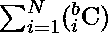

# 尽量减少相邻字符的互换，对给定二进制字符串的每一个可能的重排进行排序

> 原文:[https://www . geesforgeks . org/minimum-交换相邻字符-对给定二进制字符串进行尽可能排序-重排/](https://www.geeksforgeeks.org/minimize-swaps-of-adjacent-characters-to-sort-every-possible-rearrangement-of-given-binary-string/)

给定一个长度为 **N** 的[二进制字符串](https://www.geeksforgeeks.org/tag/binary-string/) **S** ，由 **0s** 、 **1s** 和**组成**，**“在哪里？”**可以被 **0** 或 **1** 代替，任务是统计[按非递减顺序对字符串](https://www.geeksforgeeks.org/sort-a-string-in-java-2-different-ways/)的每一种可能的排列进行排序所需的相邻字符的最小互换之和由于答案可能非常大，所以打印出来[模 **10 <sup>9</sup> + 7**](https://www.geeksforgeeks.org/modulo-1097-1000000007/) 。

**示例:**

> **输入:** S =？0?"
> **输出:** 3
> **解释:**
> 给定字符串可能的重新排列是{“101”、“100”、“000”、“001”}。
> 使“101”不递减的最小互换，即“011”= 1。
> 使“100”不递减的最小互换，即“001”= 2。
> 使“000”不递减的最小互换，即“000”= 0。
> 使“001”不递减的最小互换，即“001”= 0。
> 因此，所需的总互换量为 3。
> 
> **输入:**S =“1？00?"
> T3【输出: 17

**方法:**考虑以下字符串表示: **<某些二进制字符串> 1 <某些 0 数和 b 数的字符串？>**

*   对于其右侧的每个**‘0’**，为每个问号生成的每个二进制字符串都有一个反转。所以，这里的倒排是**a * 2<sup>b</sup>T5。**
*   对于问号，有****的选择方式，这样就有 **i** 数量的 **0s** ，而对于它们中的每一个都有 **i** 的颠倒。****
*   ****共有****
*   ****以上表达式可以转化为**b * 2<sup>(b–1)</sup>**。如果没有“？”在字符串中，值为 **0** 。****
*   ****在那里**“1”**已经被计算为总共**a * 2<sup>b</sup>+b * 2<sup>(b–1)</sup>**反转。****
*   ****为所有人"？"在**“1”的左边，**将上面的值乘以 **2，**自一个**“？”**将为计数的每个现有字符串生成两个新字符串。****
*   ****遍历整个字符串后，返回计数。****

****按照以下步骤解决问题:****

*   ****初始化一个变量**计数**为 **0** ，以存储所有可能字符串所需的最小交换总数。****
*   ****[以相反的方式遍历二进制字符串](https://www.geeksforgeeks.org/reverse-string-python-5-different-ways/)。

    *   对于字符串中的每一个**“1”**，计算**计数 0**和 **2 <sup>的乘积(计数？)</sup>** ，即计算**的值，将**计为**a * 2<sup>b</sup>+b * 2<sup>(b–1)</sup>**。
    *   如果当前字符为**“0”**，则递增 **0** s 的计数
    *   否则，将**计数**的值乘以 **2** ，重复上述过程。**** 
*   ****完成上述步骤后，打印**计数**的值作为结果。****

****下面是上述方法的实现:****

## ****C++14****

```
**// C++ program for the above approach
#include<bits/stdc++.h>
#define MOD  1000000007
using namespace std;

// Precalculate the values of power of 2
vector<int> MEM = { 1, 2, 4, 8, 16, 32, 64,
                    128, 256, 512, 1024,
                    2048, 4096 };

// Function to calculate 2 ^ N % mod
int mod_pow2(int n)
{
    while (n >= MEM.size())
        MEM.push_back((MEM[-1] * 2) % MOD);

    return MEM[n];
}

// Function to find sum of inversions
int inversions(string bstr)
{

    // Initialise a list of 0s and ?s
    int total = 0, zeros = 0, questions = 0;

    // Traverse the string in the
    // reversed manner
    reverse(bstr.begin(),bstr.end());

    for(char x: bstr)
    {
        int q;

        // If the current character is 1
        if (x == '1')
        {

            // Effectively calculate a * b^(b-1)
            int z = zeros * mod_pow2(questions);

            if (questions == 0)
                q = 0;
            else
                q = questions * mod_pow2(
                    questions - 1);

            total = (total + z + q) % MOD;
        }

        // If the current character is 0
        else if (x == '0')
        {
            //Increment count of zeroes
            zeros += 1;
        }
        else
        {

            // Double count the zeroes
            total *= 2;

            // Find b * 2^(b-1)
            int z = zeros * mod_pow2(questions);
            if (questions == 0)
                q = 0;
            else
                q = questions * mod_pow2(
                    questions - 1);

            total = (total + z + q) % MOD;

            // Increment count of questions
            questions += 1;
        }
    }

    // Return the final count
    return total;
}

// Driver Code
int main()
{

    // Given string S
    string S = "?0?";

    // Function Call
    cout << inversions(S);
}

// This code is contributed by mohit kumar 29**
```

## ****Java 语言(一种计算机语言，尤用于创建网站)****

```
**// Java program for the above approach
import java.io.*;
import java.util.*;

class GFG{

static int MOD = 1000000007;

static Integer array[] = { 1, 2, 4, 8, 16, 32, 64,
                           128, 256, 512, 1024,
                           2048, 4096 };

// Precalculate the values of power of 2
static Vector<Integer> MEM = new Vector<Integer>(
    Arrays.asList(array));

// Function to calculate 2 ^ N % mod
static int mod_pow2(int n)
{
    while (n >= MEM.size())
        MEM.add((MEM.get(
            MEM.size() - 1) * 2) % MOD);

    return MEM.get(n);
}

// Function to find sum of inversions
static int inversions(char[] bstr)
{

    // Initialise a list of 0s and ?s
    int total = 0, zeros = 0, questions = 0;

    // Traverse the string in the
    // reversed manner
    int j = bstr.length - 1;
    for(int i = 0; i < bstr.length / 2; i++)
    {
        char temp = bstr[i];
        bstr[i] = bstr[j];
        bstr[j] = temp;
        j--;
    }

    for(char x : bstr)
    {
        int q;

        // If the current character is 1
        if (x == '1')
        {

            // Effectively calculate a * b^(b-1)
            int z = zeros * mod_pow2(questions);

            if (questions == 0)
                q = 0;
            else
                q = questions * mod_pow2(
                    questions - 1);

            total = (total + z + q) % MOD;
        }

        // If the current character is 0
        else if (x == '0')
        {

            // Increment count of zeroes
            zeros += 1;
        }
        else
        {

            // Double count the zeroes
            total *= 2;

            // Find b * 2^(b-1)
            int z = zeros * mod_pow2(questions);
            if (questions == 0)
                q = 0;
            else
                q = questions * mod_pow2(
                    questions - 1);

            total = (total + z + q) % MOD;

            // Increment count of questions
            questions += 1;
        }
    }

    // Return the final count
    return total;
}

// Driver Code 
public static void main(String[] args)
{

    // Given string S
    char S[] = "?0?".toCharArray();

    // Function Call
    System.out.println(inversions(S));
}
}

// This code is contributed by divyeshrabadiya07**
```

## ****蟒蛇 3****

```
**# Python3 program for the above approach

MOD = 10**9 + 7

# Precalculate the values of power of 2
MEM = [1, 2, 4, 8, 16, 32, 64, 128,
       256, 512, 1024, 2048, 4096]

# Function to calculate 2 ^ N % mod
def mod_pow2(n):

    while n >= len(MEM):
        MEM.append((MEM[-1] * 2) % MOD)

    return MEM[n]

# Function to find sum of inversions
def inversions(bstr):

    # Initialise a list of 0s and ?s
    total, zeros, questions = (0, )*3

    # Traverse the string in the
    # reversed manner
    for x in reversed(bstr):

        # If the current character is 1
        if x == '1':

            # Effectively calculate a * b^(b-1)
            z = zeros * mod_pow2(questions)

            if questions == 0:
                q = 0
            else:
                 q = questions * mod_pow2(questions - 1)

            total = (total + z + q) % MOD

        # If the current character is 0
        elif x == '0':

            # Increment count of zeroes
            zeros += 1

        else:

            # Double count the zeroes
            total *= 2

            # Find b * 2^(b-1)
            z = zeros * mod_pow2(questions)
            if questions == 0:
                q = 0
            else:
                 q = questions * mod_pow2(questions - 1)

            total = (total + z + q) % MOD

            # Increment count of questions
            questions += 1

    # Return the final count
    return total

# Driver Code
def main():

    # Given string S
    S = "?0?"

    # Function Call
    print(inversions(S))

if __name__ == "__main__":
    main()**
```

## ****C#****

```
**// C# program for the above approach
using System;
using System.Collections.Generic;
class GFG {

  static int MOD = 1000000007;

  // Precalculate the values of power of 2
  static List<int> MEM = new List<int>(new int[] { 1, 2, 4, 8, 16, 32, 64,
                                                  128, 256, 512, 1024,
                                                  2048, 4096 });

  // Function to calculate 2 ^ N % mod
  static int mod_pow2(int n)
  {
    while (n >= MEM.Count)
      MEM.Add((MEM[MEM.Count - 1] * 2) % MOD);

    return MEM[n];
  }

  // Function to find sum of inversions
  static int inversions(char[] bstr)
  {

    // Initialise a list of 0s and ?s
    int total = 0, zeros = 0, questions = 0;

    // Traverse the string in the
    // reversed manner
    Array.Reverse(bstr);

    foreach(char x in bstr)
    {
      int q;

      // If the current character is 1
      if (x == '1')
      {

        // Effectively calculate a * b^(b-1)
        int z = zeros * mod_pow2(questions);

        if (questions == 0)
          q = 0;
        else
          q = questions * mod_pow2(
          questions - 1);

        total = (total + z + q) % MOD;
      }

      // If the current character is 0
      else if (x == '0')
      {
        // Increment count of zeroes
        zeros += 1;
      }
      else
      {

        // Double count the zeroes
        total *= 2;

        // Find b * 2^(b-1)
        int z = zeros * mod_pow2(questions);
        if (questions == 0)
          q = 0;
        else
          q = questions * mod_pow2(
          questions - 1);

        total = (total + z + q) % MOD;

        // Increment count of questions
        questions += 1;
      }
    }

    // Return the final count
    return total;
  }

  // Driver code
  static void Main()
  {

    // Given string S
    char[] S = "?0?".ToCharArray();

    // Function Call
    Console.WriteLine(inversions(S));
  }
}

// This code is contributed by divyesh072019**
```

## ****java 描述语言****

```
**<script>
    // Javascript program for the above approach

    let MOD = 1000000007;

    // Precalculate the values of power of 2
    let MEM = [ 1, 2, 4, 8, 16, 32, 64, 128, 256, 512, 1024, 2048, 4096 ];

    // Function to calculate 2 ^ N % mod
    function mod_pow2(n)
    {
      while (n >= MEM.length)
        MEM.push((MEM[MEM.length - 1] * 2) % MOD);

      return MEM[n];
    }

    // Function to find sum of inversions
    function inversions(bstr)
    {

      // Initialise a list of 0s and ?s
      let total = 0, zeros = 0, questions = 0;

      // Traverse the string in the
      // reversed manner
      bstr.reverse();

      for(let i = 0; i < bstr.length; i++)
      {
        let q;

        // If the current character is 1
        if (bstr[i] == '1')
        {

          // Effectively calculate a * b^(b-1)
          let z = zeros * mod_pow2(questions);

          if (questions == 0)
            q = 0;
          else
            q = questions * mod_pow2(questions - 1);

          total = (total + z + q) % MOD;
        }

        // If the current character is 0
        else if (bstr[i] == '0')
        {
          // Increment count of zeroes
          zeros += 1;
        }
        else
        {

          // Double count the zeroes
          total *= 2;

          // Find b * 2^(b-1)
          let z = zeros * mod_pow2(questions);
          if (questions == 0)
            q = 0;
          else
            q = questions * mod_pow2(questions - 1);

          total = (total + z + q) % MOD;

          // Increment count of questions
          questions += 1;
        }
      }

      // Return the final count
      return total;
    }

    // Given string S
    let S = "?0?".split('');

    // Function Call
    document.write(inversions(S));

// This code is contributed by suresh07.
</script>**
```

******Output:** 

```
3
```**** 

*******时间复杂度:**O(N)*
T5**辅助空间:** O(N)****