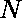

# 最小化最小和最大元素之间的差异

> 原文:[https://www . geesforgeks . org/最小化最小和最大元素之间的差异/](https://www.geeksforgeeks.org/minimize-the-difference-between-minimum-and-maximum-elements/)

给定一组整数和一个整数。允许通过增加或减少 k(仅一次)来修改元素。
**任务是最小化**并打印最短塔和最长塔之间的最大差异。
**例:**

```
Input: arr[] = {1, 10, 8, 5}, k = 2
Output : Max height difference = 5
Explanation:
modified arr[]={3, 8, 6, 7}
max difference: 5

Input: arr[] = {3, 16, 12, 9, 20}, k = 3
Output : Max height difference: 11
```

[Recommended: Please try your approach on ***<u>{IDE}</u>*** first, before moving on to the solution.](https://ide.geeksforgeeks.org/) 

**进场:**

1.  找到数组中存在的**最大**和**最小**元素。
2.  检查**最大**和**最小**元素之差是否小于或等于 **k** :
    *   如果是，则返回最大和最小元素之间的差值。
    *   否则，转到步骤 3。
3.  计算数组最大和最小元素的平均值。
4.  遍历数组并执行以下操作:
    *   如果数组元素大于平均值，则减少 k。
    *   如果数组元素小于平均值，则增加 k。
5.  返回修改后数组的最大和最小元素之间的差值。

以下是上述方法的实现:

## C++

```
// C++ program to minimize the difference between
// minimum and maximum elements

#include <bits/stdc++.h>
using namespace std;

// Function to minimize the difference between
// minimum and maximum elements
int minimizeDiff(int* arr, int n, int k)
{
    // Find max and min elements of the array
    int max = *(max_element(arr, arr + n));
    int min = *(min_element(arr, arr + n));

    // Check whether the difference between
    // the max and min element is less than
    // or equal to k or not
    if ((max - min) <= k) {
        return (max - min);
    }

    // Calculate average of max and min
    int avg = (max + min) / 2;

    for (int i = 0; i < n; i++) {
        // If the array element is greater than the
        // average then decrease it by k
        if (arr[i] > avg)
            arr[i] -= k;
        // If the array element is smaller than the
        // average then increase it by k
        else
            arr[i] += k;
    }

    // Find max and min of the modified array
    max = *(max_element(arr, arr + n));
    min = *(min_element(arr, arr + n));

    // return the new difference
    return (max - min);
}

// Driver code
int main()
{
    int arr[] = { 3, 16, 12, 9, 20 };
    int n = 5;
    int k = 3;

    cout << "Max height difference = "
         << minimizeDiff(arr, n, k) << endl;

    return 0;
}
```

## Java 语言(一种计算机语言，尤用于创建网站)

```
// Java program to minimize the difference between
// minimum and maximum elements
import java.util.*;

class GFG
{

    // Function to minimize the difference between
    // minimum and maximum elements
    static int minimizeDiff(int[] arr, int n, int k)
    {
        // Find max and min elements of the array
        int max = Arrays.stream(arr).max().getAsInt();
        int min = Arrays.stream(arr).min().getAsInt();

        // Check whether the difference between
        // the max and min element is less than
        // or equal to k or not
        if ((max - min) <= k)
        {
            return (max - min);
        }

        // Calculate average of max and min
        int avg = (max + min) / 2;

        for (int i = 0; i < n; i++)
        {
            // If the array element is greater than the
            // average then decrease it by k
            if (arr[i] > avg)
            {
                arr[i] -= k;
            }

            // If the array element is smaller than the
            // average then increase it by k
            else
            {
                arr[i] += k;
            }
        }

        // Find max and min of the modified array
        max = Arrays.stream(arr).max().getAsInt();
        min = Arrays.stream(arr).min().getAsInt();

        // return the new difference
        return (max - min);
    }

    // Driver code
    public static void main(String[] args)
    {
        int arr[] = {3, 16, 12, 9, 20};
        int n = 5;
        int k = 3;

        System.out.println("Max height difference = "
                + minimizeDiff(arr, n, k));
    }
}

// This code has been contributed by 29AjayKumar
```

## 蟒蛇 3

```
# Python 3 program to minimize the
# difference between minimum and
# maximum elements

# Function to minimize the difference
# between minimum and maximum elements
def minimizeDiff(arr, n, k) :

    # Find max and min elements
    # of the array
    max_element = max(arr)
    min_element = min(arr)

    # Check whether the difference between
    # the max and min element is less than
    # or equal to k or not
    if ((max_element - min_element) <= k) :
        return (max_element - min_element)

    # Calculate average of max and min
    avg = (max_element + min_element) // 2

    for i in range(n):

        # If the array element is greater than
        # the average then decrease it by k
        if (arr[i] > avg) :
            arr[i] -= k

        # If the array element is smaller than 
        # the average then increase it by k
        else :
            arr[i] += k

    # Find max and min of the
    # modified array
    max_element = max(arr)
    min_element = min(arr)

    # return the new difference
    return (max_element - min_element);

# Driver code
if __name__ == "__main__" :

    arr = [ 3, 16, 12, 9, 20 ]
    n = 5
    k = 3

    print("Max height difference =",
            minimizeDiff(arr, n, k))

# This code is contributed by Ryuga
```

## C#

```
// C# program to minimize the difference between
// minimum and maximum elements
using System;
using System.Linq;

class GFG
{

    // Function to minimize the difference between
    // minimum and maximum elements
    static int minimizeDiff(int[] arr, int n, int k)
    {
        // Find max and min elements of the array
        int max = arr.Max();
        int min = arr.Min();

        // Check whether the difference between
        // the max and min element is less than
        // or equal to k or not
        if ((max - min) <= k)
        {
            return (max - min);
        }

        // Calculate average of max and min
        int avg = (max + min) / 2;

        for (int i = 0; i < n; i++)
        {
            // If the array element is greater than the
            // average then decrease it by k
            if (arr[i] > avg)
            {
                arr[i] -= k;
            }

            // If the array element is smaller than the
            // average then increase it by k
            else
            {
                arr[i] += k;
            }
        }

        // Find max and min of the modified array
        max = arr.Max();
        min = arr.Min();

        // return the new difference
        return (max - min);
    }

    // Driver code
    public static void Main()
    {
        int []arr = {3, 16, 12, 9, 20};
        int n = 5;
        int k = 3;

        Console.WriteLine("Max height difference = "
                + minimizeDiff(arr, n, k));
    }
}

/* This code contributed by PrinciRaj1992 */
```

## 服务器端编程语言（Professional Hypertext Preprocessor 的缩写）

```
<?php
// PHP program to minimize the difference
// between minimum and maximum elements

// Function to minimize the difference
// between minimum and maximum elements
function minimizeDiff(&$arr, $n, $k)
{
    // Find max and min elements
    // of the array
    $max = max($arr);
    $min = min($arr);

    // Check whether the difference between
    // the max and min element is less than
    // or equal to k or not
    if (($max - $min) <= $k)
    {
        return ($max - $min);
    }

    // Calculate average of max and min
    $avg = ($max + $min) / 2;

    for ($i = 0; $i < $n; $i++)
    {
        // If the array element is greater than
        // the average then decrease it by k
        if ($arr[$i] > $avg)
            $arr[$i] -= $k;

        // If the array element is smaller than
        // the average then increase it by k
        else
            $arr[$i] += $k;
    }

    // Find max and min of the
    // modified array
    $max = max($arr);
    $min = min($arr);

    // return the new difference
    return ($max - $min);
}

// Driver code
$arr = array( 3, 16, 12, 9, 20 );
$n = 5;
$k = 3;

echo "Max height difference = " .
      minimizeDiff($arr, $n, $k). "\n";

// This code is contributed by ita_c
?>
```

## java 描述语言

```
<script>

// Javascript program to minimize
// the difference between
// minimum and maximum elements

    // Function to minimize the difference between
    // minimum and maximum elements
    function minimizeDiff(arr,n,k)
    {
        // Find max and min elements of the array
        let max = Math.max(...arr);
        let min = Math.min(...arr);

        // Check whether the difference between
        // the max and min element is less than
        // or equal to k or not
        if ((max - min) <= k)
        {
            return (max - min);
        }

        // Calculate average of max and min
           let avg = Math.floor((max + min) / 2);

        for (let i = 0; i < n; i++)
        {
            // If the array element is greater than the
            // average then decrease it by k
            if (arr[i] > avg)
            {
                arr[i] -= k;
            }

            // If the array element is smaller than the
            // average then increase it by k
            else
            {
                arr[i] += k;
            }
        }

        // Find max and min of the modified array
       max = Math.max(...arr);
        min = Math.min(...arr);

        // return the new difference
        return (max - min);
    }

    // Driver code
    let arr=[3, 16, 12, 9, 20];
    let n = 5;
    let k = 3;
    document.write("Max height difference = "
                + minimizeDiff(arr, n, k));

// This code is contributed by avanitrachhadiya2155

</script>
```

**Output:** 

```
Max height difference = 11
```

**时间复杂度** : O( N )