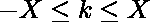
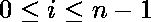

# 最小化修改后数组的最大值和最小值之间的差异

> 原文:[https://www . geeksforgeeks . org/最小化修改后数组的最大值和最小值之间的差异/](https://www.geeksforgeeks.org/minimize-the-difference-between-the-maximum-and-minimum-values-of-the-modified-array/)

给定一个由 **n** 个整数和整数 **X** 组成的数组 **A** 。您可以在和**之间选择任意整数，并为每个添加 **k** 到**A【I】**。任务是更新数组 **A** 后，找出 **A** 最大值与 **A** 最小值之间**最小**可能的差值。
示例:** 

```
Input: arr[] = {1, 3, 6}, x = 3
Output: 0
New array is [3, 3, 3] or [4, 4, 4].

Input: arr[] = {0, 10}, x = 2
Output: 6
New array is [2, 8] i.e add 2 to a[0] and subtract -2 from a[1].
```

**进场:**让 **A** 为原阵。朝向尽量最小化**最大值(A)–最小值(A)** ，让我们分别尽量最小化**最大值(A)** 和最大化**最小值(A)** 。
**最大值(A)** 的最小可能值是**最大值(A)–K**，因为**最大值(A)** 不能再低了。同样的， **min(A)** 最大可能值为 **min(A) + K** 。所以数量**最大(A)–最小(A)** 至少是 **ans =(最大(A)–K)–(最小(A) + K)** 。
我们可以通过以下修改达到这个值:

> *   如果 A[i] <=最小值(A) + K，那么 A[i] =最小值(A) + K
> *   否则，如果 A[i] >=最大值(A)–K，那么 A[i] =最大值(A)–K
> 
> 如果 **ans < 0** ，我们能得到的最好的答案是 **ans = 0** ，也使用同样的修改。

下面是上述方法的实现。

## 卡片打印处理机（Card Print Processor 的缩写）

```
// C++ program to find the minimum difference.
#include <bits/stdc++.h>
using namespace std;

// Function to return required minimum difference
int minDiff(int n, int x, int A[])
{
    int mn = A[0], mx = A[0];

    // finding minimum and maximum values
    for (int i = 0; i < n; ++i) {
        mn = min(mn, A[i]);
        mx = max(mx, A[i]);
    }

    // returning minimum possible difference
    return max(0, mx - mn - 2 * x);
}

// Driver program
int main()
{

    int n = 3, x = 3;
    int A[] = { 1, 3, 6 };

    // function to return the answer
    cout << minDiff(n, x, A);

    return 0;
}
```

## Java 语言(一种计算机语言，尤用于创建网站)

```
// Java program to find the minimum difference.

import java.util.*;
class GFG
{

    // Function to return required minimum difference
    static int minDiff(int n, int x, int A[])
    {
        int mn = A[0], mx = A[0];

        // finding minimum and maximum values
        for (int i = 0; i < n; ++i) {
            mn = Math.min(mn, A[i]);
            mx = Math.max(mx, A[i]);
        }

        // returning minimum possible difference
        return Math.max(0, mx - mn - 2 * x);
    }

    // Driver program
    public static void main(String []args)
    {

        int n = 3, x = 3;
        int A[] = { 1, 3, 6 };

        // function to return the answer
        System.out.println(minDiff(n, x, A));

    }

}

// This code is contributed by ihritik
```

## 蟒蛇 3

```
# Python program to find the minimum difference.

# Function to return required minimum difference
def minDiff( n,  x,  A):

    mn =  A[0]
    mx =  A[0]

    # finding minimum and maximum values
    for i in range(0,n):
         mn = min( mn,  A[ i])
         mx = max( mx,  A[ i])

    # returning minimum possible difference
    return max(0,  mx -  mn - 2 *  x)

# Driver program

n = 3
x = 3
A = [1, 3, 6 ]

# function to return the answer
print(minDiff( n,  x,  A))

# This code is contributed by ihritik
```

## C#

```
// C# program to find the minimum difference.

using System;
class GFG
{

    // Function to return required minimum difference
    static int minDiff(int n, int x, int []A)
    {
        int mn = A[0], mx = A[0];

        // finding minimum and maximum values
        for (int i = 0; i < n; ++i) {
            mn = Math.Min(mn, A[i]);
            mx = Math.Max(mx, A[i]);
        }

        // returning minimum possible difference
        return Math.Max(0, mx - mn - 2 * x);
    }

    // Driver program
    public static void Main()
    {

        int n = 3, x = 3;
        int []A = { 1, 3, 6 };

        // function to return the answer
        Console.WriteLine(minDiff(n, x, A));

    }
}

// This code is contributed by ihritik
```

## 服务器端编程语言（Professional Hypertext Preprocessor 的缩写）

```
<?php

// PHP program to find the minimum difference.

// Function to return required minimum difference
function minDiff($n, $x, $A)
{
    $mn = $A[0];
    $mx = $A[0];

    // finding minimum and maximum values
    for ($i = 0; $i < $n; ++$i) {
        $mn = min($mn, $A[$i]);
        $mx = max($mx, $A[$i]);
    }

    // returning minimum possible difference
    return max(0, $mx - $mn - 2 * $x);
}

// Driver program

$n = 3;
$x = 3;
$A = array( 1, 3, 6 );

// function to return the answer
echo minDiff($n, $x, $A);

// This code is contributed by ihritik

?>
```

## java 描述语言

```
<script>

// JavaScript program to find the minimum difference.

// Function to return required minimum difference
function  minDiff( n,  x, A)
{
    var mn = A[0], mx = A[0];

    // finding minimum and maximum values
    for (var i = 0; i < n; ++i) {
        mn = Math.min(mn, A[i]);
        mx = Math.max(mx, A[i]);
    }

    // returning minimum possible difference
    return Math.max(0, mx - mn - 2 * x);
}

var n = 3, x = 3;
var A = [ 1, 3, 6 ];

// function to return the answer
document.write( minDiff(n, x, A));

// This code is contributed by SoumikMondal

</script>
```

**Output:** 

```
0
```

**时间复杂度:** O(n)