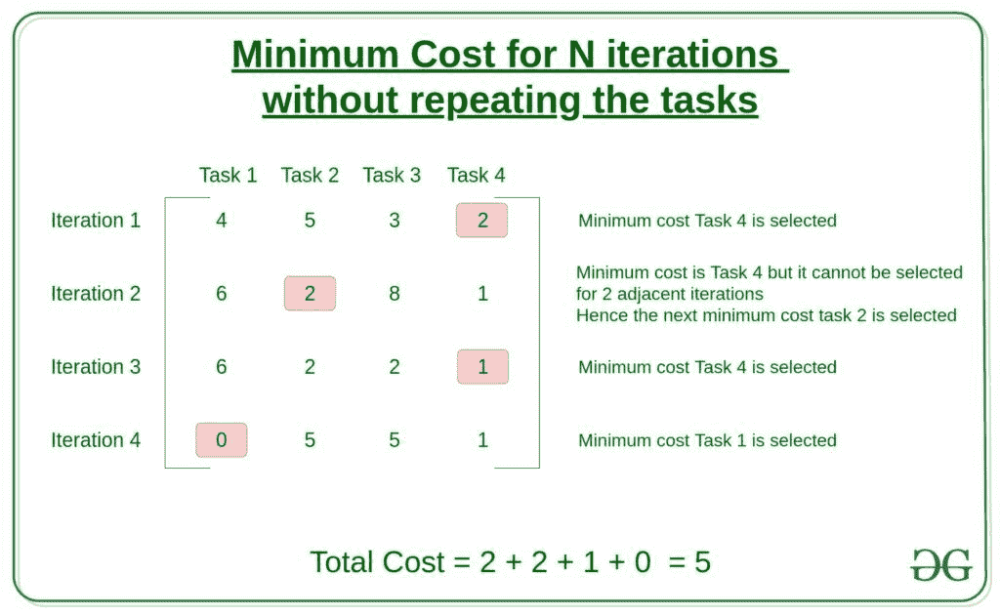

# 在两次连续迭代中不重复相同任务的情况下，最小化总成本

> 原文:[https://www . geeksforgeeks . org/minimum-总成本-不重复同一任务两次连续迭代/](https://www.geeksforgeeks.org/minimize-total-cost-without-repeating-same-task-in-two-consecutive-iterations/)

给定一个大小为 **M X N** 的数组 **arr[][]** ，其中 **M** 代表任务数 **N** 代表迭代次数。数组**arr【I】【j】**中的一个条目表示在第**I**次迭代中执行任务 **j** 的成本。假设同一任务 **j** 不能在两次连续迭代中计算，任务是计算每次迭代中恰好执行一个任务的最小成本。
**例:**

> **输入:** N = 4，M = 4，arr[][] = {{4，5，3，2}，{6，2，8，1}，{6，2，2，1}，{0，5，5，1 } }
> T3】输出:5
> T6】解释:
> 
> 
> 
> 第一次迭代的最小成本是 2。
> 由于给定在下一次迭代中不能计算相同的任务，因此在该索引处排除元素的最小成本是 2。类似地，第三次迭代的最小成本是 1，第四次迭代是 0。因此，总成本= 2 + 2 + 1 + 0 = 5。
> **输入:** N = 3，M = 2，arr[][] = {{3，4}，{1，2}，{10，0 } }
> T5】输出: 5

**朴素方法:**这个问题的朴素方法是生成所有可能的任务组合，然后以最小的成本搜索组合。然而，对于更大尺寸的矩阵，这将失败，因为这种方法的时间复杂度是 0(T2)N(T3)。
**高效途径:**利用[动态规划](https://www.geeksforgeeks.org/dynamic-programming/)的概念可以高效解决这个问题。直觉是形成维度 **N x M** 的 dp-table **dp[][]** ，其中 **dp[i][j]** 代表**j**任务在**I**迭代上的最小成本。但是，由于同一任务不应连续两天迭代，dp 表可以按以下方式填写:

**dp[][]** 阵列的第一行将与**成本[][]** 矩阵的第一行相同。答案是最后一行的最小元素。
以下是上述方法的实施:

## 卡片打印处理机（Card Print Processor 的缩写）

```
// C++ implementation of the above approach
// Function to return the minimum cost
// for N iterations
#include <bits/stdc++.h>
using namespace std;

int findCost(vector<vector<int>>cost_mat, int N, int M)
{
    // Construct the dp table
    vector<vector<int>> dp(N,vector<int>(M, 0));

    // 1st row of dp table will be equal
    // to the 1st of cost matrix

    for(int i = 0; i < M; i++)
        dp[0][i] = cost_mat[0][i];

    // Iterate through all the rows
    for (int row = 1; row < N; row++){

        // To iterate through the
        // columns of current row
        for (int curr_col = 0; curr_col < M; curr_col++)
        {

            // Initialize val as infinity
            int val = 999999999;

            // To iterate through the
            // columns of previous row
            for(int prev_col = 0; prev_col < M; prev_col++)
            {

                if (curr_col != prev_col)
                    val = min(val, dp[row - 1][prev_col]);
            }

            // Fill the dp matrix
            dp[row][curr_col] = val + cost_mat[row][curr_col];
        }
        }

    // Returning the minimum value
    int ans = INT_MAX;
    for(int i = 0; i < M; i++)
        ans = min(ans, dp[N-1][i]);
    return ans;
}

// Driver code
int main()
{

// Number of iterations
int N = 4;

// Number of tasks
int M = 4;

// Cost matrix
vector<vector<int>> cost_mat;
cost_mat = {{4, 5, 3, 2},
            {6, 2, 8, 1},
            {6, 2, 2, 1},
            {0, 5, 5, 1}};

cout << findCost(cost_mat, N, M);
return 0;
}

// This code is contributed by mohit kumar 29
```

## Java 语言(一种计算机语言，尤用于创建网站)

```
// Java implementation of the above approach
// Function to return the minimum cost
// for N iterations
import java.io.*;
class GFG {

    static int findCost(int cost_mat[][], int N, int M)
    {
        // Construct the dp table
        int dp[][] = new int[N][M] ;

        // 1st row of dp table will be equal
        // to the 1st of cost matrix

        for(int i = 0; i < M; i++)
            dp[0][i] = cost_mat[0][i];

        // Iterate through all the rows
        for (int row = 1; row < N; row++){

            // To iterate through the
            // columns of current row
            for (int curr_col = 0; curr_col < M; curr_col++)
            {

                // Initialize val as infinity
                int val = 999999999;

                // To iterate through the
                // columns of previous row
                for(int prev_col = 0; prev_col < M; prev_col++)
                {

                    if (curr_col != prev_col)
                        val = Math.min(val, dp[row - 1][prev_col]);
                }

                // Fill the dp matrix
                dp[row][curr_col] = val + cost_mat[row][curr_col];
            }
            }

        // Returning the minimum value
        int ans = Integer.MAX_VALUE;
        for(int i = 0; i < M; i++)
            ans = Math.min(ans, dp[N-1][i]);
        return ans;
    }

    // Driver code
    public static void main (String[] args) 
    {

    // Number of iterations
    int N = 4;

    // Number of tasks
    int M = 4;

    // Cost matrix
    int cost_mat[][] = {{4, 5, 3, 2},
                {6, 2, 8, 1},
                {6, 2, 2, 1},
                {0, 5, 5, 1}};

    System.out.println(findCost(cost_mat, N, M));

    }

}

// This code is contributed by ANKITKUMAR34
```

## 计算机编程语言

```
# Python implementation of the above approach

# Function to return the minimum cost
# for N iterations
def findCost(cost_mat, N, M):

    # Construct the dp table
    dp = [[0]*M for _ in range(M)]

    # 1st row of dp table will be equal
    # to the 1st of cost matrix
    dp[0] = cost_mat[0]

    # Iterate through all the rows
    for row in range(1, N):

        # To iterate through the
        # columns of current row
        for curr_col in range(M):

            # Initialize val as infinity
            val = 999999999

            # To iterate through the
            # columns of previous row
            for prev_col in range(M):

                if curr_col != prev_col:
                    val = min(val, dp[row-1][prev_col])

            # Fill the dp matrix
            dp[row][curr_col] = val + cost_mat[row][curr_col]

    # Returning the minimum value
    return min(dp[-1])

if __name__ == "__main__":

    # Number of iterations
    N = 4

    # Number of tasks
    M = 4

    # Cost matrix
    cost_mat = [[4, 5, 3, 2],
                [6, 2, 8, 1],
                [6, 2, 2, 1],
                [0, 5, 5, 1]]

    print(findCost(cost_mat, N, M))

```

## C#

```
// C# implementation of the above approach
// Function to return the minimum cost
// for N iterations
using System;

class GFG {

    static int findCost(int [,]cost_mat, int N, int M)
    {
        // Construct the dp table
        int [,]dp = new int[N, M] ;

        // 1st row of dp table will be equal
        // to the 1st of cost matrix

        for(int i = 0; i < M; i++)
            dp[0, i] = cost_mat[0, i];

        // Iterate through all the rows
        for (int row = 1; row < N; row++){

            // To iterate through the
            // columns of current row
            for (int curr_col = 0; curr_col < M; curr_col++)
            {

                // Initialize val as infinity
                int val = 999999999;

                // To iterate through the
                // columns of previous row
                for(int prev_col = 0; prev_col < M; prev_col++)
                {

                    if (curr_col != prev_col)
                        val = Math.Min(val, dp[row - 1, prev_col]);
                }

                // Fill the dp matrix
                dp[row, curr_col] = val + cost_mat[row, curr_col];
            }
            }

        // Returning the minimum value
        int ans = int.MaxValue;

        for(int i = 0; i < M; i++)
            ans = Math.Min(ans, dp[N - 1, i]);

        return ans;
    }

    // Driver code
    public static void Main (string[] args)
    {

        // Number of iterations
        int N = 4;

        // Number of tasks
        int M = 4;

        // Cost matrix
        int [,]cost_mat = {{4, 5, 3, 2},
                    {6, 2, 8, 1},
                    {6, 2, 2, 1},
                    {0, 5, 5, 1}};

        Console.WriteLine(findCost(cost_mat, N, M));

    }

}

// This code is contributed by Yash_R
```

## java 描述语言

```
<script>

// Javascript implementation of
// the above approach

// Function to return the minimum cost
// for N iterations

    function findCost(cost_mat , N , M)
    {
        // Construct the dp table
        var dp = Array(N);
        for( i = 0;i<N;i++)
            dp[i] = Array(M).fill(0);
        // 1st row of dp table will be equal
        // to the 1st of cost matrix

        for (i = 0; i < M; i++)
            dp[0][i] = cost_mat[0][i];

        // Iterate through all the rows
        for (row = 1; row < N; row++) {

            // To iterate through the
            // columns of current row
            for (curr_col = 0; curr_col < M; curr_col++)
            {

                // Initialize val as infinity
                var val = 999999999;

                // To iterate through the
                // columns of previous row
                for (prev_col = 0; prev_col < M;
                prev_col++)
                {

                    if (curr_col != prev_col)
                        val = Math.min(val,
                        dp[row - 1][prev_col]);
                }

                // Fill the dp matrix
                dp[row][curr_col] = val +
                cost_mat[row][curr_col];
            }
        }

        // Returning the minimum value
        var ans = Number.MAX_VALUE;
        for (i = 0; i < M; i++)
            ans = Math.min(ans, dp[N - 1][i]);
        return ans;
    }

    // Driver code

        // Number of iterations
        var N = 4;

        // Number of tasks
        var M = 4;

        // Cost matrix
        var cost_mat = [ [ 4, 5, 3, 2 ],
                        [ 6, 2, 8, 1 ],
                        [ 6, 2, 2, 1 ],
                        [ 0, 5, 5, 1 ] ];

        document.write(findCost(cost_mat, N, M));

// This code contributed by umadevi9616

</script>
```

**Output:** 

```
5
```