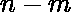
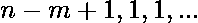
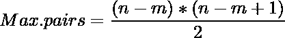
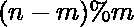
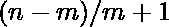
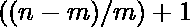

# n 人 m 队最小和最大对数

> 原文:[https://www . geesforgeks . org/最小和最大 n 人 m 对团队数/](https://www.geeksforgeeks.org/minimum-and-maximum-number-of-pairs-in-m-teams-of-n-people/)

有个人被精确地分组到个团队中，这样每个团队中至少有一个人。一个团队的所有成员都是彼此的朋友。通过将这些人精确分组到队，找到可以组成的最小和最大朋友对数量。
**例:**

> **输入:** 5 2
> **输出:** 4 6
> 对于最大配对数，第一队只包含 1 名成员，第二队包含 4 名彼此是朋友的人，因此第一队配对数+第二队配对数= 0 + 6 =总配对数= 6
> 对于最小配对数， 第一组包含 2 名成员，第二组包含 3 名互为好友的成员，因此第一组的配对数+第二组的配对数= 1 + 3 =总配对数= 4
> **输入:** 2 1
> **输出:** 1 1

**说明:**
首先我们每个团队要放 1 个成员来满足约束。所以就剩下人了。
**1。对于最大配对数**
可以看出，最大配对数只能通过将同一团队的所有剩余成员放在一起产生。可以这样解释:
考虑 2 个团队一个包含 x 个人，另一个包含 1 个人，现在我们要在两个团队中多加 1 个人，把他/她加到 x 个人的团队中会增加 x 对的数量，而把他加到另一个团队中只会增加 1 对的数量。因此，对于最大数量的对子，我们必须将所有剩余的人放在同一个团队中。
现在最大配对数的团队分布如下:

因此，



如果一个团队由 3 个人组成，第三个人有 1 个和 2 个朋友，第二个人有 1 个朋友。因此，2+1 = ((3-1)*(3))/2 友
**2。对于最小对数**
现在从同一个解释可以看出，当所有人在队伍中平均分配时，获得最小对数。因此，剩余的 n-m 个人应该分布在 m 个团队中，这样每个团队包含(n-m)/m 个更多的人。现在每个队还有人要补 1 人(可以看出与上面的最大值条件相反)。
现在最小配对数的团队分布是这样的:
每个团队有个成员，个团队多了一个成员。
所以对子总数= m 个大小团队的对子总数 +有大小的个团队加 1 人形成的对子数量


## C++

```
// CPP program to find minimum and maximum no. of pairs
#include <bits/stdc++.h>
using namespace std;

void MinimumMaximumPairs(int n, int m)
{
    int max_pairs = ((n - m + 1) * (n - m)) / 2;

    int min_pairs = m * (((n - m) / m + 1) * ((n - m) / m)) / 2 +
                    ceil((n - m) / double(m)) * ((n - m) % m);

    cout << "Minimum no. of pairs = " << min_pairs << "\n";
    cout << "Maximum no. of pairs = " << max_pairs << "\n";
}

// Driver code
int main()
{
    int n = 5, m = 2;
    MinimumMaximumPairs(n, m);
    return 0;
}
```

## Java 语言(一种计算机语言，尤用于创建网站)

```
//Java  program to find minimum
// and maximum no. of pairs

import java.io.*;

class GFG {
    static void MinimumMaximumPairs(int n, int m)
{
    int max_pairs = ((n - m + 1) * (n - m)) / 2;

    int min_pairs = m * (((n - m) / m + 1) * ((n - m) / m)) / 2 +
                        (int)Math.ceil((double)((n - m) /
                                        (double)(m))) * ((n - m) % m);

        System.out.println("Minimum no. of pairs = " + min_pairs);
        System.out.println("Maximum no. of pairs = " + max_pairs);
}

// Driver code
    public static void main (String[] args) {

    int n = 5, m = 2;
    MinimumMaximumPairs(n, m);
}
}
// This code is contributed by Sachin.
```

## 蟒蛇 3

```
# Python3 program to find minimum
# and maximum no. of pairs

from math import ceil

def MinimumMaximumPairs(n, m) :

    max_pairs = ((n - m + 1) * (n - m)) // 2;

    min_pairs = (m * (((n - m) // m + 1) *
                      ((n - m) // m)) // 2 +
                  ceil((n - m) / (m)) *
                      ((n - m) % m))

    print("Minimum no. of pairs = ", min_pairs)
    print("Maximum no. of pairs = " , max_pairs)

# Driver code
if __name__ == "__main__" :

    n ,m= 5, 2
    MinimumMaximumPairs(n, m)

# This code is contributed by Ryuga
```

## C#

```
// C# program to find minimum
// and maximum no. of pairs
using System;
class GFG
{
static void MinimumMaximumPairs(int n, int m)
{
    int max_pairs = ((n - m + 1) * (n - m)) / 2;

    int min_pairs = m * (((n - m) / m + 1) * ((n - m) / m)) / 2 +
                         (int)Math.Ceiling((double)((n - m) /
                                           (double)(m))) * ((n - m) % m);

    Console.WriteLine("Minimum no. of pairs = " + min_pairs);
    Console.WriteLine("Maximum no. of pairs = " + max_pairs);
}

// Driver code
public static void Main()
{
    int n = 5, m = 2;
    MinimumMaximumPairs(n, m);
}
}

// This code is contributed by Akanksha Rai
```

## 服务器端编程语言（Professional Hypertext Preprocessor 的缩写）

```
<?php
// PHP program to find minimum
// and maximum no. of pairs
function MinimumMaximumPairs($n, $m)
{
    $max_pairs = (($n - $m + 1) * ($n - $m)) / 2;

    $min_pairs = $m * (int)((((int)($n - $m) / $m + 1) *
                             ((int)($n - $m) / $m)) / 2) +
                      (int)ceil(($n - $m) / $m) *
                               (($n - $m) % $m);

    echo("Minimum no. of pairs = " .
               "$min_pairs" . "\n");
    echo("Maximum no. of pairs = " .
                      "$max_pairs");
}

// Driver code
$n = 5; $m = 2;
MinimumMaximumPairs($n, $m);

// This code is contributed
// by Mukul Singh
?>
```

## java 描述语言

```
<script>
// javascript  program to find minimum
// and maximum no. of pairs

    function MinimumMaximumPairs(n, m)
    {
        var max_pairs = parseInt(((n - m + 1) * (n - m)) / 2);

        var min_pairs = m * parseInt((((n - m) / m + 1) * ((n - m) / m)) / 2)
                + parseInt( Math.ceil(((n - m) /  (m)))) * ((n - m) % m);

        document.write("Minimum no. of pairs = " + min_pairs+"<br/>");
        document.write("Maximum no. of pairs = " + max_pairs);
    }

    // Driver code
    var n = 5, m = 2;
    MinimumMaximumPairs(n, m);

// This code is contributed by gauravrajput1
</script>
```

**输出**T2】

```
Minimum no. of pairs =  4
Maximum no. of pairs =  6
```

**时间复杂度:** 