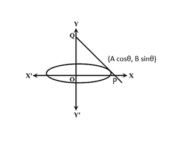

# 与坐标轴相切的椭圆形成的三角形的最小面积

> 原文:[https://www . geeksforgeeks . org/坐标轴椭圆任意切线形成的最小三角形面积/](https://www.geeksforgeeks.org/minimum-area-of-the-triangle-formed-by-any-tangent-to-an-ellipse-with-the-coordinate-axes/)

给定两个整数 **A** 和 **B** ，用方程**(x<sup>2</sup>/A<sup>2</sup>)+(y<sup>2</sup>/B<sup>2</sup>)= 1 表示椭圆的[半长半短轴的长度，](https://www.geeksforgeeks.org/program-to-find-the-area-of-an-ellipse/)**任务是求椭圆任意切线形成的三角形的最小[面积](https://www.geeksforgeeks.org/how-to-find-the-area-of-a-triangle-using-javascript/)

**示例:**

> **输入:** A = 1，B = 2
> T3】输出: 2
> 
> **输入:** A = 2，B = 3
> T3】输出: 6

**进场:**

[](https://media.geeksforgeeks.org/wp-content/uploads/20210324160816/tangent-300x244.PNG)

这个想法是基于这样的观察:上图所示椭圆上坐标 **(A * cosθ，B * sinθ)** 处的切线方程为:

> **(x * cosθ / A) + (y * sinθ / B) = 1**

**P****Q**坐标分别为 **(A / cosθ，0)****(0，B / sinθ)** 。
由椭圆的切线和坐标轴形成的三角形面积由下式给出:

> δOPQ 面积= 0.5 *基底*高度= 0.5 *(A/cosθ)*(B/sinθ)=(A * B)/(2 * sinθ*cosθ)=(A * B)/sin 2θ
> 
> 因此，面积= (A * B) / sin2θ — (1)

为了最小化面积， **sin2θ** 的值应该是最大可能值，即 1。
因此，最小可能面积是 **A * B** 。

下面是上述方法的实现:

## C++

```
// C++ program for the above approach
#include <bits/stdc++.h>
using namespace std;

// Function to find the minimum area
// of triangle formed by any tangent
// to ellipse with the coordinate axes
void minimumTriangleArea(int a, int b)
{
    // Stores the minimum area
    int area = a * b;

    // Print the calculated area
    cout << area;
}

// Driver Code
int main()
{
    int a = 1, b = 2;
    minimumTriangleArea(a, b);

    return 0;
}
```

## Java 语言(一种计算机语言，尤用于创建网站)

```
// Java program for the above approach
class GFG{

// Function to find the minimum area
// of triangle formed by any tangent
// to ellipse with the coordinate axes
static void minimumTriangleArea(int a, int b)
{

    // Stores the minimum area
    int area = a * b;

    // Print the calculated area
    System.out.println(area);
}

// Driver Code
public static void main(String[] args)
{
    int a = 1, b = 2;

    minimumTriangleArea(a, b);
}
}

// This code is contributed by AnkThon
```

## 蟒蛇 3

```
# Python3 program for the above approach

# Function to find the minimum area
# of triangle formed by any tangent
# to ellipse with the coordinate axes
def minimumTriangleArea(a, b):

    # Stores the minimum area
    area = a * b

    # Print the calculated area
    print(area)

# Driver Code
a = 1
b = 2

minimumTriangleArea(a, b)

# This code is contributed by rohitsingh07052
```

## C#

```
// C# program for the above approach
using System;

class GFG{

// Function to find the minimum area
// of triangle formed by any tangent
// to ellipse with the coordinate axes
static void minimumTriangleArea(int a, int b)
{

    // Stores the minimum area
    int area = a * b;

    // Print the calculated area
    Console.WriteLine(area);
}

// Driver Code
public static void Main()
{
    int a = 1, b = 2;

    minimumTriangleArea(a, b);
}
}

// This code is contributed by ukasp
```

## java 描述语言

```
// JavaScript program for the above approach

// Function to find the minimum area
// of triangle formed by any tangent
// to ellipse with the coordinate axes
function minimumTriangleArea(a, b)
{

    // Stores the minimum area
    var area = a * b

    // Print the calculated area
   console.log(area)

}

// Driver Code
var a = 1
var b = 2

minimumTriangleArea(a, b)

// This code is contributed by AnkThon
```

**Output**

```
2
```

***时间复杂度:**O(1)*
T5**辅助空间:** O(1)