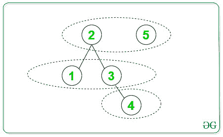

# 最小二分群

> 原文:[https://www.geeksforgeeks.org/minimum-bipartite-groups/](https://www.geeksforgeeks.org/minimum-bipartite-groups/)

给定从 **1 到 N** 的 **N** 个顶点的[图](https://www.geeksforgeeks.org/graph-data-structure-and-algorithms/)的[邻接表](https://www.geeksforgeeks.org/add-and-remove-vertex-in-adjacency-list-representation-of-graph/)表示，任务是计算给定图的最小二分群。

**示例:**

> **输入:** N = 5
> 下面是给定的图，节点数为 5:
> 
> 
> 
> **输出:** 3
> **说明:**
> 满足二部性的可能群:【2，5】、【1，3】、【4】
> 下面是可以形成的二部群的个数:
> 
> 

**方法:**
思路是在给定的 **N** 节点图中找到所有[连通分量](https://www.geeksforgeeks.org/connected-components-in-an-undirected-graph/)的最大高度，从而找到最小二部群。以下是步骤:

1.  对于给定图形中的所有非访问顶点，从当前顶点开始查找当前连接组件的高度。
2.  开始 [DFS 遍历](https://www.geeksforgeeks.org/depth-first-search-or-dfs-for-a-graph/)找到所有连接组件的高度。
3.  为所有连接组件计算的最大高度给出了所需的最小二分群。

下面是上述方法的实现:

## C++

```
#include <bits/stdc++.h>
using namespace std;

// Function to find the height sizeof
// the current component with vertex s
int height(int s, vector<int> adj[],
           int* visited)
{
    // Visit the current Node
    visited[s] = 1;
    int h = 0;

    // Call DFS recursively to find the
    // maximum height of current CC
    for (auto& child : adj[s]) {

        // If the node is not visited
        // then the height recursively
        // for next element
        if (visited[child] == 0) {
            h = max(h, 1 + height(child, adj,
                                  visited));
        }
    }
    return h;
}

// Function to find the minimum Groups
int minimumGroups(vector<int> adj[], int N)
{
    // Initialise with visited array
    int visited[N + 1] = { 0 };

    // To find the minimum groups
    int groups = INT_MIN;

    // Traverse all the non visited Node
    // and calculate the height of the
    // tree with current node as a head
    for (int i = 1; i <= N; i++) {

        // If the current is not visited
        // therefore, we get another CC
        if (visited[i] == 0) {
            int comHeight;
            comHeight = height(i, adj, visited);
            groups = max(groups, comHeight);
        }
    }

    // Return the minimum bipartite matching
    return groups;
}

// Function that adds the current edges
// in the given graph
void addEdge(vector<int> adj[], int u, int v)
{
    adj[u].push_back(v);
    adj[v].push_back(u);
}

// Drivers Code
int main()
{
    int N = 5;

    // Adjacency List
    vector<int> adj[N + 1];

    // Adding edges to List
    addEdge(adj, 1, 2);
    addEdge(adj, 3, 2);
    addEdge(adj, 4, 3);

    cout << minimumGroups(adj, N);
}
```

## Java 语言(一种计算机语言，尤用于创建网站)

```
import java.util.*;

class GFG{

// Function to find the height sizeof
// the current component with vertex s
static int height(int s, Vector<Integer> adj[],
           int []visited)
{
    // Visit the current Node
    visited[s] = 1;
    int h = 0;

    // Call DFS recursively to find the
    // maximum height of current CC
    for (int  child : adj[s]) {

        // If the node is not visited
        // then the height recursively
        // for next element
        if (visited[child] == 0) {
            h = Math.max(h, 1 + height(child, adj,
                                  visited));
        }
    }
    return h;
}

// Function to find the minimum Groups
static int minimumGroups(Vector<Integer> adj[], int N)
{
    // Initialise with visited array
    int []visited= new int[N + 1];

    // To find the minimum groups
    int groups = Integer.MIN_VALUE;

    // Traverse all the non visited Node
    // and calculate the height of the
    // tree with current node as a head
    for (int i = 1; i <= N; i++) {

        // If the current is not visited
        // therefore, we get another CC
        if (visited[i] == 0) {
            int comHeight;
            comHeight = height(i, adj, visited);
            groups = Math.max(groups, comHeight);
        }
    }

    // Return the minimum bipartite matching
    return groups;
}

// Function that adds the current edges
// in the given graph
static void addEdge(Vector<Integer> adj[], int u, int v)
{
    adj[u].add(v);
    adj[v].add(u);
}

// Drivers Code
public static void main(String[] args)
{
    int N = 5;

    // Adjacency List
    Vector<Integer> []adj = new Vector[N + 1];
    for (int i = 0 ; i < N + 1; i++)
        adj[i] = new Vector<Integer>();

    // Adding edges to List
    addEdge(adj, 1, 2);
    addEdge(adj, 3, 2);
    addEdge(adj, 4, 3);

    System.out.print(minimumGroups(adj, N));
}
}

// This code is contributed by 29AjayKumar
```

## 蟒蛇 3

```
import sys

# Function to find the height sizeof
# the current component with vertex s
def height(s, adj, visited):

    # Visit the current Node
    visited[s] = 1
    h = 0

    # Call DFS recursively to find the
    # maximum height of current CC
    for child in adj[s]:

        # If the node is not visited
        # then the height recursively
        # for next element
        if (visited[child] == 0):
            h = max(h, 1 + height(child, adj,
                                  visited))

    return h

# Function to find the minimum Groups
def minimumGroups(adj, N):

    # Initialise with visited array
    visited = [0 for i in range(N + 1)]

    # To find the minimum groups
    groups = -sys.maxsize

    # Traverse all the non visited Node
    # and calculate the height of the
    # tree with current node as a head
    for i in range(1, N + 1):

        # If the current is not visited
        # therefore, we get another CC
        if (visited[i] == 0):
            comHeight = height(i, adj, visited)
            groups = max(groups, comHeight)

    # Return the minimum bipartite matching
    return groups

# Function that adds the current edges
# in the given graph
def addEdge(adj, u, v):

    adj[u].append(v)
    adj[v].append(u)

# Driver code   
if __name__=="__main__":

    N = 5

    # Adjacency List
    adj = [[] for i in range(N + 1)]

    # Adding edges to List
    addEdge(adj, 1, 2)
    addEdge(adj, 3, 2)
    addEdge(adj, 4, 3)

    print(minimumGroups(adj, N))

# This code is contributed by rutvik_56
```

## C#

```
using System;
using System.Collections.Generic;

class GFG{

// Function to find the height sizeof
// the current component with vertex s
static int height(int s, List<int> []adj,
           int []visited)
{
    // Visit the current Node
    visited[s] = 1;
    int h = 0;

    // Call DFS recursively to find the
    // maximum height of current CC
    foreach (int  child in adj[s]) {

        // If the node is not visited
        // then the height recursively
        // for next element
        if (visited[child] == 0) {
            h = Math.Max(h, 1 + height(child, adj,
                                  visited));
        }
    }
    return h;
}

// Function to find the minimum Groups
static int minimumGroups(List<int> []adj, int N)
{
    // Initialise with visited array
    int []visited= new int[N + 1];

    // To find the minimum groups
    int groups = int.MinValue;

    // Traverse all the non visited Node
    // and calculate the height of the
    // tree with current node as a head
    for (int i = 1; i <= N; i++) {

        // If the current is not visited
        // therefore, we get another CC
        if (visited[i] == 0) {
            int comHeight;
            comHeight = height(i, adj, visited);
            groups = Math.Max(groups, comHeight);
        }
    }

    // Return the minimum bipartite matching
    return groups;
}

// Function that adds the current edges
// in the given graph
static void addEdge(List<int> []adj, int u, int v)
{
    adj[u].Add(v);
    adj[v].Add(u);
}

// Drivers Code
public static void Main(String[] args)
{
    int N = 5;

    // Adjacency List
    List<int> []adj = new List<int>[N + 1];
    for (int i = 0 ; i < N + 1; i++)
        adj[i] = new List<int>();

    // Adding edges to List
    addEdge(adj, 1, 2);
    addEdge(adj, 3, 2);
    addEdge(adj, 4, 3);

    Console.Write(minimumGroups(adj, N));
}
}

// This code is contributed by Rajput-Ji
```

## java 描述语言

```
<script>

// Function to find the height sizeof
// the current component with vertex s
function height(s, adj, visited)
{
    // Visit the current Node
    visited[s] = 1;
    var h = 0;

    // Call DFS recursively to find the
    // maximum height of current CC
    adj[s].forEach(child => {

        // If the node is not visited
        // then the height recursively
        // for next element
        if (visited[child] == 0) {
            h = Math.max(h, 1 + height(child, adj,
                                  visited));
        }
    });
    return h;
}

// Function to find the minimum Groups
function minimumGroups(adj, N)
{
    // Initialise with visited array
    var visited = Array(N+1).fill(0);

    // To find the minimum groups
    var groups = -1000000000;

    // Traverse all the non visited Node
    // and calculate the height of the
    // tree with current node as a head
    for (var i = 1; i <= N; i++) {

        // If the current is not visited
        // therefore, we get another CC
        if (visited[i] == 0) {
            var comHeight;
            comHeight = height(i, adj, visited);
            groups = Math.max(groups, comHeight);
        }
    }

    // Return the minimum bipartite matching
    return groups;
}

// Function that adds the current edges
// in the given graph
function addEdge(adj, u, v)
{
    adj[u].push(v);
    adj[v].push(u);
}

// Drivers Code
var N = 5;

// Adjacency List
var adj = Array.from(Array(N+1), ()=>Array())

// Adding edges to List
addEdge(adj, 1, 2);
addEdge(adj, 3, 2);
addEdge(adj, 4, 3);

document.write( minimumGroups(adj, N));

</script>
```

**Output:** 

```
3
```

**时间复杂度:** O(V+E)，其中 V 为顶点数，E 为边集。
**辅助空间** : O(V)。