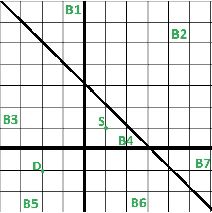

# 到达目的地的最小区块跳跃

> 原文:[https://www . geesforgeks . org/minimum-block-jumps-reach-destination/](https://www.geeksforgeeks.org/minimum-block-jumps-reach-destination/)

给定二维空间中的 N 条直线以及一个起点和终点。这 N 条线把空间分成几块。我们需要打印从起点到达目的地的最小跳跃次数。只有当它们共用一条边时，我们才能从一个街区跳到另一个街区。
示例:

```
Input : Lines = [x = 0, y = 0, x + y – 2 = 0]
        Start point = [1, 1], 
        Dest point  = [-2, -1]
Output : 2        
We need to jump 2 times (B4 -> B3 then B3 -> B5 
or B4 -> B6 then B6 -> B5) to reach destination 
point from starting point shown in below diagram. 
Each block i is given an id Bi in the diagram.


```

我们可以利用线和点的一个性质来解决这个问题，即如果我们把两个点放在线方程中，那么如果两个点位于线的同一侧，那么它们将具有相同的符号，即评估值的正-正或负-负，如果符号不同，即正-负，它们将位于线的不同侧。
现在我们可以使用上面的属性来解决这个问题，对于每一条线，我们将检查起点和终点是否在同一侧。如果他们躺在一条线的另一边，那么这条线必须跳过去才能靠得更近。如上图所示，起点和终点在 x+y–2 = 0 线的同一侧，因此该线不需要被跳过，其余两条线需要被跳过，因为两个点都在相对侧。
最后，我们将检查每条线的点评估符号，并且每当我们发现相反的符号时，我们将增加我们的跳转计数。这个问题的总时间复杂度将是线性的。

## C++

```
// C++ program to find minimum jumps to reach
// a given destination from a given source
#include <bits/stdc++.h>
using namespace std;

// To represent point in 2D space
struct point
{
    int x, y;
    point(int x, int y) : x(x), y(y)
    {}
};

// To represent line of (ax + by + c)format
struct line
{
    int a, b, c;
    line(int a, int b, int c) : a(a), b(b), c(c)
    {}
    line()
    {}
};

// Returns 1 if evaluation is greater > 0,
// else returns -1
int evalPointOnLine(point p, line curLine)
{
    int eval = curLine.a* p.x +
               curLine.b * p.y +
               curLine.c;
    if (eval > 0)
        return 1;
    return -1;
}

//  Returns minimum jumps to reach
//  dest point from start point
int minJumpToReachDestination(point start,
              point dest, line lines[], int N)
{
    int jumps = 0;
    for (int i = 0; i < N; i++)
    {
        // get sign of evaluation from point
        // co-ordinate and line equation
        int signStart = evalPointOnLine(start, lines[i]);
        int signDest = evalPointOnLine(dest, lines[i]);

        // if both evaluation are of opposite sign,
        // increase jump by 1
        if (signStart * signDest < 0)
            jumps++;
    }

    return jumps;
}

// Driver code to test above methods
int main()
{
    point start(1, 1);
    point dest(-2, -1);

    line lines[3];
    lines[0] = line(1, 0, 0);
    lines[1] = line(0, 1, 0);
    lines[2] = line(1, 1, -2);

    cout << minJumpToReachDestination(start, dest, lines, 3);

    return 0;
}
```

## Java 语言(一种计算机语言，尤用于创建网站)

```
// Java program to find minimum jumps to reach
// a given destination from a given source
class GFG
{

// To represent point in 2D space
static class point
{
    int x, y;

    public point(int x, int y) 
    {
        super();
        this.x = x;
        this.y = y;
    }

};

// To represent line of (ax + by + c)format
static class line
{
    public line(int a, int b, int c)
    {
        this.a = a;
        this.b = b;
        this.c = c;
    }

    int a, b, c;

    line()
    {}
};

// Returns 1 if evaluation is greater > 0,
// else returns -1
static int evalPointOnLine(point p, line curLine)
{
    int eval = curLine.a* p.x +
            curLine.b * p.y +
            curLine.c;
    if (eval > 0)
        return 1;
    return -1;
}

// Returns minimum jumps to reach
// dest point from start point
static int minJumpToReachDestination(point start,
            point dest, line lines[], int N)
{
    int jumps = 0;
    for (int i = 0; i < N; i++)
    {
        // get sign of evaluation from point
        // co-ordinate and line equation
        int signStart = evalPointOnLine(start, lines[i]);
        int signDest = evalPointOnLine(dest, lines[i]);

        // if both evaluation are of opposite sign,
        // increase jump by 1
        if (signStart * signDest < 0)
            jumps++;
    }

    return jumps;
}

// Driver code 
public static void main(String[] args)
{
    point start = new point(1, 1);
    point dest = new point(-2, -1);

    line []lines = new line[3];
    lines[0] = new line(1, 0, 0);
    lines[1] = new line(0, 1, 0);
    lines[2] = new line(1, 1, -2);

    System.out.print(minJumpToReachDestination(start, dest, lines, 3));
}
}

// This code is contributed by Rajput-Ji
```

## C#

```
// C# program to find minimum jumps to reach
// a given destination from a given source
using System;

class GFG
{

// To represent point in 2D space
class point
{
    public int x, y;

    public point(int x, int y) 
    {
        this.x = x;
        this.y = y;
    }

};

// To represent line of (ax + by + c)format
class line
{
    public int a, b, c; 
    line()
    {}
    public line(int a, int b, int c)
    {
        this.a = a;
        this.b = b;
        this.c = c;
    }
};

// Returns 1 if evaluation is greater > 0,
// else returns -1
static int evalPointOnLine(point p, line curLine)
{
    int eval = curLine.a* p.x +
            curLine.b * p.y +
            curLine.c;
    if (eval > 0)
        return 1;
    return -1;
}

// Returns minimum jumps to reach
// dest point from start point
static int minJumpToReachDestination(point start,
            point dest, line []lines, int N)
{
    int jumps = 0;
    for (int i = 0; i < N; i++)
    {
        // get sign of evaluation from point
        // co-ordinate and line equation
        int signStart = evalPointOnLine(start, lines[i]);
        int signDest = evalPointOnLine(dest, lines[i]);

        // if both evaluation are of opposite sign,
        // increase jump by 1
        if (signStart * signDest < 0)
            jumps++;
    }

    return jumps;
}

// Driver code 
public static void Main(String[] args)
{
    point start = new point(1, 1);
    point dest = new point(-2, -1);

    line []lines = new line[3];
    lines[0] = new line(1, 0, 0);
    lines[1] = new line(0, 1, 0);
    lines[2] = new line(1, 1, -2);

    Console.Write(minJumpToReachDestination(start, dest, lines, 3));
}
}

// This code is contributed by Rajput-Ji
```

**输出:**

```
2

```

本文由 **[乌卡什·特里维迪](https://in.linkedin.com/in/utkarsh-trivedi-253069a7)** 供稿。如果你喜欢 GeeksforGeeks 并想投稿，你也可以使用[contribute.geeksforgeeks.org](http://www.contribute.geeksforgeeks.org)写一篇文章或者把你的文章邮寄到 contribute@geeksforgeeks.org。看到你的文章出现在极客博客主页上，帮助其他极客。

如果你发现任何不正确的地方，或者你想分享更多关于上面讨论的话题的信息，请写评论。