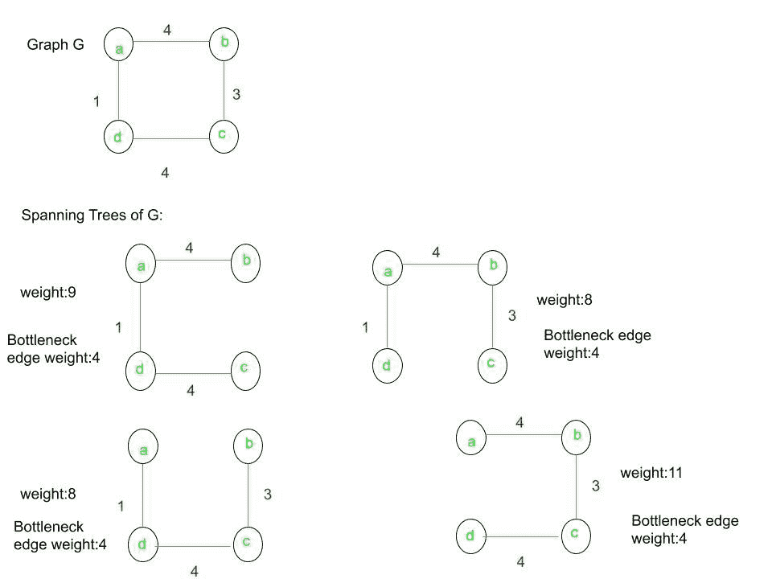
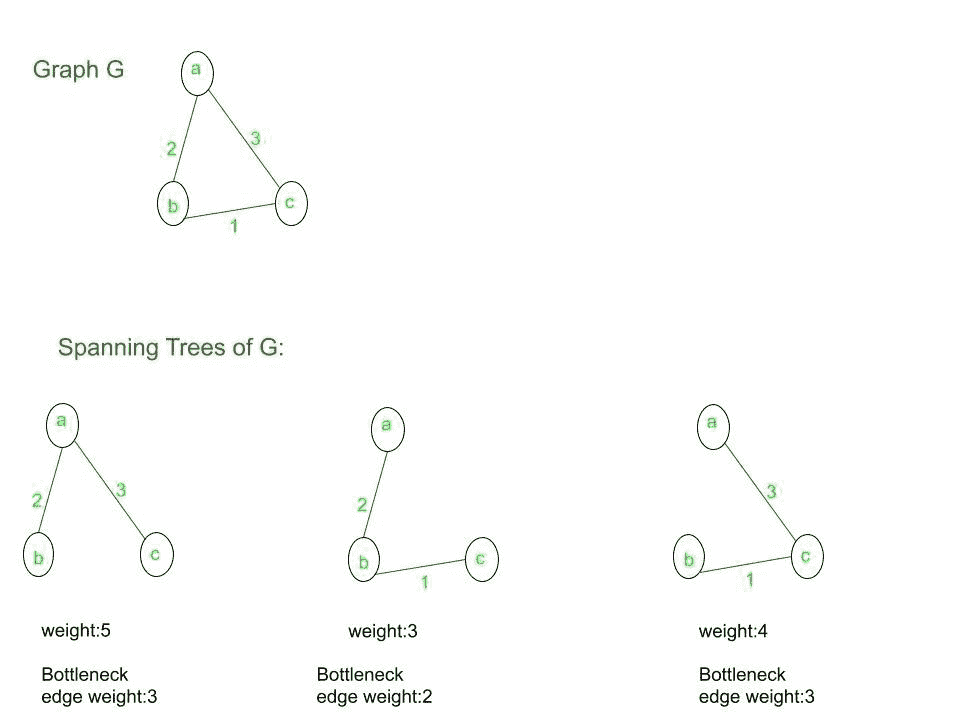

# 最小瓶颈生成树(MBST)

> 原文:[https://www . geesforgeks . org/minimum-瓶颈跨越-treembst/](https://www.geeksforgeeks.org/minimum-bottleneck-spanning-treembst/)

无向图中的最小瓶颈生成树是最昂贵边尽可能小的树。在本文中，我们将更多地了解如何识别最小瓶颈生成树，并了解每个最小生成树都是最小瓶颈生成树。

最小生成树与最小瓶颈生成树完全不同。生成树中的瓶颈是树中存在的最大权重边。同一生成树可能有许多瓶颈。让我们用下面的例子来理解这一点:

**例 1:** 给定图形为 **G** 。让我们找到所有可能的生成树。

对于给定的图 G，上图说明了给定图的所有生成树。在生成树中，最小生成树是权重为 8 的树。由于所有的生成树对于瓶颈边都具有相同的值，所以对于给定的图，所有的生成树都是**最小瓶颈生成树**。但是，它们都不是最小生成树，因为只有两个生成树的总权重是最小的(8)。

**例 2:** 让给定的图为 g，让我们找出所有可能的生成树。

对于给定的图 G，上图说明了给定图的所有生成树。在生成树中，最小生成树的权重为 3。图的最小瓶颈生成树是瓶颈边权重为 3 的树。这里，最小生成树是最小瓶颈生成树，但不是所有的最小瓶颈生成树都是最小生成树。

**证明每个最小生成树都是最小瓶颈生成树:**假设 T 是图 G(V，E)的最小生成树，T’是它的最小瓶颈生成树。考虑 T 和 T’(瓶颈边)的最大权重边。那么，有三种可能的情况:

1.  **情况 1:** 如果两条边恰好是同一条边。那么，T 是一个最小瓶颈生成树(即每个 MST 都是一个 MBST)，由于 g 的任意选择。
2.  **情况 2:** 如果两条边恰好是不同的边，那么 T’的权重不可能大于 T 中的最大加权边，因为 T’是 MBST。
3.  **情况 3:** 我们假设 T 有一个最大权重边(p，q)，其权重大于瓶颈生成树 T’的权重。然后:
    *   设 X 是 T 中 V 的顶点的子集，不经过 q 就可以从 p 到达。
    *   类似地，设 Y 是 T 中 V 的顶点子集，可以从 q 不经过 p 到达。
    *   由于 G 是一个连通图，所以在 X 和 y 之间应该有一条[割边](https://www.geeksforgeeks.org/articulation-points-or-cut-vertices-in-a-graph/)，在这条割边上唯一可以添加的边是最小权重的边。
    *   但是，通过定义 X 和 Y 的方式，我们知道(p，q)是最小权重的唯一可能的切割边。
    *   然而，我们有一个瓶颈生成树 T’，它的权重小于 w(p，q)。
    *   这是一个矛盾，因为瓶颈生成树本身就是一个生成树，它必须有一个跨越这个切口的边。而且，它的重量比 w(p，q)小。
    *   所以，假设是错误的，唯一的可能是 T 和 T’(瓶颈边)的最大权重边是相同的。
    *   然后，通过案例 1，证明已经完成，因此已经表明每个 MST 都是 MBST。