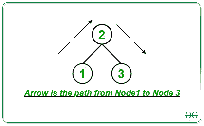

# 到达第 n 个城市所需通过的最小桥梁数

> 原文:[https://www . geesforgeks . org/minimum-bridges-需要穿越才能到达的第 n 个城市/](https://www.geeksforgeeks.org/minimum-bridges-required-to-be-crossed-to-reach-nth-city/)

给定一个整数 **N** 表示相连城市的数量(*从 **1** 到 **N*** )和一个 [2D 数组](https://www.geeksforgeeks.org/multidimensional-arrays-c-cpp/) **arr[][]** 由通过双向桥相互连接的对组成。任务是找到从城市 **1** 到达城市 **N** 所需的最小桥梁数量。

**示例:**

> **输入:** N = 3，M = 2，arr[][] = {{1，2}，{2，3}}
> 
> [](https://media.geeksforgeeks.org/wp-content/uploads/20210203165232/ConnectedCities.jpg)
> 
> **输出:** 2
> **说明:**
> 从节点 1 到达节点 2，需要通过 1 座桥。
> 要从节点 2 到达节点 3，需要穿过 1 座桥。
> 因此，需要连接两个桥。
> 
> **输入:** N = 4，M = 3，arr[][] = {{1，2}，{2，3}，{2，4 } }
> T3】输出: 2

**方法:**按照以下步骤解决问题:

*   初始化一个[邻接表](https://www.geeksforgeeks.org/graph-and-its-representations/)来建立和存储[图](https://www.geeksforgeeks.org/graph-data-structure-and-algorithms/)节点。
*   初始化一个[数组](https://www.geeksforgeeks.org/array-data-structure/)，称大小为 **N** 的**vis【】**来标记访问的节点，另一个数组称大小为 **N** 的**dist【】**来存储到城市的最小距离 **1** 。
*   执行 **BFS** 并使用[单源最短路径](https://www.geeksforgeeks.org/shortest-path-unweighted-graph/)的概念遍历图形并存储从城市 **1** 到达每个城市所需跨越的最小桥梁数。
*   将**距离**的值打印为从城市 **1** 到达城市 **N** 的最小距离。

下面是上述方法的实现:

## C++

```
// C++ program for the above approach

#include <bits/stdc++.h>
using namespace std;

// Adjacency list to store graph
vector<int> g[10001];

// Stores info about visited nodes
int vis[10001];

// Stores distance of nodes
// from the source node
int dist[10001];

// Function for BFS traversal
void BFS(int src)
{
    // Stores the nodes
    queue<int> q;

    // Push the source node
    q.push(src);

    // Mark the pushed node visited
    vis[src] = 1;

    // Source node is always at dist 0
    dist[src] = 0;

    // Iterate until queue is not empty
    while (!q.empty()) {

        // Update the current node
        int curr = q.front();

        // Pop the node after
        // update by curr
        q.pop();

        // Traverse every node of
        // the adjacency list
        for (auto child : g[curr]) {
            if (vis[child] == 0) {

                // Push the child node
                // if its not visited
                q.push(child);

                // Update the distance of next level
                // nodes as it can be accessed by the
                // previous node in BFS
                dist[child] = dist[curr] + 1;

                // Mark the child node as visited
                vis[child] = 1;
            }
        }
    }
}

// Function to build the graph
void buildGraph(int M, int arr[][2])
{
    for (int i = 0; i < M; i++) {
        g[arr[i][0]].push_back(arr[i][1]);
        g[arr[i][1]].push_back(arr[i][0]);
    }
}

// Function to print the distance between from
// city 1 to city N
void shortestDistance(int N, int M, int arr[][2])
{
    // Build graph
    buildGraph(M, arr);

    // Perform BFS traversal
    BFS(1);

    // Print the shortest distance
    cout << dist[N];
}

// Driver Code
int main()
{
    // Given number of Nodes & Edges
    int N = 3, M = 2;

    // Given pairs of edges
    int arr[][2] = { { 1, 2 }, { 2, 3 } };

    // Function Call
    shortestDistance(N, M, arr);
}
```

## Java 语言(一种计算机语言，尤用于创建网站)

```
// Java program for the above approach
import java.util.*;
class GFG
{

// Adjacency list to store graph
static Vector<Integer> []g = new Vector[10001];

// Stores info about visited nodes
static int []vis = new int[10001];

// Stores distance of nodes
// from the source node
static int []dist = new int[10001];
static {
    for(int i = 0; i < g.length; i++)
    {
        g[i] = new Vector<>();
    }
}

// Function for BFS traversal
static void BFS(int src)
{

    // Stores the nodes
    Queue<Integer> q = new LinkedList<>();

    // Push the source node
    q.add(src);

    // Mark the pushed node visited
    vis[src] = 1;

    // Source node is always at dist 0
    dist[src] = 0;

    // Iterate until queue is not empty
    while (!q.isEmpty()) {

        // Update the current node
        int curr = q.peek();

        // Pop the node after
        // update by curr
        q.remove();

        // Traverse every node of
        // the adjacency list
        for (int child : g[curr]) {
            if (vis[child] == 0) {

                // Push the child node
                // if its not visited
                q.add(child);

                // Update the distance of next level
                // nodes as it can be accessed by the
                // previous node in BFS
                dist[child] = dist[curr] + 1;

                // Mark the child node as visited
                vis[child] = 1;
            }
        }
    }
}

// Function to build the graph
static void buildGraph(int M, int arr[][])
{
    for (int i = 0; i < M; i++) {
        g[arr[i][0]].add(arr[i][1]);
        g[arr[i][1]].add(arr[i][0]);
    }
}

// Function to print the distance between from
// city 1 to city N
static void shortestDistance(int N, int M, int arr[][])
{

    // Build graph
    buildGraph(M, arr);

    // Perform BFS traversal
    BFS(1);

    // Print the shortest distance
    System.out.print(dist[N]);
}

// Driver Code
public static void main(String[] args)
{

    // Given number of Nodes & Edges
    int N = 3, M = 2;

    // Given pairs of edges
    int arr[][] = { { 1, 2 }, { 2, 3 } };

    // Function Call
    shortestDistance(N, M, arr);
}
}

// This code is contributed by shikhasingrajput.
```

## 蟒蛇 3

```
# Python 3 program for the above approach

# Adjacency list to store graph
g = [[] for i in range(10001)]

# Stores info about visited nodes
vis = [0 for i in range(10001)]

# Stores distance of nodes
# from the source node
dist = [0 for i in range(10001)]

# Function for BFS traversal
def BFS(src):
    global vis
    global dist
    global g

    # Stores the nodes
    q = []

    # Push the source node
    q.append(src)

    # Mark the pushed node visited
    vis[src] = 1

    # Source node is always at dist 0
    dist[src] = 0

    # Iterate until queue is not empty
    while (len(q)):

        # Update the current node
        curr = q[0]

        # Pop the node after
        # update by curr
        q.remove(q[0])

        # Traverse every node of
        # the adjacency list
        for child in g[curr]:
            if (vis[child] == 0):

                # Push the child node
                # if its not visited
                q.append(child)

                # Update the distance of next level
                # nodes as it can be accessed by the
                # previous node in BFS
                dist[child] = dist[curr] + 1

                # Mark the child node as visited
                vis[child] = 1

# Function to build the graph
def buildGraph(M, arr):
    global g
    for i in range(M):
        g[arr[i][0]].append(arr[i][1])
        g[arr[i][1]].append(arr[i][0])

# Function to print the distance between from
# city 1 to city N
def shortestDistance(N, M, arr):

    # Build graph
    buildGraph(M, arr)

    # Perform BFS traversal
    BFS(1)

    # Print the shortest distance
    print(dist[N])

# Driver Code
if __name__ == '__main__':

    # Given number of Nodes & Edges
    N = 3
    M = 2

    # Given pairs of edges
    arr =  [[1, 2], [2, 3]]

    # Function Call
    shortestDistance(N, M, arr)

    # This code is contributed by SURENDRA_GANGWAR.
```

## C#

```
// C# program for the above approach
using System;
using System.Collections.Generic;

public class GFG
{

// Adjacency list to store graph
static List<int> []g = new List<int>[10001];

// Stores info about visited nodes
static int []vis = new int[10001];

// Stores distance of nodes
// from the source node
static int []dist = new int[10001];

// Function for BFS traversal
static void BFS(int src)
{

    // Stores the nodes
    Queue<int> q = new Queue<int>();

    // Push the source node
    q.Enqueue(src);

    // Mark the pushed node visited
    vis[src] = 1;

    // Source node is always at dist 0
    dist[src] = 0;

    // Iterate until queue is not empty
    while (q.Count!=0) {

        // Update the current node
        int curr = q.Peek();

        // Pop the node after
        // update by curr
        q.Dequeue();

        // Traverse every node of
        // the adjacency list
        foreach (int child in g[curr]) {
            if (vis[child] == 0) {

                // Push the child node
                // if its not visited
                q.Enqueue(child);

                // Update the distance of next level
                // nodes as it can be accessed by the
                // previous node in BFS
                dist[child] = dist[curr] + 1;

                // Mark the child node as visited
                vis[child] = 1;
            }
        }
    }
}

// Function to build the graph
static void buildGraph(int M, int [,]arr)
{
    for (int i = 0; i < M; i++) {
        g[arr[i,0]].Add(arr[i,1]);
        g[arr[i,1]].Add(arr[i,0]);
    }
}

// Function to print the distance between from
// city 1 to city N
static void shortestDistance(int N, int M, int [,]arr)
{

    // Build graph
    buildGraph(M, arr);

    // Perform BFS traversal
    BFS(1);

    // Print the shortest distance
    Console.Write(dist[N]);
}

// Driver Code
public static void Main(String[] args)
{

    // Given number of Nodes & Edges
    int N = 3, M = 2;

    // Given pairs of edges
    int [,]arr = { { 1, 2 }, { 2, 3 } };

    for(int i = 0; i < g.Length; i++)
    {
        g[i] = new List<int>();
    }
    // Function Call
    shortestDistance(N, M, arr);
}
}

// This code is contributed by shikhasingrajput
```

## java 描述语言

```
<script>

// JavaScript program for the above approach

// Adjacency list to store graph
var g = Array.from(Array(10001), ()=>new Array());;

// Stores info about visited nodes
var vis = Array(10001).fill(false);

// Stores distance of nodes
// from the source node
var dist = Array(10001).fill(0);

// Function for BFS traversal
function BFS(src)
{
    // Stores the nodes
    var q = [];

    // Push the source node
    q.push(src);

    // Mark the pushed node visited
    vis[src] = 1;

    // Source node is always at dist 0
    dist[src] = 0;

    // Iterate until queue is not empty
    while (q.length!=0) {

        // Update the current node
        var curr = q[0];

        // Pop the node after
        // update by curr
        q.shift();

        // Traverse every node of
        // the adjacency list
        g[curr].forEach(child => {
              if (vis[child] == 0) {

                // Push the child node
                // if its not visited
                q.push(child);

                // Update the distance of next level
                // nodes as it can be accessed by the
                // previous node in BFS
                dist[child] = dist[curr] + 1;

                // Mark the child node as visited
                vis[child] = 1;
            }
        });

    }
}

// Function to build the graph
function buildGraph(M, arr)
{
    for (var i = 0; i < M; i++) {
        g[arr[i][0]].push(arr[i][1]);
        g[arr[i][1]].push(arr[i][0]);
    }
}

// Function to print the distance between from
// city 1 to city N
function shortestDistance(N, M, arr)
{
    // Build graph
    buildGraph(M, arr);

    // Perform BFS traversal
    BFS(1);

    // Print the shortest distance
    document.write( dist[N]);
}

// Driver Code
// Given number of Nodes & Edges
var N = 3, M = 2;

// Given pairs of edges
var arr = [ [ 1, 2 ], [ 2, 3 ] ];

// Function Call
shortestDistance(N, M, arr);

</script>
```

**Output:** 

```
2
```

***时间复杂度:**O(N)*
T5**辅助空间:** O(N)