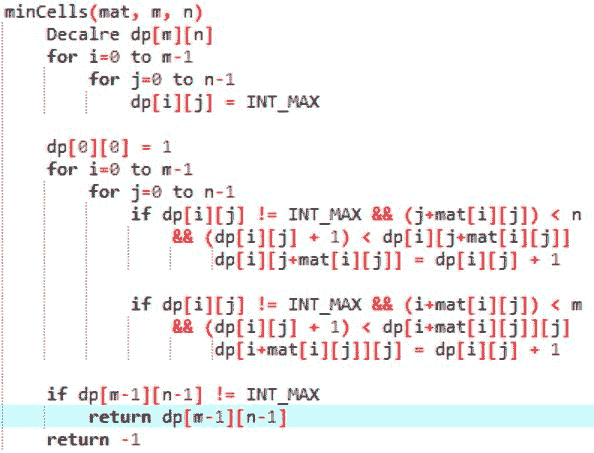

# 到达目的地所需的最小信元，其跳跃等于信元值

> 原文:[https://www . geesforgeks . org/minimum-cells-required-reach-destination-jumps-equal-cell-values/](https://www.geeksforgeeks.org/minimum-cells-required-reach-destination-jumps-equal-cell-values/)

给定一个包含正整数的 m×n 矩阵 mat[][]。问题是通过遵循给定的约束从单元(0，0)到达单元(m-1，n-1)。只有当移动到矩阵边界内的单元格时，才能从单元格(I，j)向右(在同一行中)或向下(在同一列中)移动“恰好”距离“mat[i][j]”。
例如:给定 mat[1][1] = 4，那么只有当 mat[1][5]和 mat[5][1]中的细胞存在于矩阵中时，才能移动到这些细胞。在约束之后，检查是否可以从(0，0)到达单元(m-1，n-1)。1 如果可以达到，则打印移动过程中需要覆盖的最小单元数，否则打印“-1”。
示例:

```
Input : mat[][] = { {2, 3, 2, 1, 4},
                    {3, 2, 5, 8, 2},
                    {1, 1, 2, 2, 1}  }
Output : 4
The movement and cells covered are as follows:
(0, 0)->(0, 2)
          |
        (2, 2)->(2, 4)

Input : mat[][] = { {2, 4, 2},
                {5, 3, 8},
            {1, 1, 1} }
Output : 3
```

**算法:**下面给出一种动态规划方法:



以下是上述方法的实现:

## C++

```
// C++ implementation to count minimum cells required
// to be covered to reach destination
#include <bits/stdc++.h>

using namespace std;

#define SIZE 100

// function to count minimum cells required
// to be covered to reach destination
int minCells(int mat[SIZE][SIZE], int m, int n)
{
    // to store min cells required to be
    // covered to reach a particular cell
    int dp[m][n];

    // initially no cells can be reached
    for (int i = 0; i < m; i++)
        for (int j = 0; j < n; j++)
            dp[i][j] = INT_MAX;

    // base case
    dp[0][0] = 1;

    // building up the dp[][] matrix
    for (int i = 0; i < m; i++) {
        for (int j = 0; j < n; j++) {

            // dp[i][j] != INT_MAX denotes that cell (i, j)
            // can be reached from cell (0, 0) and the other
            // half of the condition finds the cell on the
            // right that can be reached from (i, j)
            if (dp[i][j] != INT_MAX && (j + mat[i][j]) < n
                && (dp[i][j] + 1) < dp[i][j + mat[i][j]])
                dp[i][j + mat[i][j]] = dp[i][j] + 1;

            // the other half of the condition finds the cell
            // right below that can be reached from (i, j)
            if (dp[i][j] != INT_MAX && (i + mat[i][j]) < m
                && (dp[i][j] + 1) < dp[i + mat[i][j]][j])
                dp[i + mat[i][j]][j] = dp[i][j] + 1;
        }
    }

    // it true then cell (m-1, n-1) can be reached
    // from cell (0, 0) and returns the minimum
    // number of cells covered
    if (dp[m - 1][n - 1] != INT_MAX)
        return dp[m - 1][n - 1];

    // cell (m-1, n-1) cannot be reached from
    // cell (0, 0)
    return -1;
}

// Driver program to test above
int main()
{
    int mat[SIZE][SIZE] = { { 2, 3, 2, 1, 4 },
                            { 3, 2, 5, 8, 2 },
                            { 1, 1, 2, 2, 1 } };

    int m = 3, n = 5;
    cout << "Minimum number of cells = "
         << minCells(mat, m, n);

    return 0;
}
```

## Java 语言(一种计算机语言，尤用于创建网站)

```
// Java implementation to count minimum
// cells required to be covered to reach
// destination
class MinCellsDestination
{
    static final int SIZE=100;

    // function to count minimum cells required
    // to be covered to reach destination
    static int minCells(int mat[][], int m, int n)
    {
        // to store min cells required to be
        // covered to reach a particular cell
        int dp[][] = new int[m][n];

        // initially no cells can be reached
        for (int i = 0; i < m; i++)
            for (int j = 0; j < n; j++)
                dp[i][j] = Integer.MAX_VALUE;

        // base case
        dp[0][0] = 1;

        // building up the dp[][] matrix
        for (int i = 0; i < m; i++) {
            for (int j = 0; j < n; j++) {

                // dp[i][j] != INT_MAX denotes that cell
                // (i, j) can be reached from cell (0, 0)
                // and the other half of the condition
                // finds the cell on the right that can
                // be reached from (i, j)
                if (dp[i][j] != Integer.MAX_VALUE &&
                   (j + mat[i][j]) < n && (dp[i][j] + 1)
                   < dp[i][j + mat[i][j]])
                    dp[i][j + mat[i][j]] = dp[i][j] + 1;

                // the other half of the condition finds
                // the cell right below that can be
                // reached from (i, j)
                if (dp[i][j] != Integer.MAX_VALUE &&
                   (i + mat[i][j]) < m && (dp[i][j] + 1)
                   < dp[i + mat[i][j]][j])
                    dp[i + mat[i][j]][j] = dp[i][j] + 1;
            }
        }

        // it true then cell (m-1, n-1) can be reached
        // from cell (0, 0) and returns the minimum
        // number of cells covered
        if (dp[m - 1][n - 1] != Integer.MAX_VALUE)
            return dp[m - 1][n - 1];

        // cell (m-1, n-1) cannot be reached from
        // cell (0, 0)
        return -1;
    }

    // Driver code
    public static void main(String args[])
    {
         int mat[][] = { { 2, 3, 2, 1, 4 },
                         { 3, 2, 5, 8, 2 },
                         { 1, 1, 2, 2, 1 }};

        int m = 3, n = 5;
        System.out.println("Minimum number of cells" +
                          " = " + minCells(mat, m, n));
    }
}
/* This code is contributed by Danish Kaleem */
```

## 蟒蛇 3

```
# Python3 implementation to count minimum cells required
# to be covered to reach destination
SIZE=100
MAX=10000000
# function to count minimum cells required
# to be covered to reach destination
def minCells( mat,  m,  n):
    # to store min cells required to be
    # covered to reach a particular cell
    dp=[[MAX for i in range(n)]for i in range(m)]

    # initially no cells can be reached

    # base case
    dp[0][0] = 1

    # building up the dp[][] matrix
    for i in range(m):
        for j in range(n): 
            # dp[i][j] != MAX denotes that cell (i, j)
            # can be reached from cell (0, 0) and the other
            # half of the condition finds the cell on the
            # right that can be reached from (i, j)
            if (dp[i][j] != MAX and
             (j + mat[i][j]) < n and
             (dp[i][j] + 1) < dp[i][j + mat[i][j]]):
                dp[i][j + mat[i][j]] = dp[i][j] + 1

            # the other half of the condition finds the cell
            # right below that can be reached from (i, j)
            if (dp[i][j] != MAX and (i + mat[i][j]) < m
                and (dp[i][j] + 1) < dp[i + mat[i][j]][j]):
                dp[i + mat[i][j]][j] = dp[i][j] + 1

    # it true then cell (m-1, n-1) can be reached
    # from cell (0, 0) and returns the minimum
    # number of cells covered
    if (dp[m - 1][n - 1] != MAX):
        return dp[m - 1][n - 1]

    # cell (m-1, n-1) cannot be reached from
    # cell (0, 0)
    return -1

# Driver program to test above
mat= [ [ 2, 3, 2, 1, 4 ],
       [ 3, 2, 5, 8, 2 ],
       [ 1, 1, 2, 2, 1 ]]

m = 3
n = 5
print("Minimum number of cells = ",
     minCells(mat, m, n))
#this code is contributed by sahilshelangia
```

## C#

```
// C# implementation to count minimum
// cells required to be covered to reach
// destination
using System;

class GFG {

    //static int SIZE=100;

    // function to count minimum cells required
    // to be covered to reach destination
    static int minCells(int [,]mat, int m, int n)
    {

        // to store min cells required to be
        // covered to reach a particular cell
        int [,]dp = new int[m,n];

        // initially no cells can be reached
        for (int i = 0; i < m; i++)
            for (int j = 0; j < n; j++)
                dp[i,j] = int.MaxValue;

        // base case
        dp[0,0] = 1;

        // building up the dp[][] matrix
        for (int i = 0; i < m; i++) {
            for (int j = 0; j < n; j++) {

                // dp[i][j] != INT_MAX denotes that
                // cell (i, j) can be reached from
                // cell (0, 0) and the other half
                // of the condition finds the cell
                // on the right that can be reached
                // from (i, j)
                if (dp[i,j] != int.MaxValue &&
                (j + mat[i,j]) < n && (dp[i,j] + 1)
                < dp[i,j + mat[i,j]])
                    dp[i,j + mat[i,j]] = dp[i,j] + 1;

                // the other half of the condition
                // finds the cell right below that
                // can be reached from (i, j)
                if (dp[i,j] != int.MaxValue &&
                (i + mat[i,j]) < m && (dp[i,j] + 1)
                < dp[i + mat[i,j],j])
                    dp[i + mat[i,j],j] = dp[i,j] + 1;
            }
        }

        // it true then cell (m-1, n-1) can be
        // reached from cell (0, 0) and returns
        // the minimum number of cells covered
        if (dp[m - 1,n - 1] != int.MaxValue)
            return dp[m - 1,n - 1];

        // cell (m-1, n-1) cannot be reached from
        // cell (0, 0)
        return -1;
    }

    // Driver code
    public static void Main()
    {
        int [,]mat = { { 2, 3, 2, 1, 4 },
                       { 3, 2, 5, 8, 2 },
                       { 1, 1, 2, 2, 1 } };

        int m = 3, n = 5;
        Console.WriteLine("Minimum number of "
            + "cells = " + minCells(mat, m, n));
    }
}

// This code is contributed by anuj_67.
```

## 服务器端编程语言（Professional Hypertext Preprocessor 的缩写）

```
<?php
// PHP implementation to count
// minimum cells required to be
// covered to reach destination

// function to count minimum
// cells required to be
// covered to reach destination
function minCells( $mat, $m, $n)
{

    // to store min cells
    // required to be
    // covered to reach
    // a particular cell
    $dp =array(array());

    // initially no cells
    // can be reached
    for($i = 0; $i < $m; $i++)
        for($j = 0; $j < $n; $j++)
            $dp[$i][$j] = PHP_INT_MAX;

    // base case
    $dp[0][0] = 1;

    // building up the dp[][] matrix
    for($i = 0; $i < $m; $i++)
    {
        for($j = 0; $j < $n; $j++)
        {

            // dp[i][j] != INT_MAX
            // denotes that cell (i, j)
            // can be reached from cell
            // (0, 0) and the other half
            // of the condition finds the
            // cell on the right that can
            // be reached from (i, j)
            if ($dp[$i][$j] != PHP_INT_MAX and
                        ($j + $mat[$i][$j]) <$n
                         and ($dp[$i][$j] + 1) <
                     $dp[$i][$j + $mat[$i][$j]])

                $dp[$i][$j + $mat[$i][$j]] =
                           $dp[$i][$j] + 1;

            // the other half of the
            // condition finds the cell
            // right below that can be
            // reached from (i, j)
            if ($dp[$i][$j] != PHP_INT_MAX and
                      ($i + $mat[$i][$j]) < $m
                      and ($dp[$i][$j] + 1) <
                      $dp[$i +$mat[$i][$j]][$j])

                $dp[$i + $mat[$i][$j]][$j] = $dp[$i][$j] + 1;
        }
    }

    // it true then cell
    // (m-1, n-1) can be reached
    // from cell (0, 0) and
    // returns the minimum
    // number of cells covered
    if ($dp[$m - 1][$n - 1] != PHP_INT_MAX)
        return $dp[$m - 1][$n - 1];

    // cell (m-1, n-1) cannot
    // be reached from
    // cell (0, 0)
    return -1;
}

    // Driver Code
    $mat = array(array(2, 3, 2, 1, 4),
                 array(3, 2, 5, 8, 2),
                 array(1, 1, 2, 2, 1));

    $m = 3; $n = 5;
    echo "Minimum number of cells = "
        , minCells($mat, $m, $n);

// This code is contributed by anuj_67.
?>
```

## java 描述语言

```
<script>
// Javascript implementation to count minimum
// cells required to be covered to reach
// destination

let SIZE=100;

    // function to count minimum cells required
    // to be covered to reach destination
    function minCells(mat, m, n)
    {
        // to store min cells required to be
        // covered to reach a particular cell
        let dp = new Array(m);

        // Loop to create 2D array using 1D array
        for (var i = 0; i < dp.length; i++) {
            dp[i] = new Array(2);
        }

        // initially no cells can be reached
        for (let i = 0; i < m; i++)
            for (let j = 0; j < n; j++)
                dp[i][j] = Number.MAX_VALUE;

        // base case
        dp[0][0] = 1;

        // building up the dp[][] matrix
        for (let i = 0; i < m; i++) {
            for (let j = 0; j < n; j++) {

                // dp[i][j] != LET_MAX denotes that cell
                // (i, j) can be reached from cell (0, 0)
                // and the other half of the condition
                // finds the cell on the right that can
                // be reached from (i, j)
                if (dp[i][j] != Number.MAX_VALUE &&
                   (j + mat[i][j]) < n && (dp[i][j] + 1)
                   < dp[i][j + mat[i][j]])
                    dp[i][j + mat[i][j]] = dp[i][j] + 1;

                // the other half of the condition finds
                // the cell right below that can be
                // reached from (i, j)
                if (dp[i][j] != Number.MAX_VALUE &&
                   (i + mat[i][j]) < m && (dp[i][j] + 1)
                   < dp[i + mat[i][j]][j])
                    dp[i + mat[i][j]][j] = dp[i][j] + 1;
            }
        }

        // it true then cell (m-1, n-1) can be reached
        // from cell (0, 0) and returns the minimum
        // number of cells covered
        if (dp[m - 1][n - 1] != Number.MAX_VALUE)
            return dp[m - 1][n - 1];

        // cell (m-1, n-1) cannot be reached from
        // cell (0, 0)
        return -1;
    }

// driver function

        let mat = [[ 2, 3, 2, 1, 4 ],
                         [ 3, 2, 5, 8, 2 ],
                         [ 1, 1, 2, 2, 1 ]];

        let m = 3, n = 5;
        document.write("Minimum number of cells" +
                          " = " + minCells(mat, m, n));

</script>   
```

**输出:**

```
Minimum number of cells = 4
```

时间复杂度:O(m*n)
辅助空间:O(m*n)
本文由**阿育什·乔哈里**供稿。如果你喜欢 GeeksforGeeks 并想投稿，你也可以使用[write.geeksforgeeks.org](https://write.geeksforgeeks.org)写一篇文章或者把你的文章邮寄到 contribute@geeksforgeeks.org。看到你的文章出现在极客博客主页上，帮助其他极客。
如果发现有不正确的地方，或者想分享更多关于上述话题的信息，请写评论。