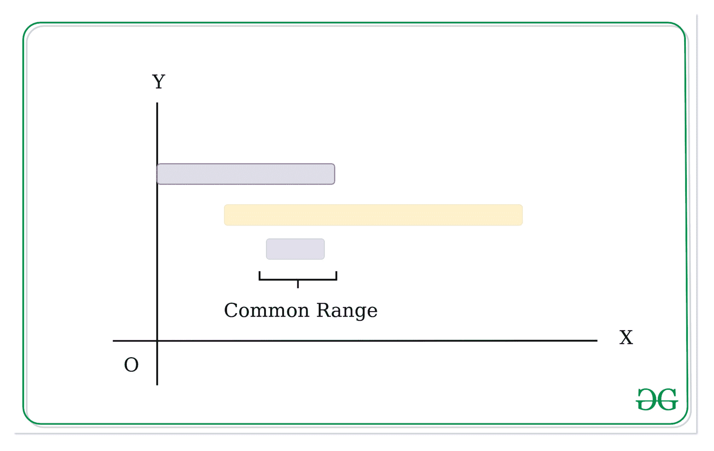

# 给定值的最小变化，使其位于所有给定范围内

> 原文:[https://www . geeksforgeeks . org/给定值变动最小，因此它位于所有给定范围内/](https://www.geeksforgeeks.org/minimum-change-in-given-value-so-that-it-lies-in-all-given-ranges/)

给定一个长度为 **N** 的范围**arr【】**和一个数字 **D** 的数组，任务是找到数字 D 应该改变的最小量，使得 D 位于给定数组的每个范围内。这里一个范围由两个整数组成**【开始，结束】**和 D，如果**开始≤ D ≤结束**，则称 D 在范围内。

**示例:**

> **输入:** N = 3，D = 3
> arr[] = {{0，7}，{2，14}，{4，6}}
> **输出:** 1
> **解释:**
> 这里如果我们将 D 增加 1，那么它将在开始≤ D ≤结束的每个范围内。
> 
> **输入:** N = 2，D = 2
> arr[] = {{1，2}，{3，2}}
> **输出:** 0
> **说明:**
> 这里的 D = 2 已经在开始≤ D ≤结束的每个范围内。

**接近**:

*   遍历范围数组，找到**开始【I】**的最大值和**结束【I】**的最小值，最终的 **max_start** 和 **min_end** 将显示给定范围数组的公共范围。
*   检查 D 是否已经在最大开始和最小结束计算范围内。
    1.  如果 D 已经在该范围内，则最小差值为 0。
    2.  否则，从最大开始和最小结束中找出最接近 D 的值

```
min(abs(D - max_start), abs(D - min_end))
```



以下是上述方法的代码:

## C++

```
// C++ implementation find the minimum
// difference in the number D such that
// D is inside of every range

#include <bits/stdc++.h>
using namespace std;

// Function to find the minimum
// difference in the number D such that
// D is inside of every range
void findMinimumOperation(int n, int d,
                      int arrays[3][2]){
    int cnt = 0;
    int first = INT_MIN, end = INT_MAX;

    // Loop to find the common range out
    // of the given array of ranges.
    while (n--) {

        // Storing the start and end index
        int arr[2] = { arrays[cnt][0],
                        arrays[cnt][1] };

        // Sorting the range
        sort(arr, arr + 2);

        // Finding the maximum starting
        // value of common segment
        first = max(first, arr[0]);

        // Finding the minimum ending
        // value of common segment
        end = min(end, arr[1]);
        cnt++;
    }

    // If there is no common segment
    if (first > end)
        cout << "-1";

    else {

        // If the given number is between
        // the computed common range.
        if (d >= first && d <= end) {
            cout << "0";
        }

        // Finding the minimum distance
        else
            cout << min(abs(first - d),
                          abs(d - end));
    }
}

// Driver Code
int main()
{
    int n = 3, d = 3;

    // Given array of ranges
    int arrays[3][2] = {
        { 0, 7 },
        { 2, 14 },
        { 4, 6 }
    };
    findMinimumOperation(n, d, arrays);
}
```

## Java 语言(一种计算机语言，尤用于创建网站)

```
// Java implementation find the minimum
// difference in the number D such that
// D is inside of every range
import java.util.*;

class GFG
{

// Function to find the minimum
// difference in the number D such that
// D is inside of every range
static void findMinimumOperation(int n, int d,
                    int arrays[][]){
    int cnt = 0;
    int first = Integer.MIN_VALUE, end = Integer.MAX_VALUE;

    // Loop to find the common range out
    // of the given array of ranges.
    while (n > 0) {

        // Storing the start and end index
        int arr[] = { arrays[cnt][0],
                        arrays[cnt][1] };

        // Sorting the range
        Arrays.sort(arr);

        // Finding the maximum starting
        // value of common segment
        first = Math.max(first, arr[0]);

        // Finding the minimum ending
        // value of common segment
        end = Math.min(end, arr[1]);
        cnt++;
        n--;
    }

    // If there is no common segment
    if (first > end)
        System.out.print("-1");

    else {

        // If the given number is between
        // the computed common range.
        if (d >= first && d <= end) {
            System.out.print("0");
        }

        // Finding the minimum distance
        else
            System.out.print(Math.min(Math.abs(first - d),
                        Math.abs(d - end)));
    }
}

// Driver Code
public static void main (String []args)
{
    int n = 3, d = 3;

    // Given array of ranges
    int arrays[][] = {
        { 0, 7 },
        { 2, 14 },
        { 4, 6 }
    };
    findMinimumOperation(n, d, arrays);
}
}

// This code is contributed by chitranayal
```

## 蟒蛇 3

```
# Python3 implementation find the minimum
# difference in the number D such that
# D is inside of every range

# Function to find the minimum
# difference in the number D such that
# D is inside of every range
def findMinimumOperation(n, d,arrays):
    cnt = 0
    first = -10**9
    end = 10**9

    # Loop to find the common range out
    # of the given array of ranges.
    while (n):

        # Storing the start and end index
        arr = [arrays[cnt][0],arrays[cnt][1]]

        # Sorting the range
        arr = sorted(arr)

        # Finding the maximum starting
        # value of common segment
        first = max(first, arr[0])

        # Finding the minimum ending
        # value of common segment
        end = min(end, arr[1])
        cnt += 1
        n -= 1

    # If there is no common segment
    if (first > end):
        print("-1",end="")

    else:

        # If the given number is between
        # the computed common range.
        if (d >= first and d <= end):
            print("0",end="")

        # Finding the minimum distance
        else:
            print(min(abs(first - d),abs(d - end)),end="")

# Driver Code
if __name__ == '__main__':
    n = 3
    d = 3

    # Given array of ranges
    arrays=[[0, 7],
            [2, 14],
            [4, 6] ]

    findMinimumOperation(n, d, arrays)

# This code is contributed by mohit kumar 29   
```

## C#

```
// C# implementation find the minimum
// difference in the number D such that
// D is inside of every range
using System;

class GFG
{

// Function to find the minimum
// difference in the number D such that
// D is inside of every range
static void findMinimumOperation(int n, int d,
                    int [,]arrays){
    int cnt = 0;
    int first = int.MinValue, end = int.MaxValue;

    // Loop to find the common range out
    // of the given array of ranges.
    while (n > 0) {

        // Storing the start and end index
        int []arr = { arrays[cnt, 0],
                        arrays[cnt, 1] };

        // Sorting the range
        Array.Sort(arr);

        // Finding the maximum starting
        // value of common segment
        first = Math.Max(first, arr[0]);

        // Finding the minimum ending
        // value of common segment
        end = Math.Min(end, arr[1]);
        cnt++;
        n--;
    }

    // If there is no common segment
    if (first > end)
        Console.Write("-1");

    else {

        // If the given number is between
        // the computed common range.
        if (d >= first && d <= end) {
            Console.Write("0");
        }

        // Finding the minimum distance
        else
            Console.Write(Math.Min(Math.Abs(first - d),
                        Math.Abs(d - end)));
    }
}

// Driver Code
public static void Main(String []args)
{
    int n = 3, d = 3;

    // Given array of ranges
    int [,]arrays = {
        { 0, 7 },
        { 2, 14 },
        { 4, 6 }
    };
    findMinimumOperation(n, d, arrays);
}
}

// This code is contributed by PrinciRaj1992
```

## java 描述语言

```
<script>

// Javascript implementation find the minimum
// difference in the number D such that
// D is inside of every range

// Function to find the minimum
// difference in the number D such that
// D is inside of every range
function findMinimumOperation(n, d, arrays)
{
    var cnt = 0;
    var first = Number.MIN_VALUE,
          end = Number.MAX_VALUE;

    // Loop to find the common range out
    // of the given array of ranges.
    while (n > 0)
    {

        // Storing the start and end index
        var arr = [arrays[cnt][0], arrays[cnt][1]];

        // Sorting the range
        arr.sort((a, b) => a - b);

        // Finding the maximum starting
        // value of common segment
        first = Math.max(first, arr[0]);

        // Finding the minimum ending
        // value of common segment
        end = Math.min(end, arr[1]);
        cnt++;
        n--;
    }

    // If there is no common segment
    if (first > end)
        document.write("-1");

    else
    {

        // If the given number is between
        // the computed common range.
        if (d >= first && d <= end)
        {
            document.write("0");
        }

        // Finding the minimum distance
        else
            document.write(Math.min(
                           Math.abs(first - d),
                           Math.abs(d - end)));
    }
}

// Driver Code
var n = 3, d = 3;

// Given array of ranges
var arrays = [ [ 0, 7 ],
               [ 2, 14 ],
               [ 4, 6 ] ];

findMinimumOperation(n, d, arrays);

// This code is contributed by Rajput-Ji

</script>
```

**Output:** 

```
1
```