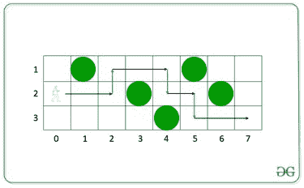

# 跨越所有障碍物所需的最小车道变化

> 原文:[https://www . geesforgeks . org/最小变道-需要跨越所有障碍/](https://www.geeksforgeeks.org/minimum-change-in-lanes-required-to-cross-all-barriers/)

考虑一条长度为 **N** 的 3 车道道路，包括从 **0** 到 **N** 的 **(N + 1)** 点。一名男子从**第二车道**的 **0** 点出发，想到达 **N** 点，但有可能沿途会有障碍物。给定一个长度为 **(N + 1)** 的[阵列](https://www.geeksforgeeks.org/array-data-structure/) **障碍物[]** ，其中**障碍物[i](0 ≤障碍物[i] ≤ 3)** 在车道上的点 **i** 处定义一个障碍物。如果**障碍【I】**为 **0** ，则该点没有障碍。否则，在 **i <sup>第</sup>位置**处**护栏【I】<sup>第</sup>车道**处有护栏。假设在每个点的 3 条车道上最多有一个障碍物。只有在**(I+1)**点没有障碍物的情况下，该男子才能从**I<sup>th</sup>T41】点行驶至**(I+1)<sup>th</sup>T45】点。为了避开障碍物，那个人只需要换到没有障碍物的车道上。****

任务是找到从点 **0** 和**车道 2** 开始的任何车道中，到达点 **N** 的人在车道中的最小变化次数。

**示例:**

> **输入:**障碍[] = [0，1，0，2，3，1，2，0]
> **输出:** 3
> **解释:**
> 下图中绿色圆圈为障碍，最佳路径如图所示，车道变化用绿色箭头表示:
> 
> 
> 
> **输入:**屏障[] = [0，2，0，1，3，0]
> **输出:** 2

**方法:**给定的问题可以使用[动态规划](https://www.geeksforgeeks.org/dynamic-programming/)来解决，因为它遵循[最优子结构](https://www.geeksforgeeks.org/optimal-substructure-property-in-dynamic-programming-dp-2/)和[重叠子问题](https://www.geeksforgeeks.org/overlapping-subproblems-property-in-dynamic-programming-dp-1/)的属性。首先，创建一个大小为 3 的[数组](https://www.geeksforgeeks.org/array-data-structure/) **arr[]** ，其中

*   dp[0] =到达车道 1 所需的最小交叉
*   dp[1] =到达车道 2 所需的最小交叉
*   dp[2] =到达车道 3 所需的最小交叉

如果遇到石头，将 **dp[i]** 设置为非常大的值，即大于 10 <sup>5</sup> ，并从 **dp[0]** 、 **dp[1]** 和 **dp[2]** 返回最小值。按照以下步骤解决问题:

*   [用值 **{1，0，1}** 初始化一个数组](https://www.geeksforgeeks.org/arrays-in-c-cpp/)**【DP】**。
*   [使用变量 **j** 迭代范围](https://www.geeksforgeeks.org/range-based-loop-c/)**【0，N】**，并执行以下任务:
    *   初始化一个变量，说**值**为**屏障【j】**。
    *   如果**值**大于 **0** ，则将**DP【val–1】**的值设置为 **10 <sup>6</sup>** 。
    *   [使用变量 **i** 迭代范围](https://www.geeksforgeeks.org/range-based-loop-c/)**【0，N】**，如果 **val** 的值不等于 **(i + 1)** ，则将 **dp[i]** 的值设置为 **dp[i]** 或 **(dp[i + 1]%3 + 1)** 或 **(dp[i + 2]】的最小值**
*   完成上述步骤后，打印**DP【0】**或**DP【1】**或**DP【2】**的最小值作为车道变更的结果数。

下面是上述方法的实现:

## C++

```
// C++ program for the above approach

#include <bits/stdc++.h>
using namespace std;

// Function to find the minimum number
// of changes of lane required
int minChangeInLane(int barrier[], int n)
{
    int dp[] = { 1, 0, 1 };
    for (int j = 0; j < n; j++) {

        // If there is a barrier, then
        // add very large value
        int val = barrier[j];
        if (val > 0) {
            dp[val - 1] = 1e6;
        }

        for (int i = 0; i < 3; i++) {

            // Add the minimum value to
            // move forword with or
            // without crossing barrier
            if (val != i + 1) {
                dp[i] = min(dp[i],
                            min(dp[(i + 1) % 3],
                                dp[(i + 2) % 3])
                                + 1);
            }
        }
    }

    // Return the minimum value of
    // dp[0], dp[1] and dp[2]
    return min(dp[0], min(dp[1], dp[2]));
}

// Driver Code
int main()
{
    int barrier[] = { 0, 1, 2, 3, 0 };
    int N = sizeof(barrier) / sizeof(barrier[0]);

    cout << minChangeInLane(barrier, N);

    return 0;
}
```

## Java 语言(一种计算机语言，尤用于创建网站)

```
// Java program for the above approach
class GFG
{

// Function to find the minimum number
// of changes of lane required
static int minChangeInLane(int barrier[], int n)
{
    int dp[] = { 1, 0, 1 };
    for (int j = 0; j < n; j++) {

        // If there is a barrier, then
        // add very large value
        int val = barrier[j];
        if (val > 0) {
            dp[val - 1] = (int) 1e6;
        }

        for (int i = 0; i < 3; i++) {

            // Add the minimum value to
            // move forword with or
            // without crossing barrier
            if (val != i + 1) {
                dp[i] = Math.min(dp[i],
                            Math.min(dp[(i + 1) % 3],
                                dp[(i + 2) % 3])
                                + 1);
            }
        }
    }

    // Return the minimum value of
    // dp[0], dp[1] and dp[2]
    return Math.min(dp[0], Math.min(dp[1], dp[2]));
}

// Driver Code
public static void main(String[] args)
{
    int barrier[] = { 0, 1, 2, 3, 0 };
    int N = barrier.length;

    System.out.print(minChangeInLane(barrier, N));

}
}

// This code is contributed by shikhasingrajput
```

## 蟒蛇 3

```
# Python program for the above approach

# Function to find the minimum number
# of changes of lane required
def minChangeInLane(barrier, n):
    dp = [1, 0, 1]
    for j in range(n):

        # If there is a barrier, then
        # add very large value
        val = barrier[j]
        if (val > 0):
            dp[val - 1] = 1000000

        for i in range(3):

            # Add the minimum value to
            # move forword with or
            # without crossing barrier
            if (val != i + 1):
                dp[i] = min(dp[i],
                            min(dp[(i + 1) % 3],
                                dp[(i + 2) % 3])
                            + 1)
    # Return the minimum value of
    # dp[0], dp[1] and dp[2]
    return min(dp[0], min(dp[1], dp[2]))

# Driver Code
barrier = [0, 1, 2, 3, 0]
N = len(barrier)

print(minChangeInLane(barrier, N))

# This code is contributed by subhammahato348.
```

## C#

```
// C# program for the above approach
using System;

public class GFG
{

  // Function to find the minimum number
  // of changes of lane required
  static int minChangeInLane(int[] barrier, int n)
  {
    int []dp = { 1, 0, 1 };
    for (int j = 0; j < n; j++) {

      // If there is a barrier, then
      // add very large value
      int val = barrier[j];
      if (val > 0) {
        dp[val - 1] = (int) 1e6;
      }

      for (int i = 0; i < 3; i++) {

        // Add the minimum value to
        // move forword with or
        // without crossing barrier
        if (val != i + 1) {
          dp[i] = Math.Min(dp[i],
                           Math.Min(dp[(i + 1) % 3],
                                    dp[(i + 2) % 3])
                           + 1);
        }
      }
    }

    // Return the minimum value of
    // dp[0], dp[1] and dp[2]
    return Math.Min(dp[0], Math.Min(dp[1], dp[2]));
  }

  // Driver Code
  static public void Main (){

    // Code
    int []barrier = { 0, 1, 2, 3, 0 };
    int N = barrier.Length;

    Console.Write(minChangeInLane(barrier, N));

  }
}

// This code is contributed by Potta Lokesh
```

## java 描述语言

```
<script>
// Javascript program for the above approach

// Function to find the minimum number
// of changes of lane required
function minChangeInLane(barrier, n)
{
  let dp = [1, 0, 1];
  for (let j = 0; j < n; j++)
  {

    // If there is a barrier, then
    // add very large value
    let val = barrier[j];
    if (val > 0) {
      dp[val - 1] = 1e6;
    }

    for (let i = 0; i < 3; i++)
    {

      // Add the minimum value to
      // move forword with or
      // without crossing barrier
      if (val != i + 1) {
        dp[i] = Math.min(dp[i], Math.min(dp[(i + 1) % 3], dp[(i + 2) % 3]) + 1);
      }
    }
  }

  // Return the minimum value of
  // dp[0], dp[1] and dp[2]
  return Math.min(dp[0], Math.min(dp[1], dp[2]));
}

// Driver Code
let barrier = [0, 1, 2, 3, 0];
let N = barrier.length;

document.write(minChangeInLane(barrier, N));

// This code is contributed by _saurabh_jaiswal.
</script>
```

**Output:** 

```
2
```

***时间复杂度:**O(N)*
T5**辅助空间:** O(1)