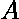
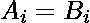
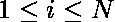

# 使两个阵列相同所需的最小变化

> 原文:[https://www . geeksforgeeks . org/最小-更改-需要制作两个阵列-相同/](https://www.geeksforgeeks.org/minimum-changes-required-to-make-two-arrays-identical/)

给定两个数组，和各有 **n** 个元素。任务是使这两个阵列相同，也就是说，对于每个，我们想要制造。在一次操作中，可以选择两个整数 **x** 和 **y** ，用 **y** 替换两个数组中所有出现的 **x** 。请注意，无论替换了多少次，它仍将被视为单个操作。您必须输出所需的最小操作数。

**示例:**

```
Input : 1 2 2
        1 2 5
Output: 1
Here, (x, y) = (5, 2) hence ans = 1.

Input : 2 1 1 3 5
        1 2 2 4 5
Output: 2
Here, (x, y) = (1, 2) and (3, 4) thus ans = 2.
Other pairs are also possible.
```

这个问题可以借助[不相交集并](https://www.geeksforgeeks.org/union-find-algorithm-set-2-union-by-rank/)来解决。
我们将检查两个阵列的所有元素，即每个。如果元素属于同一个 **id** ，那么我们跳过它。否则，我们对这两个元素执行联合操作。最后，答案将是所有不同的不相交集合的大小之和，即:e ![ans = \sum_{i=1}^{N} (sz[i]-1)   ](img/d67b3f976e295c3cf972c9fa38e73bb6.png "Rendered by QuickLaTeX.com")。我们减去 1 是因为，最初，我们把每个集合的大小设为 1。

下面是上述方法的实现:

## C++

```
// C++ program to find minimum changes
// required to make two arrays identical
#include <bits/stdc++.h>
using namespace std;

#define N 100010

/*  'id': stores parent of a node.
    'sz': stores size of a DSU tree. */
int id[N], sz[N];

// Function to assign root
int Root(int idx)
{
    int i = idx;
    while (i != id[i])
        id[i] = id[id[i]], i = id[i];

    return i;
}

// Function to find Union
void Union(int a, int b)
{
    int i = Root(a), j = Root(b);

    if (i != j) {
        if (sz[i] >= sz[j]) {
            id[j] = i, sz[i] += sz[j];
            sz[j] = 0;
        }
        else {
            id[i] = j, sz[j] += sz[i];
            sz[i] = 0;
        }
    }
}

// function to find minimum changes required
// to make both array equal.
int minChange(int n, int a[], int b[])
{

    // Sets as single elements
    for (int i = 0; i < N; i++)
        id[i] = i, sz[i] = 1;

    // Combine items if they belong to different
    // sets.
    for (int i = 0; i < n; ++i)

        // true if both elements have different root
        if (Root(a[i]) != Root(b[i]))
            Union(a[i], b[i]); // make root equal

    // Find sum sizes of all sets formed.
    int ans = 0;
    for (int i = 0; i < n; ++i)
        if (id[i] == i)
            ans += (sz[i] - 1);

    return ans;
}

// Driver program
int main()
{

    int a[] = { 2, 1, 1, 3, 5 }, b[] = { 1, 2, 2, 4, 5 };
    int n = sizeof(a) / sizeof(a[0]);
    cout << minChange(n, a, b);
    return 0;
}
```

## Java 语言(一种计算机语言，尤用于创建网站)

```
// Java program to find minimum changes
// required to make two arrays identical

class GFG{
static int N=100010;

/* 'id': stores parent of a node.
    'sz': stores size of a DSU tree. */
static int[] id=new int[100010];
static int[] sz=new int[100010];

// Function to assign root
static int Root(int idx)
{
    int i = idx;
    while (i != id[i])
        {
            id[i] = id[id[i]];
            i = id[i];
        }

    return i;
}

// Function to find Union
static void Union(int a, int b)
{
    int i = Root(a);
    int j = Root(b);

    if (i != j) {
        if (sz[i] >= sz[j]) {
            id[j] = i;
            sz[i] += sz[j];
            sz[j] = 0;
        }
        else {
            id[i] = j;
            sz[j] += sz[i];
            sz[i] = 0;
        }
    }
}

// function to find minimum changes required
// to make both array equal.
static int minChange(int n, int a[], int b[])
{

    // Sets as single elements
    for (int i = 0; i < N; i++)
        {
            id[i] = i;
            sz[i] = 1;
        }

    // Combine items if they belong to different
    // sets.
    for (int i = 0; i < n; ++i)

        // true if both elements have different root
        if (Root(a[i]) != Root(b[i]))
            Union(a[i], b[i]); // make root equal

    // Find sum sizes of all sets formed.
    int ans = 0;
    for (int i = 0; i < n; ++i)
        if (id[i] == i)
            ans += (sz[i] - 1);

    return ans;
}

// Driver program
public static void main(String[] args)
{

    int a[] = { 2, 1, 1, 3, 5 }, b[] = { 1, 2, 2, 4, 5 };
    int n = a.length;
    System.out.println(minChange(n, a, b));
}
}
// This code is contributed by mits
```

## 蟒蛇 3

```
# Python 3 program to find minimum changes
# required to make two arrays identical

N = 100010

# 'id':stores parent of a node
# 'sz':stores size of a DSU tree
ID = [0 for i in range(N)]
sz = [0 for i in range(N)]

# function to assign root
def Root(idx):
    i = idx
    while i != ID[i]:
        ID[i], i = ID[ID[i]], ID[i]
    return i

# Function to find Union
def Union(a, b):
    i, j = Root(a), Root(b)

    if i != j:
        if sz[i] >= sz[j]:
            ID[j] = i
            sz[i] += sz[j]
            sz[j] = 0
        else:
            ID[i] = j
            sz[j] += sz[i]
            sz[i] = 0

# function to find minimum changes
# required to make both array equal
def minChange(n, a, b):

    # sets as single elements
    for i in range(N):
        ID[i] = i
        sz[i] = 1

    # Combine items if they belong
    # to different sets
    for i in range(n):

        # true if both elements have
        # different root
        if Root(a[i]) != Root(b[i]):
            Union(a[i], b[i])

    # find sum sizes of all sets formed
    ans = 0
    for i in range(n):
        if ID[i] == i:
            ans += (sz[i] - 1)

    return ans

# Driver Code
a = [2, 1, 1, 3, 5]
b = [1, 2, 2, 4, 5]
n = len(a)

print(minChange(n, a, b))

# This code is contributed
# by Mohit kumar 29 (IIIT gwalior)
```

## C#

```
// C# program to find minimum changes
// required to make two arrays identical
using System;

class GFG{
static int N=100010;

/* 'id': stores parent of a node.
    'sz': stores size of a DSU tree. */
static int []id=new int[100010];
static int []sz=new int[100010];

// Function to assign root
static int Root(int idx)
{
    int i = idx;
    while (i != id[i])
        {
            id[i] = id[id[i]];
            i = id[i];
        }

    return i;
}

// Function to find Union
static void Union(int a, int b)
{
    int i = Root(a);
    int j = Root(b);

    if (i != j) {
        if (sz[i] >= sz[j]) {
            id[j] = i;
            sz[i] += sz[j];
            sz[j] = 0;
        }
        else {
            id[i] = j;
            sz[j] += sz[i];
            sz[i] = 0;
        }
    }
}

// function to find minimum changes required
// to make both array equal.
static int minChange(int n, int []a, int []b)
{

    // Sets as single elements
    for (int i = 0; i < N; i++)
        {
            id[i] = i;
            sz[i] = 1;
        }

    // Combine items if they belong to different
    // sets.
    for (int i = 0; i < n; ++i)

        // true if both elements have different root
        if (Root(a[i]) != Root(b[i]))
            Union(a[i], b[i]); // make root equal

    // Find sum sizes of all sets formed.
    int ans = 0;
    for (int i = 0; i < n; ++i)
        if (id[i] == i)
            ans += (sz[i] - 1);

    return ans;
}

// Driver program
public static void Main()
{

    int []a = { 2, 1, 1, 3, 5 };
    int []b = { 1, 2, 2, 4, 5 };
    int n = a.Length;
    Console.WriteLine(minChange(n, a, b));
}
}
// This code is contributed by anuj_67..
```

## 服务器端编程语言（Professional Hypertext Preprocessor 的缩写）

```
<?php
// PHP program to find minimum changes
// required to make two arrays identical
$N = 100010;

/* 'id': stores parent of a node.
    'sz': stores size of a DSU tree. */
$id = array_fill(0, $N, NULL);
$sz = array_fill(0, $N, NULL);

// Function to assign root
function Root($idx)
{
    global $id;
    $i = $idx;
    while ($i != $id[$i])
    {
        $id[$i] = $id[$id[$i]];
        $i = $id[$i];
    }

    return $i;
}

// Function to find Union
function Union($a, $b)
{
    global $sz, $id;
    $i = Root($a);
    $j = Root($b);

    if ($i != $j)
    {
        if ($sz[$i] >= $sz[$j])
        {
            $id[$j] = $i;
            $sz[$i] += $sz[$j];
            $sz[$j] = 0;
        }
        else
        {
            $id[$i] = $j;
            $sz[$j] += $sz[$i];
            $sz[$i] = 0;
        }
    }
}

// function to find minimum changes
// required to make both array equal.
function minChange($n, &$a, &$b)
{
    global $id, $sz, $N;

    // Sets as single elements
    for ($i = 0; $i < $N; $i++)
    {
        $id[$i] = $i;
        $sz[$i] = 1;
    }

    // Combine items if they belong to
    // different sets.
    for ($i = 0; $i < $n; ++$i)

        // true if both elements have
        // different roots
        if (Root($a[$i]) != Root($b[$i]))
            Union($a[$i], $b[$i]); // make root equal

    // Find sum sizes of all sets formed.
    $ans = 0;
    for ($i = 0; $i < $n; ++$i)
        if ($id[$i] == $i)
            $ans += ($sz[$i] - 1);

    return $ans;
}

// Driver Code
$a = array(2, 1, 1, 3, 5);
$b = array(1, 2, 2, 4, 5);
$n = sizeof($a);
echo minChange($n, $a, $b);

// This code is contributed by ita_c
?>
```

## java 描述语言

```
<script>
// Javascript program to find minimum changes
// required to make two arrays identical

    let  N=100010;
    /* 'id': stores parent of a node.
    'sz': stores size of a DSU tree. */
    let id=new Array(100010);
    let sz=new Array(100010);

    // Function to assign root
    function Root(idx)
    {
        let i = idx;
        while (i != id[i])
        {
            id[i] = id[id[i]];
            i = id[i];
        }

        return i;
    }

    // Function to find Union
    function Union(a,b)
    {
        let i = Root(a);
        let j = Root(b);

        if (i != j) {
            if (sz[i] >= sz[j]) {
                id[j] = i;
                sz[i] += sz[j];
                sz[j] = 0;
            }
            else {
                id[i] = j;
                sz[j] += sz[i];
                sz[i] = 0;
            }
        }
    }

    // function to find minimum changes required
    // to make both array equal.
    function minChange(n,a,b)
    {
        // Sets as single elements
        for (let i = 0; i < N; i++)
        {
            id[i] = i;
            sz[i] = 1;
        }

    // Combine items if they belong to different
    // sets.
        for (let i = 0; i < n; ++i)

        // true if both elements have different root
        if (Root(a[i]) != Root(b[i]))
            Union(a[i], b[i]); // make root equal

    // Find sum sizes of all sets formed.
        let ans = 0;
        for (let i = 0; i < n; ++i)
            if (id[i] == i)
                ans += (sz[i] - 1);

        return ans;
    }

    // Driver program
    let a=[2, 1, 1, 3, 5 ];
    let b=[ 1, 2, 2, 4, 5 ];
    let n = a.length;
    document.write(minChange(n, a, b));

// This code is contributed by rag2127
</script>
```

**Output:** 

```
2
```

**时间复杂度:** O(N + n)，其中 N 是数组项的最大可能值，N 是数组中的元素个数。