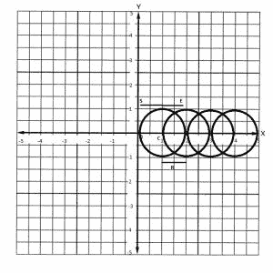

# 需要移除的最小圆，以便所有剩余圆不相交

> 原文:[https://www . geeksforgeeks . org/最小需要移除的圆-以便所有剩余的圆都不相交/](https://www.geeksforgeeks.org/minimum-circles-needed-to-be-removed-so-that-all-remaining-circles-are-non-intersecting/)

给定 x-y 平面上的 n 个圆，使得所有圆的中心在 x 轴上对齐。
任务是去掉其中一些，这样就不会有两个圆相交。找出需要移除的最小圆圈数。

**注:**触摸圆也视为相交。
给定 N 和一个整数对数组。每对包含两个整数 c 和 r，分别表示半径为 r、圆心为(c，0)的圆。

**示例:**

> **输入:** N=4，arr={(1，1)，(2，1)，(3，1)，(4，1)}
> **输出:** 2
> 
> 
> 
> 去掉 2 <sup>nd</sup> 和 3 <sup>rd</sup> 圆，使圆不相交。
> **输入:** N=4，arr={(1，1)，(4，1)，(5，2)，(7，1)}
> **输出:** 1

**进场:**
可以应用贪婪策略解决问题。

*   找到圆直径的起点和终点。
*   起点将等于(c-r ),终点将等于(c+r ),其中(c，0)是特定圆的中心，r 是其半径。
*   根据端点的值对{开始，结束}对进行排序。端点值越小，其指数越小。
*   开始迭代对，如果一个圆的起点小于当前的结束值，这意味着圆相交，因此增加计数。否则更新当前结束值。

下面是上述方法的实现:

## C++

```
// C++ implementation of the above approach
#include <algorithm>
#include <iostream>
using namespace std;

struct circle {
    int start, end;
};

// Comparison function modified
// according to the end value
bool comp(circle a, circle b)
{
    if (a.end == b.end)
        return a.start < b.start;
    return a.end < b.end;
}

// Function to return the count
// of non intersecting circles
void CountCircles(int c[], int r[], int n)
{
    // structure with start and
    // end of diameter of circles
    circle diameter[n];

    for (int i = 0; i < n; ++i) {
        diameter[i].start = c[i] - r[i];

        diameter[i].end = c[i] + r[i];
    }

    // sorting with smallest finish time first
    sort(diameter, diameter + n, comp);

    // count stores number of
    // circles to be removed
    int count = 0;

    // cur stores ending of first circle
    int cur = diameter[0].end;
    for (int i = 1; i < n; ++i) {

        // non intersecting circles
        if (diameter[i].start > cur) {
            cur = diameter[i].end;
        }

        // intersecting circles
        else
            count++;
    }

    cout << count << "\n";
}

// Driver Code
int main()
{
    // centers of circles
    int c[] = { 1, 2, 3, 4 };
    // radius of circles
    int r[] = { 1, 1, 1, 1 };

    // number of circles
    int n = sizeof(c) / sizeof(int);

    CountCircles(c, r, n);

    return 0;
}
```

## Java 语言(一种计算机语言，尤用于创建网站)

```
// Java implementation of the above approach
import java.util.Arrays;
import java.util.Comparator;

public class MinimumCirclesTobeRemoved {

    private class Circle implements Comparator<Circle>{
        int start;
        int end;

        // Comparison function modified
        // according to the end value
        public int compare(Circle a , Circle b){
            if(a.end == b.end){
                return (a.start - b.start);
            }
            return a.end - b.end;
        }
    }

    // Function to return the count
    // of non intersecting circles
    public void CountCircles(int[] c, int[] r, int n){

        // structure with start and
        // end of diameter of circles
        Circle diameter[] = new Circle[n];

        for(int i = 0; i < n; i++)
        {
            diameter[i] = new Circle();
            diameter[i].start = (c[i] - r[i]);
            diameter[i].end = (c[i] + r[i]);
        }

        // sorting with smallest finish time first
        Arrays.sort(diameter, new Circle());

        // count stores number of
        // circles to be removed
        int count = 0;

        // cur stores ending of first circle
        int curr = diameter[0].end;

        for(int i = 1; i < n; i++)
        {

            // non intersecting circles
            if(diameter[i].start > curr)
            {
                curr = diameter[i].end;
            }
            else
            {
                count++;
            }
        }
        System.out.println(count);
    }

    // Driver code
    public static void main(String[] args)
    {
        MinimumCirclesTobeRemoved a = new MinimumCirclesTobeRemoved();

        // centers of circles
        int[] c = new int[]{1, 2, 3, 4};

        // radius of circles
        int[] r = new int[]{1, 1, 1, 1};
        a.CountCircles(c, r, c.length);
    }
}

// This code is contributed by parshavnahta97
```

## 蟒蛇 3

```
# Python3 implementation of the above approach

# Function to return the count
# of non intersecting circles
def CountCircles(c, r, n):

    # Structure with start and
    # end of diameter of circles
    diameter = []

    for i in range(n):
        obj = []
        obj.append(c[i] - r[i])

        obj.append(c[i] + r[i])
        diameter.append(obj)

    # Sorting with smallest finish time first
    diameter.sort()

    # count stores number of
    # circles to be removed
    count = 0

    # cur stores ending of first circle
    cur = diameter[0][1]

    for i in range(1, n):

        # Non intersecting circles
        if (diameter[i][0] > cur):
            cur = diameter[i][1]

        # Intersecting circles
        else:
            count += 1

    print(count)

# Driver Code

# Centers of circles
c = [ 1, 2, 3, 4 ]

# Radius of circles
r = [ 1, 1, 1, 1 ]

# Number of circles
n = len(c)
CountCircles(c, r, n)

# This code is contributed by rohitsingh07052
```

**Output:** 

```
2
```

**时间复杂度:** O(N*log(N))
其中 N 为圈数。