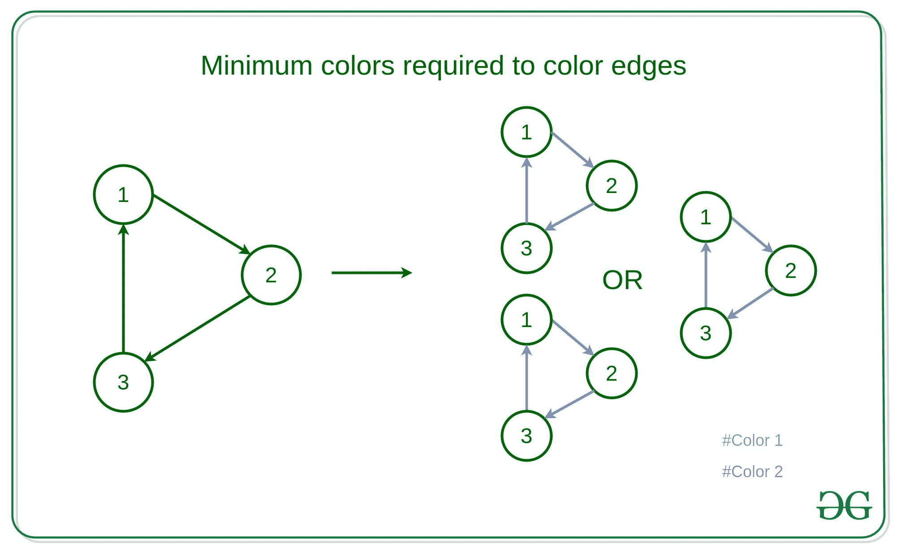

# 形成循环的边缘不具有相同颜色所需的最小颜色

> 原文:[https://www . geeksforgeeks . org/最小-颜色-要求-这样-边-形成-循环-没有相同的颜色/](https://www.geeksforgeeks.org/minimum-colors-required-such-that-edges-forming-cycle-do-not-have-same-color/)

给定一个具有 **V** 顶点和 **E** 边的有向图，该图没有自循环和多条边，任务是找到所需的最小颜色数，使得相同颜色的边不形成循环，并找到每条边的颜色。
**例:**

> **输入:** V = {1，2，3}，E = {(1，2)，(2，3)，(3，1)}
> **输出:** 2
> 1 1 2
> 
> 
> 
> **说明:**
> 在上面给定的图中它只形成一个循环，
> 即连接 1、2、3 的顶点形成一个循环
> 然后连接 1- > 2 或 2- > 3 或 3- > 1 的边可以用不同的颜色进行着色
> 使得形成循环的边不具有相同的颜色
> **输入:** V = {1、2、3、4、5}、E = {(1、2)、(1、3)、(2、5) (4，5)，(5，3)}
> **输出:** 2
> 边的颜色–1 1 1 1 1 2
> **说明:**
> 在上面给定的图形中，它只形成一个循环，
> 即顶点连接 3，4， 5 形成一个循环
> 然后连接 5- > 3 或 4- > 5 或 3- > 4 的边可以用不同的颜色进行着色
> 以使形成循环的边不具有相同的颜色
> 边的最终颜色–
> { 1:1，2: 1，3: 1，4: 1，5: 1，6: 1，7: 2}
> 上述数组将这些对表示为–边:颜色代码

**方法:**想法是在图中找到循环，这可以借助于图的 [DFS 来完成，其中当已经被访问的节点被新的边再次访问时，该边被另一种颜色着色，否则如果没有循环，那么所有的边都可以只被一种颜色着色。
**算法:**](https://www.geeksforgeeks.org/depth-first-search-or-dfs-for-a-graph/) 

*   用颜色 1 标记每条边，将每一个顶点标记为未访问。
*   使用图的 [DFS 遍历](https://www.geeksforgeeks.org/depth-first-search-or-dfs-for-a-graph/)遍历图，并标记访问的节点。
*   当一个节点已经被访问时，那么连接顶点的边被标记为用颜色 2 着色。
*   当访问所有顶点时，打印边的颜色。

**举例说明:**
例 1

<figure class="table">的详细预演

| 当前顶点 | 当前边缘 | 访问的顶点 | 边缘的颜色 | 评论 |
| --- | --- | --- | --- | --- |
| one | 1–>2 | {1} | {1: 1, 2: 1, 3: 1} | 节点 1 被标记为已访问，正在为节点 2 调用 DFS |
| Two | 2–>3 | {1, 2} | {1: 1, 2: 1, 3: 1} | 节点 2 被标记为已访问，并为节点 3 调用 DFS |
| three | 3–>1 | {1, 2} | {1: 1, 2: 1, 3: 2} | 由于 1 已被访问，边缘 3 的颜色变为 2 |

以下是上述方法的实现:

## C++

```
// C++ implementation to find the
// minimum colors required to
// such that edges forming cycle
// don't have same color

#include <bits/stdc++.h>
using namespace std;

const int n = 5, m = 7;

// Variable to store the graph
vector<pair<int, int> > g[m];

// To store that the
// vertex is visited or not
int col[n];

// Boolean Value to store that
// graph contains cycle or not
bool cyc;

// Variable to store the color
// of the edges of the graph
int res[m];

// Function to traverse graph
// using DFS Traversal
void dfs(int v)
{
    col[v] = 1;

    // Loop to iterate for all
    // edges from the source vertex
    for (auto p : g[v]) {
        int to = p.first, id = p.second;

        // If the vertex is not visited
        if (col[to] == 0)
        {
            dfs(to);
            res[id] = 1;
        }

        // Condition to check cross and
        // forward edges of the graph
        else if (col[to] == 2)
        {
            res[id] = 1;
        }

        // Presence of Back Edge
        else {
            res[id] = 2;
            cyc = true;
        }
    }
    col[v] = 2;
}

// Driver Code
int main()
{
    g[0].push_back(make_pair(1, 0));
    g[0].push_back(make_pair(2, 1));
    g[1].push_back(make_pair(2, 2));
    g[1].push_back(make_pair(3, 3));
    g[2].push_back(make_pair(3, 4));
    g[3].push_back(make_pair(4, 5));
    g[4].push_back(make_pair(2, 6));

    // Loop to run DFS Traversal on
    // vertex which is not visited
    for (int i = 0; i < n; ++i) {
        if (col[i] == 0)
        {
            dfs(i);
        }
    }
    cout << (cyc ? 2 : 1) << endl;

    // Loop to print the
    // colors of the edges
    for (int i = 0; i < m; ++i) {
        cout << res[i] << ' ';
    }
    return 0;
}
```

## Java 语言(一种计算机语言，尤用于创建网站)

```
// Java implementation to find the
// minimum colors required to
// such that edges forming cycle
// don't have same color
import java.util.*;

class GFG{

static int n = 5, m = 7;
static class pair
{
    int first, second;
    public pair(int first, int second) 
    {
        this.first = first;
        this.second = second;
    }   
}

// Variable to store the graph
static Vector<pair > []g = new Vector[m];

// To store that the
// vertex is visited or not
static int []col = new int[n];

// Boolean Value to store that
// graph contains cycle or not
static boolean cyc;

// Variable to store the color
// of the edges of the graph
static int []res = new int[m];

// Function to traverse graph
// using DFS Traversal
static void dfs(int v)
{
    col[v] = 1;

    // Loop to iterate for all
    // edges from the source vertex
    for (pair  p : g[v]) {
        int to = p.first, id = p.second;

        // If the vertex is not visited
        if (col[to] == 0)
        {
            dfs(to);
            res[id] = 1;
        }

        // Condition to check cross and
        // forward edges of the graph
        else if (col[to] == 2)
        {
            res[id] = 1;
        }

        // Presence of Back Edge
        else {
            res[id] = 2;
            cyc = true;
        }
    }
    col[v] = 2;
}

// Driver Code
public static void main(String[] args)
{
    for(int i= 0; i < m; i++)
        g[i] = new Vector<pair>();
    g[0].add(new pair(1, 0));
    g[0].add(new pair(2, 1));
    g[1].add(new pair(2, 2));
    g[1].add(new pair(3, 3));
    g[2].add(new pair(3, 4));
    g[3].add(new pair(4, 5));
    g[4].add(new pair(2, 6));

    // Loop to run DFS Traversal on
    // vertex which is not visited
    for (int i = 0; i < n; ++i) {
        if (col[i] == 0)
        {
            dfs(i);
        }
    }
    System.out.print((cyc ? 2 : 1) +"\n");

    // Loop to print the
    // colors of the edges
    for (int i = 0; i < m; ++i) {
        System.out.print(res[i] +" ");
    }
}
}

// This code is contributed by sapnasingh4991
```

## 蟒蛇 3

```
# Python3 implementation to find the
# minimum colors required to
# such that edges forming cycle
# don't have same color

n = 5
m = 7;

# Variable to store the graph
g = [[] for i in range(m)]

# To store that the
# vertex is visited or not
col = [0 for i in range(n)];

# Boolean Value to store that
# graph contains cycle or not
cyc = True

# Variable to store the color
# of the edges of the graph
res = [0 for i in range(m)];

# Function to traverse graph
# using DFS Traversal
def dfs(v):

    col[v] = 1;

    # Loop to iterate for all
    # edges from the source vertex
    for p in g[v]:

        to = p[0]
        id = p[1];

        # If the vertex is not visited
        if (col[to] == 0):

            dfs(to);
            res[id] = 1;

        # Condition to check cross and
        # forward edges of the graph
        elif (col[to] == 2):

            res[id] = 1;

        # Presence of Back Edge
        else:
            res[id] = 2;
            cyc = True;

    col[v] = 2;

# Driver Code
if __name__=='__main__':

    g[0].append([1, 0]);
    g[0].append([2, 1]);
    g[1].append([2, 2]);
    g[1].append([3, 3]);
    g[2].append([3, 4]);
    g[3].append([4, 5]);
    g[4].append([2, 6]);

    # Loop to run DFS Traversal on
    # vertex which is not visited
    for i in range(n):

        if (col[i] == 0):

            dfs(i);

    print(2 if cyc else 1)

    # Loop to print the
    # colors of the edges
    for i in range(m):
        print(res[i], end=' ')

# This code is contributed by rutvik_56
```

## C#

```
// C# implementation to find the
// minimum colors required to
// such that edges forming cycle
// don't have same color
using System;
using System.Collections.Generic;

class GFG{

static int n = 5, m = 7;
class pair
{
    public int first, second;
    public pair(int first, int second) 
    {
        this.first = first;
        this.second = second;
    }   
}

// Variable to store the graph
static List<pair> []g = new List<pair>[m];

// To store that the
// vertex is visited or not
static int []col = new int[n];

// Boolean Value to store that
// graph contains cycle or not
static bool cyc;

// Variable to store the color
// of the edges of the graph
static int []res = new int[m];

// Function to traverse graph
// using DFS Traversal
static void dfs(int v)
{
    col[v] = 1;

    // Loop to iterate for all
    // edges from the source vertex
    foreach (pair  p in g[v]) {
        int to = p.first, id = p.second;

        // If the vertex is not visited
        if (col[to] == 0)
        {
            dfs(to);
            res[id] = 1;
        }

        // Condition to check cross and
        // forward edges of the graph
        else if (col[to] == 2)
        {
            res[id] = 1;
        }

        // Presence of Back Edge
        else {
            res[id] = 2;
            cyc = true;
        }
    }
    col[v] = 2;
}

// Driver Code
public static void Main(String[] args)
{
    for(int i= 0; i < m; i++)
        g[i] = new List<pair>();
    g[0].Add(new pair(1, 0));
    g[0].Add(new pair(2, 1));
    g[1].Add(new pair(2, 2));
    g[1].Add(new pair(3, 3));
    g[2].Add(new pair(3, 4));
    g[3].Add(new pair(4, 5));
    g[4].Add(new pair(2, 6));

    // Loop to run DFS Traversal on
    // vertex which is not visited
    for (int i = 0; i < n; ++i) {
        if (col[i] == 0)
        {
            dfs(i);
        }
    }
    Console.Write((cyc ? 2 : 1) +"\n");

    // Loop to print the
    // colors of the edges
    for (int i = 0; i < m; ++i) {
        Console.Write(res[i] +" ");
    }
}
}

// This code is contributed by PrinciRaj1992
```

## java 描述语言

```
<script>
// C++ implementation to find the
// minimum colors required to
// such that edges forming cycle
// don't have same color

const n = 5, m = 7;

// Variable to store the graph
let g = new Array();

for(let i = 0;  i<m; i++){
    g.push([])
}

// To store that the
// vertex is visited or not
let col = new Array(n).fill(0);

// Boolean Value to store that
// graph contains cycle or not
let cyc;

// Variable to store the color
// of the edges of the graph
let res = new Array(m);

// Function to traverse graph
// using DFS Traversal
function dfs(v)
{
    col[v] = 1;

    // Loop to iterate for all
    // edges from the source vertex
    for (let p of g[v]) {
        let to = p[0]
        let id = p[1];

        // If the vertex is not visited
        if (col[to] == 0)
        {
            dfs(to);
            res[id] = 1;
        }

        // Condition to check cross and
        // forward edges of the graph
        else if (col[to] == 2)
        {
            res[id] = 1;
        }

        // Presence of Back Edge
        else {
            res[id] = 2;
            cyc = true;
        }
    }
    col[v] = 2;
}

// Driver Code

    g[0].push([1, 0]);
    g[0].push([2, 1]);
    g[1].push([2, 2]);
    g[1].push([3, 3]);
    g[2].push([3, 4]);
    g[3].push([4, 5]);
    g[4].push([2, 6]);

    // Loop to run DFS Traversal on
    // vertex which is not visited
    for (let i = 0; i < n; ++i) {
        if (col[i] == 0)
        {
            dfs(i);
        }
    }
    document.write((cyc ? 2 : 1) + "<br>");

    // Loop to print the
    // colors of the edges
    for (let i = 0; i < m; ++i) {
        document.write(res[i] + ' ');
    }

    // This code is contributed by _saurabh_jaiswal
</script>
```

**Output:** 

```
2
1 1 1 1 1 1 2
```

**业绩分析:**

*   **时间复杂度:**和上面的方法一样，有一个花费 O(V + E)时间的图的 DFS 遍历，其中 V 表示顶点的数量，E 表示边的数量。因此时间复杂性将是 **O(V + E)** 。
*   **辅助空间:** O(1)。

</figure>