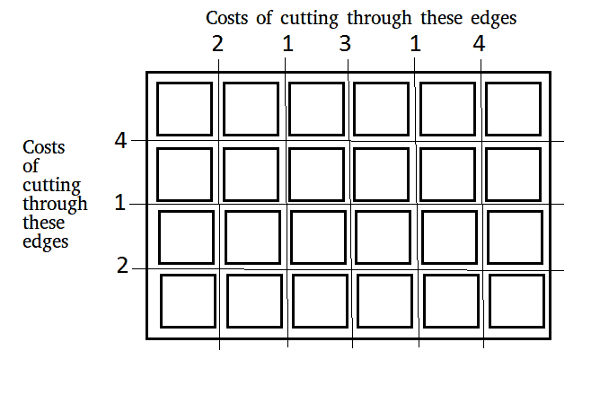

# 将木板切成方块的最小成本

> 原文:[https://www . geeksforgeeks . org/mini-cost-cut-board-squares/](https://www.geeksforgeeks.org/minimum-cost-cut-board-squares/)

给定一块长 m，宽 n 的木板，我们需要把这块木板分成 m*n 个正方形，这样破碎的成本最小。每条边的切割成本将由董事会决定。简而言之，我们需要选择这样的切割顺序，以使成本最小化。
示例:



```
For above board optimal way to cut into square is:
Total minimum cost in above case is 42\. It is 
evaluated using following steps.

Initial Value : Total_cost = 0
Total_cost = Total_cost + edge_cost * total_pieces

Cost 4 Horizontal cut         Cost = 0 + 4*1 = 4
Cost 4 Vertical cut        Cost = 4 + 4*2 = 12
Cost 3 Vertical cut        Cost = 12 + 3*2 = 18
Cost 2 Horizontal cut        Cost = 18 + 2*3 = 24
Cost 2 Vertical cut        Cost = 24 + 2*3 = 30
Cost 1 Horizontal cut        Cost = 30 + 1*4 = 34
Cost 1 Vertical cut        Cost = 34 + 1*4 = 38
Cost 1 Vertical cut        Cost = 38 + 1*4 = 42
```

这个问题可以用贪婪的方法来解决，如果总成本用 S 来表示，那么 S = a1w1 + a2w2 … + akwk，其中 wi 是某个边缘切割的成本，ai 是相应的系数，系数 ai 是由我们在切割过程结束时使用边缘 wi 竞争的切割总数来确定的。请注意，系数之和总是常数，因此我们希望找到 ai 的分布，使得 S 最小。为此**我们尽可能早地在最高成本边**上执行切割，这将达到最佳 s。如果我们遇到几个成本相同的边，我们可以先切割其中的任何一个。
下面是使用上述方法的解决方案，首先我们按照相反的顺序对边缘切割成本进行排序，然后我们将它们从高成本循环到低成本来构建我们的解决方案。每次我们选择一个边，对应的计数就会增加 1，每次都要乘以相应的切边成本。
注意下面使用的排序方法，发送 greater()作为排序方法的第三个参数，以非递增的顺序对数字进行排序，这是库的预定义函数。

## C++

```
//  C++ program to divide a board into m*n squares
#include <bits/stdc++.h>
using namespace std;

// method returns minimum cost to break board into
// m*n squares
int minimumCostOfBreaking(int X[], int Y[], int m, int n)
{
    int res = 0;

    //  sort the horizontal cost in reverse order
    sort(X, X + m, greater<int>());

    //  sort the vertical cost in reverse order
    sort(Y, Y + n, greater<int>());

    //  initialize current width as 1
    int hzntl = 1, vert = 1;

    //  loop until one or both cost array are processed
    int i = 0, j = 0;
    while (i < m && j < n)
    {
        if (X[i] > Y[j])
        {
            res += X[i] * vert;

            //  increase current horizontal part count by 1
            hzntl++;
            i++;
        }
        else
        {
            res += Y[j] * hzntl;

            //  increase current vertical part count by 1
            vert++;
            j++;
        }
    }

    // loop for horizontal array, if remains
    int total = 0;
    while (i < m)
        total += X[i++];
    res += total * vert;

    // loop for vertical array, if remains
    total = 0;
    while (j < n)
        total += Y[j++];
    res += total * hzntl;

    return res;
}

//  Driver code to test above methods
int main()
{
    int m = 6, n = 4;
    int X[m-1] = {2, 1, 3, 1, 4};
    int Y[n-1] = {4, 1, 2};
    cout << minimumCostOfBreaking(X, Y, m-1, n-1);
    return 0;
}
```

## Java 语言(一种计算机语言，尤用于创建网站)

```
// Java program to divide a 
// board into m*n squares
import java.util.Arrays;
import java.util.Collections;

class GFG
{
    // method returns minimum cost to break board into
    // m*n squares
    static int minimumCostOfBreaking(Integer X[], Integer Y[], 
                                                 int m, int n)
    {
        int res = 0;

        // sort the horizontal cost in reverse order
        Arrays.sort(X, Collections.reverseOrder());

        // sort the vertical cost in reverse order
        Arrays.sort(Y, Collections.reverseOrder());

        // initialize current width as 1
        int hzntl = 1, vert = 1;

        // loop until one or both
        // cost array are processed
        int i = 0, j = 0;
        while (i < m && j < n)
        {
            if (X[i] > Y[j])
            {
                res += X[i] * vert;

                // increase current horizontal
                // part count by 1
                hzntl++;
                i++;
            }
            else
            {
                res += Y[j] * hzntl;

                // increase current vertical 
                // part count by 1
                vert++;
                j++;
            }
        }

        // loop for horizontal array, 
        // if remains
        int total = 0;
        while (i < m)
            total += X[i++];
        res += total * vert;

        // loop for vertical array, 
        // if remains
        total = 0;
        while (j < n)
            total += Y[j++];
        res += total * hzntl;

        return res;
    }

    // Driver program
    public static void main(String arg[])
    {
        int m = 6, n = 4;
        Integer X[] = {2, 1, 3, 1, 4};
        Integer Y[] = {4, 1, 2};
        System.out.print(minimumCostOfBreaking(X, Y, m-1, n-1));
    }
}

// This code is contributed by Anant Agarwal.
```

## 蟒蛇 3

```
# Python program to divide a board into m*n squares

# Method returns minimum cost to  
# break board into m*n squares
def minimumCostOfBreaking(X, Y, m, n):

    res = 0

    # sort the horizontal cost in reverse order
    X.sort(reverse = True)

    # sort the vertical cost in reverse order
    Y.sort(reverse = True)

    # initialize current width as 1
    hzntl = 1; vert = 1

    # loop until one or both
    # cost array are processed
    i = 0; j = 0
    while (i < m and j < n):

        if (X[i] > Y[j]):

            res += X[i] * vert

            # increase current horizontal
            # part count by 1
            hzntl += 1
            i += 1

        else:
            res += Y[j] * hzntl

            # increase current vertical
            # part count by 1
            vert += 1
            j += 1

    # loop for horizontal array, if remains
    total = 0
    while (i < m):
        total += X[i]
        i += 1
    res += total * vert

    #loop for vertical array, if remains
    total = 0
    while (j < n):
        total += Y[j]
        j += 1
    res += total * hzntl

    return res

# Driver program
m = 6; n = 4
X = [2, 1, 3, 1, 4]
Y = [4, 1, 2]

print(minimumCostOfBreaking(X, Y, m-1, n-1))

# This code is contributed by Anant Agarwal.
```

## C#

```
// C# program to divide a 
// board into m*n squares
using System; 

class GFG 
{ 
    // method returns minimum cost to break board into 
    // m*n squares 
    static int minimumCostOfBreaking(int[] X, int[] Y, 
                                        int m, int n) 
    { 
        int res = 0; 

        // sort the horizontal cost in reverse order 
        Array.Sort<int>(X, new Comparison<int>( 
                (i1, i2) => i2.CompareTo(i1)));

        // sort the vertical cost in reverse order 
        Array.Sort<int>(Y, new Comparison<int>( 
                (i1, i2) => i2.CompareTo(i1)));

        // initialize current width as 1 
        int hzntl = 1, vert = 1; 

        // loop until one or both 
        // cost array are processed 
        int i = 0, j = 0; 
        while (i < m && j < n) 
        { 
            if (X[i] > Y[j]) 
            { 
                res += X[i] * vert; 

                // increase current horizontal 
                // part count by 1 
                hzntl++; 
                i++; 
            } 
            else
            { 
                res += Y[j] * hzntl; 

                // increase current vertical 
                // part count by 1 
                vert++; 
                j++; 
            } 
        } 

        // loop for horizontal array, 
        // if remains 
        int total = 0; 
        while (i < m) 
            total += X[i++]; 
        res += total * vert; 

        // loop for vertical array, 
        // if remains 
        total = 0; 
        while (j < n) 
            total += Y[j++]; 
        res += total * hzntl; 

        return res; 
    } 

    // Driver program 
    public static void Main(String []arg) 
    { 
        int m = 6, n = 4; 
        int []X = {2, 1, 3, 1, 4}; 
        int []Y = {4, 1, 2}; 
        Console.WriteLine(minimumCostOfBreaking(X, Y, m-1, n-1)); 
    } 
} 

// This code is contributed by Princi Singh
```

## java 描述语言

```
<script>

// JavaScript program to divide a 
// board into m*n squares

    // method returns minimum cost to break board into
    // m*n squares
    function minimumCostOfBreaking(X, Y,  m, n)
    {
        let res = 0;

        // sort the horizontal cost in reverse order
        X.sort();
        X.reverse();

        // sort the vertical cost in reverse order
        Y.sort();
        Y.reverse();

        // initialize current width as 1
        let hzntl = 1, vert = 1;

        // loop until one or both
        // cost array are processed
        let i = 0, j = 0;
        while (i < m && j < n)
        {
            if (X[i] > Y[j])
            {
                res += X[i] * vert;

                // increase current horizontal
                // part count by 1
                hzntl++;
                i++;
            }
            else
            {
                res += Y[j] * hzntl;

                // increase current vertical 
                // part count by 1
                vert++;
                j++;
            }
        }

        // loop for horizontal array, 
        // if remains
        let total = 0;
        while (i < m)
            total += X[i++];
        res += total * vert;

        // loop for vertical array, 
        // if remains
        total = 0;
        while (j < n)
            total += Y[j++];
        res += total * hzntl;

        return res;
    }

// Driver Code

        let m = 6, n = 4;
        let X = [2, 1, 3, 1, 4];
        let Y = [4, 1, 2];
        document.write(minimumCostOfBreaking(X, Y, m-1, n-1));

</script>
```

**输出:**

```
42
```

本文由 [**乌卡什·特里维迪**](https://in.linkedin.com/in/utkarsh-trivedi-253069a7) 供稿。如果你喜欢 GeeksforGeeks 并想投稿，你也可以使用[write.geeksforgeeks.org](http://www.write.geeksforgeeks.org)写一篇文章或者把你的文章邮寄到 review-team@geeksforgeeks.org。看到你的文章出现在极客博客主页上，帮助其他极客。
如果发现有不正确的地方，或者想分享更多关于上述话题的信息，请写评论。