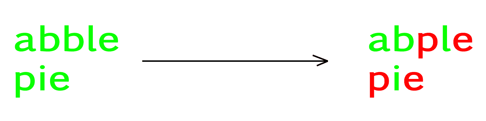

# 制作长度为 k 的最长公共子序列的最小成本

> 原文:[https://www . geeksforgeeks . org/最低成本制造最长公共子序列长度-k/](https://www.geeksforgeeks.org/minimum-cost-make-longest-common-subsequence-length-k/)

给定两个字符串 **X** 、 **Y** 和一个整数 **k** 。现在的任务是以最小的代价转换字符串 X，使得转换后 X 和 Y 的最长公共子序列的长度为 k。转换的代价计算为旧字符值和新字符值的异或。“a”的字符值是 0，“b”是 1，依此类推。

**示例:**

```
Input : X = "abble", 
        Y = "pie",
        k = 2
Output : 25
```



```
If you changed 'a' to 'z', it will cost 0 XOR 25.
```

这个问题可以通过[最长递增子序列](https://www.geeksforgeeks.org/longest-increasing-subsequence/)的动态规划问题的微小变化来解决。我们维持三个状态，而不是两个状态。
注意，如果 k > min(n，m)，那么不可能达到至少 k 长度的 [LCS](https://www.geeksforgeeks.org/longest-common-subsequence/) ，否则总是可能的。
让 dp[i][j][p]存储在 x[0…i]和 y[0…I]中实现长度为 p 的 LCS 的最小成本。j]。
基阶为 dp[i][j][0] = 0，因为我们可以实现长度为 0 的 LCS，而无需任何成本，对于 i < 0 或在这种情况下为 j 0)。
否则有 3 种情况:
1。将 x[i]转换为 y[j]。
2。从 x
3 中跳过第 i <sup>个</sup>字符。从 y 中跳过 j <sup>第</sup>个字符。

如果我们把 x[i]转换成 y[j]，那么成本= f(x[i])异或 f(y[j])将相加，LCS 将减少 1。f(x)将返回字符值 x.
请注意，将字符‘a’转换为任何字符‘c’的最小成本始终是 f(a) XOR f(c)，因为 f(a)XOR f(c)<=(f(a)XOR f(b)+f(b)XOR f(c))对于所有 a、b、c。
如果跳过 i <sup>第</sup>个字符从 x 开始，那么 I 将减少 1，不会增加任何成本，LCS 将保持不变。
如果你从 x 中跳过 j <sup>第</sup>个角色，那么 j 将减少 1，不增加任何费用，LCS 保持不变。

因此，

```
dp[i][j][k] = min(cost + dp[i - 1][j - 1][k - 1], 
                  dp[i - 1][j][k], 
                  dp[i][j - 1][k])
The minimum cost to make the length of their
LCS atleast k is dp[n - 1][m - 1][k]
```

## C++

```
#include <bits/stdc++.h>
using namespace std;
const int N = 30;

// Return Minimum cost to make LCS of length k
int solve(char X[], char Y[], int l, int r,
                     int k, int dp[][N][N])
{
    // If k is 0.
    if (!k)
        return 0;

    // If length become less than 0, return
    // big number.
    if (l < 0 | r < 0)
        return 1e9;

    // If state already calculated.
    if (dp[l][r][k] != -1)
        return dp[l][r][k];

    // Finding the cost
    int cost = (X[l] - 'a') ^ (Y[r] - 'a');

    // Finding minimum cost and saving the state value
    return dp[l][r][k] = min({cost +
                      solve(X, Y, l - 1, r - 1, k - 1, dp),
                             solve(X, Y, l - 1, r, k, dp),
                             solve(X, Y, l, r - 1, k, dp)});
}

// Driven Program
int main()
{
    char X[] = "abble";
    char Y[] = "pie";
    int n = strlen(X);
    int m = strlen(Y);
    int k = 2;

    int dp[N][N][N];
    memset(dp, -1, sizeof dp);
    int ans = solve(X, Y, n - 1, m - 1, k, dp);

    cout << (ans == 1e9 ? -1 : ans) << endl;
    return 0;
}
```

## Java 语言(一种计算机语言，尤用于创建网站)

```
class GFG
{

    static int N = 30;

    // Return Minimum cost to make LCS of length k
    static int solve(char X[], char Y[], int l, int r,
                                    int k, int dp[][][])
    {
        // If k is 0.
        if (k == 0)
        {
            return 0;
        }

        // If length become less than 0, return
        // big number.
        if (l < 0 | r < 0)
        {
            return (int) 1e9;
        }

        // If state already calculated.
        if (dp[l][r][k] != -1)
        {
            return dp[l][r][k];
        }

        // Finding the cost
        int cost = (X[l] - 'a') ^ (Y[r] - 'a');

        // Finding minimum cost and saving the state value
        return dp[l][r][k] = Math.min(Math.min(cost +
                solve(X, Y, l - 1, r - 1, k - 1, dp),
                solve(X, Y, l - 1, r, k, dp)),
                solve(X, Y, l, r - 1, k, dp));
    }

    // Driver code
    public static void main(String[] args)
    {
        char X[] = "abble".toCharArray();
        char Y[] = "pie".toCharArray();
        int n = X.length;
        int m = Y.length;
        int k = 2;

        int[][][] dp = new int[N][N][N];
        for (int i = 0; i < N; i++)
        {
            for (int j = 0; j < N; j++)
            {
                for (int l = 0; l < N; l++)
                {
                    dp[i][j][l] = -1;
                }
            }
        }
        int ans = solve(X, Y, n - 1, m - 1, k, dp);

        System.out.println(ans == 1e9 ? -1 : ans);
    }
}

// This code contributed by Rajput-Ji
```

## 蟒蛇 3

```
# Python3 program to calculate Minimum cost
# to make Longest Common Subsequence of length k
N = 30

# Return Minimum cost to make LCS of length k
def solve(X, Y, l, r, k, dp):

    # If k is 0
    if k == 0:
        return 0

    # If length become less than 0,
    # return big number
    if l < 0 or r < 0:
        return 1000000000

    # If state already calculated
    if dp[l][r][k] != -1:
        return dp[l][r][k]

    # Finding cost
    cost = ((ord(X[l]) - ord('a')) ^
            (ord(Y[r]) - ord('a')))

    dp[l][r][k] = min([cost + solve(X, Y, l - 1,
                                          r - 1, k - 1, dp),
                              solve(X, Y, l - 1, r, k, dp),
                              solve(X, Y, l, r - 1, k, dp)])

    return dp[l][r][k]

# Driver Code
if __name__ == "__main__":
    X = "abble"
    Y = "pie"
    n = len(X)
    m = len(Y)
    k = 2
    dp = [[[-1] * N for __ in range(N)]
                    for ___ in range(N)]
    ans = solve(X, Y, n - 1, m - 1, k, dp)

    print(-1 if ans == 1000000000 else ans)

# This code is contributed
# by vibhu4agarwal
```

## C#

```
// C# program to find subarray with
// sum closest to 0
using System;

class GFG
{

    static int N = 30;

    // Return Minimum cost to make LCS of length k
    static int solve(char []X, char []Y, int l, int r,
                                    int k, int [,,]dp)
    {
        // If k is 0.
        if (k == 0)
        {
            return 0;
        }

        // If length become less than 0, return
        // big number.
        if (l < 0 | r < 0)
        {
            return (int) 1e9;
        }

        // If state already calculated.
        if (dp[l,r,k] != -1)
        {
            return dp[l,r,k];
        }

        // Finding the cost
        int cost = (X[l] - 'a') ^ (Y[r] - 'a');

        // Finding minimum cost and saving the state value
        return dp[l,r,k] = Math.Min(Math.Min(cost +
                solve(X, Y, l - 1, r - 1, k - 1, dp),
                solve(X, Y, l - 1, r, k, dp)),
                solve(X, Y, l, r - 1, k, dp));
    }

    // Driver code
    public static void Main(String[] args)
    {
        char []X = "abble".ToCharArray();
        char []Y = "pie".ToCharArray();
        int n = X.Length;
        int m = Y.Length;
        int k = 2;

        int[,,] dp = new int[N, N, N];
        for (int i = 0; i < N; i++)
        {
            for (int j = 0; j < N; j++)
            {
                for (int l = 0; l < N; l++)
                {
                    dp[i,j,l] = -1;
                }
            }
        }
        int ans = solve(X, Y, n - 1, m - 1, k, dp);

        Console.WriteLine(ans == 1e9 ? -1 : ans);
    }
}

// This code is contributed by Princi Singh
```

**输出:**

```
3
```