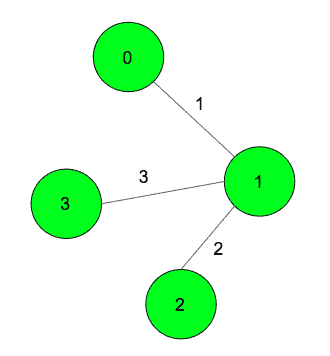

# 通过中间节点从源节点到目的节点的最小成本路径

> 原文:[https://www . geesforgeks . org/最低成本路径-从源节点到目标节点-通过中间节点/](https://www.geeksforgeeks.org/minimum-cost-path-from-source-node-to-destination-node-via-an-intermediate-node/)

给定一个无向加权图。任务是找到通过中间节点从源节点到目的节点的路径的最小开销。
**注:**如果一条边走了两次，只计算一次重量作为成本。



示例:

> **输入:**源= 0，目的地= 2，中间= 3；
> **输出:** 6
> 最小代价路径 0->1->3->1->2
> 边(1-3)在路径中出现两次，但其权重为
> 只给答案加了一次。
> **输入:**源= 0，目的地= 2，中间= 1；
> **输出:** 3
> 最小成本路径为 0- > 1 > 2

**方法:**假设走一条路径 P1 从源到中间，走一条路径 P2 从中间到目的地。这两条路径之间可以有一些公共边。因此，最优路径将总是具有以下形式:对于任何节点 U，行走由从源到 U、从中间到 U 以及从目的地到 U 的最短路径上的边组成。因此，如果 dist(a，b)是节点 a 和 b 之间最短路径的成本，则所需的最小成本路径将是*T3】min { dist(源，U) + dist(中间，U) + dist(目的地， U) }* 对于所有 u .所有节点距离源、中间和目的地的最小距离可以通过从这 3 个节点执行[迪克斯特拉最短路径算法](https://www.geeksforgeeks.org/greedy-algorithms-set-6-dijkstras-shortest-path-algorithm/)来找到。
以下是上述办法的实施情况。

## 卡片打印处理机（Card Print Processor 的缩写）

```
// CPP program to find minimum distance between
// source and destination node and visiting
// of intermediate node is compulsory
#include <bits/stdc++.h>
using namespace std;
#define MAXN 100005

// to store maped values of graph
vector<pair<int, int> > v[MAXN];

// to store distance of
// all nodes from the source node
int dist[MAXN];

// Dijkstra's algorithm to find
// shortest path from source to node
void dijkstra(int source, int n)
{
    // set all the vertices
    // distances as infinity
    for (int i = 0; i < n; i++)
        dist[i] = INT_MAX;

    // set all vertex as unvisited
    bool vis[n];
    memset(vis, false, sizeof vis);

    // make distance from source
    // vertex to source vertex is zero
    dist = 0;

    // // multiset do the job
    // as a min-priority queue
    multiset<pair<int, int> > s;

    // insert the source node with distance = 0
    s.insert({ 0, source });

    while (!s.empty()) {
        pair<int, int> p = *s.begin();
        // pop the vertex with the minimum distance
        s.erase(s.begin());

        int x = p.second;
        int wei = p.first;

        // check if the popped vertex
        // is visited before
        if (vis[x])
            continue;

        vis[x] = true;

        for (int i = 0; i < v[x].size(); i++) {
            int e = v[x][i].first;
            int w = v[x][i].second;

            // check if the next vertex
            // distance could be minimized
            if (dist[x] + w < dist[e]) {

                dist[e] = dist[x] + w;

                // insert the next vertex
                // with the updated distance
                s.insert({ dist[e], e });
            }
        }
    }
}

// function to add edges in graph
void add_edge(int s, int t, int weight)
{
    v[s].push_back({ t, weight });
    v[t].push_back({ s, weight });
}

// function to find the minimum shortest path
int solve(int source, int destination,
               int intermediate, int n)
{
    int ans = INT_MAX;

    dijkstra(source, n);

    // store distance from source to
    // all other vertices
    int dsource[n];
    for (int i = 0; i < n; i++)
        dsource[i] = dist[i];

    dijkstra(destination, n);
    // store distance from destination
    // to all other vertices
    int ddestination[n];
    for (int i = 0; i < n; i++)
        ddestination[i] = dist[i];

    dijkstra(intermediate, n);
    // store distance from intermediate
    // to all other vertices
    int dintermediate[n];
    for (int i = 0; i < n; i++)
        dintermediate[i] = dist[i];

    // find required answer
    for (int i = 0; i < n; i++)
        ans = min(ans, dsource[i] + ddestination[i]
                                  + dintermediate[i]);

    return ans;
}

// Driver code
int main()
{

    int n = 4;
    int source = 0, destination = 2, intermediate = 3;

    // add edges in graph
    add_edge(0, 1, 1);
    add_edge(1, 2, 2);
    add_edge(1, 3, 3);

    // function call for minimum shortest path
    cout << solve(source, destination, intermediate, n);

    return 0;
}
```

**Output:** 

```
6
```

**时间复杂度:** O((N + M) * logN)，其中 N 为节点数，M 为边数。
**辅助空间:** O(N+M)