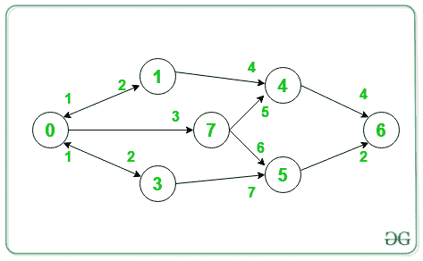

# 有向图中通过给定中间节点集的最小代价路径

> 原文:[https://www . geesforgeks . org/通过给定中间节点集的有向图中最小成本路径/](https://www.geeksforgeeks.org/minimum-cost-path-in-a-directed-graph-via-given-set-of-intermediate-nodes/)

给定一个加权的有向图 **G** ，一个由顶点组成的数组 V[]，任务是找到从给定的源 **S** 到目的地 **D** 通过集合 **V** 的所有顶点的[最小代价路径](https://www.geeksforgeeks.org/min-cost-path-dp-6/)。

**示例:**

> **输入:** V = {7}，S = 0，D = 6
> 
> 
> 
> **输出:** 11
> **解释:**
> 最小路径 0- > 7- > 5- > 6。
> 因此，路径的成本= 3 + 6 + 2 = 11
> 
> **输入:** V = {7，4}，S = 0，D = 6
> 
> 
> 
> **输出:**12
> T3】解释:T5】最小路径 0- > 7- > 4- > 6。
> 因此路径成本= 3 + 5 + 4 = 12

**进场:**
解决问题，思路是用[广度优先-搜索](https://www.geeksforgeeks.org/depth-first-search-or-dfs-for-a-graph/)遍历。 **BFS** 一般用来寻找图中[最短路径](https://www.geeksforgeeks.org/shortest-path-unweighted-graph/)，所有节点到源、中间节点、目的地的最小距离可以通过 [BFS](https://www.geeksforgeeks.org/depth-first-search-or-dfs-for-a-graph/) 从这些节点计算出来。

按照以下步骤解决问题:

*   将 **minSum** 初始化为 **INT_MAX** 。
*   使用 **BFS** 从源节点 **S** 遍历图形。
*   将源的每个相邻节点标记为新源，并从该节点执行 **BFS** 。
*   一旦遇到目的节点 **D** ，则检查是否访问了所有中间节点。
*   如果访问了所有中间节点，则更新 **minSum** 并返回最小值。
*   如果没有访问所有中间节点，则返回 **minSum** 。
*   将源标记为未访问。
*   打印得到的 **minSum** 的最终值。

下面是上述方法的实现:

## C++

```
// C++ Program to implement
// the above approach
#include <bits/stdc++.h>
using namespace std;

// Stores minimum-cost of path from source
int minSum = INT_MAX;

// Function to Perform BFS on graph g
// starting from vertex v
void getMinPathSum(unordered_map<int,
                                 vector<pair<int,
                                             int> > >& graph,
                   vector<bool>& visited,
                   vector<int> necessary,
                   int src, int dest, int currSum)
{
    // If destination is reached
    if (src == dest) {
        // Set flag to true
        bool flag = true;

        // Visit all the intermediate nodes
        for (int i : necessary) {

            // If any intermediate node
            // is not visited
            if (!visited[i]) {
                flag = false;
                break;
            }
        }

        // If all intermediate
        // nodes are visited
        if (flag)

            // Update the minSum
            minSum = min(minSum, currSum);
        return;
    }
    else {

        // Mark the current node
        // visited
        visited[src] = true;

        // Traverse adjacent nodes
        for (auto node : graph[src]) {

            if (!visited[node.first]) {

                // Mark the neighbour visited
                visited[node.first] = true;

                // Find minimum cost path
                // considering the neighbour
                // as the source
                getMinPathSum(graph, visited,
                              necessary, node.first,
                              dest, currSum + node.second);

                // Mark the neighbour unvisited
                visited[node.first] = false;
            }
        }

        // Mark the source unvisited
        visited[src] = false;
    }
}

// Driver Code
int main()
{
    // Stores the graph
    unordered_map<int, vector<pair<int,
                                   int> > >
        graph;
    graph[0] = { { 1, 2 }, { 2, 3 }, { 3, 2 } };
    graph[1] = { { 4, 4 }, { 0, 1 } };
    graph[2] = { { 4, 5 }, { 5, 6 } };
    graph[3] = { { 5, 7 }, { 0, 1 } };
    graph[4] = { { 6, 4 } };
    graph[5] = { { 6, 2 } };
    graph[6] = { { 7, 11 } };

    // Number of nodes
    int n = 7;

    // Source
    int source = 0;

    // Destination
    int dest = 6;

    // Keeps a check on visited
    // and unvisited nodes
    vector<bool> visited(n, false);

    // Stores intermediate nodes
    vector<int> necessary{ 2, 4 };

    getMinPathSum(graph, visited, necessary,
                  source, dest, 0);

    // If no path is found
    if (minSum == INT_MAX)
        cout << "-1\n";
    else
        cout << minSum << '\n';
    return 0;
}
```

## Java 语言(一种计算机语言，尤用于创建网站)

```
// Java program to implement
// the above approach
import java.util.*;

class GFG{

static class pair
{
    int first, second;

    pair(int f, int s)
    {
        this.first = f;
        this.second = s;
    }
}

// Stores minimum-cost of path from source
static int minSum = Integer.MAX_VALUE;

// Function to Perform BFS on graph g
// starting from vertex v
static void getMinPathSum(Map<Integer, ArrayList<pair>> graph,
                          boolean[] visited,
                          ArrayList<Integer> necessary,
                          int source, int dest, int currSum)
{

    // If destination is reached
    if (src == dest)
    {

        // Set flag to true
        boolean flag = true;

        // Visit all the intermediate nodes
        for(int i : necessary)
        {

            // If any intermediate node
            // is not visited
            if (!visited[i])
            {
                flag = false;
                break;
            }
        }

        // If all intermediate
        // nodes are visited
        if (flag)

            // Update the minSum
            minSum = Math.min(minSum, currSum);

        return;
    }
    else
    {

        // Mark the current node
        // visited
        visited[src] = true;

        // Traverse adjacent nodes
        for(pair node : graph.get(src))
        {
            if (!visited[node.first])
            {

                // Mark the neighbour visited
                visited[node.first] = true;

                // Find minimum cost path
                // considering the neighbour
                // as the source
                getMinPathSum(graph, visited,
                              necessary, node.first,
                              dest, currSum + node.second);

                // Mark the neighbour unvisited
                visited[node.first] = false;
            }
        }

        // Mark the source unvisited
        visited[src] = false;
    }
}

// Driver code
public static void main(String[] args)
{

    // Stores the graph
    Map<Integer, ArrayList<pair>> graph = new HashMap<>();

    for(int i = 0; i <= 6; i++)
        graph.put(i, new ArrayList<pair>());

    graph.get(0).add(new pair(1, 2));
    graph.get(0).add(new pair(2, 3));
    graph.get(0).add(new pair(3, 2));
    graph.get(1).add(new pair(4, 4));
    graph.get(1).add(new pair(0, 1));
    graph.get(2).add(new pair(4, 5));
    graph.get(2).add(new pair(5, 6));
    graph.get(3).add(new pair(5, 7));
    graph.get(3).add(new pair(0, 1));
    graph.get(4).add(new pair(6, 4));
    graph.get(5).add(new pair(4, 2));
    graph.get(6).add(new pair(7, 11));

    // Number of nodes
    int n = 7;

    // Source
    int source = 0;

    // Destination
    int dest = 6;

    // Keeps a check on visited
    // and unvisited nodes
    boolean[] visited = new boolean[n];

    // Stores intermediate nodes
    ArrayList<Integer> necessary = new ArrayList<>(
                                   Arrays.asList(2, 4));

    getMinPathSum(graph, visited, necessary,
                  source, dest, 0);

    // If no path is found
    if (minSum == Integer.MAX_VALUE)
        System.out.println(-1);
    else
        System.out.println(minSum);
}
}

// This code is contributed by offbeat
```

## 蟒蛇 3

```
# Python3 Program to implement
# the above approach

# Stores minimum-cost of path from source
minSum = 1000000000

# Function to Perform BFS on graph g
# starting from vertex v
def getMinPathSum(graph, visited, necessary,
                  source, dest, currSum):

    global minSum

    # If destination is reached
    if (src == dest):

        # Set flag to true
        flag = True;

        # Visit all the intermediate nodes
        for i in necessary:

            # If any intermediate node
            # is not visited
            if (not visited[i]):
                flag = False;
                break;

        # If all intermediate
        # nodes are visited
        if (flag):

            # Update the minSum
            minSum = min(minSum, currSum);
        return;

    else:

        # Mark the current node
        # visited
        visited[src] = True;

        # Traverse adjacent nodes
        for node in graph[src]:

            if not visited[node[0]]:

                # Mark the neighbour visited
                visited[node[0]] = True;

                # Find minimum cost path
                # considering the neighbour
                # as the source
                getMinPathSum(graph, visited,
                              necessary, node[0],
                              dest, currSum + node[1]);

                # Mark the neighbour unvisited
                visited[node[0]] = False;

        # Mark the source unvisited
        visited[src] = False;

# Driver Code
if __name__=='__main__':

    # Stores the graph
    graph=dict()

    graph[0] = [ [ 1, 2 ], [ 2, 3 ], [ 3, 2 ] ];
    graph[1] = [ [ 4, 4 ], [ 0, 1 ] ];
    graph[2] = [ [ 4, 5 ], [ 5, 6 ] ];
    graph[3] = [ [ 5, 7 ], [ 0, 1 ] ];
    graph[4] = [ [ 6, 4 ] ];
    graph[5] = [ [ 6, 2 ] ];
    graph[6] = [ [ 7, 11 ] ];

    # Number of nodes
    n = 7;

    # Source
    source = 0;

    # Destination
    dest = 6;

    # Keeps a check on visited
    # and unvisited nodes
    visited=[ False for i in range(n + 1)]

    # Stores intermediate nodes
    necessary = [ 2, 4 ];

    getMinPathSum(graph, visited, necessary,
                  source, dest, 0);

    # If no path is found
    if (minSum == 1000000000):
        print(-1)
    else:
        print(minSum)

        # This code is contributed by pratham76
```

## C#

```
// C# program to implement
// the above approach
using System;
using System.Collections;
using System.Collections.Generic;

class GFG{

class pair
{
    public int first, second;

    public pair(int f, int s)
    {
        this.first = f;
        this.second = s;
    }
}

// Stores minimum-cost of path from source
static int minSum = 100000000;

// Function to Perform BFS on graph g
// starting from vertex v
static void getMinPathSum(Dictionary<int, ArrayList> graph,
                          bool[] visited, ArrayList necessary,
                          int source, int dest, int currSum)
{

    // If destination is reached
    if (src == dest)
    {

        // Set flag to true
        bool flag = true;

        // Visit all the intermediate nodes
        foreach(int i in necessary)
        {

            // If any intermediate node
            // is not visited
            if (!visited[i])
            {
                flag = false;
                break;
            }
        }

        // If all intermediate
        // nodes are visited
        if (flag)

            // Update the minSum
            minSum = Math.Min(minSum, currSum);

        return;
    }
    else
    {

        // Mark the current node
        // visited
        visited[src] = true;

        // Traverse adjacent nodes
        foreach(pair node in graph)
        {
            if (!visited[node.first])
            {

                // Mark the neighbour visited
                visited[node.first] = true;

                // Find minimum cost path
                // considering the neighbour
                // as the source
                getMinPathSum(graph, visited,
                              necessary, node.first,
                              dest, currSum + node.second);

                // Mark the neighbour unvisited
                visited[node.first] = false;
            }
        }

        // Mark the source unvisited
        visited[src] = false;
    }
}

// Driver code
public static void Main(string[] args)
{

    // Stores the graph
    Dictionary<int, ArrayList> graph = new Dictionary<int, ArrayList>();

    for(int i = 0; i <= 6; i++)
        graph[i] = new ArrayList();

    graph[0].Add(new pair(1, 2));
    graph[0].Add(new pair(2, 3));
    graph[0].Add(new pair(3, 2));
    graph[1].Add(new pair(4, 4));
    graph[1].Add(new pair(0, 1));
    graph[2].Add(new pair(4, 5));
    graph[2].Add(new pair(5, 6));
    graph[3].Add(new pair(5, 7));
    graph[3].Add(new pair(0, 1));
    graph[4].Add(new pair(6, 4));
    graph[5].Add(new pair(4, 2));
    graph[6].Add(new pair(7, 11));

    // Number of nodes
    int n = 7;

    // Source
    int source = 0;

    // Destination
    int dest = 6;

    // Keeps a check on visited
    // and unvisited nodes
    bool[] visited = new bool[n];

    // Stores intermediate nodes
    ArrayList necessary = new ArrayList();
    necessary.Add(2);
    necessary.Add(4);

    getMinPathSum(graph, visited, necessary, source, dest, 0);

    // If no path is found
    if (minSum ==  100000000)
        Console.WriteLine(-1);
    else
        Console.WriteLine(minSum);
}
}

// This code is contributed by rutvik_56
```

## java 描述语言

```
<script>

// Javascript program to implement
// the above approach

class pair
{
    constructor(f, s)
    {
        this.first = f;
        this.second = s;
    }
}

// Stores minimum-cost of path from source
var minSum = 100000000;

// Function to Perform BFS on graph g
// starting from vertex v
function getMinPathSum(graph, visited,necessary, src, dest, currSum)
{

    // If destination is reached
    if (src == dest)
    {

        // Set flag to true
        var flag = true;

        // Visit all the intermediate nodes
        for(var i of necessary)
        {

            // If any intermediate node
            // is not visited
            if (!visited[i])
            {
                flag = false;
                break;
            }
        }

        // If all intermediate
        // nodes are visited
        if (flag)

            // Update the minSum
            minSum = Math.min(minSum, currSum);

        return;
    }
    else
    {

        // Mark the current node
        // visited
        visited[src] = true;

        // Traverse adjacent nodes
        for(var node of graph[src])
        {
            if (!visited[node.first])
            {

                // Mark the neighbour visited
                visited[node.first] = true;

                // Find minimum cost path
                // considering the neighbour
                // as the source
                getMinPathSum(graph, visited,
                              necessary, node.first,
                              dest, currSum + node.second);

                // Mark the neighbour unvisited
                visited[node.first] = false;
            }
        }

        // Mark the source unvisited
        visited[src] = false;
    }
}

// Driver code

// Stores the graph
var graph = Array.from(Array(7), ()=>Array());

graph[0].push(new pair(1, 2));
graph[0].push(new pair(2, 3));
graph[0].push(new pair(3, 2));
graph[1].push(new pair(4, 4));
graph[1].push(new pair(0, 1));
graph[2].push(new pair(4, 5));
graph[2].push(new pair(5, 6));
graph[3].push(new pair(5, 7));
graph[3].push(new pair(0, 1));
graph[4].push(new pair(6, 4));
graph[5].push(new pair(4, 2));
graph[6].push(new pair(7, 11));

// Number of nodes
var n = 7;

// Source
var source = 0;

// Destination
var dest = 6;

// Keeps a check on visited
// and unvisited nodes
var visited = Array(n).fill(false);

// Stores intermediate nodes
var necessary = [];
necessary.push(2);
necessary.push(4);

getMinPathSum(graph, visited, necessary, source, dest, 0);

// If no path is found
if (minSum ==  100000000)
    document.write(-1);
else
    document.write(minSum);

</script>
```

**Output:** 

```
12
```

***时间复杂度:** O(N+M)*
***辅助空间:** O(N+M)*