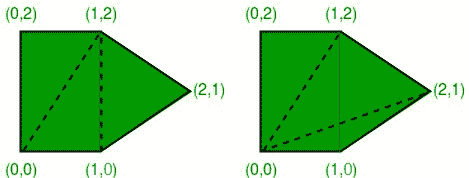
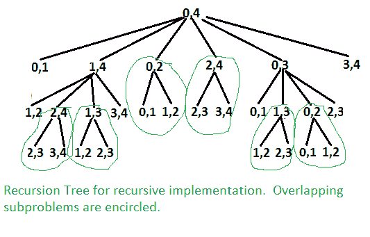

# 最小成本多边形三角剖分

> 原文:[https://www . geesforgeks . org/最低成本-多边形-三角测量/](https://www.geeksforgeeks.org/minimum-cost-polygon-triangulation/)

凸多边形的三角剖分是通过在不相邻的顶点(角)之间画对角线，使对角线永不相交而形成的。问题是用最小的代价找到三角测量的代价。三角测量的成本是其组成三角形的权重之和。每个三角形的重量是它的周长(所有边的长度之和)
见下面取自[这个](http://www.cs.utoronto.ca/~heap/Courses/270F02/A4/chains/node2.html)来源的例子。



*同一凸五边形的两个三角剖分。左边的三角测量成本为 8 + 2√2 + 2√5(约 15.30)，右边的三角测量成本为 4 + 2√2 + 4√5(约 15.77)。*

这个问题有递归子结构。这个想法是把多边形分成三个部分:一个三角形，左边的子多边形，右边的子多边形。我们尝试像这样的所有可能的划分，并找到一个最小化三角形的成本加上两个子多边形的三角剖分的成本。

```
Let Minimum Cost of triangulation of vertices from i to j be minCost(i, j)
If j < i + 2 Then
  minCost(i, j) = 0
Else
  minCost(i, j) = Min { minCost(i, k) + minCost(k, j) + cost(i, k, j) }
                  Here k varies from 'i+1' to 'j-1'

Cost of a triangle formed by edges (i, j), (j, k) and (k, i) is 
  cost(i, j, k)  = dist(i, j) + dist(j, k) + dist(k, i)
```

下面是上述朴素递归公式的实现。

## C++

```
// Recursive implementation for minimum cost convex polygon triangulation
#include <iostream>
#include <cmath>
#define MAX 1000000.0
using namespace std;

// Structure of a point in 2D plane
struct Point
{
    int x, y;
};

// Utility function to find minimum of two double values
double min(double x, double y)
{
    return (x <= y)? x : y;
}

// A utility function to find distance between two points in a plane
double dist(Point p1, Point p2)
{
    return sqrt((p1.x - p2.x)*(p1.x - p2.x) +
                (p1.y - p2.y)*(p1.y - p2.y));
}

// A utility function to find cost of a triangle. The cost is considered
// as perimeter (sum of lengths of all edges) of the triangle
double cost(Point points[], int i, int j, int k)
{
    Point p1 = points[i], p2 = points[j], p3 = points[k];
    return dist(p1, p2) + dist(p2, p3) + dist(p3, p1);
}

// A recursive function to find minimum cost of polygon triangulation
// The polygon is represented by points[i..j].
double mTC(Point points[], int i, int j)
{
   // There must be at least three points between i and j
   // (including i and j)
   if (j < i+2)
      return 0;

   // Initialize result as infinite
   double res = MAX;

   // Find minimum triangulation by considering all
   for (int k=i+1; k<j; k++)
        res = min(res, (mTC(points, i, k) + mTC(points, k, j) +
                        cost(points, i, k, j)));
   return  res;
}

// Driver program to test above functions
int main()
{
    Point points[] = {{0, 0}, {1, 0}, {2, 1}, {1, 2}, {0, 2}};
    int n = sizeof(points)/sizeof(points[0]);
    cout << mTC(points, 0, n-1);
    return 0;
}
```

## Java 语言(一种计算机语言，尤用于创建网站)

```
// Class to store a point in the Euclidean plane
class Point
{
  int x, y;
  public Point(int x, int y)
  {
    this.x = x;
    this.y = y;
  }

  // Utility function to return the distance between two
  // vertices in a 2-dimensional plane
  public double dist(Point p)
  {

    // The distance between vertices `(x1, y1)` & `(x2,
    // y2)` is `√((x2 − x1) ^ 2 + (y2 − y1) ^ 2)`
    return Math.sqrt((this.x - p.x) * (this.x - p.x)
                     + (this.y - p.y) * (this.y - p.y));
  }
}

class GFG
{

  // Function to calculate the weight of optimal
  // triangulation of a convex polygon represented by a
  // given set of vertices `vertices[i..j]`
  public static double MWT(Point[] vertices, int i, int j)
  {

    // If the polygon has less than 3 vertices,
    // triangulation is not possible
    if (j < i + 2)
    {
      return 0;
    }

    // keep track of the total weight of the minimum
    // weight triangulation of `MWT(i,j)`
    double cost = Double.MAX_VALUE;

    // consider all possible triangles `ikj` within the
    // polygon
    for (int k = i + 1; k <= j - 1; k++)
    {

      // The weight of a triangulation is the length
      // of perimeter of the triangle
      double weight = vertices[i].dist(vertices[j])
        + vertices[j].dist(vertices[k])
        + vertices[k].dist(vertices[i]);

      // choose the vertex `k` that leads to the
      // minimum total weight
      cost = Double.min(cost,
                        weight + MWT(vertices, i, k)
                        + MWT(vertices, k, j));
    }
    return cost;
  }

  // Driver code
  public static void main(String[] args)
  {

    // vertices are given in clockwise order
    Point[] vertices
      = { new Point(0, 0), new Point(2, 0),
         new Point(2, 1), new Point(1, 2),
         new Point(0, 1) };

    System.out.println(MWT(vertices,
                           0, vertices.length - 1));
  }
}

// This code is contributed by Priiyadarshini Kumari
```

## 蟒蛇 3

```
# Recursive implementation for minimum
# cost convex polygon triangulation
from math import sqrt
MAX = 1000000.0

# A utility function to find distance
# between two points in a plane
def dist(p1, p2):
    return sqrt((p1[0] - p2[0])*(p1[0] - p2[0]) + \
                (p1[1] - p2[1])*(p1[1] - p2[1]))

# A utility function to find cost of
# a triangle. The cost is considered
# as perimeter (sum of lengths of all edges)
# of the triangle
def cost(points, i, j, k):
    p1 = points[i]
    p2 = points[j]
    p3 = points[k]
    return dist(p1, p2) + dist(p2, p3) + dist(p3, p1)

# A recursive function to find minimum
# cost of polygon triangulation
# The polygon is represented by points[i..j].
def mTC(points, i, j):

    # There must be at least three points between i and j
    # (including i and j)
    if (j < i + 2):
        return 0

    # Initialize result as infinite
    res = MAX

    # Find minimum triangulation by considering all
    for k in range(i + 1, j):
        res = min(res, (mTC(points, i, k) + \
                        mTC(points, k, j) + \
                        cost(points, i, k, j)))

    return round(res, 4)

# Driver code
points = [[0, 0], [1, 0], [2, 1], [1, 2], [0, 2]]
n = len(points)
print(mTC(points, 0, n-1))

# This code is contributed by SHUBHAMSINGH10
```

## C#

```
using System;
using System.Collections.Generic;

// Class to store a point in the Euclidean plane
public  class Point {
  public int x, y;

  public Point(int x, int y) {
    this.x = x;
    this.y = y;
  }

  // Utility function to return the distance between two
  // vertices in a 2-dimensional plane
  public double dist(Point p) {

    // The distance between vertices `(x1, y1)` & `(x2,
    // y2)` is `√((x2 − x1) ^ 2 + (y2 − y1) ^ 2)`
    return Math.Sqrt((this.x - p.x) * (this.x - p.x) +
                     (this.y - p.y) * (this.y - p.y));
  }
}

public class GFG {

  // Function to calculate the weight of optimal
  // triangulation of a convex polygon represented by a
  // given set of vertices `vertices[i..j]`
  public static double MWT(Point[] vertices, int i, int j) {

    // If the polygon has less than 3 vertices,
    // triangulation is not possible
    if (j < i + 2) {
      return 0;
    }

    // keep track of the total weight of the minimum
    // weight triangulation of `MWT(i,j)`
    double cost = 9999999999999.09;

    // consider all possible triangles `ikj` within the
    // polygon
    for (int k = i + 1; k <= j - 1; k++) {

      // The weight of a triangulation is the length
      // of perimeter of the triangle
      double weight = vertices[i].dist(vertices[j]) +
        vertices[j].dist(vertices[k])
        + vertices[k].dist(vertices[i]);

      // choose the vertex `k` that leads to the
      // minimum total weight
      cost = Math.Min(cost, weight +
                      MWT(vertices, i, k) +
                      MWT(vertices, k, j));
    }
    return Math.Round(cost,4);
  }

  // Driver code
  public static void Main(String[] args) {

    // vertices are given in clockwise order
    Point[] vertices = { new Point(0, 0),
                        new Point(2, 0),
                        new Point(2, 1),
                        new Point(1, 2),
                        new Point(0, 1) };

    Console.WriteLine(MWT(vertices, 0, vertices.Length - 1));
  }
}

// This code is contributed by gauravrajput1
```

**输出:**

```
15.3006
```

以上问题类似于[矩阵链乘法](https://www.geeksforgeeks.org/dynamic-programming-set-8-matrix-chain-multiplication/)。下面是 mTC 的递归树(点[]，0，4)。



从上面的递归树中很容易看出，问题有许多重叠的子问题。由于该问题具有两个性质:[最优子结构](https://www.geeksforgeeks.org/dynamic-programming-set-2-optimal-substructure-property/)和[重叠子问题](https://www.geeksforgeeks.org/dynamic-programming-set-1/)，因此可以使用动态规划来有效地解决该问题。
下面是 C++实现的动态规划解决方案。

## C

```
// A Dynamic Programming based program to find minimum cost of convex
// polygon triangulation
#include <iostream>
#include <cmath>
#define MAX 1000000.0
using namespace std;

// Structure of a point in 2D plane
struct Point
{
    int x, y;
};

// Utility function to find minimum of two double values
double min(double x, double y)
{
    return (x <= y)? x : y;
}

// A utility function to find distance between two points in a plane
double dist(Point p1, Point p2)
{
    return sqrt((p1.x - p2.x)*(p1.x - p2.x) +
                (p1.y - p2.y)*(p1.y - p2.y));
}

// A utility function to find cost of a triangle. The cost is considered
// as perimeter (sum of lengths of all edges) of the triangle
double cost(Point points[], int i, int j, int k)
{
    Point p1 = points[i], p2 = points[j], p3 = points[k];
    return dist(p1, p2) + dist(p2, p3) + dist(p3, p1);
}

// A Dynamic programming based function to find minimum cost for convex
// polygon triangulation.
double mTCDP(Point points[], int n)
{
   // There must be at least 3 points to form a triangle
   if (n < 3)
      return 0;

   // table to store results of subproblems.  table[i][j] stores cost of
   // triangulation of points from i to j.  The entry table[0][n-1] stores
   // the final result.
   double table[n][n];

   // Fill table using above recursive formula. Note that the table
   // is filled in diagonal fashion i.e., from diagonal elements to
   // table[0][n-1] which is the result.
   for (int gap = 0; gap < n; gap++)
   {
      for (int i = 0, j = gap; j < n; i++, j++)
      {
          if (j < i+2)
             table[i][j] = 0.0;
          else
          {
              table[i][j] = MAX;
              for (int k = i+1; k < j; k++)
              {
                double val = table[i][k] + table[k][j] + cost(points,i,j,k);
                if (table[i][j] > val)
                     table[i][j] = val;
              }
          }
      }
   }
   return  table[0][n-1];
}

// Driver program to test above functions
int main()
{
    Point points[] = {{0, 0}, {1, 0}, {2, 1}, {1, 2}, {0, 2}};
    int n = sizeof(points)/sizeof(points[0]);
    cout << mTCDP(points, n);
    return 0;
}
```

输出:

```
15.3006
```

上述动态规划解的时间复杂度为 O(n <sup>3</sup> )。
请注意，上面的实现假设 covnvex 多边形的点是按顺序给出的(顺时针或逆时针)
**练习:**
将上面的解决方案扩展到打印三角剖分。对于上面的例子，最佳三角测量是 0 3 4、0 1 3 和 1 2 3。
**来源:**
[http://www . cs . utexas . edu/users/DJI menez/utsa/cs 3343/讲师 12 . html](http://www.cs.utexas.edu/users/djimenez/utsa/cs3343/lecture12.html)
[http://www . cs . uto to . ca/~ heap/Courses/270 f02/A4/chains/node 2 . html](http://www.cs.utoronto.ca/~heap/Courses/270F02/A4/chains/node2.html)
如有不正确的地方，请写评论，或者想分享以上讨论话题的更多信息【1