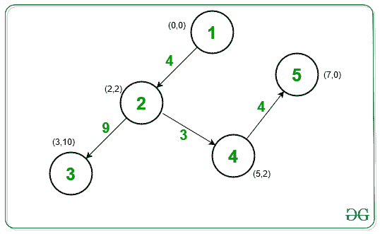

# 连接一个城市所有房屋所需的最低成本

> 原文:[https://www . geeksforgeeks . org/最低成本-需要连接所有城市中的房屋/](https://www.geeksforgeeks.org/minimum-cost-required-to-connect-all-houses-in-a-city/)

给定一个由 **N** 2D 坐标 **{x，y}** 组成的 [2D 阵](https://www.geeksforgeeks.org/multidimensional-arrays-in-java/) **房屋[][]** ，其中每个坐标代表每个房屋的位置，任务是找到连接城市所有房屋的最小成本。

> 连接两栋房子的费用是两点(x <sub>i</sub> 、y <sub>i</sub> )和(x <sub>j</sub> 、y <sub>j</sub> )即**| x<sub>I</sub>–x<sub>j</sub>|+| y<sub>I</sub>–y<sub>j</sub>|**，

**示例:**

> **输入:** houses[][] = [[0，0]，[2，2]，[3，10]，[5，2]，[7，0]]
> **输出:** 20
> **解释:**
> 
> [](https://media.geeksforgeeks.org/wp-content/uploads/20201027125012/UntitledDiagram5.jpg)
> 
> 将房屋 1 (0，0)与房屋 2 (2，2)连接成本= 4
> 将房屋 2 (2，2)与房屋 3 (3，10)连接成本=9
> 将房屋 2 (2，2)与房屋 4 (5，2)连接成本=3
> 最后，将房屋 4 (5，2)与房屋 5 (7，0)连接成本为 4。
> 现在所有的房子都连通了。
> 整体最低成本为 4 + 9 + 3 + 4 = 20。
> 
> **输入:**房源[][] = [[3，12]，[-2，5]，[-4，1]]
> **输出:** 18
> **解释:**
> 将房源 1 (3，12)与房源 2 (-2，5)连接成本= 12
> 将房源 2 (-2，5)与房源 3 (-4，1)连接成本= 6
> 现在所有房源都已连接。
> 整体最低成本为 12 + 6 = 18。

**方法:**想法是根据给定的信息创建一个[加权图](https://www.geeksforgeeks.org/graph-and-its-representations/)，任意一对边之间的权重等于连接它们的成本，比如说**C<sub>I</sub>T7】，也就是两个坐标之间的曼哈顿距离。图形生成后，应用[克鲁斯卡尔算法](https://www.geeksforgeeks.org/kruskals-minimum-spanning-tree-algorithm-greedy-algo-2/)使用[不相交集](https://www.geeksforgeeks.org/disjoint-set-data-structures/)找到图形的[最小生成树](https://www.geeksforgeeks.org/kruskals-minimum-spanning-tree-algorithm-greedy-algo-2/)。最后，打印最低成本。**

下面是上述方法的实现:

## C++

```
// C++ program for the above approach

#include <bits/stdc++.h>
using namespace std;

vector<int> parent, size;

// Utility function to find set of an
// element v using path compression
// technique
int find_set(int v)
{
    // If v is the parent
    if (v == parent[v])
        return v;

    // Otherwise, recursively
    // find its parent
    return parent[v]
           = find_set(parent[v]);
}

// Function to perform union
// of the sets a and b
int union_sets(int a, int b)
{
    // Find parent of a and b
    a = find_set(a);
    b = find_set(b);

    // If parent are different
    if (a != b) {

        // Swap Operation
        if (size[a] < size[b])
            swap(a, b);

        // Update parent of b as a
        parent[b] = a;
        size[a] += size[b];
        return 1;
    }

    // Otherwise, return 0
    return 0;
}

// Function to create a Minimum Cost
// Spanning tree for given houses
void MST(int houses[][2], int n)
{
    // Stores adjacency list of graph
    vector<pair<int, pair<int, int> > > v;

    // Traverse each coordinate
    for (int i = 0; i < n; i++) {

        for (int j = i + 1; j < n; j++) {

            // Find the Manhattan distance
            int p = abs(houses[i][0]
                        - houses[j][0]);

            p += abs(houses[i][1]
                     - houses[j][1]);

            // Add the edges
            v.push_back({ p, { i, j } });
        }
    }

    parent.resize(n);
    size.resize(n);

    // Sort all the edges
    sort(v.begin(), v.end());

    // Initialize parent[] and size[]
    for (int i = 0; i < n; i++) {
        parent[i] = i, size[i] = 1;
    }

    /// Stores the minimum cost
    int ans = 0;

    // Finding the minimum cost
    for (auto x : v) {

        // Perform the unioun operation
        if (union_sets(x.second.first,
                       x.second.second)) {
            ans += x.first;
        }
    }

    // Print the minimum cost
    cout << ans;
}

// Driver Code
int main()
{
    // Given houses
    int houses[][2] = { { 0, 0 }, { 2, 2 },
                        { 3, 10 }, { 5, 2 },
                        { 7, 0 }};

    int N = sizeof(houses)
            / sizeof(houses[0]);

    // Function Call
    MST(houses, N);

    return 0;
}
```

## Java 语言(一种计算机语言，尤用于创建网站)

```
// Java program for the above approach
import java.util.*;

// Class for DSU implementation
class DSU{

int parent[];
int rank[];

// Constructor to initialize DSU
DSU(int n)
{
    parent = new int[n];
    rank = new int[n];
    for(int i = 0; i < n; i++)
    {
        parent[i] = -1;
        rank[i] = 1;
    }
}

// Utility function to find set of an
// element v using path compression
// technique
int find_set(int v)
{

    // If v is the parent
    if (parent[v] == -1)
        return v;

    // Otherwise, recursively
    // find its parent
    return parent[v] = find_set(parent[v]);
}

// Function to perform union
// of the sets a and b
void union_sets(int a, int b)
{

    // Find parent of a and b
    int p1 = find_set(a);
    int p2 = find_set(b);

    // If parent are different
    if (p1 != p2)
    {

        // Swap Operation
        if (rank[p1] > rank[p2])
        {
            parent[p2] = p1;
            rank[p1] += rank[p2];
        }
        else
        {
            parent[p1] = p2;
            rank[p2] += rank[p1];
        }
    }
}
}

class GFG{

// Function to create a Minimum Cost
// Spanning tree for given houses
static void MST(int houses[][], int n)
{
    int ans = 0;
    ArrayList<int[]> edges = new ArrayList<>();

    // Traverse each coordinate
    for(int i = 0; i < n; i++)
    {
        for(int j = i + 1; j < n; j++)
        {

            // Find the Manhattan distance
            int p = Math.abs(houses[i][0] -
                             houses[j][0]);

            p += Math.abs(houses[i][1] -
                          houses[j][1]);

            // Add the edges
            edges.add(new int[]{ p, i, j });
        }
    }

    // Sorting arraylist using custome comparator
    // on the basis of weight i.e first element in
    // array object stored in Arraylist
    Collections.sort(edges, new Comparator<int[]>()
    {
        @Override public int compare(int[] o1, int[] o2)
        {
            return Integer.compare(o1[0], o2[0]);
        }
    });

    // Calling DSU class
    DSU d = new DSU(n);
    for(int i = 0; i < edges.size(); i++)
    {
        int from = edges.get(i)[1];
        int to = edges.get(i)[2];

        // Checking if they lie in different component
        // or not i.e they have same parent or not in
        // DSU
        if (d.find_set(from) != d.find_set(to))
        {

            // Calling union_sets
            d.union_sets(from, to);
            ans += edges.get(i)[0];
        }
    }

    // Printing the minimum cost
    System.out.println(ans);
}

// Driver code
public static void main(String args[])
{

    // Graph in form of 2D array
    int houses[][] = { { 0, 0 }, { 2, 2 },
                       { 3, 10 }, { 5, 2 },
                       { 7, 0 } };
    int n = houses.length;

    // Function Call
    MST(houses, n);
}
}

// This code is contributed by Rahul Verma
```

## 蟒蛇 3

```
# Python3 program for the above approach
parent = [0] * 100
size = [0] * 100

# Utility function to find set of an
# element v using path compression
# technique
def find_set(v):

    # If v is the parent
    if (v == parent[v]):
        return v

    # Otherwise, recursively
    # find its parent
    parent[v] = find_set(parent[v])

    return parent[v]

# Function to perform union
# of the sets a and b
def union_sets(a, b):

    # Find parent of a and b
    a = find_set(a)
    b = find_set(b)

    # If parent are different
    if (a != b):

        # Swap Operation
        if (size[a] < size[b]):
            a, b = b, a

        # Update parent of b as a
        parent[b] = a
        size[a] += size[b]
        return 1

    # Otherwise, return 0
    return 0

# Function to create a Minimum Cost
# Spanning tree for given houses
def MST(houses, n):

    # Stores adjacency list of graph
    v = []

    # Traverse each coordinate
    for i in range(n):
        for j in range(i + 1, n):

            # Find the Manhattan distance
            p = abs(houses[i][0] -
                    houses[j][0])

            p += abs(houses[i][1] -
                     houses[j][1])

            # Add the edges
            v.append([p, i, j])

    # Sort all the edges
    v = sorted(v)

    # Initialize parent[] and size[]
    for i in range(n):
        parent[i] = i
        size[i] = 1

    # Stores the minimum cost
    ans = 0

    # Finding the minimum cost
    for x in v:

        # Perform the unioun operation
        if (union_sets(x[1], x[2])):
            ans += x[0]

    # Print the minimum cost
    print(ans)

# Driver Code
if __name__ == '__main__':

    # Given houses
    houses = [ [ 0, 0 ], [ 2, 2 ],
               [ 3, 10 ], [ 5, 2 ],
               [ 7, 0 ] ]

    N = len(houses)

    # Function Call
    MST(houses, N)

# This code is contributed by mohit kumar 29
```

**Output:** 

```
20
```

***时间复杂度:**O(N<sup>2</sup>)*
***辅助空间:** O(N <sup>2</sup> )*