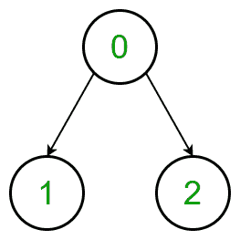
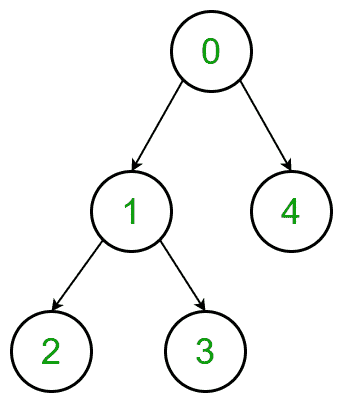
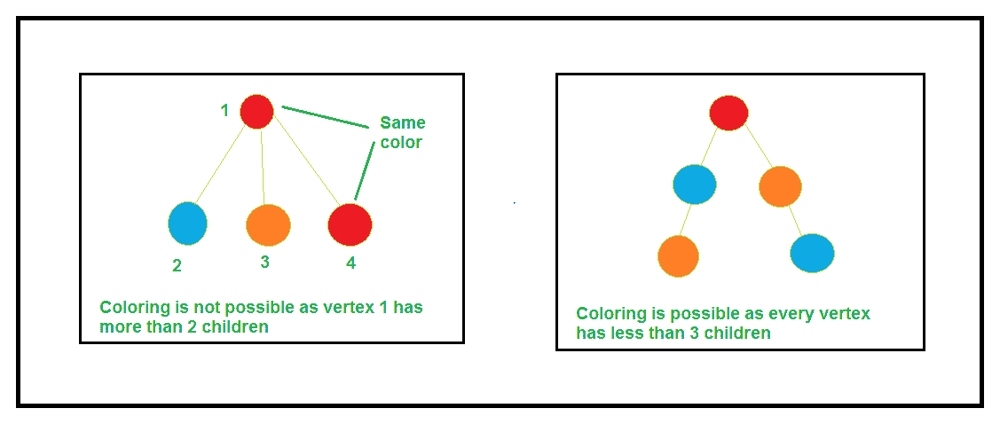

# 给没有 3 个相邻顶点具有相同颜色的树着色的最小成本

> 原文:[https://www . geeksforgeeks . org/颜色最小成本-没有 3 个相邻顶点的树具有相同的颜色/](https://www.geeksforgeeks.org/minimum-cost-to-colour-a-tree-with-no-3-adjacent-vertices-having-same-colour/)

给定具有从 **0** 到**(N–1)**的[节点值的 **N** 树](https://www.geeksforgeeks.org/binary-tree-data-structure/)和大小尺寸为 **3xN** 的 2D [数组](https://www.geeksforgeeks.org/introduction-to-arrays/) **arr[][]** ，其中 **arr[i][j]** 表示用颜色值 **i** 着色 **jth 节点**的成本。任务是找到给定树的节点着色的最小成本，使得长度为 3 的每条**路径都用不同的颜色着色。如果有任何可能的方法给树的节点着色，那么打印成本否则打印**“不可能”**。**

**示例:**

> **输入:** arr[][] = {{3，2，3}，{4，3，2}，{3，1，3}}，
> 树:
> 
> 
> 
> **输出:** 6
> **说明:**
> 用类型 1 颜色给顶点 0 上色，成本= 3
> 用类型 3 颜色给顶点 1 上色，成本= 1
> 用类型 2 颜色给顶点 2 上色，成本= 2
> 因此最小成本为 3 + 1 + 2 = 6
> 
> **输入:** arr[][] = {{3，4，2，1，2}，{4，2，1，5，4}，{5，3，2，1，1}}，
> 树:
> 
> 
> 
> **输出:**不可能

**进场:**思路是做一个观察。我们需要观察，如果有一个顶点有两条以上的边，答案是不可能的。答案只存在于链结构中，即，



*   最初，我们检查对于任何节点，是否存在两个以上的子节点。
*   如果存在，那么答案是不可能的。
*   如果不存在，那么只有**<sup>3</sup>P<sub>2</sub>T5】可用排列。因此，只需检查所有六种可能的排列，并找到最小成本。**

下面是上述方法的实现:

## C++

```
// C++ program to find the
// minimum possible cost
// to colour a given tree

#include <bits/stdc++.h>
using namespace std;

// Class to define a tree
class tree {
    vector<vector<int> > g;
    vector<int> chain;
    int minimum;

public:
    // Constructor
    tree(int n)
    {
        g = vector<vector<int> >(n);
        minimum = 1e6;
    }

    // Function for pushing edges
    void addEdge(int u, int v)
    {
        g[v].push_back(u);
        g[u].push_back(v);
    }

    // Dfs function to make the chain
    // structure of tree in a vector
    void dfs(int v, int p = -1)
    {
        chain.push_back(v);

        for (auto i : g[v]) {
            if (i == p)
                continue;

            dfs(i, v);
        }
    }

    // Function that checks all the
    // six different type of
    // coloring and find the
    // minimum of them
    void check(int n, int a, int b,
               vector<vector<int> > cost)
    {
        int sum = 0;
        vector<int> res(n);

        // Assign the color type 1
        // to the first element
        res[0] = a;

        // Assign the color type 2
        // to the second element
        res[1] = b;

        // Add the cost of the color
        // of the first element
        sum += cost[a][chain[0]];

        // Add the cost of the color
        // of the second element
        sum += cost[b][chain[1]];

        for (int i = 2; i < n; i++) {

            // Assign the next element in chain
            // with different color
            res[i] = 3 - res[i - 1] - res[i - 2];

            // Add the cost of the element color
            sum += cost[res[i]][chain[i]];
        }

        // Finding the minimum from all cases
        if (sum < minimum)
            minimum = sum;
    }

    // Function to find the
    // minimum possible cost
    // to colour a given tree
    void minimumCost(int n,
                     vector<vector<int> > cost)
    {
        for (int i = 0; i < n; i++) {

            // Condition to check if
            // any vertex consists more than
            // 2 edges, then the coloring of
            // the vertices is not possible
            if (g[i].size() > 2) {
                cout << "NOT POSSIBLE"
                     << "\n";
                return;
            }
        }

        int start;

        // Find the starting/ending vertex
        for (int i = 0; i < n; i++) {
            if (g[i].size() == 1)
                start = i;
        }

        // Call dfs function starting from
        // the start vertex
        dfs(start);

        // Check for all six different
        // possible cases
        check(n, 0, 1, cost);
        check(n, 0, 2, cost);
        check(n, 1, 0, cost);
        check(n, 1, 2, cost);
        check(n, 2, 0, cost);
        check(n, 2, 1, cost);

        // Printing the minimum cost
        cout << minimum << "\n";
    }
};

// Driver code
int main()
{
    tree t(5);

    t.addEdge(0, 1);
    t.addEdge(1, 2);
    t.addEdge(2, 3);
    t.addEdge(3, 4);

    vector<vector<int> > arr
        = { { 3, 4, 2, 1, 2 },
            { 4, 2, 1, 5, 4 },
            { 5, 3, 2, 1, 1 } };

    t.minimumCost(5, arr);

    return 0;
}
```

## 蟒蛇 3

```
# Python3 program to find the
# minimum possible cost
# to colour a given tree

# Class to define a tree
class tree:

    def __init__(self, n):
        self.g = [[] for i in range(n)]
        self.minimum = 1000000
        self.chain = []

    # Function for pushing edges
    def addEdge(self, u, v):
        self.g[v].append(u);
        self.g[u].append(v);

    # Dfs function to make the chain
    # structure of tree in a vector
    def dfs(self, v, p = -1):   
        self.chain.append(v);      
        for i in self.g[v]:      
            if (i == p):
                continue;

            self.dfs(i, v);

    # Function that checks all the
    # six different type of
    # coloring and find the
    # minimum of them
    def check(self, n, a, b, cost):

        sum = 0;
        res=[0 for i in range(n)]

        # Assign the color type 1
        # to the first element
        res[0] = a;

        # Assign the color type 2
        # to the second element
        res[1] = b;

        # Add the cost of the color
        # of the first element
        sum += cost[a][self.chain[0]];

        # Add the cost of the color
        # of the second element
        sum += cost[b][self.chain[1]];

        for i in range(2, n):

            # Assign the next element in chain
            # with different color
            res[i] = 3 - res[i - 1] - res[i - 2];

            # Add the cost of the element color
            sum += cost[res[i]][self.chain[i]];

        # Finding the minimum from all cases
        if (sum < self.minimum):
            self.minimum = sum;

    # Function to find the
    # minimum possible cost
    # to colour a given tree
    def minimumCost(self, n, cost):

        for i in range(n):

            # Condition to check if
            # any vertex consists more than
            # 2 edges, then the coloring of
            # the vertices is not possible
            if (len(self.g[i]) > 2):
                print("NOT POSSIBLE")

                return;

        start = 0

        # Find the starting/ending vertex
        for i in range(n):

            if (len(self.g[i]) == 1):
                start = i;

        # Call dfs function staring from
        # the start vertex
        self.dfs(start);

        # Check for all six different
        # possible cases
        self.check(n, 0, 1, cost);
        self.check(n, 0, 2, cost);
        self.check(n, 1, 0, cost);
        self.check(n, 1, 2, cost);
        self.check(n, 2, 0, cost);
        self.check(n, 2, 1, cost);

        # Printing the minimum cost
        print(self.minimum)

# Driver code
if __name__=='__main__':

    t=tree(5);

    t.addEdge(0, 1);
    t.addEdge(1, 2);
    t.addEdge(2, 3);
    t.addEdge(3, 4);

    arr = [[ 3, 4, 2, 1, 2 ],
            [ 4, 2, 1, 5, 4 ],
            [ 5, 3, 2, 1, 1 ]];

    t.minimumCost(5, arr);

# This code is contributed by rutvik_56
```

## C#

```
// C# program to find the
// minimum possible cost
// to colour a given tree
using System;
using System.Collections;
using System.Collections.Generic;

// Class to define a tree
class tree{

public ArrayList g;
public ArrayList chain;
public int minimum;

// Constructor
tree(int n)
{
    g = new ArrayList();
    chain = new ArrayList();

    for(int i = 0; i < n; i++)
    {
        g.Add(new ArrayList());
    }

    minimum = 1000000;
}

// Function for pushing edges
void addEdge(int u, int v)
{
    ((ArrayList)g[v]).Add(u);
    ((ArrayList)g[u]).Add(v);
}

// Dfs function to make the chain
// structure of tree in a vector
void dfs(int v, int p = -1)
{
    chain.Add(v);

    foreach(int i in (ArrayList)g[v])
    {
        if (i == p)
            continue;

        dfs(i, v);
    }
}

// Function that checks all the
// six different type of
// coloring and find the
// minimum of them
void check(int n, int a, int b,
           ArrayList cost)
{
    int sum = 0;

    ArrayList res = new ArrayList();
    for(int i = 0; i < n; i++)
    {
        res.Add(0);
    }

    // Assign the color type 1
    // to the first element
    res[0] = a;

    // Assign the color type 2
    // to the second element
    res[1] = b;

    // Add the cost of the color
    // of the first element
    sum += (int)((ArrayList)cost[a])[(int)chain[0]];

    // Add the cost of the color
    // of the second element
    sum += (int)((ArrayList)cost[b])[(int)chain[1]];

    for(int i = 2; i < n; i++)
    {

        // Assign the next element in chain
        // with different color
        res[i] = 3 - (int)res[i - 1] - (int)res[i - 2];

        // Add the cost of the element color
        sum += (int)((ArrayList)cost[(
                int)res[i]])[(int)chain[i]];
    }

    // Finding the minimum from all cases
    if (sum < minimum)
        minimum = sum;
}

// Function to find the
// minimum possible cost
// to colour a given tree
void minimumCost(int n,
                 ArrayList cost)
{
    for(int i = 0; i < n; i++)
    {

        // Condition to check if
        // any vertex consists more than
        // 2 edges, then the coloring of
        // the vertices is not possible
        if (((ArrayList)g[i]).Count > 2)
        {
            Console.WriteLine("NOT POSSIBLE");
            return;
        }
    }

    int start = 0;

    // Find the starting/ending vertex
    for(int i = 0; i < n; i++)
    {
        if (((ArrayList)g[i]).Count == 1)
            start = i;
    }

    // Call dfs function staring from
    // the start vertex
    dfs(start);

    // Check for all six different
    // possible cases
    check(n, 0, 1, cost);
    check(n, 0, 2, cost);
    check(n, 1, 0, cost);
    check(n, 1, 2, cost);
    check(n, 2, 0, cost);
    check(n, 2, 1, cost);

    // Printing the minimum cost
    Console.WriteLine(minimum);
}

// Driver code
public static void Main(string []args)
{
    tree t = new tree(5);

    t.addEdge(0, 1);
    t.addEdge(1, 2);
    t.addEdge(2, 3);
    t.addEdge(3, 4);

    ArrayList arr = new ArrayList();
    arr.Add(new ArrayList(){ 3, 4, 2, 1, 2 });
    arr.Add(new ArrayList(){ 4, 2, 1, 5, 4 });
    arr.Add(new ArrayList(){ 5, 3, 2, 1, 1 });

    t.minimumCost(5, arr);
}
}

// This code is contributed by pratham76
```

## java 描述语言

```
<script>
    // Javascript program to find the
    // minimum possible cost
    // to colour a given tree

    let g = [];
    let chain = [];
    let minimum;

    // Class to define a tree
    class tree
    {
        constructor(n) {

            for(let i = 0; i < n; i++)
            {
                g.push([]);
            }
            minimum = 1000000;
        }
    }

    // Function for pushing edges
    function addEdge(u, v)
    {
        g[v].push(u);
        g[u].push(v);
    }

    // Dfs function to make the chain
    // structure of tree in a vector
    function dfs(v, p = -1)
    {
        chain.push(v);

        for(let i = 0; i < g[v].length; i++)
        {
            if (g[v][i] == p)
                continue;

            dfs(g[v][i], v);
        }
    }

    // Function that checks all the
    // six different type of
    // coloring and find the
    // minimum of them
    function check(n, a, b, cost)
    {
        let sum = 0;

        let res = [];
        for(let i = 0; i < n; i++)
        {
            res.push(0);
        }

        // Assign the color type 1
        // to the first element
        res[0] = a;

        // Assign the color type 2
        // to the second element
        res[1] = b;

        // Add the cost of the color
        // of the first element
        sum += (cost[a])[chain[0]];

        // Add the cost of the color
        // of the second element
        sum += (cost[b])[chain[1]];

        for(let i = 2; i < n; i++)
        {

            // Assign the next element in chain
            // with different color
            res[i] = 3 - res[i - 1] - res[i - 2];

            // Add the cost of the element color
            sum += (cost[res[i]])[chain[i]];
        }

        // Finding the minimum from all cases
        if (sum < minimum)
            minimum = sum;
    }

    // Function to find the
    // minimum possible cost
    // to colour a given tree
    function minimumCost(n, cost)
    {
        for(let i = 0; i < n; i++)
        {

            // Condition to check if
            // any vertex consists more than
            // 2 edges, then the coloring of
            // the vertices is not possible
            if ((g[i]).length > 2)
            {
                document.write("NOT POSSIBLE");
                return;
            }
        }

        let start = 0;

        // Find the starting/ending vertex
        for(let i = 0; i < n; i++)
        {
            if ((g[i]).length == 1)
                start = i;
        }

        // Call dfs function staring from
        // the start vertex
        dfs(start);

        // Check for all six different
        // possible cases
        check(n, 0, 1, cost);
        check(n, 0, 2, cost);
        check(n, 1, 0, cost);
        check(n, 1, 2, cost);
        check(n, 2, 0, cost);
        check(n, 2, 1, cost);

        // Printing the minimum cost
        document.write(minimum);
    }

    let t = new tree(5);

    addEdge(0, 1);
    addEdge(1, 2);
    addEdge(2, 3);
    addEdge(3, 4);

    let arr = [];
    arr.push([ 3, 4, 2, 1, 2 ]);
    arr.push([ 4, 2, 1, 5, 4 ]);
    arr.push([ 5, 3, 2, 1, 1 ]);

    minimumCost(5, arr);

// This code is contributed by mukesh07.
</script>
```

**Output:** 

```
9
```

**时间复杂度:** *O(N)* ，其中 N 为树中节点数。