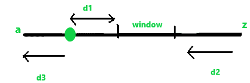
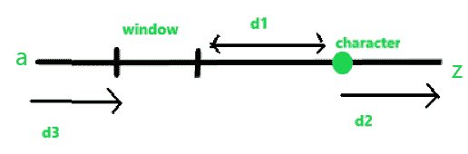
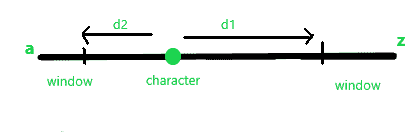

# 修改字符串的最小成本

> 原文:[https://www . geesforgeks . org/修改字符串的最小成本/](https://www.geeksforgeeks.org/minimum-cost-to-modify-a-string/)

给定字符串**字符串**仅由小写字母和整数 **K** 组成。任务是找到修改字符串的最小成本，使给定字符串的任意两个字符之间的 ASCII 值差小于或等于 **K** 。
可以对字符串执行以下操作:

1.  **增加一个角色:**比如你用 **1** 增加**【a】**时，它就变成了**【b】**。同样，如果将 **'z'** 增加 **1** ，则变成 **'a'** 。增量以循环方式完成。
2.  **减少一个角色:**比如你用 **1** 减少**一个**的时候，就变成了**【z】**。同样，如果将 **'z'** 减少 **1** ，则变成 **'y'** 。减量以循环方式进行。

**示例:**

> **输入:** str = "abcd "，K = 1
> **输出:** 2
> 将成本为 1 的‘a’改为‘b’，成本为 1 的‘d’再次改为‘c’。
> 总成本= 1 + 1 = 2。
> 修改后的字符串为“bbcc”
> 
> **输入:** str = "abcdefghi "，K = 2
> T3】输出: 12

**方法:**想法是为字符串的所有字符维护一个哈希表，以降低时间复杂度，而不是一次取一个字符。我们需要检查所有包含 k 个连续字符的窗口，并在所有窗口中找到修改字符串所有字符的最小成本。
修改角色的成本分为以下几类:

*   **情况 1:** 如果字符在窗口内，修改不会产生任何费用。
*   **情况 2:** 如果窗口在字符 a-z 之间，并且字符在窗口的左侧。



*   如果我们增加一个代价为 d1 的角色，或者减少一个代价为 d2+d3 的角色，我们会发现 d1 和 d2+d3 的最小值。
    如果窗口在字符 a-z 之间，并且字符在窗口的右侧。



*   如果我们减少会产生 d1 成本的角色，或者增加会产生 d2+d3 成本的角色，我们会发现 d1 和 d2+d3 的最小值。

*   **情况 3:** 如果窗口是以 z 结尾、从 a 开始的字符子窗口，并且字符在窗口之外。



*   如果我们增加角色，它将产生 d1 的成本，如果我们减少角色，它将产生 d2 的成本，我们找到 d1 和 d2 之间的最小值。

下面是上述方法的实现:

## C++

```
// C++ implementation of the approach
#include <bits/stdc++.h>
using namespace std;

// Function to return the minimum cost
int minCost(string str, int K)
{
    int n = str.length();

    // Initialize result
    int res = 999999999, count = 0, a, b;

    // To store the frequency of characters
    // of the string
    int cnt[27];

    // Initialize array with 0
    memset(cnt, 0, sizeof(cnt));

    // Update the frequencies of the
    // characters of the string
    for (int i = 0; i < n; i++)
        cnt[str[i] - 'a' + 1]++;

    // Loop to check all windows from a-z
    // where window size is K
    for (int i = 1; i < (26 - K + 1); i++) {

        // Starting index of window
        a = i;

        // Ending index of window
        b = i + K;
        count = 0;
        for (int j = 1; j <= 26; j++) {

            // Check if the string contains character
            if (cnt[j] > 0) {

                // Check if the character is on left side of window
                // find the cost of modification for character
                // add value to count
                // calculate nearest distance of modification
                if (j >= a && j >= b)
                    count = count + (min(j - b, 25 - j + a + 1)) * cnt[j];

                // Check if the character is on right side of window
                // find the cost of modification for character
                // add value to count
                // calculate nearest distance of modification
                else if (j <= a && j <= b)
                    count = count + (min(a - j, 25 + j - b + 1)) * cnt[j];
            }
        }

        // Find the minimum of all costs
        // for modifying the string
        res = min(res, count);
    }

    // Loop to check all windows
    // Here window contains characters
    // before z and after z of window size K
    for (int i = 26 - K + 1; i <= 26; i++) {

        // Starting index of window
        a = i;

        // Ending index of window
        b = (i + K) % 26;
        count = 0;

        for (int j = 1; j <= 26; j++) {

            // Check if the string contains character
            if (cnt[j] > 0) {

                // If characters are outside window
                // find the cost for modifying character
                // add value to count
                if (j >= b and j <= a)
                    count = count + (min(j - b, a - j)) * cnt[j];
            }
        }

        // Find the minimum of all costs
        // for modifying the string
        res = min(res, count);
    }

    return res;
}

// Driver code
int main()
{
    string str = "abcdefghi";
    int K = 2;
    cout << minCost(str, K);

    return 0;
}
```

## Java 语言(一种计算机语言，尤用于创建网站)

```
// Java program to implement
// the above approach
import java.util.Arrays;

class GFG
{

// Function to return the minimum cost
static int minCost(String str, int K)
{
    int n = str.length();

    // Initialize result
    int res = 999999999, count = 0, a, b;

    // To store the frequency of characters
    // of the string
    int cnt[] = new int[27];

    // Initialize array with 0
    Arrays.fill(cnt, 0);

    // Update the frequencies of the
    // characters of the string
    for (int i = 0; i < n; i++)
        cnt[str.charAt(i) - 'a' + 1]++;

    // Loop to check all windows from a-z
    // where window size is K
    for (int i = 1; i < (26 - K + 1); i++)
    {

        // Starting index of window
        a = i;

        // Ending index of window
        b = i + K;
        count = 0;
        for (int j = 1; j <= 26; j++)
        {

            // Check if the string contains character
            if (cnt[j] > 0)
            {

                // Check if the character is on left side of window
                // find the cost of modification for character
                // add value to count
                // calculate nearest distance of modification
                if (j >= a && j >= b)
                    count = count + (Math.min(j - b,
                            25 - j + a + 1)) * cnt[j];

                // Check if the character is on right side of window
                // find the cost of modification for character
                // add value to count
                // calculate nearest distance of modification
                else if (j <= a && j <= b)
                    count = count + (Math.min(a - j,
                            25 + j - b + 1)) * cnt[j];
            }
        }

        // Find the minimum of all costs
        // for modifying the string
        res = Math.min(res, count);
    }

    // Loop to check all windows
    // Here window contains characters
    // before z and after z of window size K
    for (int i = 26 - K + 1; i <= 26; i++)
    {

        // Starting index of window
        a = i;

        // Ending index of window
        b = (i + K) % 26;
        count = 0;

        for (int j = 1; j <= 26; j++)
        {

            // Check if the string contains character
            if (cnt[j] > 0)
            {

                // If characters are outside window
                // find the cost for modifying character
                // add value to count
                if (j >= b && j <= a)
                    count = count + (Math.min(j - b, a - j)) * cnt[j];
            }
        }

        // Find the minimum of all costs
        // for modifying the string
        res = Math.min(res, count);
    }

    return res;
}

// Driver code
public static void main(String[] args)
{
    String str = "abcdefghi";
    int K = 2;
    System.out.println(minCost(str, K));
}
}

/* This code contributed by PrinciRaj1992 */
```

## 蟒蛇 3

```
# Python 3 implementation of the approach

# Function to return the minimum cost
def minCost(str1, K):
    n = len(str1)

    # Initialize result
    res = 999999999
    count = 0

    # To store the frequency of characters
    # of the string
    cnt = [0 for i in range(27)]

    # Update the frequencies of the
    # characters of the string
    for i in range(n):
        cnt[ord(str1[i]) - ord('a') + 1] += 1

    # Loop to check all windows from a-z
    # where window size is K
    for i in range(1, 26 - K + 1, 1):
        # Starting index of window
        a = i

        # Ending index of window
        b = i + K
        count = 0
        for j in range(1, 27, 1):

            # Check if the string contains character
            if (cnt[j] > 0):

                # Check if the character is on left side of window
                # find the cost of modification for character
                # add value to count
                # calculate nearest distance of modification
                if (j >= a and j >= b):
                    count = count + (min(j - b, 25 -
                                         j + a + 1)) * cnt[j]

                # Check if the character is on right side of window
                # find the cost of modification for character
                # add value to count
                # calculate nearest distance of modification
                elif (j <= a and j <= b):
                    count = count + (min(a - j, 25 +
                                             j - b + 1)) * cnt[j]

        # Find the minimum of all costs
        # for modifying the string
        res = min(res, count)

    # Loop to check all windows
    # Here window contains characters
    # before z and after z of window size K
    for i in range(26 - K + 1, 27, 1):

        # Starting index of window
        a = i

        # Ending index of window
        b = (i + K) % 26
        count = 0

        for j in range(1, 27, 1):

            # Check if the string contains character
            if (cnt[j] > 0):

                # If characters are outside window
                # find the cost for modifying character
                # add value to count
                if (j >= b and j <= a):
                    count = count + (min(j - b,
                                         a - j)) * cnt[j]

        # Find the minimum of all costs
        # for modifying the string
        res = min(res, count)

    return res

# Driver code
if __name__ == '__main__':
    str1 = "abcdefghi"
    K = 2
    print(minCost(str1, K))

# This code is contributed by
# Surendra_Gangwar
```

## C#

```
// C# program to implement
// the above approach
using System;

class GFG
{

// Function to return the minimum cost
static int minCost(String str, int K)
{
    int n = str.Length;

    // Initialize result
    int res = 999999999, count = 0, a, b;

    // To store the frequency of characters
    // of the string
    int []cnt = new int[27];

    // Update the frequencies of the
    // characters of the string
    for (int i = 0; i < n; i++)
        cnt[str[i] - 'a' + 1]++;

    // Loop to check all windows from a-z
    // where window size is K
    for (int i = 1; i < (26 - K + 1); i++)
    {

        // Starting index of window
        a = i;

        // Ending index of window
        b = i + K;
        count = 0;
        for (int j = 1; j <= 26; j++)
        {

            // Check if the string contains character
            if (cnt[j] > 0)
            {

                // Check if the character is on left side of window
                // find the cost of modification for character
                // add value to count
                // calculate nearest distance of modification
                if (j >= a && j >= b)
                    count = count + (Math.Min(j - b,
                            25 - j + a + 1)) * cnt[j];

                // Check if the character is on right side of window
                // find the cost of modification for character
                // add value to count
                // calculate nearest distance of modification
                else if (j <= a && j <= b)
                    count = count + (Math.Min(a - j,
                            25 + j - b + 1)) * cnt[j];
            }
        }

        // Find the minimum of all costs
        // for modifying the string
        res = Math.Min(res, count);
    }

    // Loop to check all windows
    // Here window contains characters
    // before z and after z of window size K
    for (int i = 26 - K + 1; i <= 26; i++)
    {

        // Starting index of window
        a = i;

        // Ending index of window
        b = (i + K) % 26;
        count = 0;

        for (int j = 1; j <= 26; j++)
        {

            // Check if the string contains character
            if (cnt[j] > 0)
            {

                // If characters are outside window
                // find the cost for modifying character
                // add value to count
                if (j >= b && j <= a)
                    count = count + (Math.Min(j - b, a - j)) * cnt[j];
            }
        }

        // Find the minimum of all costs
        // for modifying the string
        res = Math.Min(res, count);
    }

    return res;
}

// Driver code
public static void Main(String[] args)
{
    String str = "abcdefghi";
    int K = 2;
    Console.WriteLine(minCost(str, K));
}
}

// This code has been contributed by 29AjayKumar
```

## 服务器端编程语言（Professional Hypertext Preprocessor 的缩写）

```
<?php
// PHP implementation of the approach

// Function to return the minimum cost
function minCost($str, $K)
{
    $n = strlen($str);

    // Initialize result
    $res = 999999999; $count = 0;

    // To store the frequency of characters
    // of the string
    // Initialize array with 0
    $cnt = array_fill(0, 27, 0);

    // Update the frequencies of the
    // characters of the string
    for ($i = 0; $i < $n; $i++)
        $cnt[ord($str[$i]) - ord('a') + 1]++;

    // Loop to check all windows from a-z
    // where window size is K
    for ($i = 1; $i < (26 - $K + 1); $i++)
    {

        // Starting index of window
        $a = $i;

        // Ending index of window
        $b = $i + $K;
        $count = 0;
        for ($j = 1; $j <= 26; $j++)
        {

            // Check if the string contains character
            if ($cnt[$j] > 0)
            {

                // Check if the character is on left side of window
                // find the cost of modification for character
                // add value to count
                // calculate nearest distance of modification
                if ($j >= $a && $j >= $b)
                    $count = $count + (min($j - $b, 25 - $j + $a + 1)) * $cnt[$j];

                // Check if the character is on right side of window
                // find the cost of modification for character
                // add value to count
                // calculate nearest distance of modification
                else if ($j <= $a && $j <=$b)
                    $count = $count + (min($a - $j, 25 + $j - $b + 1)) * $cnt[$j];
            }
        }

        // Find the minimum of all costs
        // for modifying the string
        $res = min($res, $count);
    }

    // Loop to check all windows
    // Here window contains characters
    // before z and after z of window size K
    for ($i = 26 - $K + 1; $i <= 26; $i++)
    {

        // Starting index of window
        $a = $i;

        // Ending index of window
        $b = ($i + $K) % 26;
        $count = 0;

        for ($j = 1; $j <= 26; $j++)
        {

            // Check if the string contains character
            if ($cnt[$j] > 0)
            {

                // If characters are outside window
                // find the cost for modifying character
                // add value to count
                if ($j >= $b and $j <= $a)
                    $count = $count + (min($j - $b,$a - $j)) * $cnt[$j];
            }
        }

        // Find the minimum of all costs
        // for modifying the string
        $res = min($res, $count);
    }

    return $res;
}

    // Driver code
    $str = "abcdefghi";
    $K = 2;
    echo minCost($str, $K);

    // This code is contributed by Ryuga

?>
```

## java 描述语言

```
<script>

// Javascript implementation of the approach

// Function to return the minimum cost
function minCost(str, K)
{
    var n = str.length;

    // Initialize result
    var res = 999999999, count = 0, a, b;

    // To store the frequency of characters
    // of the string
    var cnt = Array(27).fill(0);

    // Update the frequencies of the
    // characters of the string
    for (var i = 0; i < n; i++)
        cnt[str[i].charCodeAt(0) - 97 + 1]++;

    // Loop to check all windows from a-z
    // where window size is K
    for (var i = 1; i < (26 - K + 1); i++) {

        // Starting index of window
        a = i;

        // Ending index of window
        b = i + K;
        count = 0;
        for (var j = 1; j <= 26; j++) {

            // Check if the string contains character
            if (cnt[j] > 0) {

                // Check if the character is on left side of window
                // find the cost of modification for character
                // add value to count
                // calculate nearest distance of modification
                if (j >= a && j >= b)
                    count = count + (Math.min(j - b, 25 - j + a + 1)) * cnt[j];

                // Check if the character is on right side of window
                // find the cost of modification for character
                // add value to count
                // calculate nearest distance of modification
                else if (j <= a && j <= b)
                    count = count + (Math.min(a - j, 25 + j - b + 1)) * cnt[j];
            }
        }

        // Find the minimum of all costs
        // for modifying the string
        res = Math.min(res, count);
    }

    // Loop to check all windows
    // Here window contains characters
    // before z and after z of window size K
    for (var i = 26 - K + 1; i <= 26; i++) {

        // Starting index of window
        a = i;

        // Ending index of window
        b = (i + K) % 26;
        count = 0;

        for (var j = 1; j <= 26; j++) {

            // Check if the string contains character
            if (cnt[j] > 0) {

                // If characters are outside window
                // find the cost for modifying character
                // add value to count
                if (j >= b && j <= a)
                    count = count + (Math.min(j - b, a - j)) * cnt[j];
            }
        }

        // Find the minimum of all costs
        // for modifying the string
        res = Math.min(res, count);
    }

    return res;
}

// Driver code
var str = "abcdefghi";
var K = 2;
document.write( minCost(str, K));

</script>
```

**Output:** 

```
12
```

**时间复杂度:**O(n)
T3】辅助空间: O(n)