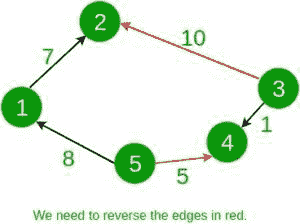

# 反转边的最小成本，使得每对节点之间都有路径

> 原文:[https://www . geeksforgeeks . org/反向边的最小成本-这样每对节点之间就有一条路径/](https://www.geeksforgeeks.org/minimum-cost-to-reverse-edges-such-that-there-is-path-between-every-pair-of-nodes/)

给定一个连通的有向图。每个节点恰好连接到另外两个节点。每个边都有权重，表示反转方向的成本。任务是找到反转图的某些边的最小成本，以便可以从每个节点转到其他每个节点。
**例:**

```
Input: 
5
1 2 7
5 1 8
5 4 5
3 4 1
3 2 10
Output: 15
```



```
Input:
6
1 5 4
5 3 8
2 4 15
1 6 16
2 3 23
4 6 42
Output: 39
```

**进场:**

*   为了从每个节点到达每一个其他节点，图必须形成一个环，即沿顺时针或逆时针两个方向之一引导其上的所有边。让我们将把所有顺时针方向的边重定向到逆时针方向的成本表示为成本 1，反之则表示为成本 2。答案显然是这两个成本中的最小值。
*   保持两个布尔数组开始和结束。开始和结束数组表示是否有一条边从给定的节点开始或结束。每当我们遇到从节点 a 到节点 b 的边时，我们首先检查是否有一条边已经从节点 a 开始或在节点 b 结束。如果有一条边满足条件，则该边与已经存在的边方向相反。在这种情况下，我们更新 cost2 并以相反的方向存储边。否则，我们更新成本 1。这样我们就能维持两种取向的成本。最后，打印最低成本。

以下是上述方法的实现:

## C++

```
// C++ code to find
// the minimum cost to
// reverse the edges
#include <bits/stdc++.h>
using namespace std;

// Function to calculate
// min cost for reversing
// the edges
int minCost(vector<vector<int> >& graph, int n)
{

    int cost1 = 0, cost2 = 0;
    // bool array to mark
    // start and end node
    // of a graph
    bool start[n + 1] = { false };
    bool end[n + 1] = { false };

    for (int i = 0; i < n; i++) {

        int a = graph[i][0];
        int b = graph[i][1];
        int c = graph[i][2];

        // This edge must
        // start from b and end at a
        if (start[a] || end[b]) {
            cost2 += c;
            start[b] = true;
            end[a] = true;
        }

        // This edge must
        // start from a and end at b
        else {
            cost1 += c;
            start[a] = true;
            end[b] = true;
        }
    }

    // Return minimum of
    // both possibilities
    return min(cost1, cost2);
}

// Driver code
int main()
{
    int n = 5;
    // Adjacency list representation
    // of a graph
    vector<vector<int> > graph = {
        { 1, 2, 7 },
        { 5, 1, 8 },
        { 5, 4, 5 },
        { 3, 4, 1 },
        { 3, 2, 10 }
    };

    int ans = minCost(graph, n);
    cout << ans << '\n';

    return 0;
}
```

## Java 语言(一种计算机语言，尤用于创建网站)

```
// Java code to find the minimum cost to
// reverse the edges
class GFG
{

// Function to calculate min cost for
// reversing the edges
static int minCost(int[][] graph, int n)
{

    int cost1 = 0, cost2 = 0;

    // bool array to mark start and
    // end node of a graph
    boolean []start = new boolean[n + 1];
    boolean []end = new boolean[n + 1];

    for (int i = 0; i < n; i++)
    {
        int a = graph[i][0];
        int b = graph[i][1];
        int c = graph[i][2];

        // This edge must start from b
        // and end at a
        if (start[a] || end[b])
        {
            cost2 += c;
            start[b] = true;
            end[a] = true;
        }

        // This edge must start from a
        // and end at b
        else
        {
            cost1 += c;
            start[a] = true;
            end[b] = true;
        }
    }

    // Return minimum of both possibilities
    return Math.min(cost1, cost2);
}

// Driver code
public static void main(String[] args)
{
    int n = 5;

    // Adjacency list representation
    // of a graph
    int [][]graph = {{ 1, 2, 7 },
                     { 5, 1, 8 },
                     { 5, 4, 5 },
                     { 3, 4, 1 },
                     { 3, 2, 10 }};

    int ans = minCost(graph, n);
    System.out.println(ans);
}
}

// This code is contributed by Rajput-Ji
```

## 蟒蛇 3

```
# Python code to find the minimum cost to
# reverse the edges

# Function to calculate min cost for
# reversing the edges
def minCost(graph, n):

    cost1, cost2 = 0, 0;

    # bool array to mark start and
    # end node of a graph
    start = [False]*(n + 1);
    end = [False]*(n + 1);

    for i in range(n):
        a = graph[i][0];
        b = graph[i][1];
        c = graph[i][2];

        # This edge must start from b
        # and end at a
        if (start[a] or end[b]):
            cost2 += c;
            start[b] = True;
            end[a] = True;

        # This edge must start from a
        # and end at b
        else:
            cost1 += c;
            start[a] = True;
            end[b] = True;

    # Return minimum of both possibilities
    return min(cost1, cost2);

# Driver code
if __name__ == '__main__':
    n = 5;

    # Adjacency list representation
    # of a graph
    graph = [[ 1, 2, 7 ],
                    [ 5, 1, 8 ],
                    [ 5, 4, 5 ],
                    [ 3, 4, 1 ],
                    [ 3, 2, 10 ]];

    ans = minCost(graph, n);
    print(ans);

# This code is contributed by 29AjayKumar
```

## C#

```
// C# code to find the minimum cost to
// reverse the edges
using System;

class GFG
{

// Function to calculate min cost for
// reversing the edges
static int minCost(int[,] graph, int n)
{
    int cost1 = 0, cost2 = 0;

    // bool array to mark start and
    // end node of a graph
    Boolean []start = new Boolean[n + 1];
    Boolean []end = new Boolean[n + 1];

    for (int i = 0; i < n; i++)
    {
        int a = graph[i, 0];
        int b = graph[i, 1];
        int c = graph[i, 2];

        // This edge must start from b
        // and end at a
        if (start[a] || end[b])
        {
            cost2 += c;
            start[b] = true;
            end[a] = true;
        }

        // This edge must start from a
        // and end at b
        else
        {
            cost1 += c;
            start[a] = true;
            end[b] = true;
        }
    }

    // Return minimum of both possibilities
    return Math.Min(cost1, cost2);
}

// Driver code
public static void Main(String[] args)
{
    int n = 5;

    // Adjacency list representation
    // of a graph
    int [,]graph = {{ 1, 2, 7 },
                    { 5, 1, 8 },
                    { 5, 4, 5 },
                    { 3, 4, 1 },
                    { 3, 2, 10 }};

    int ans = minCost(graph, n);
    Console.WriteLine(ans);
}
}

// This code is contributed by PrinciRaj1992
```

## java 描述语言

```
<script>

// JavaScript code to find
// the minimum cost to
// reverse the edges

// Function to calculate
// min cost for reversing
// the edges
function minCost(graph, n) {

    let cost1 = 0, cost2 = 0;
    // bool array to mark
    // start and end node
    // of a graph
    let start = new Array(n + 1).fill(false);
    let end = new Array(n + 1).fill(false);

    for (let i = 0; i < n; i++) {

        let a = graph[i][0];
        let b = graph[i][1];
        let c = graph[i][2];

        // This edge must
        // start from b and end at a
        if (start[a] || end[b]) {
            cost2 += c;
            start[b] = true;
            end[a] = true;
        }

        // This edge must
        // start from a and end at b
        else {
            cost1 += c;
            start[a] = true;
            end[b] = true;
        }
    }

    // Return minimum of
    // both possibilities
    return Math.min(cost1, cost2);
}

// Driver code

let n = 5;
// Adjacency list representation
// of a graph
let graph = [
    [1, 2, 7],
    [5, 1, 8],
    [5, 4, 5],
    [3, 4, 1],
    [3, 2, 10]
];

let ans = minCost(graph, n);
document.write(ans + '<br>');

</script>
```

**Output:** 

```
15
```

**时间复杂度:** O(N)，其中 N 是边数